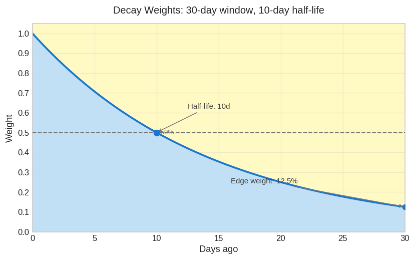
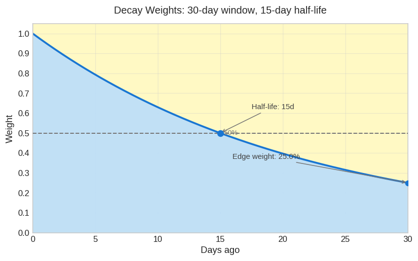
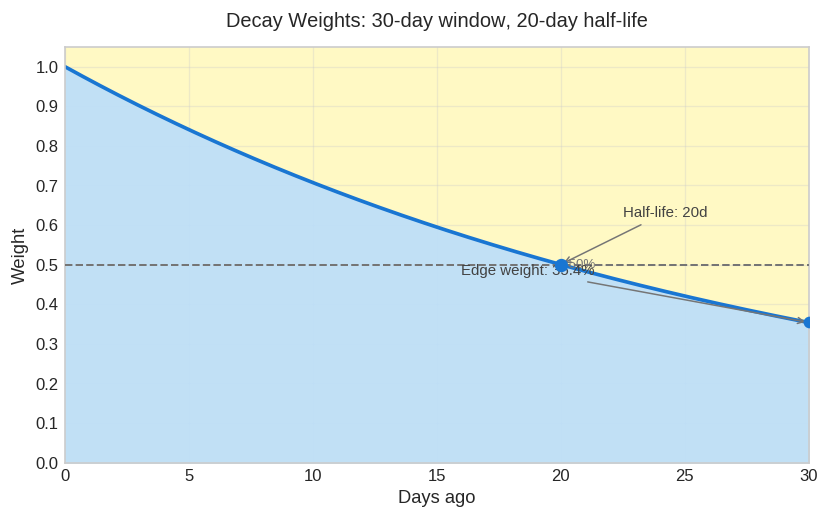

# Decay Weights

> **Date:** 2026-06-12

ROS-OCP uses **exponential decay weighting** so recent utilization data influences
recommendations more than older data within the same term window. Without decay,
a single spike from two weeks ago counts the same as yesterday's usage — which can
produce oversized or sluggish recommendations when workloads change.

Decay is applied when computing CPU, memory, node utilization, and business-hours
aggregates across all recommendation plugins that use weighted percentiles.

For how decay fits into the full sizing pipeline, see
[Recommendation Math](recommendation-math.md). For term defaults and env overrides,
see [Configurability Reference](configurability.md#term-windows-all-plugins).

---

## Formula

Decay weight is a function of **age in hours** from the observation to `now`:

```
weight = exp(-ageHours × ln(2) / halfLifeHours)
       = 2^(-ageHours / halfLifeHours)
```

Equivalently, in days:

```
weight = 2^(-daysAgo / halfLifeDays)
```

| Age | Weight |
|-----|--------|
| 0 (most recent) | 1.0 (100%) |
| 1 half-life ago | 0.5 (50%) |
| 2 half-lives ago | 0.25 (25%) |
| n half-lives ago | 2^(-n) |

The engine measures age in **continuous hours** from each digest row's timestamp
to the recommendation time — not calendar-day boundaries. This avoids jumps at
midnight and keeps weights smooth across DST transitions.
See [ADR-0204](https://github.com/pgarciaq/ros-ocp-backend/blob/{{ git_branch }}/docs/adr/0204-continuous-hour-decay-vs-calendar-day-windows.md).

---

## Half-Life and Window Relationship

Each recommendation **term** has three related settings:

| Field | Purpose |
|-------|---------|
| `window_days` | How many calendar days of digest history to include |
| `min_data_days` | Minimum days with real reports before emitting a recommendation |
| `decay_halflife_hours` | Hours until weight drops to 50%; `0` = no decay (uniform weight) |

### Default half-life derivation

When a tenant customizes `window_days` via the Settings API but leaves
`decay_halflife_hours` unset (NULL in the database), the engine **auto-derives**:

```
halfLifeHours = window_days × 12
```

That is half the window expressed in hours (`window_days × 0.5 × 24`). A 30-day
window therefore defaults to a 360-hour (15-day) half-life unless explicitly
overridden.

Plugin compiled defaults (when no tenant row exists) are fixed per plugin — for
example container medium term: 7-day window, 168-hour half-life.

### Short term: no decay

The **short** term defaults to `decay_halflife_hours = 0`. When half-life is zero
or negative, every row receives **weight 1.0** — all observations in the
(typically 1-day) window are weighted equally. The short window is already narrow,
so recency bias adds little value.

---

## Visual Examples (30-Day Window)

The charts below show weight distribution across a **30-day** term window with
different half-life values. The pale yellow background is the data consideration
window; the blue curve is the decay weight from today (left) to the window edge
(right).

### 10-day half-life

Shorter half-life → older data fades quickly. At the 30-day edge, weight is
**12.5%** (`2^(-3)`).



### 15-day half-life

Matches the auto-derived default for a 30-day window (`30 × 12h = 360h = 15d`).
Edge weight is **25%** (`2^(-2)`).



### 20-day half-life

Longer half-life → more uniform weighting across the window. Edge weight is
**35.4%** (`2^(-1.5) ≈ 0.354`).



---

## Edge Weight Reference Table

Edge weight is the decay factor at the **oldest day inside the window**
(`daysAgo = window_days`):

```
edge_weight = 2^(-window_days / half_life_days)
```

| Window (days) | Half-life (days) | Half-life (hours) | Edge weight | Notes |
|---------------|------------------|-------------------|-------------|-------|
| 7 | 7 | 168 | 12.5% | Container medium default |
| 7 | 3.5 | 84 | 3.1% | Aggressive recency (half window) |
| 15 | 15 | 360 | 12.5% | Container long default |
| 15 | 7.5 | 180 | 3.1% | Auto-derive for 15d window |
| 30 | 15 | 360 | 25.0% | Auto-derive for 30d window |
| 30 | 10 | 240 | 12.5% | Chart example |
| 30 | 20 | 480 | 35.4% | Chart example |
| 30 | 30 | 720 | 50.0% | Edge equals half-life point |
| 90 | 45 | 1080 | 25.0% | PVC long window, no decay by default |

When `decay_halflife_hours = 0`, edge weight is **100%** — no decay regardless of
window size.

---

## Configuration

### Settings API

Set per-term decay via the terms endpoint (container example):

```http
PUT /api/ros-ocp/v1/recommendations/openshift/settings/terms?recommendation_type=container
```

```json
{
  "terms": [
    {
      "name": "medium",
      "window_days": 30,
      "min_data_days": 15,
      "decay_halflife_hours": 240
    }
  ]
}
```

`decay_halflife_hours` accepts `0` (no decay) through `8760` (one year). Negative
values and values above 8760 are rejected with `422 Unprocessable Entity`.

VM terms use `PUT /settings/vm/terms` with the same field.

### Admin environment variables

Platform operators can lock term fields with:

```
ROS_TERMS_<PLUGIN>_<TERM>_DECAY_HALFLIFE_HOURS
```

Examples:

| Variable | Default | Plugin / term |
|----------|---------|---------------|
| `ROS_TERMS_CONTAINER_MEDIUM_DECAY_HALFLIFE_HOURS` | 168 | Container medium |
| `ROS_TERMS_CONTAINER_LONG_DECAY_HALFLIFE_HOURS` | 360 | Container long |
| `ROS_TERMS_PVC_MEDIUM_DECAY_HALFLIFE_HOURS` | 0 | PVC medium (no decay) |

When an admin env var is set, tenant PUTs for that field return `422` with
`locked_terms`. See [Configurability Reference](configurability.md#term-windows-all-plugins).

### Auto-derive behavior

If a tenant sets `window_days` but omits `decay_halflife_hours` (NULL):

1. Engine loads the term row from `org_recommendation_terms`
2. `decay_halflife_hours` is NULL → `window_days × 12` applies
3. Explicit `decay_halflife_hours` in the PUT body always wins over auto-derive
4. Admin env var overrides both tenant DB values and auto-derive on read

---

## Performance: Precomputed Lookup Tables

Decay weights are **not** computed with `math.Exp` on every digest row at runtime
for the common case. The engine quantizes age and half-life to integer hours and
looks up precomputed values from lazily built tables:

- Tables keyed by integer `halfLifeHours` (e.g. `168`, `360` from `window_days × 12`)
- Built once per distinct half-life via in-process cache (microseconds, 2–3 tables typical per batch)
- Non-integer half-lives (e.g. `167.3`) fall back to direct `math.Exp`

Integer-hour quantization introduces at most **~0.2%** weight error vs continuous
hours — negligible compared to adaptive margin (15–50%) and percentile selection.

See [ADR-0288](https://github.com/pgarciaq/ros-ocp-backend/blob/{{ git_branch }}/docs/adr/0288-decay-weight-lookup-tables.md)
for the full design rationale.

---

## Related Documentation

| Document | Scope |
|----------|-------|
| [Recommendation Math](recommendation-math.md#decay-weighting) | Decay in the CPU/memory sizing pipeline |
| [Recommendation Engines](recommendation-engines.md) | Per-plugin term defaults and thresholds |
| [Configurability Reference](configurability.md#term-windows-all-plugins) | All term env vars and API routes |
| [ADR-0005](https://github.com/pgarciaq/ros-ocp-backend/blob/{{ git_branch }}/docs/adr/0005-decay-weighted-average-half-life.md) | Original decay design decision |
| [ADR-0288](https://github.com/pgarciaq/ros-ocp-backend/blob/{{ git_branch }}/docs/adr/0288-decay-weight-lookup-tables.md) | Lookup table optimization |
