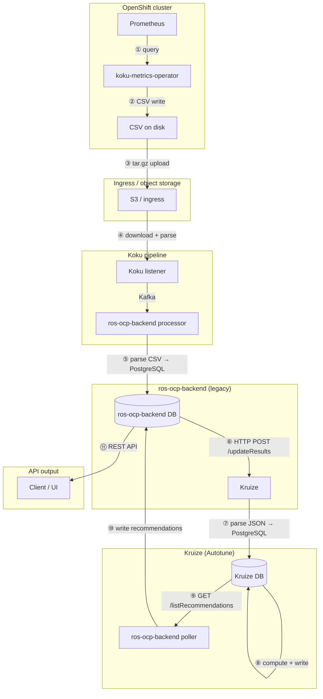
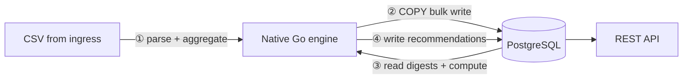

# Why the Native Engine Was Built

> **Date:** 2026-06-16

ROS-OCP Backend originally delegated container right-sizing to **Kruize** (Autotune), a Java service that stored metrics as JSONB blobs and computed recommendations over HTTP. That architecture worked for small clusters but collapsed at fleet scale: ingestion measured in single-digit containers per second, storage measured in terabytes, and recommendation latency measured in hours.

The **native Go engine** was built to eliminate the structural causes of that failure — not to replace PostgreSQL, but to use it correctly. This page explains the legacy pipeline's serialization overhead, the JSONB anti-pattern, and why the bottleneck was always application design, not the database engine.

For migration steps from Kruize, see [Legacy-to-Native Engine Migration Guide](native-migration.md). For benchmark numbers and production tuning, see [Performance and Scalability](../operations/performance-and-scalability.md).

---

## The Legacy Pipeline: 11 Serialization Hops

Every container metric in the Kruize `remote_monitoring` path crossed **11 distinct serialize/deserialize boundaries** before reaching a REST API consumer. Each hop added CPU cost, latency, and failure surface — with no corresponding benefit.



### Hop-by-hop breakdown

| Hop | From | To | Format change |
|-----|------|----|---------------|
| 1 | Prometheus (cluster) | Operator in-memory | PromQL result → Go structs |
| 2 | Operator memory | CSV file (disk) | Structs → comma-separated text |
| 3 | CSV files | S3 / ingress | Plain CSV → tar.gz object |
| 4 | S3 | Koku → Kafka → ros-ocp-backend | Object download → CSV parse → Kafka message |
| 5 | ros-ocp-backend processor | ros-ocp-backend PostgreSQL | CSV rows → relational inserts |
| 6 | ros-ocp-backend PostgreSQL | Kruize HTTP API | SQL rows → JSON POST body |
| 7 | Kruize HTTP handler | Kruize PostgreSQL | JSON → JSONB column writes |
| 8 | Kruize PostgreSQL | Kruize PostgreSQL | Read JSONB → JVM objects → compute → write JSONB |
| 9 | Kruize PostgreSQL | ros-ocp-backend poller | JSONB → JSON HTTP response |
| 10 | ros-ocp-backend poller | ros-ocp-backend PostgreSQL | JSON → relational recommendation rows |
| 11 | ros-ocp-backend PostgreSQL | REST API | SQL → JSON response |

The native engine collapses hops 5–10 into a single in-process path: **CSV parse → daily digest aggregation → recommendation compute → PostgreSQL write**. The operator-to-ingress hops (1–4) remain unchanged — they are inherent to the cluster upload model.

**Native pipeline (4 hops after cluster upload):**



---

## The JSONB Anti-Pattern

Kruize stored all workload metrics in PostgreSQL **JSONB columns** — opaque blobs that required full deserialization on every read, on both the database side and the JVM side.

### Why JSONB was the wrong choice

| Concern | JSONB storage | Typed relational columns |
|---------|---------------|--------------------------|
| Read path | Parse entire blob to extract one field | Direct column access via index |
| Write path | Serialize full object graph per row | Typed INSERT / COPY |
| Indexing | GIN on JSON paths (never used) | B-tree on numeric/timestamp columns |
| Query operators | `->`, `->>`, `@>` available but unused | Standard SQL aggregates |
| Storage overhead | Repeated field names (~50% of payload) | Fixed schema, no key repetition |
| Type safety | Runtime parse errors | Database-enforced types |

**Critical finding:** One of five JSONB columns on the primary metrics table was **written on every ingest but never read** during recommendation computation — pure dead weight multiplied across every interval for every container.

No PostgreSQL JSON operators were ever used in the recommendation hot path. The JSONB columns functioned as an expensive serialization buffer between HTTP and JVM heap — a role PostgreSQL was never designed to optimize.

The native engine stores metrics in **typed relational columns** on `daily_*_digest` tables (e.g., `cpu_usage_p95_mc`, `mem_usage_max_kib`, `interval_start`). Percentile computation reads float slices directly from query results — no intermediate JSON parsing.

---

## The Bottleneck Was Kruize's Usage of PostgreSQL

The Kruize team concluded that "PostgreSQL is the bottleneck." That conclusion conflated **misuse of the database** with an **inherent limitation of the engine**. The evidence:

### Per-row transactions (no batching)

Every 15-minute interval for every container triggered an individual HTTP POST followed by a separate INSERT — no batching, no pipeline, no `COPY FROM`. For 500 containers × 4 intervals/hour × 24 hours, that is **48,000 discrete write transactions per day per cluster** before any recommendation work begins.

### 4N sequential HTTP calls per hour

Kruize's `remote_monitoring` API expected one POST per container per 15-minute interval. A single hour of data for *N* containers required **4N sequential HTTP round-trips** — network latency stacked linearly with fleet size.

### No connection pooling

Each HTTP request opened (or competed for) database connections without a bounded pool. Under load, connection churn and wait time dominated wall-clock latency.

### Full historical re-read on every recommendation

Computing a recommendation required deserializing **all stored intervals for all time** for every container — not just the lookback window. For 500 containers over 91 days at 4 intervals/hour:

```
500 containers × 91 days × 96 intervals/day = 4,368,000 JSONB rows to deserialize
```

Every recommendation cycle repeated this full scan.

### Boxed Double objects and GC pressure

Percentile computation in the JVM sorted arrays of boxed `Double` objects. Autoboxing allocated heap objects for every sample; sorting triggered GC pauses proportional to fleet size. The native engine uses `slices.Sort()` on stack-allocated `float64` slices — zero allocation in the sort hot path.

---

## Architecture Comparison

| Dimension | Legacy Kruize | Native Engine |
|-----------|---------------|---------------|
| Serialization hops | 11 | 4 (operator → CSV → upload → native engine → PostgreSQL) |
| Storage locations | 4 (S3, ros-ocp-backend DB, Kruize DB, API cache) | 1 (ros-ocp-backend PostgreSQL) |
| Storage format | JSONB blobs | Typed relational columns |
| Write pattern | Per-row INSERT via HTTP | `COPY FROM` bulk writes |
| Percentile computation | JVM: sort boxed `Double[]`, GC pressure | Go: `slices.Sort()` on stack-allocated floats |
| Connection management | No pooling | `pgxpool` with bounded connections |
| Data aggregation | None (raw 15-min intervals stored forever) | Daily digests (96 intervals → 1 row/day) |
| Recommendation domains | Containers only | Containers, namespaces, nodes, GPUs, PVCs, quotas, snapshots, VMs |
| External dependencies | Kruize service + 2 PostgreSQL instances | Single PostgreSQL instance |

---

## Key Insight

> **PostgreSQL was never the bottleneck. The 11-hop serialization pipeline and the JSONB anti-pattern were.**

Both the legacy Kruize path and the native engine use PostgreSQL as the system of record. The performance difference is not the database engine — it is how data reaches the database and how it is stored once there:

- **Legacy:** CSV → HTTP → JSON → JSONB → JVM deserialize → compute → JSONB → HTTP → relational rows
- **Native:** CSV → in-process parse → daily digest aggregation → typed columns via `COPY FROM` → in-process compute → typed recommendation rows

Measured on identical hardware (single instance, PostgreSQL 16):

| Metric | Legacy Kruize | Native Engine | Factor |
|--------|---------------|---------------|--------|
| Ingestion throughput | 8 containers/sec | 15,000 containers/sec | ~1,900× |
| Recommendation throughput | 24 containers/sec | 60,000 containers/sec | ~2,500× |

These numbers use the **same PostgreSQL version** on the **same machine class**. The native engine achieves orders-of-magnitude higher throughput because it eliminates unnecessary serialization, aggregates intervals into daily digests, and writes in bulk — not because it replaced PostgreSQL with something else.

For full benchmark methodology, scaling projections to 100M containers, and production tuning guidance, see [Performance and Scalability](../operations/performance-and-scalability.md).

---

## Related Documentation

| Document | Scope |
|----------|-------|
| [Performance and Scalability](../operations/performance-and-scalability.md) | Benchmarks, scaling, tuning |
| [Legacy-to-Native Migration Guide](native-migration.md) | Cutover steps and env vars |
| [Plugin Architecture](plugin-architecture.md) | Native engine design |
| [Query Performance](../query-performance.md) | API read-path optimization |
| [Monitoring](../monitoring.md) | Operational metrics |
