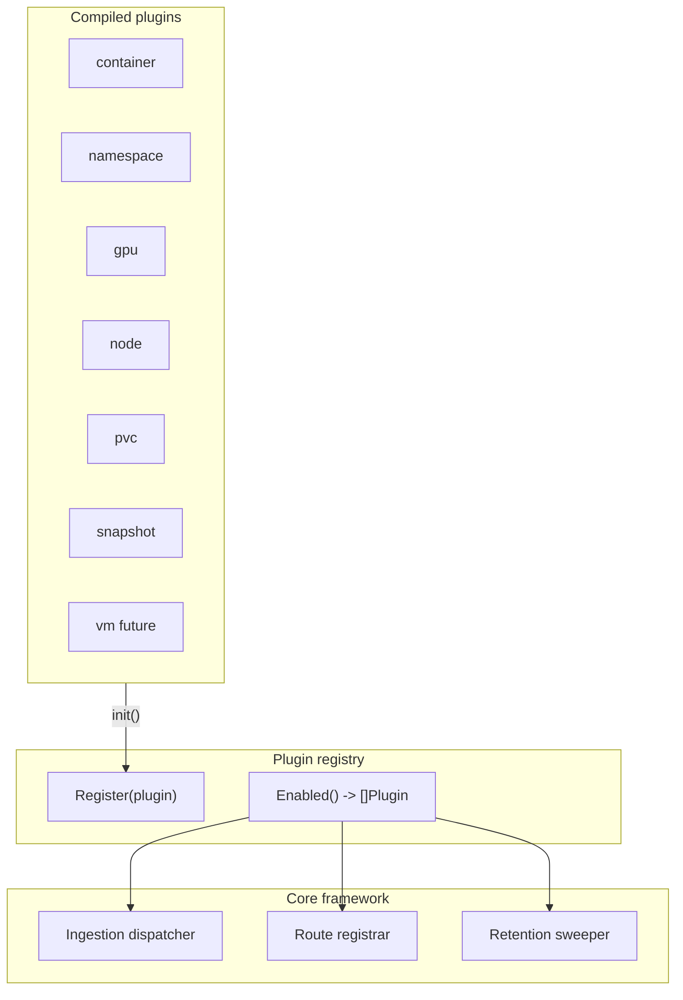

# Recommendation Plugin Architecture — Current Design

> **Date:** 2026-05-18  
> **Status:** Implemented (iterative; outer Kafka dispatch remains partly explicit)  
> **Scope:** `ros-ocp-backend` (Go service that ingests OpenShift metrics and serves resource optimization recommendations via HTTP)

ros-ocp-backend implements multiple recommendation domains—container CPU/memory, namespace aggregates, GPU (MIG and time-slicing), node utilization, PVC storage, and VolumeSnapshot staleness—with more domains planned. **Plugin traits** (`CSVIngestor`, `IngestHook`, `APIProvider`, `APIEnricher`, `RetentionProvider`, reserved `MigrationProvider`) now own much of this surface area, though **Kafka file dispatch** at the outer loop remains explicit per payload type (see §1.2).

This document describes **compile-time, in-process plugins** behind small Go interfaces, toggled at runtime via environment variables (`ROS_ENABLED_PLUGINS` / `ROS_DISABLED_PLUGINS`). Plugins ship in the same binary (blank imports + `init()` registration)—no dynamic `.so` loading, no gRPC, no Wasm—preserving **zero interface dispatch overhead** on the hot path beyond ordinary Go polymorphism.

**Execution phases:** Plugins declare a phase (1=Produce, 2=Enrich, 3=Optimize) and a priority within each phase (lower runs first). The registry runs all Phase 1 plugins before Phase 2, then Phase 3, sorting by phase → priority → name. `ROS_ENABLED_PLUGINS` list order does not matter. See **[plugin-phases.md](plugin-phases.md)** for the phase table, priority matrix, ordering examples, and future plugins (quota tuning, JVM/HPA/VPA, VM rightsizing, binpacking).

**Implementation note:** The Kafka consumer still uses an explicit top-level `switch`/branch per known CSV/payload type (`container`, `namespace`, `storage`, `snapshot`). Within each native branch, CSV handling routes through **`CSVIngestor`** plugins (`nativeCSVIngestViaPlugins`) where applicable; hooks and fallbacks preserve disable semantics for coupled domains (GPU/node digests).

## 1. Problem statement

### 1.1 Symptoms

- Adding or substantially changing a recommendation type requires edits across Kafka ingestion, CSV classification, digest pipelines, recommendation engines, HTTP routing, handlers, and often SQL migrations—without a single place that declares “this type exists.”
- Operators cannot disable a domain (for example GPU or snapshots) without feature-specific env vars scattered through `config`, or without removing code paths.
- Cross-cutting behavior (GPU digest upserts during container CSV processing; GPU enrichment of container list/detail APIs; node recommendations invoked from the container native path) is **implicitly sequenced** inside large functions, which obscures ownership and complicates testing.

### 1.2 Concrete coupling in the codebase

**Kafka report dispatch** (`internal/services/report_processor.go`):

- The outer `for _, file` loop in `ProcessReport` keys off `DetermineCSVType` and `PayloadType` constants.
- Dispatches to `processContainerCSVNative`, `processNamespaceCSVNative`, `processStorageCSVNative`, or `processSnapshotCSVNative` when native ingest is active.
- Native ingest gate: `useNativeCSVIngest := !plugin.EnabledFor(plugin.KruizePluginName)`.

**Inside `processContainerCSVNative`:**

- Matching `CSVIngestor` plugins receive the CSV via `nativeCSVIngestViaPlugins`.
- `IngestHook` implementations run via `runIngestHooksForCSV` on returned `[]MetricRow` (GPU/node digest upserts).
- **Fallback:** when no `CSVIngestor` handles `"container"`, `processContainerDigestFallback` runs `ParseAndDigestCSV` and conditionally `UpsertGPUDigests` / `UpsertNodeDigests` only when `plugin.EnabledFor("gpu")` / `plugin.EnabledFor("node")`.

**Container CSV native path** (`internal/services/report_processor.go`):

1. Fetch the CSV.
2. Run `nativeCSVIngestViaPlugins` (or `processContainerDigestFallback` when no ingestor claims `"container"`).
3. Run recommendations/history/quality.
4. Run `runNodeRecommendations`.

**GPU and node digest upserts** (`internal/ingestion/pipeline.go` + plugins):

- `ParseAndDigestCSV` returns `[]MetricRow`.
- **Plugin path:** `IngestHook` (`gpu`, `node`) runs `UpsertGPUDigests` / `UpsertNodeDigests`.
- **Fallback path:** upserts run only when `plugin.EnabledFor("gpu")` / `plugin.EnabledFor("node")`.
- `ingestion.ProcessCSVToDigests` remains for CLI/tools/tests and **always** chains GPU + node upserts (no registry awareness).
- Non-fatal `IngestHook` failures increment Prometheus `ros_ocp_plugin_hook_errors_total`.

**HTTP routes:**

- `gpu`, `node`, `namespace`, `pvc`, and `snapshot` register `APIProvider` routes from their plugins.
- `internal/api/server.go` registers in order:
    1. Container list/detail (with Kruize fallback)
    2. Settings/terms/history/quality/fleet-summary native gates
    3. `plugin.APIProviders()` routes
    4. `/:recommendation-id` (catch-all, last)
- Echo `static > param > any` matching ensures concrete paths like `/gpu` are not consumed by `/:recommendation-id`.

**GPU enrichment:**

- `gpu` plugin implements `APIEnricher.EnrichResponse` for `NativeContainerEnrichmentInput`.
- `handlers.go` calls `EnrichNativeContainerResults` instead of `enrichWithGPU` directly.

**Retention sweeps** (`internal/engine/retention.go`):

- When `RetentionProvider` plugins are registered, they take priority — each plugin sweeps its own tables via `SweepRetention`.
- If **no** retention plugins are registered (e.g. minimal tests without plugin imports), core falls back to the `retainedTables` slice.
- The fallback list covers the **original pre-plugin set**: container samples/digests, `daily_namespace_digests`, `namespace_usage_samples`, and `gpu_container_digests`.
- **Node and PVC partitions are not in the fallback** — `daily_node_digests`, `node_recommendations`, and `daily_pvc_digests` are swept **only** when the `node` and `pvc` plugins register `SweepRetention`.

Together, these fragments show the same pattern repeated: **dispatch by enum + imperative wiring**, rather than a registry of named capabilities.

---

## 2. Design goals

| Goal | Intent |
|------|--------|
| **Zero hot-path IPC overhead** | Use Go interfaces and static calls only—no gRPC, no subprocesses, no serialization between core and plugins. |
| **Runtime enable/disable without recompilation** | Operators choose active domains via env vars; compiled plugins not in the allowlist (or explicitly blocklisted) do not run **their** ingest hooks, routes, retention, or migrations **contributions**. The binary remains a single artefact with all plugins linked. |
| **Incremental adoption** | Introduce registry and interfaces first; migrate one recommendation type at a time behind the same API. |
| **Explicit cross-plugin relationships** | Secondary behavior (GPU/node piggybacking on container CSV; GPU enrichment of container HTTP responses) becomes **declarative** (`IngestHook`, `APIEnricher`) instead of buried ordering inside monolithic functions. |
| **Testability** | Each plugin can be unit-tested with fake pools and typed stubs; integration tests compose a subset of registered plugins. |

Non-goals are listed in [§13](#13-what-this-design-does-not-do).

---

## 3. Architecture overview

Plugins are **compiled in** and **self-register** via `init()`. A central **registry** filters registrations according to env-configured enabled sets. Core subsystems (**ingestion dispatcher**, **HTTP registrar**, and **retention runner**) iterate **only enabled** plugins and invoke optional capabilities via type assertions (trait pattern). DDL ownership remains **documentation convention** on numbered SQL files under **`migrations/`** — **`MigrationProvider`** is reserved and **not** invoked by core dispatch (§6.4).



**Shared infrastructure:** Trait methods take concrete dependencies in their signatures (for example `*pgxpool.Pool`, `context.Context`, Echo groups). **[`PluginContext`](../../internal/plugin/context.go)** exists for **initialization-time** dependency injection (pool, logger entry, optional typed config snapshot) when core wires plugins at startup.

Plugins may use the same globals as the rest of the codebase — for example **[`config.GetConfig()`](../../internal/config/config.go)** and **[`logging.GetLogger()`](../../internal/logging/logging.go)** — where that matches existing patterns. Prefer explicit parameters on trait methods when the dependency is always needed for that operation.

### 3.1 Configuration boundary

- **Single load:** The root **`Config`** struct is populated **once at process startup** via Viper (existing pattern). This remains the central source of truth for service-wide settings.
- **Plugins:** May read **`config.GetConfig()`** like other packages, or receive snapshots via **`PluginContext`** during wiring; avoid duplicating Viper reads for values already on **`Config`** when practical.
- **Cleanup (directional):** Domain-specific toggles that still use raw **`os.Getenv`** should migrate onto the central **`Config`** over time for consistency.

---

## 4. Plugin interfaces (trait-based)

Not every plugin implements every trait. Core code uses **type assertions** (see **[`plugin.ByTrait`](../../internal/plugin/registry.go)**) to detect capabilities—no “fat” interface forcing empty methods.

The canonical definitions live in **[`internal/plugin/plugin.go`](../../internal/plugin/plugin.go)**. Signatures use concrete dependencies (`*pgxpool.Pool`, `echo.Group`, etc.) rather than threading **`PluginContext`** through every hot-path call.

```go
package plugin

// Plugin is the base interface every plugin implements.
type Plugin interface {
	Name() string
	// Enabled reports whether this plugin should participate in the registry.
	Enabled() bool
	// Phase returns execution phase (1=Produce, 2=Enrich, 3=Optimize). Lower phases run first.
	Phase() int
	// Priority returns order within a phase (lower runs first). Ties break by Name() ascending.
	Priority() int
}

// CSVIngestor plugins own CSV parsing for one or more logical CSV report types.
type CSVIngestor interface {
	Plugin
	SupportedCSVTypes() []string
	IngestCSV(ctx context.Context, pool *pgxpool.Pool, r io.Reader, orgID, clusterUUID string) ([]ingestion.MetricRow, error)
}

// IngestHook runs after a CSVIngestor has parsed matching CSV types.
type IngestHook interface {
	Plugin
	HookAfterCSVTypes() []string
	AfterIngest(ctx context.Context, pool *pgxpool.Pool, rows []ingestion.MetricRow, orgID, clusterUUID string) error
}

// APIProvider registers HTTP routes on the authenticated API group.
type APIProvider interface {
	Plugin
	RegisterRoutes(g *echo.Group)
}

// APIEnricher plugins decorate responses produced by other handlers/plugins.
type APIEnricher interface {
	Plugin
	EnrichResponse(ctx context.Context, resp interface{}) error
}

// RetentionProvider contributes retention sweep logic for domain-owned tables.
type RetentionProvider interface {
	Plugin
	RetentionTables() []string
	SweepRetention(ctx context.Context, pool *pgxpool.Pool, olderThan time.Time) error
}

// MigrationProvider is reserved for future use when plugins can declare DDL ownership in docs and tooling.
// Nothing in the dispatch pipeline consumes this trait yet.
type MigrationProvider interface {
	Plugin
	OwnedTables() []string
}

// TermProvider plugins declare configurable recommendation terms (short/medium/long).
// Implementing this trait enables:
//   - Per-tenant term customization via PUT /settings/terms?recommendation_type=<name>
//   - Admin-locked terms via ROS_TERMS_<PLUGIN>_<TERM>_<FIELD> environment variables
//   - Listing in GET /settings/capabilities with supports_terms: true
type TermProvider interface {
	Plugin
	DefaultTerms() []TermConfig  // Plugin-specific defaults (3 entries: short, medium, long)
	MaxWindowDays() int          // Upper bound on window_days (enforced in API and env vars)
}
```

**IngestHook data contract (confirmed — Option B):**

After the container `CSVIngestor` parses the CSV, hooks receive `[]MetricRow` — the existing struct in `internal/ingestion/models.go`. That type is already the de facto DTO for `upsertGPUDigests` and `upsertNodeDigests`.

**Why Option B (in-memory `[]MetricRow`):**

- Avoids an extra DB round-trip
- Hooks are trivially unit-testable with in-memory slices
- `MetricRow` can grow additively as the CSV schema evolves — hooks that only read fields they need remain compatible

**Rejected — Option C** (hooks re-query DB after container writer persists rows): adds I/O, couples hooks to table shapes, and complicates tests.

**Note:** Kafka/message types and routing details stay in **`internal/types`** and **`internal/api`**; traits reference **`ingestion.MetricRow`** where needed rather than duplicating models.

---

## 5. Registry implementation

Implementation: **[`internal/plugin/registry.go`](../../internal/plugin/registry.go)**.

- **`Register(p Plugin)`** — appends to a package-level slice; called from each plugin’s **`init()`**. **`Register(nil)` panics** with a clear message — accidental nil registration is a programmer error.
- **Convention:** Always register **pointer receivers** so embedding/`interface` satisfaction works as intended, e.g. **`plugin.Register(&MyPlugin{})`**.
- **`Enabled()`** — returns plugins that pass **`p.Enabled()`** (implementations usually delegate to **`EnabledFor(Name())`** per plugin rules), then applies **kruize exclusivity**: if any plugin named **`kruize`** is enabled, only kruize plugins are returned and others are skipped (with a one-time warning).

Env semantics (**[`EnabledFor`](../../internal/plugin/registry.go)**):

- If **`ROS_ENABLED_PLUGINS`** is non-empty: **allowlist** only (comma-separated names matching **`Plugin.Name()`**).
- If empty: every plugin is eligible except **`kruize`** (off unless allowlisted), then **`ROS_DISABLED_PLUGINS`** applies as a blocklist.

- **Ordering** — [`Enabled()`](../../internal/plugin/registry.go) returns plugins sorted by **execution phase** (1→2→3), then **priority** ascending within a phase, then **name** ascending for ties. Registration order and `ROS_ENABLED_PLUGINS` list order do not affect execution. See **[`plugin-phases.md`](plugin-phases.md)** (priority table and examples). [`ExecuteInPhases`](../../internal/plugin/phases.go) runs callbacks with barriers between phases; retention sweeps and [`ByTrait`](../../internal/plugin/registry.go) use this ordering.

**Blank imports:** [`cmd/start.go`](../../cmd/start.go) imports **`_ ".../internal/plugins"`**, which loads **[`internal/plugins/plugins.go`](../../internal/plugins/plugins.go)** — that file aggregates **`init()`** registration via blank imports of each plugin package:

```go
import (
	_ "github.com/redhatinsights/ros-ocp-backend/internal/plugins/cluster-quota"
	_ "github.com/redhatinsights/ros-ocp-backend/internal/plugins/container"
	_ "github.com/redhatinsights/ros-ocp-backend/internal/plugins/example"
	_ "github.com/redhatinsights/ros-ocp-backend/internal/plugins/gpu"
	_ "github.com/redhatinsights/ros-ocp-backend/internal/plugins/kruize"
	_ "github.com/redhatinsights/ros-ocp-backend/internal/plugins/namespace"
	_ "github.com/redhatinsights/ros-ocp-backend/internal/plugins/node"
	_ "github.com/redhatinsights/ros-ocp-backend/internal/plugins/pvc"
	_ "github.com/redhatinsights/ros-ocp-backend/internal/plugins/quota"
	_ "github.com/redhatinsights/ros-ocp-backend/internal/plugins/snapshot"
)
```

---

## 6. Core dispatch changes

### 6.1 Ingestion (`report_processor.go`)

**Hook orchestration rule:**

- Ingest-hook dispatch is orchestrated from `internal/services/report_processor.go`, **not** from `internal/ingestion/`.
- This avoids import cycles (`ingestion` imports `plugin` for `CSVIngestor` / `[]MetricRow` plumbing).

**Container CSV seam:**

- `ParseAndDigestCSV` returns `[]MetricRow` after upserting container digests.
- Enabled `IngestHook` plugins (`gpu`, `node`) run `UpsertGPUDigests` / `UpsertNodeDigests` from `report_processor.go` after `CSVIngestor.IngestCSV`.
- When no ingestor handles `container`, `processContainerDigestFallback` performs the same conditional upserts keyed off `plugin.EnabledFor("gpu"|"node")`.
- `ProcessCSVToDigests` remains a tool/test helper that **always** chains GPU + node upserts (no registry awareness).

**Outer Kafka routing:**

- The file-type `if` chain is unchanged at the top of `ProcessReport`.
- Inner dispatch uses plugins as above.

### 6.1.1 Hook failure semantics (confirmed)

`IngestHook` invocations are **non-fatal by default**. When a hook returns an error:

1. Core **logs** the error.
2. Core **increments** `ros_ocp_plugin_hook_errors_total`.
3. Processing **continues** with remaining hooks and downstream steps.

**Key principle:** Container recommendations are the primary product — an auxiliary plugin bug must not prevent container data from landing.

**Why this matters:** Isolation between domains limits blast radius. Before plugins, a GPU digest failure could fail the entire container ingest path. Now `processContainerDigestFallback` + hooks isolate failures per domain.

**Future extension:** A `Critical() bool` trait on hooks could mark must-succeed contributors that abort the batch — not part of the initial design.

### 6.2 API (`server.go` / handlers)

[`plugin.APIProviders`](../../internal/plugin/registry.go) registers **`APIProvider`** routes **without** Kruize mutual exclusivity so reads (for example namespace listings) stay available in legacy mode; ingest hooks still use **`plugin.Enabled()`**, which **is** exclusive when **`kruize`** is on.

**Route ordering:** Echo matches **`static > param > any`**, so concrete paths such as **`/recommendations/openshift/gpu`** win over **`/:recommendation-id`**. Core registers parameterized container detail routes **after** the **`APIProviders()`** loop.

Container list/detail handlers call **`EnrichNativeContainerResults`**, which invokes **`APIEnricher`** implementations (**`gpu`** attaches utilization/savings today).

### 6.3 Retention (`internal/engine/retention.go`)

**Framework-owned** tables (history, quality, non-partitioned date columns) stay in core.

**Plugin-owned** partitioned digest/sample tables are swept by `RetentionProvider` implementations when registered.

**Fallback behavior** (no retention plugins registered):

- Core falls back to the `retainedTables` slice — the legacy monthly-partition sweep list.
- Covers: container samples/digests, namespace digests/samples, `gpu_container_digests`.
- **Not included:** node and PVC partitions — those require their plugins’ `SweepRetention`.

Core orchestrates via **`plugin.ByTrait`** (cutoff timestamp — see **`RetentionProvider`** in §4). Dispatch matches **[`RunRetentionSweep`](../../internal/engine/retention.go)**:

```go
for _, rp := range plugin.ByTrait[plugin.RetentionProvider]() {
	if err := rp.SweepRetention(ctx, pool, cutoff); err != nil {
		errs = append(errs, err)
	}
}
// If len(retProviders)==0: SweepPartitionedTables(..., retainedTables, cutoffYM)
```

### 6.4 Migrations

**Central directory only (confirmed):** All golang-migrate SQL stays in the repository’s single **`migrations/`** directory with **sequential numeric prefixes** on filenames. Plugin-contributed DDL is added as new numbered files in that same tree—**not** under **`internal/plugins/<name>/migrations/`** or other per-plugin paths.

**Convention:** Each plugin-authored file begins with a SQL comment header identifying ownership, e.g. **`-- plugin: gpu`**, so operators and reviewers can see domain ownership without splitting the migrate graph.

The golang-migrate driver loads **one** sequential chain (core + plugin contributions in numeric order). Disabled plugins still imply an operational constraint: operators must not enable a domain on an existing cluster until its numbered migrations have been applied—same as today when toggling features.

### 6.5 Legacy Kruize engine (optional plugin — confirmed stance)

The Kruize-facing surface comprises roughly **2.5k+ lines**:

- HTTP client: `internal/utils/kruize/`
- Payload types: `internal/types/kruizePayload/`
- Recommendation poller: `recommendation_poller.go`
- Legacy ingestion plumbing and handler fallback branches

**External dependencies:**

- HTTP calls to the Kruize server
- Consumption/production on the Kafka recommendation topic
- `KRUIZE_*` configuration variables

**Decision:** Treat Kruize as an **optional legacy plugin** behind the same registry.

- `ROS_USE_NATIVE_ENGINE` on `Config` is **deprecated** (see §11.1).
- `plugin.EnabledFor(plugin.KruizePluginName)` is the unified runtime signal.
- Remove Kruize-only codepaths only when product commits to native-only operation **and** all tenants are migrated.

**Mutual exclusivity with native plugins:**

- **Disabled by default** — deployments run native plugins unless `ROS_ENABLED_PLUGINS` lists `kruize`.
- **Enabling `kruize` automatically disables all other plugins.** The two engines are mutually exclusive.
- **Startup enforcement:** Registry logs a warning and skips all non-Kruize plugins.
- **Rationale:** Running both would emit conflicting/duplicate recommendations and risk double-counting savings.

---

## 7. Hard coupling points and resolutions

| Coupling | Today | Resolution |
|----------|--------|------------|
| **Shared infrastructure** | Packages import `db.GetPool()` and **`config.GetConfig()`** freely. | Trait methods receive **`pool`** (and similar) explicitly; **`PluginContext`** is optional for startup wiring (§3). Plugins may use **`logging.GetLogger()`** like the rest of the codebase. |
| **Container CSV fan-out** | Prior unconditional GPU/node tails on **`ProcessCSVToDigests`** for Kafka paths. | **`CSVIngestor`** + **`IngestHook`** + **`processContainerDigestFallback`** respect **`EnabledFor("gpu"|"node")`**; **`ProcessCSVToDigests`** remains for tools/tests only (always chains GPU+node). |
| **GPU API enrichment** | Direct **`enrichWithGPU`** calls in handlers. | **`APIEnricher`** via **`EnrichNativeContainerResults`** (**`gpu`** plugin). |
| **Retention table lists** | Single `retainedTables` fallback predates per-domain plugins. | Loaded **`RetentionProvider`** plugins sweep their declared tables first; the fallback list retains the original digest/sample set for tests/tools without plugin imports; **node/PVC** partitions are plugin-only. |

---

## 8. Plugin directory structure

```
internal/plugin/
  plugin.go              # Plugin + trait interfaces (CSVIngestor, APIProvider, ...)
  registry.go            # Register, Enabled, ByTrait, env parsing helpers
  context.go             # PluginContext (startup DI)

internal/plugins/
  example/
    README.md            # trait contract for plugin authors (see §8.1)
    plugin.go            # stub implementations of every trait (compile-time interface check)
    plugin_test.go

  container/
    plugin.go            # CSVIngestor + RetentionProvider (+ plugin_test.go)

  namespace/
    plugin.go            # CSVIngestor + APIProvider + RetentionProvider (+ tests)

  gpu/
    plugin.go            # IngestHook + APIProvider + APIEnricher + RetentionProvider (+ tests)

  node/
    plugin.go            # IngestHook + APIProvider + RetentionProvider (+ tests)

  pvc/
    plugin.go            # CSVIngestor + APIProvider + RetentionProvider (+ tests)

  quota/
    plugin.go            # APIProvider + RetentionProvider (+ tests)

  cluster-quota/
    plugin.go            # CSVIngestor + APIProvider + RetentionProvider (+ tests)

  snapshot/
    plugin.go            # CSVIngestor + APIProvider (+ tests)

  kruize/
    plugin.go            # legacy engine registration (+ tests)
```

Engine math under `internal/engine/` can remain shared libraries imported by plugins until a later refactor moves code physically.

### 8.1 Sample plugin (`example` / id `_example`) — confirmed

The compilable template lives at **`internal/plugins/example/`** (Go tooling skips directories named with a leading `_`; the stable plugin id remains **`_example`** via **`ExamplePlugin.Name()`**). It implements **all** trait interfaces with **stub/logging bodies** ( **`Enabled()` is always false** in production builds).

- **Authoring template** — copy/adapt when adding a new plugin.
- **Compile-time check** — proves the trait set is satisfiable together.

See **`internal/plugins/example/README.md`** for trait contracts and registration expectations.

---

## 9. Trait matrix (current recommendation types)

Sorted by execution order (Phase → Priority → Name):

| Domain | Plugin name | Phase | Priority | CSVIngestor | IngestHook | APIProvider | APIEnricher | RetentionProvider | MigrationProvider | TermProvider |
|--------|-------------|:-----:|:--------:|:-----------:|:----------:|:-----------:|:-----------:|:-----------------:|:-----------------:|:------------:|
| Container CPU/memory | `container` | 1 | 10 | ✅ Primary ros CSV | — | — (core handlers) | — | ✅ Container samples & digests | — | ✅ (max 90d) |
| Legacy Kruize | `kruize` | 1 | 10 | — | — | — (core handlers) | — | — | — | — |
| GPU (MIG / time-slicing) | `gpu` | 1 | 20 | — | ✅ After `container` | ✅ Summary + subroutes | ✅ Container payloads | ✅ `gpu_container_digests` | — | ✅ (max 90d) |
| Node utilization | `node` | 1 | 30 | — | ✅ After `container` | ✅ Nodes routes | — | ✅ `daily_node_digests`, `node_recommendations` | — | ✅ (max 90d) |
| PVC | `pvc` | 1 | 30 | ✅ Storage CSV | — | ✅ `/pvcs` | — | ✅ `daily_pvc_digests` | — | ✅ (max 365d) |
| ResourceQuota | `quota` | 1 | 35 | — | — | ✅ `/quota` + settings | — | ✅ `quota_recommendation_sets` | — | — |
| ClusterResourceQuota | `cluster-quota` | 1 | 36 | ✅ CRQ CSV | — | ✅ `/cluster-quota` + settings | — | ✅ `cluster_quota_recommendation_sets`, `daily_cluster_quota_digests` | — | — |
| Snapshot | `snapshot` | 1 | 40 | ✅ Snapshot CSV | — | ✅ Snapshots + settings | — | — (inventory purge stays in core retention) | — | — |
| Template (disabled) | `_example` | 1 | 50 | ✅ stub | ✅ stub | ✅ stub | ✅ stub | ✅ stub | ✅ stub / reserved trait | ✅ stub |
| Namespace | `namespace` | 1 | 90 | ✅ | — | ✅ (+ legacy paths) | — | ✅ Namespace samples & digests | — | ✅ (max 90d) |

*`MigrationProvider` is implemented today **only** by **`example`** (`Name()` **`_example`**); the trait is **reserved** for future tooling — no production dispatch consumes it.*

### 9.1 TermProvider — per-plugin default terms

Plugins implementing **`TermProvider`** declare their domain-specific default recommendation terms. The choice of window sizes depends on how fast the underlying metric changes:

| Plugin | short | medium | long | MaxWindowDays | Rationale |
|--------|-------|--------|------|:-------------:|-----------|
| `container` | 1d / min 1d | 7d / min 3d | 15d / min 7d | 90 | CPU/memory usage changes rapidly; long lookbacks are noisy |
| `namespace` | 1d / min 1d | 7d / min 3d | 15d / min 7d | 90 | Aggregate of containers — same dynamics |
| `node` | 1d / min 1d | 7d / min 3d | 15d / min 7d | 90 | Node capacity utilization patterns |
| `gpu` | 1d / min 1d | 7d / min 3d | 15d / min 7d | 90 | GPU workloads often bursty; 90d sufficient |
| `pvc` | 7d / min 3d | 30d / min 14d | 90d / min 30d | 365 | Storage growth is slow; long windows needed for trend detection |

**Term resolution precedence** (per term, per plugin):
1. **Admin env var** (`ROS_TERMS_<PLUGIN>_<TERM>_WINDOW_DAYS`, etc.) — always wins, makes term "locked"
2. **Tenant DB override** (via `PUT /settings/terms?recommendation_type=<plugin>`) — applied unless locked
3. **Plugin default** (`DefaultTerms()`) — used when no override exists

**Decay half-life:** Controls exponential weighting in time-series analysis. A value of `168` (1 week) means data from 1 week ago receives half the weight of today's data. Set to `0` for equal weighting. PVC defaults to `0` because storage growth is linear and doesn't benefit from recency weighting.

---

## 10. Adding a new plugin (example: OpenShift Virtualization VMs)

1. **Define plugin name** — `vm` (stable, lowercase, matches env vars).
2. **Create package** `internal/plugins/vm/` with `init() { plugin.Register(&VMPlugin{}) }`.
3. **Implement traits:**
   - **`CSVIngestor`** if a distinct CSV / payload type exists; otherwise **`IngestHook`** if VM metrics piggyback on an existing file.
   - **`APIProvider`** for `/recommendations/openshift/vms` (exact paths follow OpenAPI policy).
   - **`RetentionProvider`** for `daily_vm_digests` and VM recommendation partitions.
   - **`MigrationProvider`** when DDL is plugin-owned.
   - **`TermProvider`** (optional) if recommendations are parameterized by configurable time windows. Implement `DefaultTerms()` (3 terms) and `MaxWindowDays()`. See [`internal/plugins/example/plugin.go`](../../internal/plugins/example/plugin.go) for a template.
4. **Add SQL** as the next sequential migration(s) under the central **`migrations/`** directory with a **`-- plugin: vm`** (or matching name) header comment—no **`internal/plugins/vm/migrations/`** subtree.
5. **Blank-import** `_ ".../internal/plugins/vm"` from the main binary.
6. **Update operator / ingest documentation** so the correct files arrive on Kafka when the plugin is enabled.

No edits to `server.go`’s route list should be required beyond the generic registrar loop for **`APIProvider`** surfaces.

---

## 11. Enable / disable mechanism

| Variable | Semantics |
|----------|-----------|
| **`ROS_ENABLED_PLUGINS`** | Comma-separated allowlist. When set, **only** these plugins run (names match `Plugin.Name()`). |
| **`ROS_DISABLED_PLUGINS`** | Comma-separated blocklist applied when **allowlist is unset**: defaults minus blocked names. |
| **Both unset** | Plugins use **`Plugin.Enabled()`** (typically **`EnabledFor(Name())`**); **`kruize`** stays off unless allowlisted; **`ROS_DISABLED_PLUGINS`** subtracts from that default set (see §5). |

### 11.1 Native vs. legacy Kruize (unified switch)

Legacy vs native dispatch no longer depends on a separate **`cfg.UseNativeEngine`** branch in parallel with the registry:

- **Runtime signal:** [`report_processor.go`](../../internal/services/report_processor.go) and [`server.go`](../../internal/api/server.go) use **`!plugin.EnabledFor(plugin.KruizePluginName)`** (native CSV ingest paths and native HTTP routes when the **`kruize`** plugin is off).
- **Preferred configuration:** `ROS_ENABLED_PLUGINS=kruize` to run legacy Kruize only (native plugins excluded by registry exclusivity).
- **Deprecated:** `ROS_USE_NATIVE_ENGINE` on [`Config`](../../internal/config/config.go) is retained for backward compatibility only.
- **Compatibility bridge:** [`ApplyLegacyUseNativeEngineEnv`](../../internal/plugin/registry.go) runs from [`main`](../../rosocp.go) **before** [`cmd.Execute()`](../../cmd/root.go).
  - When **`UseNativeEngine`** is **`false`** (**`ROS_USE_NATIVE_ENGINE=false`**): **`ROS_ENABLED_PLUGINS`** is **forced** to **`kruize`** (overwrites any prior value) with a deprecation warning.
  - When **`UseNativeEngine`** is **`true`** (default): if **`ROS_ENABLED_PLUGINS`** lists **`kruize`**, **`kruize`** is **stripped** from the allowlist (unset env when nothing remains) because **`kruize`** cannot run alongside native plugins — a warning is logged.

Prefer migrating manifests to **`ROS_ENABLED_PLUGINS=kruize`** for legacy-only installs instead of the deprecated flag.

Examples:

```bash
# Default bundle (all default-enabled plugins)
ROS_ENABLED_PLUGINS=
ROS_DISABLED_PLUGINS=

# Strict subset for lightweight deployments
ROS_ENABLED_PLUGINS=container,namespace,pvc

# Disable GPU and snapshot domains only
ROS_DISABLED_PLUGINS=gpu,snapshot
```

**Operational note:** Disabling a plugin stops **new** processing and API surfaces for that domain; existing DB rows remain until retention policies drop them (may require running disabled plugin retention once for cleanup, or a documented manual purge).

---

## 12. Migration path (four phases)

| Phase | Deliverable |
|-------|-------------|
| **Phase 1 — Framework** | ✅ Registry, traits, env parsing — iterative adoption continues (**`PluginContext`** defined for future lifecycle injection but **not** threaded through dispatch yet). |
| **Phase 2 — Simple domains** | ✅ PVC/snapshot ingest **`CSVIngestor`** plugins + **`APIProvider`** for HTTP surfaces (inventory purge stays centralized). |
| **Phase 3 — Coupled domains** | ✅ GPU/node **`IngestHook`** + **`APIEnricher`** for GPU; optional future work: move **`runNodeRecommendations`** entirely behind **`node`** plugin orchestration. |
| **Phase 4 — New domains** | Add **VM** (then JVM/Go) using only plugin-local code + blank import—prove the framework. |

Detailed testing expectations per phase are in [§16](#16-test-strategy).

---

## 13. What this design does not do

- **No dynamic `.so` plugins** — avoids Go plugin package instability across platforms and build modes.
- **No gRPC / sidecar plugins** — avoids latency and operational complexity on every request and CSV row batch.
- **No polyglot plugins** — JVM or Python logic would require a **different** integration model (out of scope here).
- **No runtime plugin download** — supply chain and reproducibility stay under Git + container image versioning.

---

## 14. Risks and mitigations

| Risk | Mitigation |
|------|------------|
| **Over-abstraction** | Keep trait count small; forbid “misc” traits—justify each with ≥2 plugins. |
| **Hook ordering bugs** | Integration tests with partial enable sets; document hook contracts; optional deterministic sort. |
| **Double CSV fetch** | Eliminated for hooks on the container path by passing **`[]MetricRow`** from the primary ingestor (§4). Hooks must not re-download the same URL unless a future use case explicitly requires it. |
| **Migration skew when toggling plugins** | Document: enabling a plugin on an old DB requires migrations; CI runs full migration suite with all plugins registered. |
| **Shared table ownership** | **Core** owns org/cluster/account globals; plugins own domain digest and recommendation tables. |
| **RBAC / OpenAPI drift** | **APIProvider** registration is gated behind existing RBAC middleware. The dynamic `/openapi.json` endpoint (`ServeFilteredOpenAPI` in `openapi_handler.go`) filters out disabled plugin paths at runtime via the `x-plugin-required` annotation on each operation. |

---

## 15. Alternatives considered

| Approach | Why not chosen |
|----------|----------------|
| **`plugin` package (Go runtime plugins)** | Poor portability (Linux-focused), painful linking constraints, difficult debugging—unsuitable for enterprise OpenShift builds (often FIPS / static-ish binaries). |
| **gRPC microservices per domain** | Operational overhead, network latency, duplicated auth and paging semantics; contradicts “single binary” deployment model. |
| **HashiCorp go-plugin** | Same IPC/process isolation benefits/drawbacks as gRPC for this scale; unnecessary when compile-time registration suffices. |
| **Wasm extensions** | Embedding a Wasm runtime adds security surface and latency; team expertise and toolchain cost outweigh benefits for internal recommendation types. |
| **IngestHook loads rows from DB after container write (Option C)** | Extra I/O and tight coupling to table schemas; hooks harder to unit test — **`[]MetricRow`** passed in-process is the confirmed contract (§4). |

---

## 16. Test strategy

**Current state:** Tests are **colocated** with production code (`*_test.go` beside packages). A subset are **pure unit tests**; others integrate against **PostgreSQL** (often via **testcontainers**). Exact file and line counts drift as the suite grows—treat **`go test ./...`** as the source of truth.

**Principle:** Existing tests **stay where they are** today—they are the **acceptance criteria** for the refactor. If the full package test suite still passes after each extraction phase, that phase is considered behavior-preserving.

**Phased approach:**

| Phase | Testing focus |
|-------|----------------|
| **Phase 1 — Framework** | Add tests for the **registry**, trait dispatch loops, and optional **`PluginContext`** wiring. The **`_example`** plugin proves traits stay callable through registration. **Existing tests unchanged**—they provide the regression safety net. |
| **Phase 2 — Container plugin extraction** | Keep **`recommend_cpu_test.go`**, **`recommend_memory_test.go`**, **`digest_test.go`**, and related container tests **in place** and passing. Add a **small integration test** asserting the container plugin **registers** and the dispatch loop **invokes** it for container CSVs. |
| **Phase 3+ — GPU, node, namespace plugins** | Same pattern: **domain-specific tests remain** where they live today; add **wiring tests** that enabled plugins are registered and hooks/routes/retention hooks fire as expected. |
| **Post-extraction (optional)** | **Cosmetic** re-home tests under each plugin’s directory—organizational only; **no functional requirement**. |

**Known refactor prerequisite:** **`handlers_node_recs_integration_test.go`** (~886 lines) mixes **GPU time-slicing** scenarios with **node utilization** scenarios. It should be **split** when those concerns become separate plugins (aligned with §12 Phase 3 / coupled domains).

---

## 17. Summary

A **trait-based, compile-time plugin model** with `ROS_ENABLED_PLUGINS` / `ROS_DISABLED_PLUGINS` gives operators control over recommendation domains without forking the binary.

**Confirmed mechanics:**

- `IngestHook` receives `[]MetricRow` (§4)
- Hook failures are **non-fatal** and increment `ros_ocp_plugin_hook_errors_total` (§6.1.1)
- Migrations remain **one central numbered directory** with `-- plugin:` headers (§6.4)
- Echo **static-before-param** routing; core registers catch-alls last (§6.2)
- Kruize stays an **optional legacy path** (§6.5)
- `PluginContext` is defined for future lifecycle injection but not consumed by dispatch yet
- Plugins use `config.GetConfig()` / `logging.GetLogger()` like other packages (§3.1)
- The compilable `internal/plugins/example` template (plugin id `_example`) documents traits at compile time (§8.1)
- `MigrationProvider` remains **reserved / documentation-only** (`ExamplePlugin` only)
- Testing stays anchored on existing coverage plus wiring tests ([§16](#16-test-strategy))
