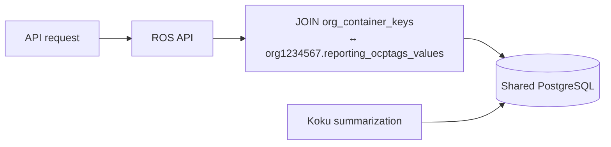

# Configuration Reference

Environment variables for ROS-OCP Backend deployments. Set these on the
**API**, **processor**, and **recommendation-poller** Deployments as needed —
each process reads the same config struct but uses different subsets (for
example, Kafka variables apply to the processor; RBAC cache applies to the API).

In Red Hat OpenShift with the cost-onprem Helm chart or Clowder, database,
Kafka, and RBAC connection settings are usually injected by the platform. The
variables below are the ones operators most often tune explicitly.

---

## Performance Tuning

Added during native-engine performance optimization (parallel ingestion,
connection pooling, RBAC caching, threshold recalc fan-out, reship concurrency).

| Variable | Default | Description |
|----------|---------|-------------|
| `ROS_KAFKA_PARALLEL` | `true` | Enable parallel Kafka message processing. |
| `ROS_KAFKA_WORKERS` | `3` | Worker goroutines when parallel mode is on. Messages on the same Kafka partition are still processed serially. |
| `ROS_RBAC_CACHE_TTL` | `60` | RBAC permission cache TTL in seconds. `0` disables caching. |
| `ROS_THRESHOLD_RECALC_CONCURRENCY` | `3` | Max parallel clusters during threshold recalculation. |
| `ROS_DB_MIN_CONNS` | `2` | Minimum pgxpool connections. |
| `ROS_DB_MAX_CONN_LIFETIME` | `30` | Max connection lifetime in **minutes**. |
| `ROS_DB_MAX_CONN_IDLE_TIME` | `5` | Max idle connection time in **minutes**. |
| `ROS_DB_STATEMENT_CACHE_MODE` | `describe` | pgx statement cache mode (`describe`, `prepare`, `describe_exec`). |
| `ROS_DB_MAX_CONNS` | `10` | Maximum pgxpool connections per process. |
| `ROS_DB_ACQUIRE_TIMEOUT_SECS` | `5` | Pool acquire timeout. `0` = no limit. |
| `ROS_RESHIP_CONCURRENCY` | `2` | Parallel masu reship calls per org. |

!!! tip "Tuning order"
    Increase Kafka workers first if CPU is idle and ingestion lag is high. Then
    adjust `ROS_DB_MAX_CONNS` if you see pool timeouts. Raise reship concurrency
    only after confirming masu can handle the load.

---

## Database

| Variable | Default (local dev) | Description |
|----------|---------------------|-------------|
| `DB_HOST` | `localhost` | PostgreSQL hostname. |
| `DB_PORT` | `15432` | PostgreSQL port. |
| `DB_NAME` | `postgres` | Database name. |
| `DB_USER` | `postgres` | Database user. |
| `DB_PASSWORD` | `postgres` | Database password. |
| `DB_SSL` | `disable` | SSL mode. |
| `DB_CA_CERT` | (empty) | CA certificate path for TLS. |

Pool tuning variables are listed under [Performance Tuning](#performance-tuning).

---

## Kafka

| Variable | Default | Description |
|----------|---------|-------------|
| `KAFKA_BOOTSTRAP_SERVERS` | `localhost:29092` | Broker addresses (comma-separated). |
| `KAFKA_CONSUMER_GROUP_ID` | `ros-ocp` | Consumer group ID. |
| `KAFKA_AUTO_COMMIT` | `false` | Auto-commit offsets (`false` recommended). |
| `UPLOAD_TOPIC` | `hccm.ros.events` | Upload event topic (processor). |
| `RECOMMENDATION_TOPIC` | `rosocp.kruize.recommendations` | Kruize request topic (legacy poller). |
| `SOURCES_EVENT_TOPIC` | `platform.sources.event-stream` | Sources lifecycle events. |

Parallel processing: `ROS_KAFKA_PARALLEL`, `ROS_KAFKA_WORKERS` (see Performance Tuning).

---

## API and HTTP

| Variable | Default | Description |
|----------|---------|-------------|
| `API_PORT` | `8000` | REST API port. |
| `PROMETHEUS_PORT` | `9000` (Helm) / `5005–5007` (local) | Metrics scrape port. |
| `READ_HEADER_TIMEOUT` | `15` | HTTP read-header timeout (seconds). |
| `GLOBAL_HTTP_CLIENT_TIMEOUT_SECS` | `30` | Outbound HTTP client timeout. |
| `MAXIMUM_COUNT_PER_QUERY_PARAM` | `5` | Max values per repeated query param. |
| `RECORD_LIMIT_CSV` | `1000` | CSV export row limit per batch. |

### List pagination (`after` cursor)

Container and namespace recommendation list endpoints support **keyset pagination**
via the `after` query parameter. When `after` is present, the API uses an opaque
base64-encoded cursor and ignores `offset`. Each JSON response includes
`meta.has_next` and, when more pages exist, `meta.next_cursor` for the next
request. Existing clients can continue using `offset` and `limit`; `meta.count`
is served from pre-computed org stats when available.

Example:

```
GET /recommendations/openshift?limit=100
GET /recommendations/openshift?limit=100&after=<meta.next_cursor>
```

---
| `CSV_STREAM_INTERVAL` | `100` | CSV streaming flush interval (rows). |

---

## RBAC

| Variable | Default | Description |
|----------|---------|-------------|
| `RBAC_ENABLE` | `true` (prod) / `false` (local) | Enable RBAC authorization on API. |
| `RBACHost` | (platform) | RBAC service host. |
| `RBACPort` | (platform) | RBAC service port. |
| `RBACProtocol` | `http` | RBAC URL scheme. |
| `ROS_RBAC_CACHE_TTL` | `60` | Permission cache TTL (seconds). See Performance Tuning. |

---

## Feature Flags and Plugins

| Variable | Default | Description |
|----------|---------|-------------|
| `ROS_ENABLED_PLUGINS` | (all) | Comma-separated allowlist: `container`, `namespace`, `node`, `gpu`, `pvc`, `snapshot`. |
| `ROS_DISABLED_PLUGINS` | (empty) | Comma-separated blocklist. |
| `ROS_BUSINESS_HOURS_ENABLED` | `true` | Business-hours feature, dual-stream ingestion, reship poller. |
| `ROS_THRESHOLD_RECALCULATION_ENABLED` | `true` | Recalculate recommendations when tenant thresholds change. |
| `ROS_SAVINGS_ESTIMATES_ENABLED` | `true` | Fetch dollar savings from Koku masu. |
| `ROS_USE_NATIVE_ENGINE` | `true` | **Deprecated** — use `ROS_ENABLED_PLUGINS=kruize` for legacy Kruize mode. |

---

## Koku / Masu Integration

| Variable | Default | Description |
|----------|---------|-------------|
| `KOKU_MASU_URL` | (empty) | Koku masu API base URL. |
| `ROS_RESHIP_POLLER_INTERVAL_SECS` | `60` | Business-hours reship retry interval. |
| `ROS_RESHIP_MAX_RETRIES` | `10` | Max consecutive reship failures. |
| `ROS_RESHIP_CONCURRENCY` | `2` | Parallel reship calls (see Performance Tuning). |
| `ROS_BUSINESS_HOURS_RESHIP_FORWARD_ONLY_FALLBACK` | `false` | Forward-only fallback after reship exhaustion. |

---

## Retention and Data Lifecycle

| Variable | Default | Description |
|----------|---------|-------------|
| `ROS_RETENTION_MONTHS` | `6` | Digest partition retention (months). |
| `ROS_HISTORY_RETENTION_DAYS` | `90` | Recommendation history retention. |
| `ROS_STALENESS_THRESHOLD_HOURS` | `72` | Hours before recommendations marked stale. |
| `ROS_STALE_ARCHIVE_DAYS` | `30` | Delete stale recommendations after N days. |
| `ROS_MAX_LOOKBACK_DAYS` | `90` | Max digest lookback for queries. |

---

## Logging and Observability

| Variable | Default | Description |
|----------|---------|-------------|
| `LOG_LEVEL` | `INFO` | `DEBUG`, `INFO`, or `ERROR`. |
| `LogFormater` | JSON (prod) / `text` (local) | Log output format. |
| `SERVICE_NAME` | `rosocp` | Service name in log `service` field. |
| `CW_LOG_STREAM_NAME` | `rosocp` | CloudWatch log stream (SaaS). |

See [Monitoring](monitoring.md) for metrics tied to these settings.

---

## Legacy Kruize

Only relevant when running the Kruize recommendation poller.

| Variable | Default | Description |
|----------|---------|-------------|
| `KRUIZE_URL` | `http://localhost:8080` | Kruize HTTP endpoint. |
| `KRUIZE_WAIT_TIME` | `30` | Wait time for experiment results (seconds). |
| `KRUIZE_MAX_BULK_CHUNK_SIZE` | `100` | Bulk experiment chunk size. |
| `RECOMMENDATION_POLL_INTERVAL_HOURS` | `24` | Poller interval (hours). |

---

## Engine Thresholds

Platform-wide defaults for recommendation algorithms. When set, they **lock**
the corresponding tenant Settings API field. For full semantics, defaults, and
workload-specific tuning examples, see
[Configurability Reference](architecture/configurability.md).

| Category | Variable prefix |
|----------|-----------------|
| Container sizing | `ROS_CONTAINER_*` |
| Namespace sizing | `ROS_NAMESPACE_*` |
| Node consolidation | `ROS_NODE_*` |
| GPU classification | `ROS_GPU_*` |
| PVC right-sizing | `ROS_PVC_*` |
| Snapshot staleness | `ROS_SNAPSHOT_*` |
| Term windows | `ROS_TERMS_<PLUGIN>_<TERM>_*` |
| OOM feedback | `ROS_OOM_BASE_BUMP`, `ROS_OOM_MAX_BUMP` |

---

## Tag Sync

Tag filtering requires `ROS_TAGS_ENABLED=true` on ROS. **How tags reach list queries**
is controlled by `ROS_TAGS_SOURCE`:

| Value | Deployment | Mechanism |
|-------|------------|-----------|
| `db` (default) | On-prem — shared PostgreSQL | ROS SQL-joins Koku tenant tag tables at query time |
| `api` | SaaS — separate databases | Koku Celery pushes tags to ROS internal HTTP API |

Use **`db`** when Koku and ROS share one PostgreSQL instance (cost-onprem chart). No
Koku-side tag sync configuration is required — enable tags in Settings and set ROS env vars.

Use **`api`** when Koku and ROS have separate databases. Requires Koku Celery tasks,
`ROS_OCP_BACKEND_URL`, and ServiceAccount (or dev token) authentication.

### ROS environment variables

| Variable | Default | On-Prem | SaaS | Description |
|----------|---------|---------|------|-------------|
| `ROS_TAGS_ENABLED` | `false` | Set `true` | Set `true` | Master switch: list filters; push API active only when source=`api` |
| `ROS_TAGS_SOURCE` | `db` | `db` | `api` | `db` = direct Koku PostgreSQL reads; `api` = push into `resolved_tags` |
| `ROS_TAGS_ALLOWED_SERVICE_ACCOUNTS` | (empty) | — | Optional | Comma-separated SA names allowed to call push API; empty = any authenticated SA |
| `ROS_TAGS_DEV_TOKEN` | (empty) | — | Dev only | Static bearer token when projected SA token unavailable; must match Koku |

### Koku environment variables (SaaS / `api` source only)

When `ROS_TAGS_SOURCE=db`, these variables are **ignored** — Koku does not push tags.

| Variable | Default | On-Prem | SaaS | Description |
|----------|---------|---------|------|-------------|
| `ROS_TAGS_ENABLED` | `false` | Ignored | Set `true` | Enables Celery tag push tasks |
| `ROS_TAGS_SOURCE` | `db` | `db` | `api` | Must be `api` for push sync to run |
| `ROS_OCP_BACKEND_URL` | `http://cost-onprem-ros-api:8000` | Unused | Required | ROS API base URL (no trailing path) |
| `ROS_TAGS_DEV_TOKEN` | (empty) | Unused | Dev only | Bearer token when SA mount missing; must match ROS |
| `ROS_TAGS_SA_TOKEN_PATH` | `/var/run/secrets/kubernetes.io/serviceaccount/token` | Unused | Production | Path to projected SA token on Koku worker |

### On-prem (`ROS_TAGS_SOURCE=db`)



ROS reads:

- `{schema}.reporting_enabledtagkeys` — enabled OCP tag keys
- `{schema}.reporting_ocptags_values` — key/value pairs with cluster and namespace arrays

Schema name is `org` + bare `org_id` (e.g. `1234567` → `org1234567`).

**No HTTP push, Celery sync, or ServiceAccount auth** is required on either service.
Push endpoints return 404 in this mode.

### SaaS (`ROS_TAGS_SOURCE=api`)

Koku pushes resolved namespace tags after settings changes and OCP summarization.
Direction is **one-way (Koku → ROS)**; Koku is the source of truth for enabled keys and
observed tag values.

| Method | Path | Purpose |
|--------|------|---------|
| `POST` | `/api/cost-management/v1/internal/tags/sync` | Full-replace sync for one org |
| `GET` | `/api/cost-management/v1/internal/tags/status?org_id=` | Freshness (`synced_at`, tag key catalog) |

#### Sync triggers and frequency

| Trigger | Celery task | When |
|---------|-------------|------|
| Tag key enabled/disabled | `sync_ros_ocp_tags` | Immediately after Settings API mutation |
| Tag mapping changed | `sync_ros_ocp_tags` | Immediately after Settings API mutation |
| OCP summarization complete | `sync_ros_ocp_tags` | After summary tables updated for provider |
| Periodic safety-net | `sync_ros_ocp_tags_periodic` | Celery Beat every **6 hours** at `:15` — all tenants |

Normal operation: tags sync within **seconds** of any change. Worst case (all event
triggers fail): **~6 hours** until the periodic task succeeds.

Koku implementation: [`koku/masu/processor/ros_tag_sync.py`](https://github.com/project-koku/koku/blob/main/koku/masu/processor/ros_tag_sync.py).
Beat schedule: [`koku/koku/celery.py`](https://github.com/project-koku/koku/blob/main/koku/koku/celery.py)
(`crontab(minute="15", hour="*/6")`).

#### Example SaaS configuration

**Koku worker:**

```yaml
env:
  ROS_TAGS_ENABLED: "true"
  ROS_TAGS_SOURCE: "api"
  ROS_OCP_BACKEND_URL: "http://ros-ocp-backend:8000"
  # Dev only — omit in production; use projected SA token instead:
  # ROS_TAGS_DEV_TOKEN: "dev-only-change-me"
```

**ROS API:**

```yaml
env:
  ROS_TAGS_ENABLED: "true"
  ROS_TAGS_SOURCE: "api"
  ROS_TAGS_ALLOWED_SERVICE_ACCOUNTS: "system:serviceaccount:cost-onprem:koku-worker"
  # ROS_TAGS_DEV_TOKEN must match Koku when using dev token auth
```

#### Manual sync and monitoring

Force a sync for one tenant (Koku side):

```bash
# Masu API (when exposed)
curl -s "http://localhost:5042/api/cost-management/v1/sync_ros_tags/?schema=org1234567"

# Django shell
python manage.py shell -c \
  'from masu.processor.ros_tag_sync import sync_ros_ocp_tags; sync_ros_ocp_tags.delay("org1234567")'

# Celery CLI
celery -A koku call masu.processor.ros_tag_sync.sync_ros_ocp_tags --args='["org1234567"]'
```

Check freshness (ROS side):

```bash
curl -s -H "Authorization: Bearer $TOKEN" \
  "$ROS_URL/api/cost-management/v1/internal/tags/status?org_id=1234567"
```

Alert if `synced_at` is **>6 hours** old. Koku worker logs: grep for
`ROS tag sync completed` or `ROS tag sync failed`.

On failure, the failed org is retried on the next event or periodic cycle; other orgs
are unaffected. See [Tag Filtering → Running in API Mode](features/tag-filtering.md#running-in-api-mode-saas).

### Authentication (api source only)

**On-prem (`db`):** No authentication between Koku and ROS for tags — direct database access.

**SaaS (`api`):** Kubernetes ServiceAccount token validation via TokenReview. Koku worker
sends `Authorization: Bearer <service-account-token>`; ROS validates the caller.

**Development:** Set `ROS_TAGS_DEV_TOKEN` to the same static value on **both** Koku and ROS
when projected SA tokens are unavailable (docker-compose).

**Future: mTLS** — Planned for SaaS hardening. Mutual TLS between Koku and ROS (cert-manager
or service mesh) with TokenReview retained during migration. See
[`docs/operations/tag-sync-auth.md`](../docs/operations/tag-sync-auth.md).

### Data flow and filtering

See [Tag Filtering](features/tag-filtering.md) for lifecycle scenarios, freshness guarantees,
troubleshooting, and list API syntax (`?filter[tag:key]=value1,value2`).

Internal reference: [`docs/features/tag-filtering.md`](../docs/features/tag-filtering.md),
[`docs/operations/tag-sync-auth.md`](../docs/operations/tag-sync-auth.md)

Group-by tag dimensions (`group_by[tag:key]=*`) are planned for a follow-up release.

---

## Sources API

| Variable | Default | Description |
|----------|---------|-------------|
| `SOURCES_API_BASE_URL` | (platform) | Sources API base URL. |
| `SOURCES_API_PREFIX` | `/api/sources/v3.1` | API path prefix. |

---

## Related Documentation

- [Monitoring](monitoring.md) — metrics and troubleshooting
- [Configurability Reference](architecture/configurability.md) — threshold semantics
- [Business Hours](features/business-hours.md) — reship behavior
- [Upgrade Runbook](operations/upgrade-runbook.md) — deployment procedures
