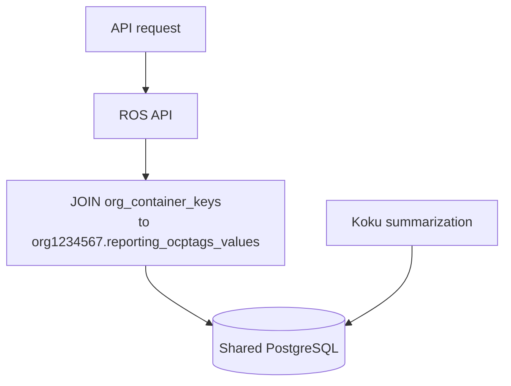

# Configuration Reference

Environment variables for ROS-OCP Backend deployments. Set these on the
**API**, **processor**, and **recommendation-poller** Deployments as needed —
each process reads the same config struct but uses different subsets (for
example, Kafka variables apply to the processor; RBAC cache applies to the API).

!!! tip "Authoritative reference"
    For **every** default, env var, Settings API endpoint, JSON field name, and
    lock behavior (container, namespace, node, GPU, PVC, VM, quota, cluster-quota,
    snapshot, idle, business hours, global lock, infrastructure), use the
    **[Configurability Reference](architecture/configurability.md)**. This page
    focuses on deployment-oriented subsets.

In Red Hat OpenShift with the cost-onprem Helm chart or Clowder, database,
Kafka, and RBAC connection settings are usually injected by the platform. The
variables below are the ones operators most often tune explicitly.

---

## Global Settings Lock

Set `ROS_SETTINGS_LOCKED=true` to freeze **all** tenant Settings API overrides at compiled
defaults (same effect as clearing every org's settings rows). PUT and DELETE on settings routes
return `403 Forbidden` with `{"error":"settings are locked by platform administrator","locked":true}`.
GET responses include `settings_locked: true` and `locked_fields: ["*"]`.

Per-feature opt-outs (`ROS_SETTINGS_LOCKED_VM=false`, etc.) apply only when the global lock is on.
Individual admin env vars (for example `ROS_CONTAINER_CPU_COST_PERCENTILE`) still override defaults
on read even under the global lock.

### Startup log

When the API or processor starts with the global lock enabled, ROS logs a warning and lists any
per-feature opt-outs, for example:

```
ROS_SETTINGS_LOCKED=true: all tenant settings overrides will be ignored; compiled defaults enforced
ROS_SETTINGS_LOCKED: per-feature opt-out (tenant API allowed): vm
```

### Reset to defaults (DELETE)

When settings are **not** locked, `DELETE` removes tenant overrides for that route and returns
`204 No Content`. Examples:

| DELETE path | Effect |
|-------------|--------|
| `/recommendations/openshift/settings/snapshot` | Clear snapshot staleness overrides |
| `/recommendations/openshift/settings/vm` | Clear VM threshold / disk / I/O overrides |
| `/recommendations/openshift/settings/vm/terms` | Clear VM term-window overrides |
| `/recommendations/openshift/settings/container` | Clear container threshold overrides |
| `/recommendations/openshift/settings/terms?recommendation_type=<plugin>` | Clear generic term overrides for that plugin |

Other settings routes (quota, cluster-quota, idle-detection, business-hours) support DELETE as documented in
[Configurability — Settings API Routes](architecture/configurability.md#settings-api-routes).

### Generic terms lock

`GET/PUT/DELETE .../settings/terms?recommendation_type=<plugin>` is blocked when **either** the
plugin type is locked (e.g. `ROS_SETTINGS_LOCKED_VM` for `recommendation_type=vm`) **or** the generic
`ROS_SETTINGS_LOCKED_TERMS` lock is on. VM-only term windows at `/settings/vm/terms` use only the `vm` lock.

See [Configurability — Global Settings Lock](architecture/configurability.md#global-settings-lock)
for the full variable list and business-hours behavior.

---

## Performance Tuning

Added during native-engine performance optimization (parallel ingestion,
connection pooling, RBAC caching, threshold recalc fan-out, reship concurrency).

| Variable | Default | Description |
|----------|---------|-------------|
| `ROS_KAFKA_PARALLEL` | `true` | Enable parallel Kafka message processing. |
| `ROS_KAFKA_WORKERS` | `3` | Worker goroutines when parallel mode is on. Messages on the same Kafka partition are still processed serially. |
| `ROS_RBAC_CACHE_TTL` | `60` | RBAC permission cache TTL in seconds. `0` disables caching. |
| `ROS_RBAC_CACHE_MAX_ENTRIES` | `500` | Max entries in the in-memory RBAC permission LRU cache. Observable via `rosocp_rbac_cache_size` and `rosocp_rbac_cache_evictions_total` (see [Monitoring](monitoring.md)). |
| `ROS_THRESHOLD_RECALC_CONCURRENCY` | `3` | Max parallel clusters during threshold recalculation. Coalesced duplicate triggers appear on `rosocp_threshold_recalc_coalesced_total`. |
| `ROS_DB_MIN_CONNS` | `2` | Minimum pgxpool connections. |
| `ROS_DB_MAX_CONN_LIFETIME` | `30` | Max connection lifetime in **minutes**. |
| `ROS_DB_MAX_CONN_IDLE_TIME` | `5` | Max idle connection time in **minutes**. |
| `ROS_DB_STATEMENT_CACHE_MODE` | `describe` | pgx statement cache mode (`describe`, `prepare`, `describe_exec`). |
| `ROS_DB_MAX_CONNS` | `10` | Maximum pgxpool connections per process. GORM and pgxpool share this single pool; all DB paths honor the same limit. |
| `ROS_DB_ACQUIRE_TIMEOUT_SECS` | `5` | Pool acquire timeout. `0` = no limit. |
| `ROS_DB_STATEMENT_TIMEOUT` | `25` | Session statement timeout in **seconds** for API connections. |
| `ROS_DB_INGEST_STATEMENT_TIMEOUT` | `120` | Per-transaction ingest timeout in **seconds** (`SET LOCAL` on batch writes). |
| `ROS_INGEST_FLUSH_BATCH_SIZE` | `1000` | Max digest groups in memory before incremental flush during streaming ingest. |
| `ROS_INGEST_STRICT_ANALYTICS` | `true` | When `true` (default), block recommendation persistence and Kafka commit if history or quality writes fail (message retried). Set `false` for degraded mode: write recommendations and surface gaps via `rosocp_analytics_incomplete_total` and `analytics_incomplete` on container list responses. |
| `ROS_RESHIP_CONCURRENCY` | `2` | Parallel masu reship calls per org. |

!!! tip "Tuning order"
    Increase Kafka workers first if CPU is idle and ingestion lag is high. Then
    adjust `ROS_DB_MAX_CONNS` if you see pool timeouts. Raise reship concurrency
    only after confirming masu can handle the load.

---

## Database

| Variable | Default (local dev) | Description |
|----------|---------------------|-------------|
| `DB_HOST` | `localhost` | PostgreSQL hostname. |
| `DB_PORT` | `15432` | PostgreSQL port. |
| `DB_NAME` | `postgres` | Database name. |
| `DB_USER` | `postgres` | Database user. |
| `DB_PASSWORD` | `postgres` | Database password. |
| `DB_SSL` | `disable` | SSL mode. |
| `DB_CA_CERT` | (empty) | CA certificate path for TLS. |

Pool tuning variables are listed under [Performance Tuning](#performance-tuning).

---

## Kafka

| Variable | Default | Description |
|----------|---------|-------------|
| `KAFKA_BOOTSTRAP_SERVERS` | `localhost:29092` | Broker addresses (comma-separated). |
| `KAFKA_CONSUMER_GROUP_ID` | `ros-ocp` | Consumer group ID. |
| `KAFKA_AUTO_COMMIT` | `false` | Auto-commit offsets (`false` recommended). |
| `UPLOAD_TOPIC` | `hccm.ros.events` | Upload event topic (processor). |
| `RECOMMENDATION_TOPIC` | `rosocp.kruize.recommendations` | Kruize request topic (legacy poller). |
| `SOURCES_EVENT_TOPIC` | `platform.sources.event-stream` | Sources lifecycle events. |

Parallel processing: `ROS_KAFKA_PARALLEL`, `ROS_KAFKA_WORKERS` (see Performance Tuning).

### Kafka resilience

| Variable | Default | Description |
|----------|---------|-------------|
| `ROS_KAFKA_MAX_TRANSIENT_RETRIES` | `5` | How many times a message is retried before it is moved to the Dead Letter Queue. Increase in environments with intermittent storage or database connectivity issues. |
| `ROS_KAFKA_DLQ_TOPIC` | `hccm.ros.events.dlq` | Topic that stores messages that could not be processed after all retries. Requires a Kafka topic (Helm/cost-onprem chart creates it automatically). |

---

## API and HTTP

| Variable | Default | Description |
|----------|---------|-------------|
| `API_PORT` | `8000` | REST API port. |
| `PROMETHEUS_PORT` | `9000` (Helm) / `5005–5007` (local) | Metrics scrape port. |
| `READ_HEADER_TIMEOUT` | `15` | HTTP read-header timeout (seconds). |
| `GLOBAL_HTTP_CLIENT_TIMEOUT_SECS` | `30` | Outbound HTTP client timeout. |
| `MAXIMUM_COUNT_PER_QUERY_PARAM` | `5` | Max values per repeated query param. |
| `ROS_API_MAX_OFFSET` | `10000` | Max `offset` before HTTP 400; use keyset pagination for deeper pages. |
| `ROS_API_MAX_NODE_RESULTS` | `1000` | Max rows per node utilization / GPU time-slicing list request. |
| `ROS_READINESS_CHECK_KAFKA` | `false` | Opt-in Kafka broker check on `/readyz`. |
| `ROS_READINESS_CHECK_S3` | `false` | Opt-in S3 bucket HEAD check on `/readyz`. |
| `DEVELOPMENT` | `false` | Local dev only — relaxes CSV allowlist and tag dev-token checks. Never enable in production. |
| `RECORD_LIMIT_CSV` | `1000` | CSV export row limit per batch. |
| `CSV_STREAM_INTERVAL` | `100` | CSV streaming flush interval (rows). |

### List pagination (`after` cursor)

Container and namespace list endpoints support **keyset pagination** via `?after=<opaque base64url cursor>`.
When `after` is set, `offset` is ignored. Responses include `meta.has_next` and `meta.next_cursor`
for the next page. Other list endpoints remain offset-only by design.

**Authoritative reference:** [API Pagination](pagination.md) — endpoint matrix, client patterns,
and when offset-only routes would need keyset.

Quick example:

```
GET /recommendations/openshift?limit=100
GET /recommendations/openshift?limit=100&after=<meta.next_cursor>
```

### CSV download security (processor)

| Variable | Default | Description |
|----------|---------|-------------|
| `ROS_CSV_ALLOWED_HOSTS` | (empty) | Hostname allowlist for presigned CSV URLs. Required when not in development mode. |
| `ROS_CSV_DENY_PRIVATE_NETWORKS` | `true` | Block private/link-local/loopback targets. |

---

## RBAC

| Variable | Default | Description |
|----------|---------|-------------|
| `RBAC_ENABLE` | `true` (prod) / `false` (local) | Enable RBAC authorization on API. |
| `RBACHost` | (platform) | RBAC service host. |
| `RBACPort` | (platform) | RBAC service port. |
| `RBACProtocol` | `http` | RBAC URL scheme. |
| `ROS_RBAC_CACHE_TTL` | `60` | Permission cache TTL (seconds). See Performance Tuning. |
| `ROS_RBAC_CACHE_MAX_ENTRIES` | `500` | Max RBAC cache entries (LRU). Observable via `rosocp_rbac_cache_size` and `rosocp_rbac_cache_evictions_total`. |

---

## Feature Flags and Plugins

Plugin toggles load into `Config.EnabledPlugins` / `Config.DisabledPlugins` via
`internal/config/config.go` and are applied in `internal/plugin/registry.go`.

### Plugin enablement

| Variable | Default | Description |
|----------|---------|-------------|
| `ROS_ENABLED_PLUGINS` | (empty) | Comma-separated **allowlist**. Empty = all native plugins enabled. Non-empty = **only** listed plugins run. |
| `ROS_DISABLED_PLUGINS` | (empty) | Comma-separated **denylist**. Used only when the allowlist is empty; removes plugins from the default set. Ignored when `ROS_ENABLED_PLUGINS` is set. |
| `ROS_USE_NATIVE_ENGINE` | `true` | **Deprecated** — use `ROS_ENABLED_PLUGINS=kruize` for legacy Kruize-only mode. |

**Available plugins** (sorted by execution order): `container`, `kruize`, `gpu`, `node`, `pvc`, `quota`, `cluster-quota`, `snapshot`, `vm`, `namespace`

- **`kruize`** is mutually exclusive with native plugins (Kruize-only when enabled).
- Listing **`kruize` together with native plugins** in `ROS_ENABLED_PLUGINS` causes a **fatal startup error** — the process exits before serving traffic.
- With both lists unset, **`kruize` is off** unless explicitly allowlisted.

**Disable namespace recommendations:**

```bash
ROS_DISABLED_PLUGINS=namespace
# or
ROS_ENABLED_PLUGINS=container,gpu,node,pvc,quota,cluster-quota,snapshot,vm
```

| Variable | Default | Description |
|----------|---------|-------------|
| `ROS_BUSINESS_HOURS_ENABLED` | `true` | Business-hours feature, dual-stream ingestion, reship poller. |
| `ROS_THRESHOLD_RECALCULATION_ENABLED` | `true` | Recalculate recommendations when tenant thresholds change. |
| `ROS_SAVINGS_ESTIMATES_ENABLED` | `true` | Fetch dollar savings from Koku masu (container, node, PVC, snapshot, VM). When `false`, VM API `savings` is always `null`. |
| `ROS_SAVINGS_RECALCULATION_ENABLED` | `true` | Allow `POST /internal/recalculate-savings` after Koku cost model rate changes. When `false`, savings refresh only on the next ingestion cycle. Requires `ROS_SAVINGS_ESTIMATES_ENABLED` and `KOKU_MASU_URL`. |

---

## Centralized configuration

All production environment variables load through `internal/config/config.go` (Viper +
`Config` struct). Per-plugin term overrides use dynamic keys
`ROS_TERMS_<PLUGIN>_<TERM>_<FIELD>` read via `config.EnvString` in `internal/config/env.go`.

| Variable(s) | Config field / accessor | Purpose |
|-------------|-------------------------|---------|
| `ROS_ENABLED_PLUGINS`, `ROS_DISABLED_PLUGINS` | `EnabledPlugins`, `DisabledPlugins` | Plugin allowlist/denylist |
| `ROS_TERMS_<PLUGIN>_<TERM>_<FIELD>` | `config.EnvString` | Term window overrides (`WINDOW_DAYS`, `MIN_DATA_DAYS`, `DECAY_HALFLIFE_HOURS`) |
| `ROS_CSV_*`, `KUBERNETES_*` | `CSV*`, `Kubernetes*` fields | CSV download limits and SSRF controls; tag sync TokenReview |
| `ROS_API_MAX_OFFSET`, `DEVELOPMENT`, `ROS_LOG_POISON_PAYLOAD`, `ROS_HOUSEKEEPER_SHUTDOWN_GRACE_SECS` | Security / ops fields | Pagination cap, dev mode, poison log redaction, housekeeper shutdown |
| `KRUIZE_HOST`, `KRUIZE_PORT`, `KRUIZE_URL` | Viper defaults | Kruize HTTP endpoint (URL defaults from host + port) |

Example term override: `ROS_TERMS_CONTAINER_LONG_WINDOW_DAYS=45` locks the container long-term window.

---

## Koku / Masu Integration

| Variable | Default | Description |
|----------|---------|-------------|
| `KOKU_MASU_URL` | (empty) | Koku masu API base URL for `effective_rates` (required for non-null VM `savings` and fleet `by_plugin.vm`). |
| `ROS_COST_CACHE_MAX_ENTRIES` | `1000` | Max entries in the in-memory LRU cache for masu `effective_rates` (5-minute TTL per entry). Observable via `rosocp_cost_cache_size` and `rosocp_cost_cache_evictions_total`. |
| `ROS_RESHIP_POLLER_INTERVAL_SECS` | `60` | Business-hours reship retry interval. Duplicate reship triggers coalesce on `rosocp_reship_coalesced_total`. |
| `ROS_RESHIP_MAX_RETRIES` | `10` | Max consecutive reship failures. |
| `ROS_RESHIP_CONCURRENCY` | `2` | Parallel reship calls (see Performance Tuning). |
| `ROS_BUSINESS_HOURS_RESHIP_FORWARD_ONLY_FALLBACK` | `false` | Forward-only fallback after reship exhaustion. |

### Savings recalculation callback (Koku worker / masu)

After cost model costs are applied, Koku can notify ROS to recompute persisted dollar
savings without re-ingesting CSVs. Configure on the **Koku** side (not ROS):

| Variable | Default | Description |
|----------|---------|-------------|
| `ROS_API_HOST` | (unset) | ROS API hostname (e.g. `cost-onprem-ros-api.cost-onprem.svc.cluster.local`). When unset, Koku skips the callback unless `ROS_OCP_BACKEND_URL` is set. |
| `ROS_API_PORT` | `8000` | ROS API port when using `ROS_API_HOST`. |
| `ROS_OCP_BACKEND_URL` | `http://cost-onprem-ros-api:8000` | Fallback base URL when `ROS_API_HOST` is unset (cost-onprem chart). |
| `ROS_SERVICE_TOKEN` | (unset) | Optional bearer token for `POST /internal/recalculate-savings`. When unset, Koku uses the Kubernetes service account token (same path as tag sync). |

ROS gates the endpoint with `ROS_SAVINGS_RECALCULATION_ENABLED` (see Feature Flags).
Details: [Cost Integration — Savings recalculation](architecture/cost-integration.md#savings-recalculation-after-cost-model-changes).

---

## Retention and Data Lifecycle

| Variable | Default | Description |
|----------|---------|-------------|
| `ROS_RETENTION_MONTHS` | `6` | Digest partition retention (months). |
| `ROS_HISTORY_RETENTION_DAYS` | `90` | Container recommendation history and quality partition retention. |
| `ROS_VM_REC_HISTORY_RETENTION_DAYS` | `90` | VM recommendation history snapshot retention (`vm_recommendation_history`). Exposed read-only as `history_retention_days` on `GET /settings/vm`. See [Configurability — VM](architecture/configurability.md#vm-admin-only-no-settings-api-field). |
| `ROS_STALENESS_THRESHOLD_HOURS` | `48` | Hours before recommendations marked stale. |
| `ROS_STALE_DATA_THRESHOLD_HOURS` | (alias) | Same as `ROS_STALENESS_THRESHOLD_HOURS`. |
| `ROS_STALE_CLEANUP_DAYS` | `30` | Delete stale recommendations after N days. (`ROS_STALE_ARCHIVE_DAYS` deprecated alias) |
| `ROS_MAX_LOOKBACK_DAYS` | `90` | Max digest lookback for queries. |

---

## Logging and Observability

| Variable | Default | Description |
|----------|---------|-------------|
| `LOG_LEVEL` | `INFO` | `DEBUG`, `INFO`, or `ERROR`. |
| `LogFormater` | JSON (prod) / `text` (local) | Log output format. |
| `SERVICE_NAME` | `rosocp` | Service name in log `service` field. |
| `CW_LOG_STREAM_NAME` | `rosocp` | CloudWatch log stream (SaaS). |

See [Monitoring](monitoring.md) for metrics tied to these settings.

---

## Legacy Kruize

Only relevant when running the Kruize recommendation poller or `ROS_ENABLED_PLUGINS=kruize`.

| Variable | Default | Description |
|----------|---------|-------------|
| `KRUIZE_URL` | `http://localhost:8080` | Kruize HTTP endpoint (built from host/port when unset). |
| `KRUIZE_HOST` | `localhost` | Kruize hostname. |
| `KRUIZE_PORT` | `8080` | Kruize port. |
| `KRUIZE_WAIT_TIME` | `30` | Wait time for experiment results (seconds). |
| `KRUIZE_MAX_BULK_CHUNK_SIZE` | `100` | Bulk experiment chunk size. |
| `RECOMMENDATION_POLL_INTERVAL_HOURS` | `24` | Poller interval (hours). |

---

## Idle / Zombie Detection

| Variable | Default | Description |
|----------|---------|-------------|
| `ROS_IDLE_DETECTION_ENABLED` | `true` | Master switch for inline idle/zombie classification. |
| `ROS_IDLE_ZOMBIE_CPU_MILLICORES` | `1` | P95 CPU (millicores) below this → zombie candidate. |
| `ROS_IDLE_ZOMBIE_PEAK_MILLICORES` | `10` | Peak CPU below this confirms zombie. |
| `ROS_IDLE_CPU_UTILIZATION_PCT` | `2` | P95 CPU as % of request; below → idle. |
| `ROS_IDLE_MEMORY_UTILIZATION_PCT` | `5` | P95 memory as % of request; below → idle. |
| `ROS_IDLE_BURST_RATIO` | `10` | `peak/P95` above this → bursty (stay active). |
| `ROS_IDLE_MIN_OBSERVATION_DAYS` | `14` | Minimum digest days before classifying. |
| `ROS_IDLE_EXCLUDE_NAMESPACES` | `kube-system,openshift-*` | Comma-separated namespace globs to skip. |
| `ROS_IDLE_EXCLUDE_WORKLOAD_TYPES` | `DaemonSet` | Comma-separated owner kinds to skip. |
| `ROS_IDLE_GPU_SM_ACTIVE_BP` | `500` | GPU `sm_active` P95 below this (basis points) → idle. |
| `ROS_IDLE_GPU_DRAM_ACTIVE_BP` | `500` | GPU `dram_active` P95 below this (basis points) → idle. |

See [Idle / Zombie Detection](features/idle-detection.md).

---

## ResourceQuota Recommendations

Namespace **ResourceQuota** tuning via the `quota` plugin. Thresholds resolve per
organization from the Settings API, then env vars, then compiled defaults.

| Variable | Default | Description |
|----------|---------|-------------|
| `ROS_QUOTA_HEADROOM_PERCENT` | `10` | Extra margin on recommended hard limits (10 → multiply container rec sums by 1.10). |
| `ROS_QUOTA_HIGH_RISK_THRESHOLD_PERCENT` | `90` | `raise` recommendation and `high` risk when max utilization (used or rec sum vs hard) ≥ 90%. |
| `ROS_QUOTA_MEDIUM_RISK_THRESHOLD_PERCENT` | `70` | `medium` risk when utilization ≥ 70% and below the high-risk threshold. |

**Settings API:** `GET` / `PUT` / `DELETE`
`/api/cost-management/v1/recommendations/openshift/settings/quota`
(requires `quota` plugin). JSON fields: `headroom_percent`, `high_risk_threshold_percent`,
`medium_risk_threshold_percent`, `locked_fields`. Env vars lock the corresponding field in
`locked_fields`.

See [ResourceQuota Recommendations](features/quota-recommendations.md) and
[Configurability — ResourceQuota](architecture/configurability.md#resourcequota).

---

## ClusterResourceQuota Recommendations

OpenShift **ClusterResourceQuota** tuning via the `cluster-quota` plugin. Thresholds resolve per
organization from the Settings API, then env vars, then compiled defaults.

| Variable | Default | Description |
|----------|---------|-------------|
| `ROS_CLUSTER_QUOTA_HEADROOM_PERCENT` | `10` | Margin on recommended CRQ hard values |
| `ROS_CLUSTER_QUOTA_HIGH_RISK_THRESHOLD_PERCENT` | `90` | Triggers `raise` and `high` risk |
| `ROS_CLUSTER_QUOTA_MEDIUM_RISK_THRESHOLD_PERCENT` | `70` | `medium` risk band |

**Settings API:** `GET` / `PUT` / `DELETE`
`/api/cost-management/v1/recommendations/openshift/settings/cluster-quota`

**List API:** `GET /api/cost-management/v1/recommendations/openshift/cluster-quota/`

See [ClusterResourceQuota Recommendations](features/cluster-resource-quota.md).

---

## Engine Thresholds

Platform-wide defaults for recommendation algorithms. When set, they **lock**
the corresponding tenant Settings API field. For full semantics, defaults, API
paths, JSON fields, VM settings, and workload-specific tuning examples, see
[Configurability Reference](architecture/configurability.md).

| Category | Settings API | Variable prefix |
|----------|--------------|-----------------|
| Container sizing | `/settings/container` | `ROS_CONTAINER_*` |
| Namespace sizing | `/settings/namespace` | `ROS_NAMESPACE_*` |
| Node consolidation | `/settings/node` (alias: `/settings/thresholds?recommendation_type=node`) | `ROS_NODE_*` |
| GPU classification | `/settings/gpu` | `ROS_GPU_*` |
| PVC right-sizing | `/settings/pvc` | `ROS_PVC_*` |
| OpenShift Virtualization | `/settings/vm`, `/settings/vm/terms` | `ROS_VM_*`, `ROS_TERMS_VM_*` (includes `ROS_VM_NETWORK_*`, `ROS_VM_NETWORK_QOS_*`, `ROS_VM_STORAGE_TIERING_*`, `ROS_VM_GPU_TIMESLICE_*`, `ROS_VM_ENABLE_NETWORK_SERIES`, `ROS_VM_ENABLE_PLACEMENT_CHECKS`, `ROS_VM_PLACEMENT_SKEW_RATIO`, `ROS_VM_ENABLE_SHARED_PVC_CORRELATION`, `ROS_VM_NUMA_NODE_MEMORY_GIB`, `ROS_VM_NUMA_ASSUMED_SOCKETS`, `ROS_VM_ENABLE_POWER_SCHEDULE`, `ROS_VM_POWER_OFF_MIN_IDLE_DAYS`, `ROS_VM_POWER_OFF_IDLE_RATIO_THRESHOLD`) |
| ResourceQuota | `/settings/quota` | `ROS_QUOTA_*` |
| ClusterResourceQuota | `/settings/cluster-quota` | `ROS_CLUSTER_QUOTA_*` |
| Snapshot staleness | `/settings/snapshot` | `ROS_SNAPSHOT_*` |
| Term windows (generic) | `/settings/terms?recommendation_type=<plugin>` | `ROS_TERMS_<PLUGIN>_<TERM>_*` |
| OOM feedback | — (admin only) | `ROS_OOM_BASE_BUMP`, `ROS_OOM_MAX_BUMP` |
| Idle / zombie | `/settings/idle-detection` | `ROS_IDLE_*` (see section above) |

Embedded GPU hardware catalogs (`gpu_catalog.yaml`, `vgpu_profiles.yaml`) are validated against
official NVIDIA documentation. See [GPU Catalogs](architecture/gpu-catalogs.md) for data sources
and update procedures.

**Node pod scheduling headroom** (`ROS_NODE_POD_HEADROOM_*`, `/settings/node`): consolidation is
suppressed when `pod_scheduling_headroom` &lt; `pod_headroom_consolidation_gate` (default **15%**);
notification code **74** fires when headroom &lt; `pod_headroom_notification_threshold` (default
**10%**). Requires `pod_capacity` in operator CSV / digests. See
[Configurability — Node](architecture/configurability.md#node) and
[List API — Node recommendations](architecture/configurability.md#list-api-node-recommendations).

---

## Tag Sync

Tag filtering is **enabled by default** on ROS (`ROS_TAGS_ENABLED=true` in the cost-onprem
Helm chart). Filterable tag keys are controlled in **Settings → Tags**; if none are enabled,
tag filters return all results with `meta.warnings`. Set `ROS_TAGS_ENABLED=false` only to
disable tag filters entirely. **How tags reach list queries** is controlled by
`ROS_TAGS_SOURCE`:

| Value | Deployment | Mechanism |
|-------|------------|-----------|
| `db` (default) | On-prem — shared PostgreSQL | ROS SQL-joins Koku tenant tag tables at query time |
| `api` | SaaS — separate databases | Koku Celery pushes tags to ROS internal HTTP API |

Use **`db`** when Koku and ROS share one PostgreSQL instance (cost-onprem chart). ROS must
use the chart's shared database connection to Koku tenant schemas (`reporting_enabledtagkeys`,
`reporting_ocptags_values`). No Koku-side tag sync configuration is required — enable tag
keys in **Settings → Tags** (ROS tag filtering is on by default).

Use **`api`** when Koku and ROS have separate databases. Requires Koku Celery tasks,
`ROS_OCP_BACKEND_URL`, and ServiceAccount (or dev token) authentication.

### ROS environment variables

| Variable | Default | On-Prem | SaaS | Description |
|----------|---------|---------|------|-------------|
| `ROS_TAGS_ENABLED` | `true` | `true` (chart default) | `true` | Master switch: list filters; push API active only when source=`api` |
| `ROS_TAGS_SOURCE` | `db` | `db` | `api` | `db` = direct Koku PostgreSQL reads; `api` = push into `resolved_tags` |
| `ROS_TAGS_ALLOWED_SERVICE_ACCOUNTS` | (empty) | — | Required (non-dev) | Comma-separated SA names allowed to call push API |
| `ROS_TAGS_DEV_TOKEN` | (empty) | — | Dev only (`DEVELOPMENT=true`) | Static bearer token; blocked at startup outside development |
| `ROS_TAGS_SYNC_MAX_BODY_MIB` | `10` | — | SaaS (`api`) | Max request body size (MiB) for `POST /internal/tags/sync` |

### Koku environment variables (SaaS / `api` source only)

When `ROS_TAGS_SOURCE=db`, these variables are **ignored** — Koku does not push tags.

| Variable | Default | On-Prem | SaaS | Description |
|----------|---------|---------|------|-------------|
| `ROS_TAGS_ENABLED` | `false` | Ignored | Set `true` | Enables Celery tag push tasks |
| `ROS_TAGS_SOURCE` | `db` | `db` | `api` | Must be `api` for push sync to run |
| `ROS_OCP_BACKEND_URL` | `http://cost-onprem-ros-api:8000` | Unused | Required | ROS API base URL (no trailing path) |
| `ROS_TAGS_DEV_TOKEN` | (empty) | Unused | Dev only | Bearer token when SA mount missing; must match ROS |
| `ROS_TAGS_SA_TOKEN_PATH` | `/var/run/secrets/kubernetes.io/serviceaccount/token` | Unused | Production | Path to projected SA token on Koku worker |

### On-prem (`ROS_TAGS_SOURCE=db`)



ROS reads:

- `{schema}.reporting_enabledtagkeys` — enabled OCP tag keys
- `{schema}.reporting_ocptags_values` — key/value pairs with cluster and namespace arrays

Schema name is `org` + bare `org_id` (e.g. `1234567` → `org1234567`).

**No HTTP push, Celery sync, or ServiceAccount auth** is required on either service.
Push endpoints return 404 in this mode.

**Operational risk:** ROS depends on Koku table layout (`reporting_enabledtagkeys`,
`reporting_ocptags_values`). Koku schema changes can break tag filters; the startup DB probe
only verifies table reachability, not column compatibility. Pin compatible Koku/ROS versions
and validate tag filters after Koku upgrades. Details:
[Tag Filtering → Caveats and operational risks](features/tag-filtering.md#caveats-and-operational-risks).

### SaaS (`ROS_TAGS_SOURCE=api`)

Koku pushes resolved namespace tags after settings changes and OCP summarization.
Direction is **one-way (Koku → ROS)**; Koku is the source of truth for enabled keys and
observed tag values.

| Method | Path | Purpose |
|--------|------|---------|
| `POST` | `/api/cost-management/v1/internal/tags/sync` | Full-replace sync for one org |
| `GET` | `/api/cost-management/v1/internal/tags/status?org_id=` | Freshness (`synced_at`, tag key catalog) |

#### Sync triggers and frequency

| Trigger | Celery task | When |
|---------|-------------|------|
| Tag key enabled/disabled | `sync_ros_ocp_tags` | Immediately after Settings API mutation |
| Tag mapping changed | `sync_ros_ocp_tags` | Immediately after Settings API mutation |
| OCP summarization complete | `sync_ros_ocp_tags` | After summary tables updated for provider |
| Periodic safety-net | `sync_ros_ocp_tags_periodic` | Celery Beat every **6 hours** at `:15` — all tenants |

Normal operation: tags sync within **seconds** of any change. Worst case (all event
triggers fail): **~6 hours** until the periodic task succeeds.

Koku implementation: [`koku/masu/processor/ros_tag_sync.py`](https://github.com/project-koku/koku/blob/main/koku/masu/processor/ros_tag_sync.py).
Beat schedule: [`koku/koku/celery.py`](https://github.com/project-koku/koku/blob/main/koku/koku/celery.py)
(`crontab(minute="15", hour="*/6")`).

#### Example SaaS configuration

**Koku worker:**

```yaml
env:
  ROS_TAGS_ENABLED: "true"
  ROS_TAGS_SOURCE: "api"
  ROS_OCP_BACKEND_URL: "http://ros-ocp-backend:8000"
  # Dev only — omit in production; use projected SA token instead:
  # ROS_TAGS_DEV_TOKEN: "dev-only-change-me"
```

**ROS API:**

```yaml
env:
  ROS_TAGS_ENABLED: "true"
  ROS_TAGS_SOURCE: "api"
  ROS_TAGS_ALLOWED_SERVICE_ACCOUNTS: "system:serviceaccount:cost-onprem:koku-worker"
  # ROS_TAGS_DEV_TOKEN must match Koku when using dev token auth
```

#### Manual sync and monitoring

Force a sync for one tenant (Koku side):

```bash
# Masu API (when exposed)
curl -s "http://localhost:5042/api/cost-management/v1/sync_ros_tags/?schema=org1234567"

# Django shell
python manage.py shell -c \
  'from masu.processor.ros_tag_sync import sync_ros_ocp_tags; sync_ros_ocp_tags.delay("org1234567")'

# Celery CLI
celery -A koku call masu.processor.ros_tag_sync.sync_ros_ocp_tags --args='["org1234567"]'
```

Check freshness (ROS side):

```bash
curl -s -H "Authorization: Bearer $TOKEN" \
  "$ROS_URL/api/cost-management/v1/internal/tags/status?org_id=1234567"
```

Alert if `synced_at` is **>6 hours** old. Koku worker logs: grep for
`ROS tag sync completed` or `ROS tag sync failed`.

On failure, the failed org is retried on the next event or periodic cycle; other orgs
are unaffected. See [Tag Filtering → SaaS operations](features/tag-filtering.md#saas-operations-ros-tags-sourceapi).

### Authentication (api source only)

**On-prem (`db`):** No authentication between Koku and ROS for tags — direct database access.

**SaaS (`api`):** Kubernetes ServiceAccount token validation via TokenReview. Koku worker
sends `Authorization: Bearer <service-account-token>`; ROS validates the caller.

**Development:** Set `ROS_TAGS_DEV_TOKEN` to the same static value on **both** Koku and ROS
when projected SA tokens are unavailable (docker-compose).

**Future: mTLS** — Planned for SaaS hardening. Mutual TLS between Koku and ROS (cert-manager
or service mesh) with TokenReview retained during migration. See
[`docs/operations/tag-sync-auth.md`](../docs/operations/tag-sync-auth.md).

### Data flow and filtering

See [Tag Filtering](features/tag-filtering.md) for lifecycle scenarios, freshness guarantees,
troubleshooting, and list API syntax (`?filter[tag:key]=value1,value2`).

Internal reference: [`docs/features/tag-filtering.md`](../docs/features/tag-filtering.md),
[`docs/operations/tag-sync-auth.md`](../docs/operations/tag-sync-auth.md)

**Group by tag:** `GET /recommendations/openshift/savings-summary?group_by[tag:key]=*` (or flat
`group_by=tag:key`) aggregates container savings per tag value when `ROS_TAGS_ENABLED=true`.
List endpoints support tag **filters** and `meta.warnings` on empty results; they do not support
`group_by[tag:key]` yet. With `ROS_TAGS_SOURCE=db`, startup probes `reporting_enabledtagkeys`
reachability (see [Tag Filtering](features/tag-filtering.md#on-prem-startup-health-check-ros-tags-sourcedb)).

---

## Sources API

| Variable | Default | Description |
|----------|---------|-------------|
| `SOURCES_API_BASE_URL` | (platform) | Sources API base URL. |
| `SOURCES_API_PREFIX` | `/api/sources/v3.1` | API path prefix. |

---

## List API (selected)

Deployment env vars above; query parameters and response fields for list endpoints are in
[Configurability Reference — List API](architecture/configurability.md#list-api-node-recommendations).

| Endpoint | Notable query params / fields |
|----------|-------------------------------|
| `GET /recommendations/openshift/nodes` | `filter[stranded_resource]` (`cpu`, `memory`, `none`), `filter[instance_type]`, `filter[machineset_name]`; response `pod_capacity`, `pod_scheduling_headroom` (omitempty) |
| `GET /recommendations/openshift/savings-summary` | `term` (`short`, `medium`, `long`; default `medium`) |

---

## Related Documentation

- [Monitoring](monitoring.md) — metrics and troubleshooting
- [Configurability Reference](architecture/configurability.md) — threshold semantics
- [Business Hours](features/business-hours.md) — reship behavior
- [Upgrade Runbook](operations/upgrade-runbook.md) — deployment procedures
