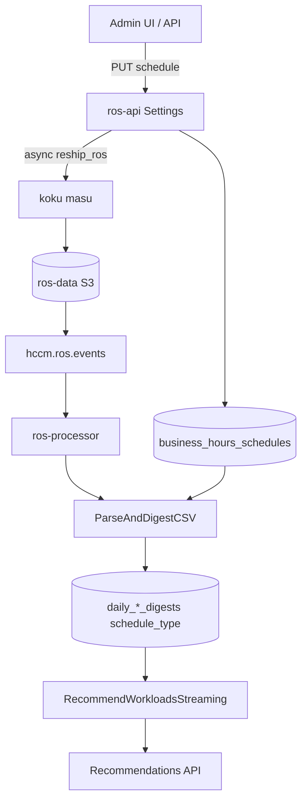

# Business Hours Recommendations

!!! info "Quick Facts"
    **What it does:** Produces container and namespace recommendations scoped to configured business hours (e.g., Mon–Fri 09:00–17:00) alongside existing 24/7 **all_hours** results  
    **Data source:** Same ROS usage CSV as container recommendations; hourly samples are weighted by `business_hours_schedules` (timezone, days, start/end, `off_hours_weight`)  
    **Update frequency:** Each ingestion cycle; schedule changes trigger masu `reship_ros` to rebuild historical **business_hours** digests  
    **Plugin:** `container` (priority 10) and `namespace` (priority 90) — business hours is a dual-digest enrichment, not a separate plugin  
    **Settings API:** `GET/PUT/DELETE /api/cost-management/v1/recommendations/openshift/settings/business-hours` (plus cluster and namespace paths)  
    **Recommendations API:** `business_hours` blocks on `GET .../recommendations/openshift` and `GET .../namespaces` when a schedule is enabled and reship is complete  
    **Savings:** Always computed from **all_hours** sizing; `estimated_monthly_savings` is a `MoneyAmount` (`{"value": "12.34", "units": "USD"}`) — BH affects CPU/memory sizing only  
    **Kill-switch:** `ROS_BUSINESS_HOURS_ENABLED` (default `true`)

**Status:** Implemented (ros-ocp-backend, koku masu `reship_ros`, cost-onprem-chart E2E)

## Overview

Business hours adds schedule-aware CPU and memory sizing to **container** and
**namespace** recommendations. Workloads that spike during business hours but
share nodes with overnight batch jobs get a second sizing perspective based on
in-window usage only.

ROS produces **two** recommendation perspectives:

| Stream | Meaning |
|--------|---------|
| **all_hours** | Existing 24/7 behavior (unchanged when BH is disabled) |
| **business_hours** | Percentiles computed from in-window samples only (off-hours excluded when `off_hours_weight=0`) |

**Who uses it:** Platform / FinOps admins sizing interactive workloads that
spike during business hours but share nodes with overnight batch jobs.

**Why not Koku cost models?** Business hours are an optimization concern, not
billing. Not every cluster has a cost model; settings live in ros-ocp-backend
alongside snapshot staleness and recommendation terms.

Full design rationale: [`docs/features-business-hours.md`](../features/business-hours.md).

## How it works



1. An administrator configures a weekly schedule (timezone, days, start/end time) at org, cluster, or namespace scope.
2. **Schedule change** sets `reship_pending_since` and calls masu `reship_ros`
   to re-list S3 ROS CSVs and republish Kafka messages.
3. **Ingestion** writes dual digests (`schedule_type = all_hours | business_hours`).
4. **Engine** runs twice when BH is enabled — once per stream — and the API
   returns both CPU/memory amounts in Kruize-compatible `amount`/`format` fields.
5. After historical reship completes, recommendation detail and list responses
   include a nested `business_hours` block alongside the existing all-hours engines.

Savings estimates always use the **all_hours** perspective. Business hours
affects sizing only, not dollar savings.

Key code:

- Settings: [`internal/api/handlers_business_hours_settings.go`](../../internal/api/handlers_business_hours_settings.go)
- Schedule eval: [`internal/bhschedule/schedule.go`](../../internal/bhschedule/schedule.go)
- Dual digest pipeline: [`internal/ingestion/pipeline_business_hours.go`](../../internal/ingestion/pipeline_business_hours.go)
- Reship client: [`internal/reship/service.go`](../../internal/reship/service.go)
- Masu endpoint: koku `masu/api/views.py` (`reship_ros`)

## Scope

**v1: container and namespace only.** Nodes, GPUs, PVCs, and VMs do not receive
business-hours recommendations.

## Configuration

### Environment variables (ros-api / ros-processor)

| Variable | Default | Purpose |
|----------|---------|---------|
| `ROS_BUSINESS_HOURS_ENABLED` | `true` | Kill-switch — when `false`, BH routes return 404, capabilities omit the feature, and only `all_hours` digests are produced |
| `ROS_BUSINESS_HOURS_RESHIP_FORWARD_ONLY_FALLBACK` | `false` | After max reship retries, transition cluster to `forward_only` (new ingest only, no historical backfill) |
| `ROS_SETTINGS_LOCKED_BUSINESS_HOURS` | `true` (under global lock) | With `ROS_SETTINGS_LOCKED=true`, blocks PUT/DELETE; GET returns `settings_locked: true` and `enabled: false` |

Helm (cost-onprem-chart): set under `ros-api` and `ros-processor` env blocks;
see chart values on branch `feature/business-hours-e2e`.

Discover availability via `GET .../settings/capabilities` (`business_hours: true|false`).

### Savings estimates (Koku cost data)

Business hours affects **CPU/memory recommendation sizing**, not dollar savings
math. Savings estimates are configured separately:

| Variable | Default | Purpose |
|----------|---------|---------|
| `KOKU_MASU_URL` | `""` | Masu base URL for `GET .../effective_rates/` (required for non-zero savings) |
| `ROS_SAVINGS_ESTIMATES_ENABLED` | `true` | Kill-switch — `false` skips all Masu cost fetches; savings are zero `MoneyAmount` and recommendations include `NotifNoCostData` (code 25) |

For OCP-on-cloud clusters (OCP on AWS/Azure/GCP), `effective_rates` already includes
correlated cloud infrastructure costs in `namespace_aggregates.infrastructure_cost`
when both Koku sources are configured — no ROS-side correlation work is needed.

Plugin coverage, OCP-on-cloud details, `MoneyAmount` currency fields, fleet savings summary
(`GET .../savings-summary`), and troubleshooting:
[Savings estimations](savings-estimations.md) and
[`docs/architecture/cost-integration.md`](../../docs/architecture/cost-integration.md).

### Schedule inheritance

Resolution order: **namespace override → cluster override → org default → disabled**.

Storage impact: enabling BH approximately **doubles** digest row count for
affected scopes. The API returns a warning on org-level PUT.

## API Reference

Base path: `/api/cost-management/v1/recommendations/openshift/settings/business-hours`

| Method | Path | Description |
|--------|------|-------------|
| GET | `/` | Org default (inherited view) |
| PUT | `/` | Set org default (202 Accepted) |
| DELETE | `/` | Remove org default (204 No Content) |
| GET | `/effective` | Resolved schedule for optional `cluster_id` / `namespace` query params + `resolved_from` |
| GET | `/clusters/{cluster_id}` | Effective cluster schedule + `reship_status` |
| PUT | `/clusters/{cluster_id}` | Set cluster override (202 Accepted) |
| DELETE | `/clusters/{cluster_id}` | Remove cluster override (inherit org) |
| GET/PUT/DELETE | `/clusters/{id}/namespaces/{ns}` | Namespace override |

Capabilities: `GET .../settings/capabilities` → `{ "business_hours": true }`.

### Request body

```json
{
  "timezone": "America/New_York",
  "schedule": {
    "days": ["monday", "tuesday", "wednesday", "thursday", "friday"],
    "start_time": "08:00",
    "end_time": "17:00"
  },
  "off_hours_weight": 0.0,
  "enabled": true
}
```

| Field | Notes |
|-------|-------|
| `timezone` | IANA timezone for schedule boundaries |
| `schedule.days` | Lowercase English day names (`monday` … `sunday`) |
| `schedule.start_time` / `end_time` | 24-hour `HH:MM` in the configured timezone; `end_time` must be after `start_time` (overnight windows not supported) |
| `off_hours_weight` | `0.0`–`1.0`; weight for off-hours samples in BH percentiles (`0.0` = in-window only) |
| `enabled` | `false` keeps the row but disables BH digest generation for that scope |

### Example GET response (cluster)

```json
{
  "timezone": "America/New_York",
  "schedule": {
    "days": ["monday", "tuesday", "wednesday", "thursday", "friday"],
    "start_time": "08:00",
    "end_time": "17:00"
  },
  "off_hours_weight": 0.0,
  "enabled": true,
  "reship_status": "complete",
  "reship_status_since": null
}
```

`reship_status` values: `complete`, `pending`, `forward_only`.

### Example GET effective response

`GET .../settings/business-hours/effective?cluster_id={uuid}&namespace=team-a`

```json
{
  "timezone": "America/New_York",
  "schedule": {
    "days": ["monday", "tuesday", "wednesday", "thursday", "friday"],
    "start_time": "09:00",
    "end_time": "17:00"
  },
  "off_hours_weight": 0.3,
  "enabled": true,
  "resolved_from": "namespace"
}
```

When no schedule applies at any level, `enabled` is `false` and `resolved_from` is `none`.

OpenAPI: `/api/cost-management/v1/openapi.json` (when feature enabled).

### Recommendation response

When a schedule applies and reship is complete:

`recommendation_engines.{cost|performance}.business_hours`

Same `amount`/`format` shape as the parent engine (CPU and memory requests/limits).
Omitted when no schedule applies — clients do not need extra filters.

`business_hours.reason` may explain degraded mode (e.g. reship in progress).

## Deployment

### Migration order (ros-ocp-backend)

1. `000066_create_business_hours_schedules`
2. `000067_add_schedule_type_to_digests`
3. `000068_container_usage_samples_pk_workload_type`
4. `000069_add_reship_forward_only_since`

Deploy order: **koku masu** (`reship_ros`) → **ros-ocp-backend** (migrations 066–069) →
**cost-onprem-chart** (Helm values). If ros deploys before koku, the pending-flag
poller retries until masu is available.

### Helm values (cost-onprem)

- `ROS_BUSINESS_HOURS_ENABLED=true` on ros-api (and processor if split)
- Optional: `ROS_BUSINESS_HOURS_RESHIP_FORWARD_ONLY_FALLBACK=true` for degraded
  mode after repeated masu failures

No koku-metrics-operator changes required.

## Troubleshooting

| Symptom | Likely cause | Action |
|---------|--------------|--------|
| Settings 404 | Kill-switch off | Set `ROS_BUSINESS_HOURS_ENABLED=true`, restart ros-api |
| `reship_status: pending` stuck | masu down / S3 errors | Check masu logs, `ros_reship_failures_total`; scale masu; poller retries every 60s |
| `reship_status: forward_only` | Retries exhausted with fallback enabled | PUT schedule again to re-arm full reship, or fix masu/S3 root cause |
| BH recommendations missing | Reship not finished | Wait for `reship_pending_since` NULL and dual `schedule_type` rows in DB |
| Only `all_hours` digests | `enabled: false` or no schedule | Verify GET shows `enabled: true` |
| Storage growth | Expected ~2× digests | Documented in PUT warning; prune via DELETE schedule + re-ingest |
| PUT/DELETE returns 403 | Global settings lock | Check `ROS_SETTINGS_LOCKED` and `ROS_SETTINGS_LOCKED_BUSINESS_HOURS` |

Prometheus metrics: `ros_reship_in_progress`, `ros_reship_files_processed`,
`ros_reship_duration_seconds`, `ros_reship_failures_total`.

E2E coverage: `cost-onprem-chart/tests/suites/ros/test_business_hours.py`;
extended namespace flow: `cost-onprem-chart/tests/suites/e2e/test_namespace_recommendations_flow.py`
(`./scripts/run-pytest.sh --extended -k namespace_recommendations_flow`).

## Related documentation

- [Plugin reference — Business hours](../plugin-reference/business-hours.md)
- [Configurability — Business Hours](../architecture/configurability.md#business-hours)
- [UI integration — Business hours settings](../ui-integration-guide.md#business-hours-settings)
- [Namespace recommendations](namespace-recommendations.md#business-hours)
