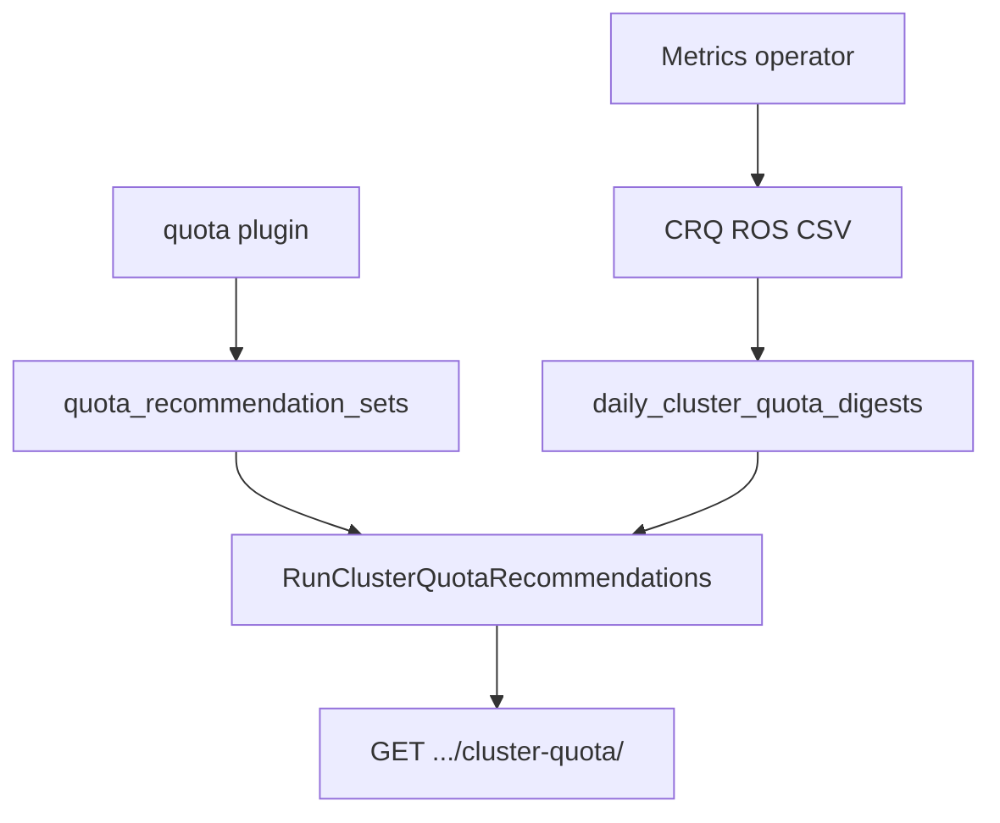

# ClusterResourceQuota Recommendations

!!! info "Quick Facts"
    **API:** `GET /api/cost-management/v1/recommendations/openshift/cluster-quota/`  
    **Plugin:** `cluster-quota` (priority 36; enable with `quota` for best results)  
    **Configurable:** Per-org Settings API + admin env vars  
    **OpenShift only:** Requires `openshift_clusterresourcequota_usage` metrics

Right-size OpenShift **ClusterResourceQuota** (team/tenant pools) by comparing CRQ hard/used
metrics to aggregated namespace **ResourceQuota** recommendation totals.

**Related:** [ResourceQuota recommendations](quota-recommendations.md) tune per-namespace
limits. Enable both the `quota` and `cluster-quota` plugins so CRQ recommended values
incorporate fresh namespace quota sums.

Internal design: [`docs/features/cluster-resource-quota.md`](../../../docs/features/cluster-resource-quota.md) (repo `docs/` tree).

---

## How it works

1. The operator emits `ros-openshift-cluster-quota-*.csv` when CRQ metrics exist.
2. ROS ingests digests and runs `RunClusterQuotaRecommendations` after namespace quota recs
   when both plugins are enabled in the same report cycle.
3. Each CRQ name on a cluster gets `tighten`, `raise`, `optimal`, or `none`, plus risk and
   optional savings on **tighten**.

Clusters without any ClusterResourceQuota produce **zero API rows** (not an error).

---

## Timing and one-cycle lag

Same pattern as [namespace/quota timing](quota-recommendations.md#timing-and-one-cycle-lag):

- CRQ recommended-hard values sum **all** namespace quota recommendations on the cluster
  (v1 does not map CRQs to namespace selectors yet).
- If only a CRQ CSV arrives in a payload, namespace quota sums may reflect the **previous**
  cycle until container + `quota` processing completes.
- On first deployment, expect **one report cycle** before tighten/raise signals fully align.

---

## Configuration

| Variable | Default | Description |
|----------|---------|-------------|
| `ROS_CLUSTER_QUOTA_HEADROOM_PERCENT` | `10` | Margin on recommended CRQ hard values |
| `ROS_CLUSTER_QUOTA_HIGH_RISK_THRESHOLD_PERCENT` | `90` | `raise` + `high` risk when utilization ≥ threshold |
| `ROS_CLUSTER_QUOTA_MEDIUM_RISK_THRESHOLD_PERCENT` | `70` | `medium` risk band |

**Settings API:** `GET` / `PUT` / `DELETE`
`/api/cost-management/v1/recommendations/openshift/settings/cluster-quota`

Env vars lock the corresponding field in `locked_fields`; locked PUTs return **403**.

See [Configuration — ClusterResourceQuota](../configuration.md#clusterresourcequota-recommendations)
and [Configurability](../architecture/configurability.md).

---

## API filters

| Parameter | Maps to |
|-----------|---------|
| `filter[cluster]` | `cluster_uuid` |
| `filter[cluster_quota_name]` / `filter[crq]` | CRQ name |
| `filter[recommendation_type]` | `tighten` \| `raise` \| `optimal` |
| `filter[risk_level]` | `high` \| `medium` \| `low` \| `none` |

Full schema: [`openapi.json`](../../openapi.json).

---

## Enablement

Add `cluster-quota` to `ROS_ENABLED_PLUGINS` (and `quota` for namespace quota signals).
When the plugin is disabled, list and settings routes return **404** (no stale data).
