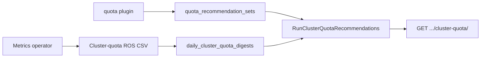

# ClusterResourceQuota Recommendations

!!! info "Quick Facts"
    **API:** `GET /api/cost-management/v1/recommendations/openshift/cluster-quota/`  
    **Plugin:** `cluster-quota` (priority 36, OpenShift only)  
    **Configurable:** Per-org Settings API + `ROS_CLUSTER_QUOTA_*` env vars  
    **Savings:** Yes on `tighten` rows when cost integration is enabled

Right-size OpenShift **ClusterResourceQuota** hard limits per team or tenant pool by
comparing CRQ hard/used metrics against aggregated namespace quota recommendation totals.

**Related:** [ResourceQuota recommendations](quota-recommendations.md) tune per-namespace
`ResourceQuota` objects. CRQ recommendations operate at the **multi-namespace** budget
boundary selected by CRQ selectors.

Internal design reference: [`docs/features/cluster-resource-quota.md`](../../docs/features/cluster-resource-quota.md).

---

## How it works



1. The operator reports CRQ **hard** and **used** from `openshift_clusterresourcequota_usage`
   (`requests.cpu`, `limits.cpu`, `requests.memory`, `limits.memory`).
2. ROS ingests `ros-openshift-cluster-quota-*.csv` (or nise `ocp_ros_cluster_quota*`) into
   `daily_cluster_quota_digests`.
3. The engine loads the latest digest per `cluster_quota_name` and sums namespace quota
   recommendations cluster-wide for v1 recommended-hard values.
4. Each CRQ with hard limits gets `recommendation_type`, `risk_level`, utilization, and
   optional savings on **tighten**.

If the cluster has no `ClusterResourceQuota` objects (or metrics are absent), the operator
omits the CSV and the API returns an empty list — not an error.

---

## Recommendation types and risk

Same semantics as [ResourceQuota recommendations](quota-recommendations.md#recommendation-types-and-risk):

| `recommendation_type` | Meaning |
|----------------------|---------|
| `tighten` | Recommended hard below current hard — reclaim team-pool capacity |
| `raise` | Utilization near hard — admission risk across matched namespaces |
| `optimal` | CRQ aligned with aggregated workload signals |
| `none` | No hard limits on the CRQ snapshot |

---

## Configuration

Resolution order: **per-org Settings API** → **`ROS_CLUSTER_QUOTA_*` env** → **defaults** (10 / 90 / 70).

| Variable | Default | Purpose |
|----------|---------|---------|
| `ROS_CLUSTER_QUOTA_HEADROOM_PERCENT` | `10` | Margin on recommended hard values |
| `ROS_CLUSTER_QUOTA_HIGH_RISK_THRESHOLD_PERCENT` | `90` | Triggers `raise` and `high` risk |
| `ROS_CLUSTER_QUOTA_MEDIUM_RISK_THRESHOLD_PERCENT` | `70` | `medium` risk band |

**Settings API:** `GET` / `PUT` / `DELETE`
`/api/cost-management/v1/recommendations/openshift/settings/cluster-quota`

```json
{
  "headroom_percent": 10,
  "high_risk_threshold_percent": 90,
  "medium_risk_threshold_percent": 70,
  "locked_fields": []
}
```

PUT requires all three percent fields with the same validation rules as namespace quota.
DELETE clears per-org overrides.

See [Configuration](../configuration.md#clusterresourcequota-recommendations).

Disable the feature: omit `cluster-quota` from `ROS_ENABLED_PLUGINS` or use
`ROS_DISABLED_PLUGINS=cluster-quota` (routes return 404).

---

## Timing

Recommendations run:

- After **cluster-quota CSV** ingest (digest update, then engine), and
- After **container CSV** processing (with namespace `quota`), in the same order as
  namespace quota relative to container rows.

Expect **one-cycle lag** when namespace quota or container recommendations in PostgreSQL are
from the previous report cycle — same behavior as
[ResourceQuota timing](quota-recommendations.md#timing).

---

## API

```http
GET /api/cost-management/v1/recommendations/openshift/cluster-quota/
```

| Parameter | Example | Description |
|-----------|---------|-------------|
| `filter[cluster]` | UUID | Limit to one cluster |
| `filter[cluster_quota_name]` | `team-payments` | Limit to one CRQ (aliases: `filter[cluster_resource_quota]`, `filter[crq]`) |
| `filter[recommendation_type]` | `tighten,raise` | Filter by type |
| `filter[risk_level]` | `high,medium` | Filter by risk |
| `limit`, `offset` | — | Pagination (default 20, max 100) |

### Example response

```json
{
  "meta": { "count": 1, "limit": 20, "offset": 0 },
  "links": {
    "first": "/api/cost-management/v1/recommendations/openshift/cluster-quota/?limit=20&offset=0",
    "last": "...",
    "next": null,
    "previous": null
  },
  "data": [
    {
      "cluster_uuid": "550e8400-e29b-41d4-a716-446655440001",
      "cluster_quota_name": "team-payments-quota",
      "recommendation_type": "tighten",
      "risk_level": "low",
      "quota_hard": {
        "cpu_request_millicores": 500000,
        "memory_request_bytes": 1099511627776
      },
      "quota_used": {
        "cpu_request_millicores": 175000
      },
      "quota_recommended": {
        "cpu_request_millicores": 396000,
        "memory_request_bytes": 496125722624
      },
      "utilization": {
        "cpu_request_percent": 35,
        "memory_request_percent": 12
      },
      "capacity_freed": {
        "cpu_cores_freed": 104,
        "memory_bytes": 603387187152
      },
      "estimated_savings": {
        "value": 420,
        "units": "USD"
      }
    }
  ]
}
```

Full schema: [OpenAPI](../openapi.md) and [`openapi.json`](../../openapi.json). Endpoint details: [API reference — cluster-quota](../api-reference/cluster-quota.md).

---

## Operator data

CSV prefix: `ros-openshift-cluster-quota-` (packaged under `resource_optimization_files`).

Required columns include `interval_start`, `interval_end`, and `cluster_quota_name` or
`cluster_resource_quota`. Hard/used columns mirror namespace quota units (millicores for CPU,
bytes for memory): `cpu_request_cluster_sum` / `cpu_request_cluster_used`, and corresponding
limit and memory fields.

Nise compatibility: `ocp_ros_cluster_quota_usage.csv` and similar prefixes.

---

## Known limitations (v1)

- **Cluster-wide namespace sum:** Recommended hard uses the sum of all namespace quota
  recommendations on the cluster, not namespaces matched by each CRQ selector.
- **No selector in API response** yet (digest may carry selector metadata in future operator versions).
- **Storage / object-count** CRQ resources are out of scope (same gap as namespace quota).
- **Fleet savings:** Do not sum namespace quota and CRQ tighten savings without deduplication.
