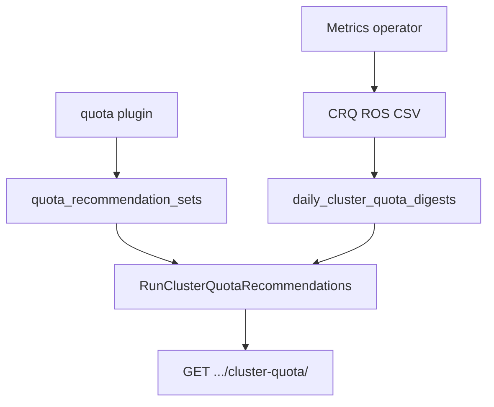

# ClusterResourceQuota Recommendations

!!! info "Quick Facts"
    **API:** `GET /api/cost-management/v1/recommendations/openshift/cluster-quota/`  
    **Plugin:** `cluster-quota` (priority 36; enable with `quota` for best results)  
    **Configurable:** Per-org Settings API + admin env vars  
    **OpenShift only:** Requires `openshift_clusterresourcequota_usage` metrics

Right-size OpenShift **ClusterResourceQuota** (team/tenant pools) by comparing CRQ hard/used
metrics to aggregated namespace **ResourceQuota** recommendation totals.

**Related:** [ResourceQuota recommendations](quota-recommendations.md) tune per-namespace
limits. Enable both the `quota` and `cluster-quota` plugins so CRQ recommended values
incorporate fresh namespace quota sums.

Internal design: [`docs/features/cluster-resource-quota.md`](../../../docs/features/cluster-resource-quota.md) (repo `docs/` tree).

---

## How it works

1. The operator emits `ros-openshift-cluster-quota-*.csv` when CRQ metrics exist.
2. ROS ingests digests and runs `RunClusterQuotaRecommendations` after namespace quota recs
   when both plugins are enabled in the same report cycle.
3. Each CRQ name on a cluster gets `tighten`, `raise`, `optimal`, or `none`, plus risk and
   optional savings on **tighten**.

Clusters without any ClusterResourceQuota produce **zero API rows** (not an error).

---

## Namespace membership

The operator exports a comma-separated **`namespaces`** column on each CRQ CSV row. Membership
is derived from Prometheus `openshift_clusterresourcequota_usage{type='used'}`: namespaces
with a **non-zero used** value for that CRQ are included. This is **not** the CRQ
`.spec.selector` label map evaluated server-side.

The engine sums `quota_recommendation_sets` only for namespaces in that list. When `namespaces`
is empty (older operator builds), the engine falls back to a **cluster-wide** namespace-quota
aggregate.

List and detail APIs support `filter[namespace]` and `filter[project]` to return CRQs whose
membership includes a given namespace.

---

## Timing and one-cycle lag

Same pattern as [namespace/quota timing](quota-recommendations.md#timing-and-one-cycle-lag):

- If only a CRQ CSV arrives in a payload, namespace quota sums may reflect the **previous**
  cycle until container + `quota` processing completes.
- On first deployment, expect **one report cycle** before tighten/raise signals fully align.

---

## Savings and capacity freed

When `ROS_SAVINGS_ESTIMATES_ENABLED=true` and Koku cost data is available, **tighten**
recommendations include `estimated_savings` (whole USD per month):

| Resource | Monetary savings | Capacity freed field |
|----------|------------------|----------------------|
| CPU request | Yes (hourly rate × 730 h) | `capacity_freed.cpu_cores_freed` |
| Memory request | Yes | `capacity_freed.memory_bytes` |
| Storage request | Yes (`storage_gb_request_per_month` or usage fallback) | `capacity_freed.storage_request_bytes` |
| Pods | **No** — no cost-model metric for pod count | `capacity_freed.pods_freed` |

**Object-count quotas** (`count/deployments.apps`, `count/services`, etc.) are ingested into
digests for observability but **do not** produce right-sizing recommendations (see below).

---

## Object-count quotas (visibility and alerting only)

The operator reports aggregated **`object_count_*`** hard/used values (sum of Kubernetes
`count/*` quota types such as `count/deployments.apps`, `count/services`, `count/secrets`).
These are stored in `daily_cluster_quota_digests`. Namespace quota uses the same policy —
see [Object-count resources](quota-recommendations.md#object-count-resources).

| Use case | Included? |
|----------|-----------|
| Utilization % on object counts | Yes |
| Risk level (`high` / `medium` / …) | Yes — counts toward max utilization across CRQ resources |
| Blocking notifications | Yes — code **73** (CRQ at capacity); code **72** on namespace quota rows |
| Tighten / raise recommendations | **No** |
| Estimated savings | **No** |

**Why no right-sizing:** Object limits are **admission-control guardrails**, not cost levers.
ROS has no workload-derived target (container rightsizing does not produce object totals) and
no cost-model rate in Koku. Recommending lower object-count hard values could block production
deployments.

**What you get:** utilization percentage, risk badge when approaching limits, and notification
**73** when a CRQ object-count resource is at capacity. Use these signals for operational
admission pressure — not FinOps dollar impact.

---

## Extended resources (future work)

Extended quota resource types are **not** collected or analyzed today, including:

- `requests.ephemeral-storage` / `limits.ephemeral-storage`
- `nvidia.com/gpu` and other GPU device resources
- `hugepages-2Mi`, `hugepages-1Gi`
- Custom device-plugin resources

Prometheus already exposes hard/used values on `kube_resourcequota` and
`openshift_clusterresourcequota_usage` when clusters define these limits. The limitation is
**operator query scope** (which series the ROS CSV includes), not missing cluster metrics.

| Resource | Priority | Notes |
|----------|----------|-------|
| Ephemeral storage | **High** | Common quota dimension; usage-based tighten may wait on cadvisor reliability (REQ-8.2) |
| GPU quota | **Medium** | GPU **workload** recs use the `gpu` plugin separately; GPU **quota** would likely be visibility-only |
| Hugepages | **Low** | Niche; demand-driven |
| Custom device-plugin resources | **Low** | Demand-driven |

When extended resources are added, expect the same pattern as object counts:
**visibility + alerting only** (utilization, risk, blocking notifications) unless a Koku
cost-model rate exists. See [Known issues — Quota extended resources](../known-issues.md#quota-extended-resources-future-work).

---

## Configuration

| Variable | Default | Description |
|----------|---------|-------------|
| `ROS_CLUSTER_QUOTA_HEADROOM_PERCENT` | `10` | Margin on recommended CRQ hard values |
| `ROS_CLUSTER_QUOTA_HIGH_RISK_THRESHOLD_PERCENT` | `90` | `raise` + `high` risk when utilization ≥ threshold |
| `ROS_CLUSTER_QUOTA_MEDIUM_RISK_THRESHOLD_PERCENT` | `70` | `medium` risk band |

**Settings API:** `GET` / `PUT` / `DELETE`
`/api/cost-management/v1/recommendations/openshift/settings/cluster-quota`

Env vars lock the corresponding field in `locked_fields`; locked PUTs return **403**.

See [Configuration — ClusterResourceQuota](../configuration.md#clusterresourcequota-recommendations)
and [Configurability](../architecture/configurability.md).

---

## API filters

| Parameter | Maps to |
|-----------|---------|
| `filter[cluster]` | `cluster_uuid` |
| `filter[cluster_quota_name]` / `filter[cluster_resource_quota]` / `filter[crq]` | CRQ name |
| `filter[namespace]` / `filter[project]` | CRQs whose membership includes the namespace |
| `filter[recommendation_type]` | `tighten` \| `raise` \| `optimal` \| `none` |
| `filter[risk_level]` | `high` \| `medium` \| `low` \| `none` |

Full schema: [`openapi.json`](../../openapi.json).

---

## Enablement

Add `cluster-quota` to `ROS_ENABLED_PLUGINS` (and `quota` for namespace quota signals).
When the plugin is disabled, list and settings routes return **404** (no stale data).
