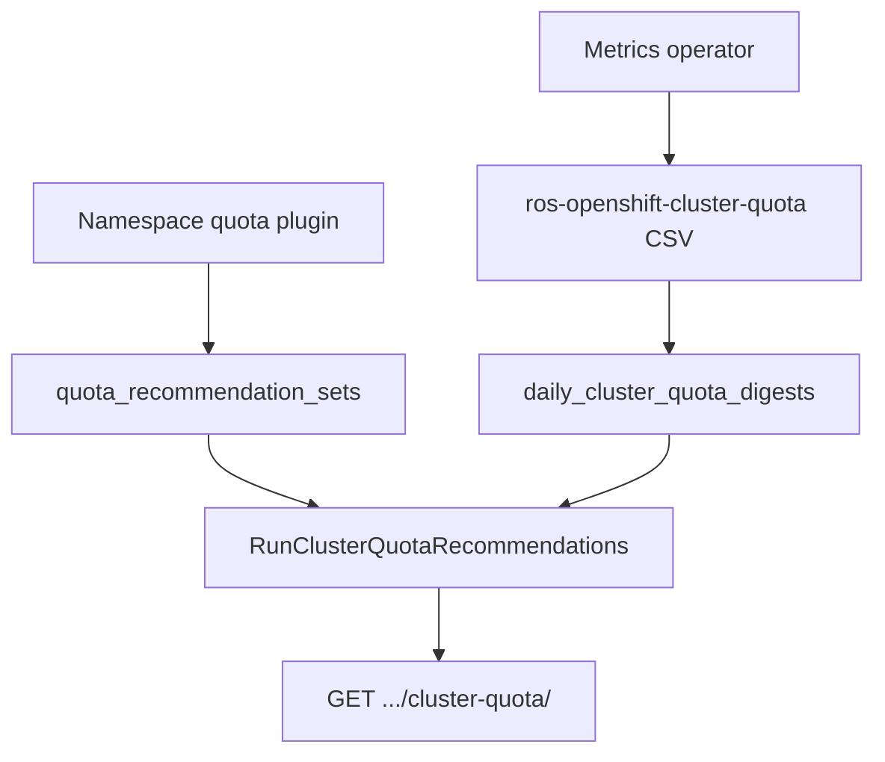

# ClusterResourceQuota Recommendations

!!! info "Quick Facts"
    **API:** `GET /api/cost-management/v1/recommendations/openshift/cluster-quota/`  
    **Plugin:** `cluster-quota` (priority 36, OpenShift only)  
    **Configurable:** Per-org Settings API + admin env vars  
    **Savings:** Yes on `tighten` rows when cost integration is enabled (CPU, memory, storage request)

Right-size OpenShift **ClusterResourceQuota** hard limits by comparing CRQ hard/used metrics
against aggregated namespace ResourceQuota recommendations for the namespaces selected by
each CRQ's label or annotation selector.

Each recommendation row is keyed by **`(cluster_uuid, cluster_quota_name)`**. The API also
returns a **`namespaces[]`** array listing namespace membership for that CRQ (from operator
CSV or engine fallback).

**Related:** [ResourceQuota recommendations](quota-recommendations.md) tune per-namespace
limits. The **`cluster-quota`** plugin provides a team-pool view across multiple namespaces.

**OpenShift required:** `ClusterResourceQuota` is an OpenShift API extension
(`quota.openshift.io/v1`), not upstream Kubernetes.

---

## What it does

| Problem | ROS guidance |
|---------|--------------|
| Over-provisioned CRQ hard limits | `tighten` — reduce hard limits toward summed namespace quota recommendations plus headroom |
| CRQ near or at capacity | `raise` + elevated `risk_level` — admission pressure before deployments fail |
| CRQ aligned with namespace quotas | `optimal` — no change recommended |

Resources covered in recommendations and risk:

| Resource | Tighten / raise | Savings on tighten | Notes |
|----------|-----------------|-------------------|-------|
| CPU request / limit | Yes | Yes (hourly usage rates) | Utilization uses max of used vs namespace rec sums |
| Memory request / limit | Yes | Yes (hourly usage rates) | Same signal as CPU |
| Storage request | Yes | Yes when `storage_gb_request_per_month` exists | `capacity_freed.storage_request_bytes` |
| Pods | Yes | Count only — no dollar estimate | `capacity_freed.pods_freed` |
| Object counts (`count/*`) | Visibility only | No | Risk + blocking notifications only |

**FinOps note:** Do not add namespace `quota` savings and CRQ `tighten` savings in one fleet
total without deduplication — CRQ is a team-pool view; namespace quota is a project view.

---

## How it works



1. The operator reports CRQ **hard** and **used** values from `openshift_clusterresourcequota_usage`.
2. ROS ingests cluster-quota CSV into `daily_cluster_quota_digests`.
3. `RunClusterQuotaRecommendations` sums namespace `quota_recommendation_sets` for namespaces
   in the operator `namespaces` column (cluster-wide when empty).
4. Each CRQ gets a recommendation type, risk level, optional estimated savings on **tighten**,
   and notification codes **70–73** when applicable.

**Enablement:** Include `cluster-quota` in `ROS_ENABLED_PLUGINS`. When disabled, list and
settings routes return **404**. Clusters without CRQ objects return an empty `data` array (not an error).

Internal design: [`docs/features/cluster-resource-quota.md`](../../docs/features/cluster-resource-quota.md).

---

## Namespace membership

The operator exports a comma-separated **`namespaces`** column on
`ros-openshift-cluster-quota-*.csv`. The engine sums namespace `quota_recommendation_sets`
only for namespaces in that list. When membership is empty (older operator builds), the
engine falls back to a cluster-wide aggregate.

The list and detail API responses expose membership as **`namespaces[]`** — a JSON array of
namespace names. Filter with `filter[namespace]` or the alias `filter[project]` to find CRQs
whose membership includes a given namespace.

---

## Object-count quotas (risk and notifications only)

The operator ingests aggregated **`object_count_*`** metrics (sum of Kubernetes `count/*`
ResourceQuota types). These appear on CRQ digests but follow a **visibility-only** policy:

| Use case | Included? | Notes |
|----------|-----------|-------|
| **API utilization fields** | No | `utilization` exposes CPU, memory, storage, and pods percents only |
| **`order_by=utilization`** | No | Sort uses the same four percents; object-count is internal-only |
| **Risk level** | Yes | High object-count utilization can surface `high` risk |
| **Blocking notifications** | Yes | Code **72** when `used >= hard` on object counts |
| **High-utilization notifications** | Yes | Codes **70** and **73** when `risk_level` is `high` |
| **Tighten / raise** | No | No workload-derived target for object counts |
| **Savings** | No | No cost-model rate for object counts |

Treat object-count signals as admission-pressure indicators, not FinOps dollar impact.
See also [ResourceQuota object-count policy](quota-recommendations.md#object-count-resources).

---

## Configuration

Resolution order: **per-org Settings API** → **`ROS_CLUSTER_QUOTA_*` env vars** → **compiled defaults** (10 / 90 / 70).

| Variable | Default | Purpose |
|----------|---------|---------|
| `ROS_CLUSTER_QUOTA_HEADROOM_PERCENT` | `10` | Margin on recommended CRQ hard values |
| `ROS_CLUSTER_QUOTA_HIGH_RISK_THRESHOLD_PERCENT` | `90` | Triggers `raise` and `high` risk |
| `ROS_CLUSTER_QUOTA_MEDIUM_RISK_THRESHOLD_PERCENT` | `70` | `medium` risk band |

**Settings API:**

```http
GET /api/cost-management/v1/recommendations/openshift/settings/cluster-quota
PUT /api/cost-management/v1/recommendations/openshift/settings/cluster-quota
DELETE /api/cost-management/v1/recommendations/openshift/settings/cluster-quota
```

GET returns current thresholds and `locked_fields` (env-locked fields). PUT requires all three
percent fields; `high_risk_threshold_percent` must exceed `medium_risk_threshold_percent`.
PUT on env-locked fields returns **403**. DELETE clears per-org overrides and restores
deployment defaults.

See [Configuration — ClusterResourceQuota](../configuration.md#clusterresourcequota-recommendations).

---

## Savings recalculation

Cluster-quota `estimated_savings` values are computed at ingestion time from Koku cost rates
when `ROS_SAVINGS_ESTIMATES_ENABLED=true` (tighten rows only). When cost model rates change,
persisted savings can become stale until refreshed.

**Automatic refresh:** After Koku applies updated cost model rates, masu calls:

```http
POST /api/cost-management/v1/internal/recalculate-savings
```

Include `"cluster-quota"` in `recommendation_types`. ROS recomputes `estimated_savings` on
existing `tighten` rows without re-ingesting CSV. Requires `ROS_SAVINGS_RECALCULATION_ENABLED=true`
(default) and Koku→ROS connectivity.

**What changes:** Dollar savings only — `recommendation_type`, `risk_level`, hard/used values,
and notification codes are unchanged by savings recalc.

See [Cost Integration — Savings recalculation](../architecture/cost-integration.md#savings-recalculation-after-cost-model-changes).

---

## API

```http
GET /api/cost-management/v1/recommendations/openshift/cluster-quota/
GET /api/cost-management/v1/recommendations/openshift/cluster-quota/detail
```

### List filters, sorting, and grouping

| Parameter | Example | Description |
|-----------|---------|-------------|
| `filter[cluster]` | UUID | Limit to one cluster |
| `filter[cluster_quota_name]` | `team-payments-quota` | CRQ object name (exact match) |
| `filter[cluster_resource_quota]` | `team-payments-quota` | Alias for `filter[cluster_quota_name]` |
| `filter[crq]` | `team-payments-quota` | Alias for `filter[cluster_quota_name]` |
| `filter[namespace]` | `team-a` | CRQs whose `namespaces[]` includes the value |
| `filter[project]` | `team-a` | Alias for `filter[namespace]` |
| `filter[recommendation_type]` | `tighten,raise` | `tighten`, `raise`, `optimal`, or `none` |
| `filter[risk_level]` | `high,medium` | `high`, `medium`, `low`, or `none` |
| `order_by` | `utilization` | Sort key — see [order_by values](#order_by-values) |
| `order_how` | `desc` | `asc` or `desc` (default `desc` when `order_by` is set) |
| `group_by[cluster]` | `*` | Aggregate rows per cluster (sums `capacity_freed`, `estimated_savings`; includes `count`) |
| `limit` / `offset` | `20` / `0` | Pagination (default limit 20, max 100) |

### order_by values

| `order_by` | Sort key |
|------------|----------|
| `cluster_quota_name` | CRQ object name (default) |
| `utilization` | Max of CPU/memory/storage/pods utilization percents (object-count excluded) |
| `risk_level` | `high` → `medium` → `low` → `none` |
| `estimated_monthly_savings` | `savings_dollars_monthly` (tighten rows only) |

### Notification codes

CRQ rows may emit codes **70–73**. Filter the catalog:

```http
GET /api/cost-management/v1/recommendations/openshift/notification-codes/?filter[plugin]=cluster-quota
```

| Code | Name | When emitted (CRQ) |
|------|------|-------------------|
| **70** | `QUOTA_NEAR_CAPACITY` | `risk_level` is `high` — utilization at or above the high-risk threshold |
| **71** | `QUOTA_OVERSIZED` | `recommendation_type` is `tighten` — hard limits exceed aggregated namespace quota recommendations |
| **72** | `QUOTA_BLOCKING` | `used >= hard` on any tracked resource (CPU, memory, storage, pods, or object counts) |
| **73** | `CLUSTER_QUOTA_AT_CAPACITY` | `risk_level` is `high` — CRQ-specific high-utilization alert (often co-emitted with **70**) |

See [Notification codes](../architecture/notification-codes.md).

### Detail endpoint

```http
GET /api/cost-management/v1/recommendations/openshift/cluster-quota/detail
  ?cluster_uuid={uuid}&cluster_quota_name={name}
```

**Required query params:** `cluster_uuid`, `cluster_quota_name`.

Returns the same fields as a list row plus **`history[]`** — 90-day append-only snapshots
per resource (CPU request, memory request, storage request, pods, etc.).

### Example list response

```json
{
  "meta": {
    "count": 1,
    "limit": 20,
    "offset": 0
  },
  "links": {
    "first": "/api/cost-management/v1/recommendations/openshift/cluster-quota/?limit=20&offset=0",
    "last": "...",
    "next": null,
    "previous": null
  },
  "data": [
    {
      "cluster_uuid": "550e8400-e29b-41d4-a716-446655440001",
      "cluster_quota_name": "team-payments-quota",
      "namespaces": ["namespace-a", "namespace-b"],
      "recommendation_type": "tighten",
      "risk_level": "low",
      "quota_hard": {
        "cpu_request_millicores": 500000,
        "memory_request_bytes": 1099511627776,
        "storage_request_bytes": 107374182400,
        "pods": 500
      },
      "quota_used": {
        "cpu_request_millicores": 175000,
        "storage_request_bytes": 53687091200,
        "pods": 120
      },
      "quota_recommended": {
        "cpu_request_millicores": 396000,
        "memory_request_bytes": 496125722624,
        "storage_request_bytes": 85899345920,
        "pods": 400
      },
      "utilization": {
        "cpu_request_percent": 35,
        "memory_request_percent": 12,
        "storage_request_percent": 50,
        "pods_percent": 24
      },
      "capacity_freed": {
        "cpu_cores_freed": 104,
        "memory_bytes": 603387187152,
        "storage_request_bytes": 21474836480,
        "pods_freed": 100
      },
      "estimated_savings": {
        "value": 420,
        "units": "USD"
      },
      "notifications": {
        "71": {
          "code": 71,
          "severity": "info",
          "description": "ClusterResourceQuota hard limits exceed aggregated namespace quota recommendations"
        }
      }
    }
  ]
}
```

### Example `group_by[cluster]` response

```json
{
  "meta": { "count": 2, "limit": 20, "offset": 0 },
  "data": [
    {
      "cluster_uuid": "550e8400-e29b-41d4-a716-446655440001",
      "count": 3,
      "capacity_freed": {
        "cpu_cores_freed": 12,
        "memory_bytes": 85899345920,
        "storage_request_bytes": 10737418240,
        "pods_freed": 5
      },
      "estimated_savings": { "value": 840, "units": "USD" }
    }
  ]
}
```

### `capacity_freed` keys

On **tighten** rows (and summed in `group_by[cluster]`), `capacity_freed` includes:

| Key | Description |
|-----|-------------|
| `cpu_cores_freed` | CPU request cores that could be reclaimed |
| `memory_bytes` | Memory request bytes that could be reclaimed |
| `storage_request_bytes` | Storage request bytes that could be reclaimed |
| `pods_freed` | Pod slots that could be reclaimed (count only — no dollar estimate) |

Full schema: [OpenAPI specification](../openapi.md) and [`openapi.json`](../../openapi.json).

Plugin reference: [cluster-quota](../plugin-reference/cluster-quota.md).

---

## Timing and one-cycle lag

Same pattern as [namespace ResourceQuota](quota-recommendations.md#timing-and-one-cycle-lag):

1. **After container CSV:** `RunClusterQuotaRecommendations` runs after `RunQuotaRecommendations`.
2. **After cluster-quota CSV:** Ingest updates digests, then recommendations run in the same cycle.
3. **Stale namespace quota sums:** If only CRQ CSV arrives in a cycle, recommended-hard aggregates
   reflect the **previous** namespace quota run until container + namespace/quota processing completes.

On first deployment, expect **one report cycle** before tighten/raise signals fully align.

---

## Extended resources (future work)

Extended CRQ resource types — ephemeral storage, GPU quota, hugepages, custom device plugins —
are **not** currently collected by the operator or analyzed by the `cluster-quota` plugin.

**Planned pattern when added:** Same as [object-count quotas](#object-count-quotas-risk-and-notifications-only) —
visibility + alerting only unless Koku exposes a matching cost-model rate.

Track alongside namespace quota extended-resource work in
[quota-recommendations.md — Roadmap](quota-recommendations.md#roadmap-future-work).

---

## Related documentation

- [ResourceQuota recommendations](quota-recommendations.md)
- [Plugin reference — cluster-quota](../plugin-reference/cluster-quota.md)
- [Configuration](../configuration.md#clusterresourcequota-recommendations)
- [Known issues](../known-issues.md)
- [UI integration guide](../ui-integration-guide.md)
