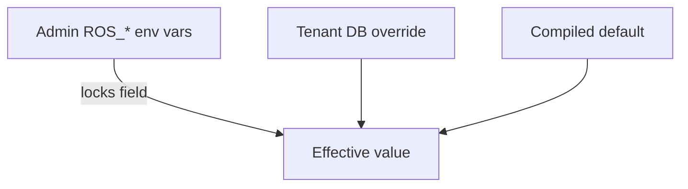

# Configurable Thresholds

!!! info "Quick Facts"
    **API:** `GET/PUT/DELETE /api/cost-management/v1/recommendations/openshift/settings/thresholds?recommendation_type=<type>`  
    **Configurable:** Yes (meta-feature)  
    **Engines:** Applies to all engine types  
    **RBAC:** `cost-management:settings:write` required for PUT/DELETE

## Overview

Configurable thresholds let each tenant tune recommendation behavior — percentiles,
classification cutoffs, margins, and idle detection — without redeploying ROS.
Administrators can lock parameters platform-wide via environment variables.

## Three-tier precedence



| Tier | Source | Behavior |
|------|--------|----------|
| **1 — Admin env var** | `ROS_CONTAINER_*`, `ROS_NODE_*`, etc. | **Locks** the field; tenant PUT returns `403` with `locked_fields` |
| **2 — Tenant Settings API** | `recommendation_thresholds` table | Applied when no env lock exists |
| **3 — Compiled default** | Engine constants / `Default*()` functions | Fallback |

Resolution order: Tier 1 → Tier 2 → Tier 3. See
[Configurability Reference](../architecture/configurability.md#configuration-precedence).

## Settings API workflow

### GET — current effective values

```http
GET /api/cost-management/v1/recommendations/openshift/settings/thresholds?recommendation_type=container
```

Returns merged effective settings plus `locked_fields` (admin-locked parameter names).
Compare returned values to [compiled defaults](../architecture/configurability.md) to
see whether the tenant has overrides (DELETE resets tier-2 overrides).

### PUT — partial override

```http
PUT /api/cost-management/v1/recommendations/openshift/settings/thresholds?recommendation_type=container
Content-Type: application/json

{ "cpu_cost_percentile": 0.55, "min_margin": 1.20 }
```

- Accepts partial JSON; validates ranges before save.
- Locked fields → `403 Forbidden` with `locked_fields` array.
- Invalid values → `400` with `validation_errors`.
- On success, triggers **async recalculation** (see below).

### DELETE — reset tenant overrides

```http
DELETE /api/cost-management/v1/recommendations/openshift/settings/thresholds?recommendation_type=container
```

Returns `204 No Content`. Removes tier-2 overrides; effective values revert to
compiled defaults (unless admin env vars are set).

## Async recalculation

After a successful PUT, ROS re-runs recommendation engines for **all clusters
in the org** using existing digest data — typically within seconds, without
waiting for the next operator upload.

| Variable | Default | Purpose |
|----------|---------|---------|
| `ROS_THRESHOLD_RECALCULATION_ENABLED` | `true` | Kill-switch — when `false`, PUT saves settings but skips background recalc |

Recalculation uses the same pipelines as ingestion; only threshold inputs change.

## Supported recommendation types

| `recommendation_type` | Scope |
|-----------------------|-------|
| `container` | CPU/memory percentiles, margins, idle thresholds |
| `namespace` | Same field set as container (higher default trend threshold) |
| `node` | Utilization targets, consolidation, classification |
| `gpu` | Classification, MIG sizing, time-slicing parameters |
| `pvc` | Oversized/near-full ratios, growth projection |

Snapshot thresholds use a dedicated route:
`GET/PUT .../settings/snapshot` (not the thresholds endpoint).

## RBAC

When RBAC is enabled, PUT and DELETE require **`cost-management:settings:write`**
(mapped to `settings.write` permission in the identity header). GET is available
to all authenticated users with recommendation read access.

## Full parameter catalog

The thresholds API exposes plugin-specific fields. For the complete list of
**49+ environment variables** (including term windows, global platform settings,
and snapshot/business-hours knobs), see:

**[Configurability Reference](../architecture/configurability.md)**

For how thresholds affect engine output, see
**[Recommendation Engines](../architecture/recommendation-engines.md)**.

## Related

- [Dual Engine](dual-engine.md) — Percentile differences between cost and performance
- [Container Right-Sizing](container-recommendations.md) — Primary consumer of container thresholds
- [UI Integration Guide — Settings: Thresholds](../ui-integration-guide.md#8-settings-thresholds)
