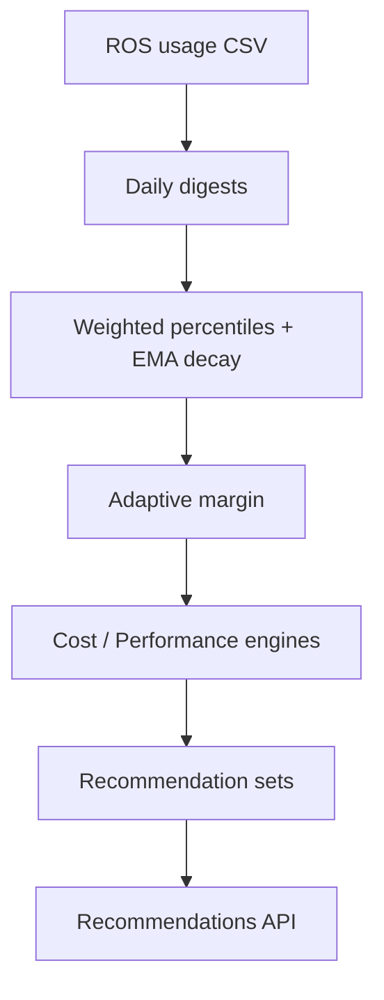

# Container Right-Sizing

!!! info "Quick Facts"
    **API:** `GET /api/cost-management/v1/recommendations/openshift` (list),
    `GET .../recommendations/openshift/{id}` (detail)  
    **Configurable:** Yes  
    **Engines:** cost, performance (both returned on every response)

## Overview

Container right-sizing is the core ROS-OCP capability. It analyzes historical
CPU and memory usage for each workload container and recommends Kubernetes
**requests** and **limits** that better match actual consumption — reducing waste
without ignoring spikes or OOM events.

## How it works



1. **Ingestion** — Hourly usage samples are aggregated into `daily_*_digests`
   (CPU max/avg, memory max/avg, OOM counts).
2. **Percentile sizing** — Each engine applies a usage percentile (cost uses
   lower percentiles; performance uses higher). Exponential decay weights recent
   days more heavily on medium/long terms.
3. **Adaptive margin** — A safety buffer (1.15×–1.50×) scales with workload
   variability: stable workloads get tighter margins; spiky ones get more headroom.
4. **Limits** — Recommended limit = request × `limit_multiplier` (default 1.05).
5. **Persistence** — Results are stored per container × term × engine and exposed
   via the API.

Algorithm details: [Recommendation Math](../architecture/recommendation-math.md).

## Key metrics

| Field | Meaning |
|-------|---------|
| `cpu_request` / `cpu_limit` | Recommended CPU in cores or millicores |
| `memory_request` / `memory_limit` | Recommended memory (bytes, MiB, or GiB) |
| `data_days` | Days of digest data in the term window |
| `confidence` | `min(data_days / window_days, 1.0)` |

## Classification

| Type | Condition | Typical action |
|------|-----------|----------------|
| **Active** | Normal usage above idle thresholds | Apply right-sizing |
| **Idle** | Max CPU ≤ 10 m **and** max memory ≤ 10 MiB | Consider scale-down or removal |
| **Abandoned** | All digest rows show zero CPU **and** zero memory | Decommission candidate |

Idle and abandoned containers still receive recommendations; savings estimates
treat them as **100% recoverable** when cost data is available.

## OOM detection and bump

When a container was OOM-killed during the observation window, the memory
recommendation is bumped using a logarithmic formula:

```
bump = min(oom_max_bump, 1.0 + oom_base_bump × log₂(1 + oom_count))
```

Defaults: `ROS_OOM_BASE_BUMP=0.15`, `ROS_OOM_MAX_BUMP=1.60`. This prevents
repeated OOM loops while capping runaway memory suggestions.

## Confidence tiers

Recommendations are emitted for three **terms** (short / medium / long):

| Term | Default window | Min data days |
|------|----------------|---------------|
| short | 1 day | 1 |
| medium | 7 days | 3 |
| long | 15 days | 7 |

When `data_days / window_days` falls below `low_confidence_threshold` (default
0.5), a low-confidence notification is appended.

## Dual engine

Each term returns **both** engines nested under `recommendations.{term}.cost`
and `recommendations.{term}.performance`:

| Engine | CPU percentile | Memory percentile |
|--------|----------------|-------------------|
| cost | P60 | P95 |
| performance | P98 | Max (P100) |

See [Dual Engine](dual-engine.md) for when to display each perspective.

## API

```http
GET /api/cost-management/v1/recommendations/openshift
GET /api/cost-management/v1/recommendations/openshift/{recommendation-id}
```

List returns one row per container with all terms and engines nested. Detail
endpoints use a Kruize-compatible shape with `recommendation_terms` and
`recommendation_engines`.

### Example (abbreviated list item)

```json
{
  "container": "app",
  "project": "team-a",
  "workload": "api",
  "estimated_monthly_savings_usd": 12.50,
  "currency": "USD",
  "recommendations": {
    "medium_term": {
      "cost": {
        "config": {
          "requests": { "cpu": { "amount": 0.25, "format": "cores" }, "memory": { "amount": 384, "format": "MiB" } }
        },
        "notifications": { "1": { "type": "INFO", "code": 1, "message": "..." } }
      },
      "performance": {
        "config": {
          "requests": { "cpu": { "amount": 0.5, "format": "cores" }, "memory": { "amount": 512, "format": "MiB" } }
        }
      }
    }
  }
}
```

Full parameter reference: [UI Integration Guide](../ui-integration-guide.md#2-recommendation-list-container--namespace).

### Pagination

Container lists support **keyset pagination** via `?after=<meta.next_cursor>` for stable
iteration over large fleets. Offset pagination (`limit` / `offset`) remains available
for legacy clients. See [API Pagination](../pagination.md) for the full contract,
client patterns, and when to prefer cursor mode over offset.

### CSV export

Bulk export uses `?format=csv` or `Accept: text/csv` on the list endpoint. The response
is `text/csv` with one row per container × term × engine (cluster, project, workload,
container, savings, idle state, and recommendation values). The same filters and sort
keys apply as the JSON list. Details: [UI Integration Guide — CSV export](../ui-integration-guide.md).

## Configurable thresholds

Tenant overrides via
`GET/PUT/DELETE .../settings/thresholds?recommendation_type=container`.

| Parameter | Default | Purpose |
|-----------|---------|---------|
| `cpu_cost_percentile` | 0.60 | Cost engine CPU percentile |
| `cpu_perf_percentile` | 0.98 | Performance engine CPU percentile |
| `mem_cost_percentile` | 0.95 | Cost engine memory percentile |
| `mem_perf_percentile` | 1.0 | Performance engine memory percentile |
| `min_margin` / `max_margin` | 1.15 / 1.50 | Adaptive margin bounds |
| `limit_multiplier` | 1.05 | Limit = request × multiplier |
| `cpu_floor_mc` | 25 | Minimum CPU request (millicores) |
| `idle_cpu_threshold_mc` | 10 | Idle classification CPU ceiling |
| `idle_mem_threshold_kib` | 10240 | Idle classification memory ceiling |
| `mem_trend_slope_threshold` | 100 | KiB/day growth alert |
| `low_confidence_threshold` | 0.5 | Low-confidence notification |

Full env var catalog: [Configurability Reference](../architecture/configurability.md#container).

## Related

- [API Pagination](../pagination.md) — Keyset (`after`) vs offset pagination
- [Savings Estimations](savings-estimations.md) — Dollar impact per container
- [Business Hours](business-hours.md) — Schedule-aware percentiles
- [History & Quality](history-and-quality.md) — Track recommendation changes over time
