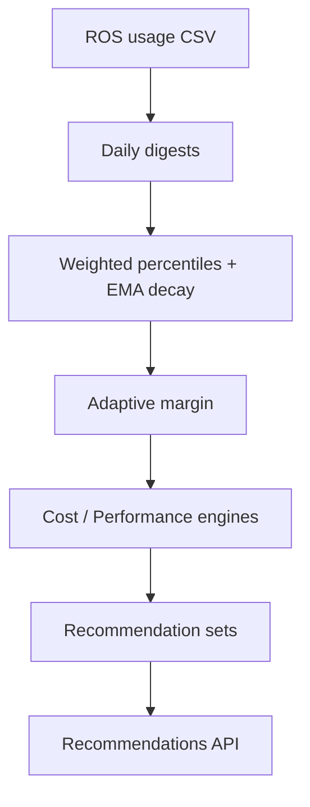

# Container Right-Sizing

!!! info "Quick Facts"
    **API:** `GET /api/cost-management/v1/recommendations/openshift` (list),
    `GET .../recommendations/openshift/{id}` (detail)  
    **Configurable:** Yes  
    **Engines:** cost, performance (both returned on every response)

## Overview

Container right-sizing is the core ROS-OCP capability. It analyzes historical
CPU and memory usage for each workload container and recommends Kubernetes
**requests** and **limits** that better match actual consumption — reducing waste
without ignoring spikes or OOM events.

## How it works



1. **Ingestion** — Hourly usage samples are aggregated into `daily_*_digests`
   (CPU max/avg, memory max/avg, OOM counts).
2. **Percentile sizing** — Each engine applies a usage percentile (cost uses
   lower percentiles; performance uses higher). Exponential decay weights recent
   days more heavily on medium/long terms.
3. **Adaptive margin** — A safety buffer (1.15×–1.50×) scales with workload
   variability: stable workloads get tighter margins; spiky ones get more headroom.
4. **Limits** — Recommended limit = request × `limit_multiplier` (default 1.05).
5. **Persistence** — Results are stored per container × term × engine and exposed
   via the API.

Algorithm details: [Recommendation Math](../architecture/recommendation-math.md).

## Key metrics

| Field | Meaning |
|-------|---------|
| `cpu_request` / `cpu_limit` | Recommended CPU in cores or millicores |
| `memory_request` / `memory_limit` | Recommended memory (bytes, MiB, or GiB) |
| `data_days` | Days of digest data in the term window |
| `confidence` | `min(data_days / window_days, 1.0)` |

## Classification

Each container is classified into one of three **idle states** (`active`,
`idle`, `zombie`) by [`ClassifyIdleState()`](../../internal/engine/idle_classification.go)
after at least `minimum_observation_days` of digest data (default **14**).
DaemonSets and excluded namespaces (e.g. `kube-system`, `openshift-*`) stay
**active**.

| State | Key criteria | Typical action |
|-------|--------------|----------------|
| **active** | Default; utilization above idle thresholds, or bursty (peak/P95 CPU > `burst_ratio`, default 10) | Apply right-sizing |
| **idle** | CPU P95 < **2%** of request **and** memory P95 < **5%** of request (configurable via `settings/idle-detection`) | Scale-down candidate |
| **zombie** | CPU P95 < **1 mc** **and** peak CPU < **10 mc** (configurable zombie millicore thresholds) | Decommission candidate; UI may label **Abandoned** |

Idle and zombie containers still receive recommendations; savings estimates
treat them as **100% recoverable** when cost data is available. Filter with
`filter[idle_state]=zombie,idle`. See [Idle detection](idle-detection.md) for
GPU, namespace, and node rollups.

## OOM detection and bump

When a container was OOM-killed during the observation window, the memory
recommendation is bumped using a logarithmic formula:

```
bump = min(oom_max_bump, 1.0 + oom_base_bump × log₂(1 + oom_count))
```

Defaults: `ROS_OOM_BASE_BUMP=0.15`, `ROS_OOM_MAX_BUMP=1.60`. This prevents
repeated OOM loops while capping runaway memory suggestions.

## Confidence tiers

Recommendations are emitted for three **terms** (short / medium / long):

| Term | Default window | Min data days |
|------|----------------|---------------|
| short | 1 day | 1 |
| medium | 7 days | 3 |
| long | 15 days | 7 |

When `data_days / window_days` falls below `low_confidence_threshold` (default
0.5), a low-confidence notification is appended.

## Dual engine

Each term returns **both** engines nested under
`recommendations.recommendation_terms.{term}.recommendation_engines.{cost,performance}`:

| Engine | CPU percentile | Memory percentile |
|--------|----------------|-------------------|
| cost | P60 | P95 |
| performance | P98 | Max (P100) |

See [Dual Engine](dual-engine.md) for when to display each perspective.

## API

### List endpoint

```http
GET /api/cost-management/v1/recommendations/openshift
```

Returns one row per container with nested `recommendations.recommendation_terms` for
short/medium/long windows and cost/performance engines.

**Offset pagination** (default for legacy clients):

| Parameter | Default | Notes |
|-----------|---------|-------|
| `limit` | 100 | 1–1000 |
| `offset` | 0 | Page start index |

```http
GET .../recommendations/openshift?limit=20&offset=0
GET .../recommendations/openshift?limit=20&offset=20
```

Response envelope:

```json
{
  "meta": { "count": 42, "limit": 20, "offset": 0, "has_next": true, "next_cursor": "..." },
  "data": [ { "id": "...", "container": "...", "recommendations": { ... } } ],
  "links": { "first": "...", "next": "...", "last": "..." }
}
```

### Detail endpoint

```http
GET /api/cost-management/v1/recommendations/openshift/{recommendation-id}
```

Lookup by deterministic UUID v5 from `(cluster_uuid, namespace, workload, workload_type, container_name)`.
Same schema as list items, with usage box plots, `recommendations.current`, optional `gpu` block,
and idle/zombie fields when classified.

```http
GET .../recommendations/openshift/550e8400-e29b-41d4-a716-446655440000
```

### Example (abbreviated list item)

```json
{
  "id": "550e8400-e29b-41d4-a716-446655440000",
  "container": "app",
  "project": "team-a",
  "workload": "api",
  "idle_state": "active",
  "currency": "USD",
  "recommendations": {
    "monitoring_end_time": "2026-05-31T23:00:00.000Z",
    "estimated_monthly_savings": { "value": "12.500000", "units": "USD" },
    "recommendation_terms": {
      "medium_term": {
        "duration_in_hours": 168,
        "recommendation_engines": {
          "cost": {
            "config": {
              "requests": {
                "cpu": { "amount": 0.25, "format": "cores" },
                "memory": { "amount": 384, "format": "MiB" }
              }
            },
            "notifications": { "1": { "type": "INFO", "code": 1, "message": "..." } }
          },
          "performance": {
            "config": {
              "requests": {
                "cpu": { "amount": 0.5, "format": "cores" },
                "memory": { "amount": 512, "format": "MiB" }
              }
            }
          }
        }
      }
    }
  }
}
```

Full parameter reference: [UI Integration Guide](../ui-integration-guide.md#2-recommendation-list-container--namespace).

### Filters

Bracket syntax (`filter[field]`) and legacy flat params are both accepted.

| Filter | Bracket form | Description |
|--------|--------------|-------------|
| Cluster | `filter[cluster]` | Cluster UUID (exact) or alias (partial match) |
| Project / namespace | `filter[project]` or `filter[namespace]` | Namespace (partial); `filter[namespace]` is an alias for `filter[project]` |
| Workload | `filter[workload]` | Workload name (partial match) |
| Workload type | `filter[workload_type]` | `daemonset`, `deployment`, `deploymentconfig`, `replicaset`, `replicationcontroller`, `statefulset` |
| Container | `filter[container]` | Container name (partial match) |
| Engine | `filter[engine]` | `cost` or `performance` — limits nested engines per term |
| Term | `filter[term]` | `short`/`medium`/`long` or `short_term`/`medium_term`/`long_term` |
| Idle state | `filter[idle_state]` | Comma-separated: `active`, `idle`, `zombie` |
| GPU presence | `filter[has_gpu]` | `true` / `false` / `1` / `0` |
| GPU model | `filter[gpu_model]` | Case-insensitive substring (repeatable, OR) |
| GPU classification | `filter[gpu_classification]` | `idle`, `underutilized`, `compute_bound_underutil`, `memory_bound`, `well_utilized`, `no_profiling` |

Exact and exclude variants: `filter[exact:<field>]`, `exclude[<field>]`.
Date window on `updated_at`: `start_date`, `end_date` (`YYYY-MM-DD`).
Tag filters: `filter[tag:<key>]` (requires `ROS_TAGS_ENABLED=true`). See [Tag Filtering](tag-filtering.md).

### Sorting (`order_by`)

Use `order_by=<field>&order_how=asc|desc` or bracket form `order_by[<field>]=asc|desc`.
Default: `last_reported` descending.

| `order_by` value | Sorts by |
|------------------|----------|
| `cluster` | Cluster alias |
| `project` | Namespace |
| `workload_type` | Workload kind |
| `workload` | Workload name |
| `container` | Container name |
| `last_reported` | Last reported timestamp |
| `cpu_request_current` | Current CPU request |
| `memory_request_current` | Current memory request |
| `cpu_variation_short_cost` | Short-term cost CPU variation (%) |
| `cpu_variation_short_performance` | Short-term performance CPU variation (%) |
| `cpu_variation_medium_cost` | Medium-term cost CPU variation (%) |
| `cpu_variation_medium_performance` | Medium-term performance CPU variation (%) |
| `cpu_variation_long_cost` | Long-term cost CPU variation (%) |
| `cpu_variation_long_performance` | Long-term performance CPU variation (%) |
| `memory_variation_short_cost` | Short-term cost memory variation (%) |
| `memory_variation_short_performance` | Short-term performance memory variation (%) |
| `memory_variation_medium_cost` | Medium-term cost memory variation (%) |
| `memory_variation_medium_performance` | Medium-term performance memory variation (%) |
| `memory_variation_long_cost` | Long-term cost memory variation (%) |
| `memory_variation_long_performance` | Long-term performance memory variation (%) |

### Keyset pagination

Request the first page with `limit` (and optional filters). When more rows exist,
`meta.has_next` is `true` and `meta.next_cursor` holds an opaque cursor:

```http
GET /api/cost-management/v1/recommendations/openshift?limit=20
GET /api/cost-management/v1/recommendations/openshift?limit=20&after=<meta.next_cursor>
```

Copy `next_cursor` verbatim — do not parse or construct it. When `after` is set,
`offset` is ignored. Offset pagination (`limit` / `offset`) remains for legacy clients.
Details: [API Pagination](../pagination.md).

### History, quality, business hours, notifications

- **History** — `GET .../recommendations/openshift/history` — fleet-wide recommendation
  snapshots. Filters: `cluster`, `project`, `workload`, `container`, `term`, `engine`,
  `start_date`, `end_date`, `limit`, `offset`, `format=csv`.
- **Quality** — `GET .../recommendations/openshift/quality` — stability, adoption, and
  OOM-after-recommendation metrics. Filters: `cluster`, `project`, `workload`, `container`,
  date range, `order_by`, `format=csv`.
- **Business hours** — Schedule-aware percentiles add a `business_hours` block on detail
  engines when enabled. Configure via `GET/PUT/DELETE .../settings/business-hours/clusters/{uuid}`.
  See [Business Hours](business-hours.md).
- **Notification codes** — Lookup catalog for container plugin notifications:

  ```http
  GET /api/cost-management/v1/recommendations/openshift/notification-codes?filter[plugin]=container
  ```

  Container codes: **1, 2, 3, 5, 6, 7, 8, 9, 21, 22, 25**. See
  [Notification codes API](../api-reference/notification-codes.md) and the
  [human-readable catalog](../architecture/notification-codes.md).

### Savings shape

When Masu cost model rates are available (`ROS_SAVINGS_ESTIMATES_ENABLED`):

| Field | When present |
|-------|----------------|
| `recommendations.estimated_monthly_savings` | `idle_state` is `active` — `{ "value": "12.340000", "units": "USD" }` |
| `estimated_monthly_waste` | `idle_state` is `idle` or `zombie` |

Replica counts multiply total impact on detail responses. See [Savings Estimations](savings-estimations.md).

### CSV export

Bulk export uses `?format=csv` or `Accept: text/csv` on the list endpoint. The response
is `text/csv` with one row per container × term × engine (cluster, project, workload,
container, savings, idle state, and recommendation values). The same filters and sort
keys apply as the JSON list. Details: [UI Integration Guide — CSV export](../ui-integration-guide.md).

## Configurable thresholds

Per-organization sizing thresholds:

```http
GET    /api/cost-management/v1/recommendations/openshift/settings/container
PUT    /api/cost-management/v1/recommendations/openshift/settings/container
DELETE /api/cost-management/v1/recommendations/openshift/settings/container
```

Term windows (shared across container/namespace/node/gpu where applicable):

```http
GET/PUT/DELETE .../settings/terms?recommendation_type=container
```

Idle detection thresholds: `GET/PUT/DELETE .../settings/idle-detection`.

| Parameter | Default | Purpose |
|-----------|---------|---------|
| `cpu_cost_percentile` | 0.60 | Cost engine CPU percentile |
| `cpu_perf_percentile` | 0.98 | Performance engine CPU percentile |
| `mem_cost_percentile` | 0.95 | Cost engine memory percentile |
| `mem_perf_percentile` | 1.0 | Performance engine memory percentile |
| `min_margin` / `max_margin` | 1.15 / 1.50 | Adaptive margin bounds |
| `limit_multiplier` | 1.05 | Limit = request × multiplier |
| `cpu_floor_mc` | 25 | Minimum CPU request (millicores) |
| `idle_cpu_threshold_mc` | 10 | Idle classification CPU ceiling |
| `idle_mem_threshold_kib` | 10240 | Idle classification memory ceiling |
| `mem_trend_slope_threshold` | 100 | KiB/day growth alert |
| `low_confidence_threshold` | 0.5 | Low-confidence notification |

Full env var catalog: [Configurability Reference](../architecture/configurability.md#container).

## Validating recommendations with VPA

You can increase confidence in container rightsizing recommendations **today**
using Kubernetes Vertical Pod Autoscaler (VPA) in `updateMode: Off` — no VPA
plugin, feature flag, or additional ROS configuration required.

### How it works

| Component | `updateMode: Off` behavior |
|-----------|---------------------------|
| VPA **recommender** | Runs and writes targets to `.status.recommendation` |
| VPA **admission controller** | Inactive — no automatic resize on pod create |
| VPA **updater** | Inactive — no eviction to apply new requests |

ROS and VPA therefore act as **independent advisors**: ROS from historical CSV
digests and percentile engines; VPA from live in-cluster metrics with exponential
histogram decay.

### Steps

1. Create VPA CRs with `updateMode: Off` for workloads you plan to rightsizing
   (or use [Goldilocks](https://github.com/FairwindsOps/goldilocks) to generate them).
2. Wait for the VPA recommender to populate
   `.status.recommendation.containerRecommendations[].target` (CPU and memory).
3. Fetch ROS recommendations for the same container:

   ```http
   GET /api/cost-management/v1/recommendations/openshift?filter[namespace]=<ns>&filter[workload]=<name>&filter[container]=<container>
   ```

4. Compare VPA target vs ROS recommended request (pick `cost` or `performance`
   engine to match your apply policy — see [Dual Engine](dual-engine.md)).

### Interpreting results

| Result | Meaning | Suggested action |
|--------|---------|------------------|
| **Agreement** (targets within ~15% of ROS request) | Two independent algorithms align | High confidence to apply — manually or via [external automation](../planned-features/hpa-recommendations.md#external-automation) |
| **Divergence** | Different time windows, bursty traffic, idle classification, or VPA `minAllowed` bounds | Investigate before apply; check ROS term (`short` vs `medium` vs `long`) and VPA policy |
| **VPA higher than ROS** | VPA may see recent spikes ROS smooths with percentiles | Consider performance engine or longer ROS term |
| **ROS higher than VPA** | ROS may include OOM bump or performance headroom | Review OOM notifications (code **3**) and margin settings |

Example comparison (pseudocode):

```python
vpa_cpu = vpa_status["containerRecommendations"][0]["target"]["cpu"]
ros_cpu = rec["recommendations"]["recommendation_terms"]["medium_term"]["recommendation_engines"]["cost"]["config"]["requests"]["cpu"]["amount"]
delta_pct = abs(vpa_cpu - ros_cpu) / ros_cpu
high_confidence = delta_pct < 0.15
```

### Deployment modes

This pattern works in **all** ROS deployment modes:

- **SaaS** (console.redhat.com) — poll ROS API; compare against in-cluster VPA status
- **On-prem** (cost-onprem chart) — same API contract, local ingress URL
- **Hybrid fleet** — per-cluster VPA CRs; central ROS API for container recs

### When the VPA plugin ships

The planned [VPA Recommendations](../planned-features/vpa-recommendations.md) plugin will automate
this comparison in the API and UI (divergence notifications, `updateMode` promotion
suggestions). Until then, the manual dual-advisor workflow above delivers most of
the validation value with zero backend changes.

Use [safety gates](../planned-features/vpa-recommendations.md#safety-gates) before promoting
from `Off` to `Initial` or `Auto`, or before applying ROS recommendations via automation.

## Related

- [API Pagination](../pagination.md) — Keyset (`after`) vs offset pagination
- [Savings Estimations](savings-estimations.md) — Dollar impact per container
- [Business Hours](business-hours.md) — Schedule-aware percentiles
- [History & Quality](history-and-quality.md) — Track recommendation changes over time
- [VPA Recommendations](../planned-features/vpa-recommendations.md) — planned VPA policy plugin (Phase 2 Enrich)

## Future work

- **UI settings:** Expose cost vs performance percentile configuration in the UI (backend supports via `GET/PUT .../settings/container`).
- **UI history/quality:** Wire an engine selector in the frontend to history and quality endpoints (`filter[engine]`).
