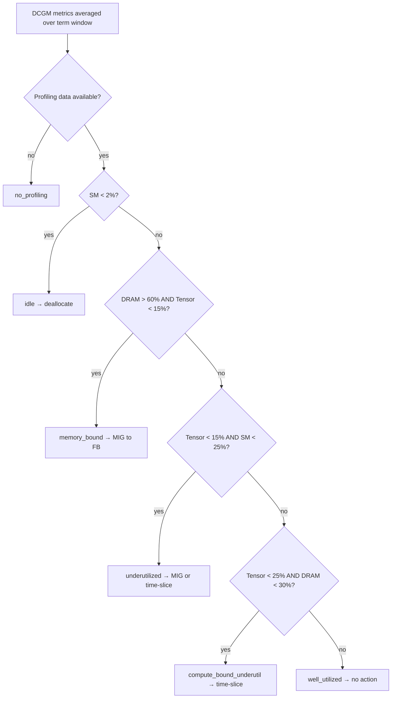

# GPU Workload Classification

!!! info "Quick Facts"
    **Scope:** Per-container GPU workloads (Pods, Jobs, OpenShift AI)  
    **Data source:** NVIDIA DCGM profiling metrics (SM, tensor, DRAM, framebuffer)  
    **Output:** `gpu_classification` on container detail and MIG list responses  
    **Configurable:** Thresholds via Settings API (`recommendation_type=gpu`)

## What this means for your workloads

Cost Management does not apply a single "10% utilization" rule to every GPU.
Instead, it reads three DCGM signals — **compute (SM)**, **tensor-core
activity**, and **memory bandwidth (DRAM)** — and classifies each workload into
one of six categories. Each category maps to a **specific action** you should
take.

| Classification | What it looks like | What you should do |
|----------------|-------------------|-------------------|
| **Idle** | GPU allocated but &lt;2% SM active — dev notebook left running overnight | **Remove the GPU** from the pod spec; reclaim the full device |
| **Memory-bound** | High DRAM (&gt;60%), low tensor — LLM inference loading large models | **MIG partition** sized to framebuffer usage; do not time-slice (no memory isolation) |
| **Underutilized** | Low SM (&lt;25%) *and* low tensor (&lt;15%) — light batch jobs | **MIG** or **time-slicing** to share the device across workloads |
| **Compute-bound underutil** | Moderate compute, low DRAM — distributed training using part of the chip | **Time-slicing** at the node level; keep full GPU per job |
| **Well utilized** | Healthy mix of metrics | **No action** — sizing matches workload |
| **No profiling** | Older GPUs (Volta/Pascal) without DCGM profiling | FB-based MIG sizing only; lower confidence |

## Why not a single threshold?

A simple rule like "SM &lt; 10% = underutilized" treats very different
workloads the same way:

| Your workload | SM | DRAM | Single 10% rule says | Multi-metric class says |
|---------------|-----|------|----------------------|-------------------------|
| LLM inference | 8% | 75% | Underutilized → generic MIG | **Memory-bound** → MIG sized to model weights |
| Dev notebook | 1% | 2% | Idle (accidentally right) | **Idle** → deallocate |
| Distributed training | 35% | 15% | Well utilized (misses waste) | **Compute-bound underutil** → time-slicing |
| Batch inference | 18% | 25% | Underutilized (same as idle-ish jobs) | **Underutilized** → MIG or time-slice |

The multi-metric tree separates **idle** (2% SM) from **underutilized** (25% SM)
and catches **memory-bound** workloads that look "fine" on compute alone.

## How classification works

Thresholds are configurable per organization. Defaults match the tree above.

Technical reference (threshold env vars, confidence scoring, source files):
[GPU Classification — Architecture](../architecture/gpu-classification.md).

## Where you see classifications

| Surface | Field | Notes |
|---------|-------|-------|
| Container detail | `gpu.{term}.gpu_classification` | Includes savings and MIG profile when applicable |
| MIG list | `gpu_classification` | Only MIG-eligible rows (`GET .../gpu/mig`) |
| Notifications | Codes 10, 26–28, 36 | Filter with `filter[plugin]=gpu` |

## Related features

- [GPU MIG Recommendations](gpu-mig.md) — profile selection after classification
- [GPU Time-Slicing](gpu-time-slicing.md) — node-level software sharing
- [Idle / Zombie Detection](idle-detection.md#gpu-idle) — separate idle-state tracking (`gpu_idle_state`)
- [gpu plugin reference](../plugin-reference/gpu.md) — API endpoints and settings
