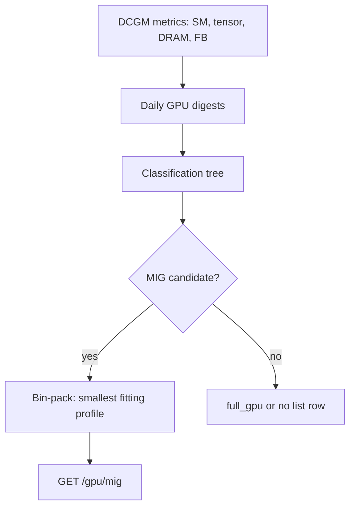

# GPU MIG Recommendations

!!! info "Quick Facts"
    **API:** `GET /api/cost-management/v1/recommendations/openshift/gpu/mig`  
    **Scope:** Per-container (workload on a MIG-capable GPU)  
    **Engines:** Recommendation **terms** only (`short`, `medium`, `long`) — **not** cost/performance dual engine  
    **Savings:** On container detail (`GET .../recommendations/openshift/{uuid}`), **not** on this list  
    **Configurable:** Yes (GPU thresholds + term windows via Settings API)

## Overview

GPU MIG (Multi-Instance GPU) recommendations analyze NVIDIA DCGM profiling
metrics and suggest the smallest **MIG profile** that fits each GPU workload.
MIG provides **hardware isolation** — each slice gets dedicated memory and compute
partitions on the GPU.

This complements [GPU Time-Slicing](gpu-time-slicing.md), which uses software
multiplexing without memory isolation and applies at the **node** level.

For **spend** by MIG profile (cost accounting), use Koku
`GET /api/cost-management/v1/reports/openshift/gpu/mig_profiles/`. ROS MIG
recommendations are a separate Optimizations surface.

## Recommendation terms vs dual engine

GPU MIG (and all GPU plugin routes) use **recommendation terms** — `short`,
`medium`, and `long` — with independent lookback windows configured via the
Settings API (`recommendation_type=gpu`).

They do **not** use the cost/performance **dual engine** (`filter[engine]=cost|performance`).
That split applies to container, namespace, node, and VM sizing recommendations
where FinOps users trade cost-optimized vs headroom-optimized CPU/memory requests.

GPU workloads are classified from utilization telemetry (SM, tensor, DRAM,
framebuffer) and mapped to MIG profiles; there is no parallel “cost engine” vs
“performance engine” profile pair for the same container.

See [Recommendation Engines — GPU](../architecture/recommendation-engines.md#gpu-recommendations).

## How it works



1. **Profiling data** — Streaming multiprocessor (SM), tensor core, DRAM, and
   framebuffer (FB) usage are aggregated per container × GPU model × day.
2. **Classification** — Workloads are labeled using ordered threshold checks
   (see [Classification types](#classification-types)).
3. **Profile selection (bin-packing)** — For MIG-eligible workloads, P98
   framebuffer usage × headroom factor (default 1.20) is mapped to the
   **smallest** standard profile on the GPU model that still fits. Profiles are
   defined per model in [`gpu_catalog.yaml`](../../internal/engine/gpu_catalog.yaml).
4. **List filter** — Only rows where `recommended_gpu_profile` is set and is
   **not** `full_gpu` appear on `GET .../gpu/mig`.
5. **Confidence** — Tiered by days of data (3 / 7 / 14 days) with penalties for
   bursty usage and missing profiling.

User guide (why multi-metric beats a single threshold, workload examples):
[GPU Classification](gpu-classification.md). Technical reference:
[GPU Classification — Architecture](../architecture/gpu-classification.md).

## MIG slice profiles

Profile names follow NVIDIA conventions (examples on A100 40GB; exact set is
**model-specific**):

| Profile | Typical use |
|---------|-------------|
| `1g.5gb` | Smallest slice — light inference |
| `2g.10gb` | Small models |
| `3g.20gb` | Medium inference |
| `4g.20gb` / `4g.40gb` | Larger footprints (model-dependent) |
| `7g.40gb` / `7g.80gb` | Large slice before full GPU |
| `full_gpu` | Entire device — **excluded** from the MIG list endpoint |

The engine selects the smallest profile whose memory capacity covers
`P98(FB) × fb_headroom_factor`. If no slice fits, the recommendation is
`full_gpu` (not returned on `/gpu/mig`).

Hopper and other families expose different profile names in the catalog; always
use `recommended_gpu_profile` and `current_gpu_profile` from the API rather
than hard-coding a single GPU generation.

## Classification types

Evaluated in priority order:

| Classification | Typical pattern |
|----------------|-----------------|
| `no_profiling` | DCGM profiling metrics unavailable |
| `idle` | Avg SM below idle threshold (default 2%) |
| `memory_bound` | High DRAM (> 60%), low tensor (< 15%) — often `full_gpu` |
| `underutilized` | Low tensor (< 15%) and low SM (< 25%) — common MIG candidate |
| `compute_bound_underutil` | Low tensor (< 25%), low DRAM (< 30%) |
| `well_utilized` | Everything else — keep full GPU |

## GPU idle and underutilized detection

Each list row includes `gpu_idle_state`: `active`, `idle`, or `zombie` (aligned
with container idle detection). Filter with:

```http
GET .../gpu/mig?filter[gpu_idle_state]=idle,zombie
```

Idle GPUs may receive MIG downsizing or removal guidance on **container detail**;
the MIG list still shows profile recommendations when `HasMIGRecommendation()`
is true for that term.

## MIG vs full GPU vs time-slicing

| Approach | Isolation | When recommended |
|----------|-----------|------------------|
| **MIG** | Hardware (memory + compute partitions) | Underutilized GPU with predictable FB footprint on MIG-capable hardware |
| **Full GPU** | Dedicated device | Well-utilized or memory-bound workloads |
| **Time-slicing** | Software only (shared FB) | Node-level; non-MIG GPUs; majority of containers underutilized |

MIG and time-slicing are **mutually exclusive** per container: MIG-recommended
workloads are excluded from time-slicing candidate lists.

## API

```http
GET /api/cost-management/v1/recommendations/openshift/gpu/mig
```

### Filters

| Filter | Alias | Description |
|--------|-------|-------------|
| `filter[cluster]` | `cluster`, `cluster_uuid` | Cluster UUID; empty list if unknown or not RBAC-visible |
| `filter[project]` | `namespace`, `filter[namespace]` | Namespace; comma-separated values are OR'd |
| `filter[gpu_idle_state]` | — | `active`, `idle`, `zombie` (comma-separated OR) |
| `filter[tag:<key>]` | `tag=key:value` | Tag filter when `ROS_TAGS_ENABLED=true` |

Bracket and flat query syntax are both supported — see
[Query Parameters](../plugin-reference/query-parameters.md).

### Sort (`order_by` / `order_how`)

Applied in memory after the cluster query. Allowed `order_by` values:

| `order_by` | JSON field |
|------------|------------|
| `cluster_uuid` (default) | `cluster_uuid` |
| `namespace` | `namespace` |
| `workload` | `workload` |
| `container` | `container` |
| `term` | `term` |
| `gpu_model` | `gpu_model` |
| `confidence` | `confidence` |

`order_how`: `asc` or `desc` (default `desc` when using flat `order_by`).

!!! note "Savings not sortable on this list"
    `estimated_monthly_gpu_savings_usd` is **not** a valid `order_by` for `/gpu/mig`.
    Dollar savings are attached per term on **container detail**
    (`GET .../recommendations/openshift/{recommendation_uuid}` → `gpu.{term}.estimated_monthly_gpu_savings`).
    The MIG list is one row per container × term with profile and classification only.

### Pagination and export

| Parameter | Description |
|-----------|-------------|
| `limit` / `offset` | Offset pagination (default limit 100, max 1000) |
| `format=csv` | CSV export; same columns as JSON (see OpenAPI). `Accept: text/csv` also works |

Implementation loads recommendations per cluster, then filters, sorts, and
paginates in memory. See [Known limitations](#known-limitations).

Summary counts and links: `GET .../recommendations/openshift/gpu`.

### Example (abbreviated)

```json
{
  "meta": { "count": 2, "limit": 100, "offset": 0 },
  "data": [{
    "cluster_uuid": "550e8400-e29b-41d4-a716-446655440000",
    "namespace": "ml-team",
    "workload": "inference",
    "container": "model",
    "term": "medium",
    "gpu_model": "NVIDIA A100-SXM4-40GB",
    "node_name": "gpu-worker-1",
    "recommended_gpu_profile": "2g.10gb",
    "current_gpu_profile": "",
    "gpu_classification": "underutilized",
    "confidence": 0.75,
    "gpu_idle_state": "active"
  }]
}
```

For savings, query the container recommendation UUID and read `gpu.medium.estimated_monthly_gpu_savings`.

## Settings

### Thresholds

`GET/PUT/DELETE .../settings/thresholds?recommendation_type=gpu`

| Parameter | Default | Purpose |
|-----------|---------|---------|
| `idle_threshold` | 0.02 | Avg SM below → idle |
| `underutilized_sm_threshold` | 0.25 | SM ceiling for underutilized |
| `underutilized_tensor_threshold` | 0.15 | Tensor ceiling for underutilized |
| `membound_dram_threshold` | 0.60 | DRAM floor for memory-bound |
| `membound_tensor_threshold` | 0.15 | Tensor ceiling for memory-bound |
| `compute_bound_dram_threshold` | 0.30 | DRAM ceiling for compute-bound underutil |
| `fb_headroom_factor` | 1.20 | MIG sizing: P98 FB × factor |
| `mig_fb_percentile` | 0.98 | Percentile for FB selection |

!!! warning "Expert configuration"
    GPU thresholds interact with NVIDIA hardware semantics. Change only with GPU
    workload expertise. See [Configurability — GPU](../architecture/configurability.md#gpu).

### Terms

`GET/PUT/DELETE .../settings/terms?recommendation_type=gpu` — window length and
min data days per `short` / `medium` / `long` term (same pattern as other plugins).

## Notifications

Container-level GPU notifications (codes **10**, **26–28**) may fire when MIG
right-sizing or idle removal applies. Node-level time-slicing uses code **36**.
See [Notification Codes](../architecture/notification-codes.md).

## RBAC

Cluster list is restricted by `openshift.cluster` permissions. Rows are further
filtered by `openshift.node` when node-scoped RBAC is configured. Callers with no
ROS permissions receive **403** from middleware; a `filter[cluster]` for a
cluster outside RBAC returns an **empty** list (200).

## Known limitations

| Topic | Status |
|-------|--------|
| SQL-backed pagination | Deferred until fleets exceed ~1k MIG rows; in-memory path is &lt;50ms today |
| Multi-GPU per container consolidation | Not performed — per-container MIG sizing only |
| Savings on list endpoint | Intentionally omitted — use container detail |
| `filter[engine]` | Not supported (by design) |
| ROS Optimizations UI | Backend ready; koku-ui pages not shipped |

Details: [Known issues — GPU MIG](../known-issues.md#gpu-mig--known-limitations-gap-5).

## Test data generation

Generate OCP payloads with GPU ROS metrics using
[nise](https://github.com/project-koku/nise):

```bash
nise report ocp \
  --static-report-file /path/to/ocp_static_data.yml \
  --ocp-cluster-id <cluster_uuid> \
  --ros-ocp-info \
  --write-monthly
```

Use a static YAML that defines GPU-enabled workloads (A100/H100 nodes, containers
with low SM/DRAM utilization for MIG candidates). The `--ros-ocp-info` flag emits
container-level ROS CSVs (`ocp_ros_usage.csv`, `ocp_ros_namespace_usage.csv`)
required by the ros-ocp-backend processor.

GPU usage CSVs from cost ingestion (`ocp_gpu_usage.csv`) should include:

| Column | Role |
|--------|------|
| `gpu_model` | NVIDIA model name (must match the engine GPU catalog) |
| `gpu_uuid` | Device identity |
| `instance_name` | MIG instance / profile when partitioned |
| `utilization` | Utilization signal (with DCGM-derived SM/DRAM/FB in ROS GPU digests) |

Package typed monthly files into a tarball with `manifest.json` (`start`/`end`
dates, `files`, `resource_optimization_files`) and upload via ingress. See
[Validating the native engine](../testing/validating-native-engine.md) for
on-prem E2E flow.

## Plugin enablement

GPU MIG routes are provided by the **`gpu`** recommendation plugin. Control
which plugins run with:

| Variable | Behavior |
|----------|----------|
| `ROS_ENABLED_PLUGINS` | When non-empty, allowlist only (e.g. `container,gpu,node`). Omit `gpu` to disable GPU routes. |
| `ROS_DISABLED_PLUGINS` | When the allowlist is empty, subtract plugins from the default native set (e.g. `gpu`). |

When the `gpu` plugin is disabled, `GET .../recommendations/openshift/gpu/mig`
and related `/gpu/*` paths return **404** (`plugin 'gpu' is not enabled`), not an
empty list. GPU threshold settings (`GET .../settings/gpu`) follow the same
gating. See [Configuration](../configuration.md) and
[Plugin architecture](../architecture/plugin-architecture.md).

## Related

- [GPU Catalogs](../architecture/gpu-catalogs.md) — NVIDIA data sources and catalog validation
- [GPU Time-Slicing](gpu-time-slicing.md) — Software sharing alternative
- [Savings Estimations](savings-estimations.md) — GPU savings on detail vs fleet summary
- [Recommendation Engines — GPU](../architecture/recommendation-engines.md#gpu-recommendations)
- [Tag Filtering](../features/tag-filtering.md)
