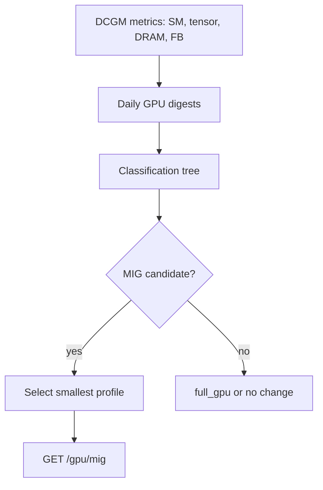

# GPU MIG Recommendations

!!! info "Quick Facts"
    **API:** `GET /api/cost-management/v1/recommendations/openshift/gpu/mig`  
    **Configurable:** Yes  
    **Engines:** single (no cost/performance split)  
    **Savings:** Computed at API read time (not in fleet summary)

## Overview

GPU MIG (Multi-Instance GPU) recommendations analyze NVIDIA DCGM profiling
metrics and suggest the smallest **MIG profile** that fits each GPU workload.
MIG provides **hardware isolation** — each slice gets dedicated memory and compute
partitions on the GPU.

This complements [GPU Time-Slicing](gpu-time-slicing.md), which uses software
multiplexing without memory isolation and applies at the **node** level.

## How it works



1. **Profiling data** — Streaming multiprocessor (SM), tensor core, DRAM, and
   framebuffer (FB) usage are aggregated per container × GPU model × day.
2. **Classification** — Workloads are labeled using ordered threshold checks
   (see table below).
3. **Profile selection** — For MIG-eligible workloads, P98 framebuffer usage ×
   headroom factor (default 1.20) is mapped to the smallest standard profile:
   `1g.5gb`, `2g.10gb`, `3g.20gb`, `4g.20gb`, `7g.40gb`, or `full_gpu`.
4. **Confidence** — Tiered by days of data (3 / 7 / 14 days) with penalties for
   bursty usage and missing profiling.

Decision tree: [GPU Classification](../architecture/gpu-classification.md).

## Classification types

Evaluated in priority order:

| Classification | Typical pattern |
|----------------|-----------------|
| `no_profiling` | DCGM profiling metrics unavailable |
| `idle` | Avg SM < 2% |
| `memory_bound` | High DRAM (> 60%), low tensor (< 15%) |
| `underutilized` | Low tensor (< 15%) and low SM (< 25%) |
| `compute_bound_underutil` | Low tensor (< 25%), low DRAM (< 30%) |
| `well_utilized` | Everything else — keep full GPU |

## MIG vs full GPU vs time-slicing

| Approach | Isolation | When recommended |
|----------|-----------|------------------|
| **MIG** | Hardware (memory + compute partitions) | Underutilized GPU with predictable FB footprint |
| **Full GPU** | Dedicated device | Well-utilized or memory-bound workloads |
| **Time-slicing** | Software only (shared FB) | Node-level; non-MIG GPUs; majority of containers underutilized |

MIG and time-slicing are **mutually exclusive** per container: MIG-recommended
workloads are excluded from time-slicing candidate lists.

## API

```http
GET /api/cost-management/v1/recommendations/openshift/gpu/mig
```

Filters: `cluster`, `project`, `gpu_model`, `gpu_classification`, `term`,
pagination, and sort keys.

### Example (abbreviated)

```json
{
  "data": [{
    "container": "trainer",
    "project": "ml",
    "gpu_model": "NVIDIA-A100-SXM4-40GB",
    "gpu_classification": "underutilized",
    "recommended_gpu_profile": "2g.10gb",
    "gpu_confidence": 0.8,
    "estimated_monthly_gpu_savings_usd": 1200.00,
    "currency": "USD"
  }]
}
```

Summary counts and links: `GET .../recommendations/openshift/gpu`.

## Configurable thresholds

`GET/PUT/DELETE .../settings/thresholds?recommendation_type=gpu`

| Parameter | Default | Purpose |
|-----------|---------|---------|
| `idle_threshold` | 0.02 | Avg SM below → idle |
| `underutilized_sm_threshold` | 0.25 | SM ceiling for underutilized |
| `underutilized_tensor_threshold` | 0.15 | Tensor ceiling for underutilized |
| `membound_dram_threshold` | 0.60 | DRAM floor for memory-bound |
| `membound_tensor_threshold` | 0.15 | Tensor ceiling for memory-bound |
| `compute_bound_dram_threshold` | 0.30 | DRAM ceiling for compute-bound underutil |
| `fb_headroom_factor` | 1.20 | MIG sizing: P98 FB × factor |
| `mig_fb_percentile` | 0.98 | Percentile for FB selection |

!!! warning "Expert configuration"
    GPU thresholds interact with NVIDIA hardware semantics. Change only with GPU
    workload expertise. See [Configurability — GPU](../architecture/configurability.md#gpu).

## Related

- [GPU Catalogs](../architecture/gpu-catalogs.md) — NVIDIA data sources and catalog validation
- [GPU Time-Slicing](gpu-time-slicing.md) — Software sharing alternative
- [Savings Estimations](savings-estimations.md) — GPU savings limitations in fleet summary
- [Recommendation Engines — GPU](../architecture/recommendation-engines.md#gpu-recommendations)
