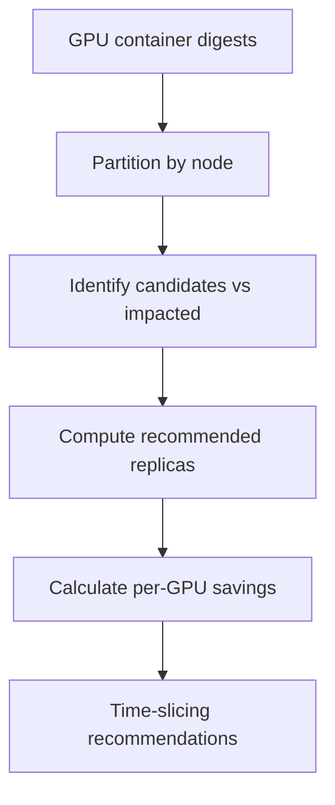

# GPU Time-Slicing Recommendations

!!! info "Quick Facts"
    **API:** `GET /api/cost-management/v1/recommendations/openshift/gpu/timeslicing`  
    **Scope:** Per-node  
    **Engines:** single (no cost/performance split)  
    **Savings:** Yes — per-GPU and total node savings  
    **Configurable:** Yes (thresholds via Settings API)

## Overview

GPU time-slicing recommends sharing underutilized GPUs across multiple workloads
via NVIDIA's time-slicing feature. Instead of each container getting exclusive
GPU access, time-slicing allows N containers to share a single GPU — reducing GPU
provisioning costs.

This complements [GPU MIG](gpu-mig.md), which uses hardware isolation at the
**container** level. Time-slicing applies at the **node** level and is the natural
action boundary for device-plugin configuration.

## Prerequisites

GPU time-slicing recommendations require telemetry, operator configuration, and
(optionally) cost-model rates. Without these, the API may return empty lists,
`no_profiling` classifications, or `$0.00` savings while cost-side GPU metrics
still appear.

### 1. DCGM exporter on GPU nodes

Deploy the **NVIDIA DCGM exporter** on every GPU worker (typically via the
[NVIDIA GPU Operator](https://docs.nvidia.com/datacenter/cloud-native/gpu-operator/latest/)
or a manual DaemonSet). The cost-management metrics operator queries Prometheus
for profiling metrics used to classify workloads and compute replica counts.

| Metric | Purpose |
|--------|---------|
| `DCGM_FI_PROF_SM_ACTIVE` | Streaming-multiprocessor utilization (primary “compute busy” signal) |
| `DCGM_FI_PROF_DRAM_ACTIVE` | Memory bandwidth utilization (memory-bound detection) |
| `DCGM_FI_PROF_PIPE_TENSOR_ACTIVE` | Tensor-core activity |
| Framebuffer usage (`DCGM_FI_DEV_FB_USED` / capacity) | Memory footprint for replica math |

**Hardware:** DCGM profiling requires compute capability **7.0+** (Volta,
Turing, Ampere, Hopper). Older GPUs may fall back to Tier-2 behavior with
limited classification.

**Without DCGM profiling:** the operator can fall back to basic
`nvidia_gpu_duty_cycle`, which measures “time any kernel was running” rather
than actual SM/tensor/DRAM utilization. That signal is **insufficient** for
time-slicing analysis — the engine cannot reliably distinguish
compute-bound from memory-bound workloads or safe sharing factors.

Use DCGM Exporter **v3.1+** (avoid known regressions in v4.0.x–4.1.x; GPU
Operator bundles v4.2+ are recommended). See
[GPU Classification](../architecture/gpu-classification.md) for threshold
semantics.

### 2. Namespace label opt-in (ROS profiling)

Label GPU namespaces so the operator collects **ROS container metrics** at
~15-minute granularity (required for `gpu_container_digests`):

```yaml
metadata:
  labels:
    cost_management_optimizations: "true"
```

The operator also accepts the legacy label
`insights_cost_management_optimizations: "true"` on some deployments.

| Collection path | Namespace label required? | Used for time-slicing? |
|-----------------|---------------------------|-------------------------|
| Cost / pod usage CSV | No — all namespaces | No (billing only) |
| ROS GPU profiling CSV | **Yes** | **Yes** |

**Unlabeled GPU namespaces:** cost metrics may show GPU spend, but ROS will not
have profiling digests → no classifications, no time-slicing rows, and
containers may show `no_profiling`.

### 3. GPU cost model rates (optional — dollar savings)

`estimated_monthly_timeslicing_savings` on container `gpu.{term}` and
`total_node_savings_usd` on the list endpoint are computed as:

```
(current GPU hours − projected shared GPU hours) × GPU hourly rate
```

Configure **`gpu_core_usage_per_hour`** (and related GPU rates) in the Koku
cost model assigned to the cluster. Without a positive GPU rate, recommendations
still return utilization, `recommended_replicas`, and notification **36**, but
savings fields are omitted or zero.

See [Cost Integration](../architecture/cost-integration.md) and
[Savings Estimations](savings-estimations.md).

### 4. GPU plugin enabled (ros-ocp-backend)

Time-slicing routes are served by the **`gpu` plugin**. Disable it only in
restricted deployments:

| Variable | Effect |
|----------|--------|
| `ROS_ENABLED_PLUGINS` without `gpu` | `/recommendations/openshift/gpu/*` returns **404** |
| `ROS_DISABLED_PLUGINS=gpu` | Same when allowlist is empty |

Default: all native plugins enabled (including `gpu`). This is **not** a
cluster-side setting — it applies to the ROS API deployment only.

## When it applies

- **Non-MIG GPUs:** T4, L4, L40, L40S, A10
- **MIG-capable GPUs** (A100, H100) only get time-slicing if MIG was **not**
  recommended for that container
- Time-slicing and MIG are **mutually exclusive** per GPU container

## How it works



1. **Partition** — Group GPU containers by node and GPU model within the term
   window.
2. **Classify** — Containers that are `underutilized` or `compute_bound_underutil`
   (and don't have MIG recommendations) are candidates for time-slicing.
   `well_utilized` containers and MIG-recommended workloads are **impacted**.
3. **Majority check** — At least 50% of eligible GPU containers on the node must
   be candidates (unless all eligible containers are underutilized).
4. **Compute replicas** — Based on peak utilization (SM, DRAM, frame buffer):
   `replicas = floor(1 / peak_utilization)`, clamped to 2–8.
5. **Savings** — `savings_per_gpu = monthly_rate × (1 - 1/replicas)`; total node
   savings sum across candidate containers only.
6. **Confidence** — Base confidence from GPU classification, penalized by 30% for
   time-slicing risk, further penalized by the proportion of impacted containers.

Classification details: [GPU Classification](../architecture/gpu-classification.md).

## Skip conditions

| Condition | Reason |
|-----------|--------|
| Zero candidates on the node | Nothing to recommend |
| All containers are `idle` | Handled by the "remove GPU" path instead |
| MIG-capable GPU and all containers got MIG recommendations | MIG takes precedence |
| Below majority threshold with impacted containers present | Mixed node — time-slicing would hurt well-utilized workloads |
| Node telemetry stale (> 7 days) | No recent GPU digest data |
| Computed replicas below minimum (2) | Peak utilization too high for safe sharing |

## API

```http
GET /api/cost-management/v1/recommendations/openshift/gpu/timeslicing
```

### Filters

| Filter | Alias | Description |
|--------|-------|-------------|
| `filter[cluster]` | `cluster`, `cluster_uuid` | Cluster UUID; empty list if unknown or not RBAC-visible |
| `node_name` | — | Node name (case-insensitive exact match) |
| `gpu_model` | `filter[gpu_model]` | GPU model (case-insensitive substring) |
| `filter[tag:<key>]` | `tag=key:value` | Tag filter when `ROS_TAGS_ENABLED=true` |
| `filter[term]` | `term` | `short_term`, `medium_term`, or `long_term` |

Bracket and flat query syntax are both supported — see
[Query Parameters](../plugin-reference/query-parameters.md).

### Sort (`order_by` / `order_how`)

| `order_by` | JSON field |
|------------|------------|
| `node_name` (default) | `node_name` |
| `cluster_uuid` | `cluster_uuid` |
| `gpu_model` | `gpu_model` |
| `recommended_replicas` | `recommended_replicas` |
| `confidence` | `confidence` |
| `total_node_savings` | `total_node_savings_usd` |

`order_how`: `asc` or `desc` (default `desc`).

### Pagination and export

| Parameter | Description |
|-----------|-------------|
| `limit` / `offset` | Offset pagination (default limit **100**, max **1000**; negative `limit` is rejected) |
| `format=csv` | CSV export; same columns as JSON (see OpenAPI). `Accept: text/csv` also works |

Summary counts and links: `GET .../recommendations/openshift/gpu`.

## RBAC

Cluster list is restricted by `openshift.cluster` permissions. Rows are further
filtered by `openshift.node` when node-scoped RBAC is configured. Callers with no
ROS permissions receive **403** from middleware; a `filter[cluster]` for a
cluster outside RBAC returns an **empty** list (200).

## Summary vs list count semantics

Two endpoints expose a “count” for time-slicing. **They measure different things**
and must not be used interchangeably in the UI.

| Endpoint | Field | Symbol | Meaning |
|----------|-------|--------|---------|
| `GET .../gpu` | `timeslicing.count` | **N** | **Data coverage** — distinct `(cluster, node, gpu_model)` groups in `gpu_container_digests` with fresh telemetry (default window, node freshness ≤ 7 days). Answers: “where do we have GPU ROS data?” |
| `GET .../gpu/timeslicing` | `meta.count` | **M** | **Actionable recommendations** — node×model groups that pass the time-slicing engine after threshold and safety checks (see below). Answers: “how many sharing recommendations can we show?” |

**Relationship:** **N ≥ M** (often **N > M**). Summary can be non-zero while the
list `data` array is empty on the first page (or entirely, if every group fails
engine gates).

### Why `timeslicing.count` (summary) is larger

`timeslicing.count` comes from [`CountNodeGPUTriples`](../../internal/engine/node_gpu_triples.go)
— a cheap SQL count over digest rows. It does **not** run
`ComputeNodeTimeslicingRec`. Every fresh node×GPU-model triple with ROS telemetry
increments **N**, including groups that are well-utilized, memory-bound, idle,
MIG-preferred, or below the majority threshold.

### Why `meta.count` (list) is smaller

Each list row is produced only when
[`ComputeNodeTimeslicingRec`](../../internal/engine/gpu_timeslicing.go) returns a
non-nil recommendation. A group is **dropped** when any of the following apply:

1. **No candidates** — no containers classified as `underutilized` or
   `compute_bound_underutil` (idle and memory-bound workloads are excluded;
   MIG-recommended containers are excluded).
2. **Majority threshold** — fewer than `timeslicing_majority_threshold` (default
   **50%**) of eligible containers on the node are candidates, when impacted
   (well-utilized) containers exist.
3. **Replica math** — peak utilization (max of avg SM, DRAM, framebuffer
   fraction) implies `recommended_replicas` &lt; `timeslicing_min_replicas`
   (default **2**); sharing would not be safe.
4. **GPU classification thresholds** — containers must be under the configured
   `underutilized_sm_threshold` / `underutilized_tensor_threshold` (defaults
   align with ~25% SM / tensor utilization — not a single “50%” knob, but the
   same Settings API `recommendation_type=gpu`).
5. **MIG precedence** — workloads with a non-`full_gpu` MIG recommendation are
   not time-slicing candidates.
6. **Stale node** — no digest activity within `node_freshness_days` (default **7**).
7. **Confidence** — derived from candidate GPU confidence, time-slicing penalty,
   and impacted-container ratio; groups with zero candidates never surface.

Configurable parameters: [Configurable thresholds](#configurable-thresholds) and
[Settings API](configurable-thresholds.md).

### Guidance for UI and automation

| Use case | Use this count |
|----------|----------------|
| Badge: “N time-slicing recommendations” | `GET .../gpu/timeslicing` → **`meta.count`** (or count notification **36** on containers) |
| Fleet notification / savings rollup | List `meta.total_savings_usd` + paginated `data` |
| Show or hide the “Time-slicing” nav section | `GET .../gpu` → **`timeslicing.count`** (coverage: “we monitor GPU groups on this fleet”) |
| Empty state when summary &gt; 0 but list is empty | Explain that telemetry exists but no group passed sharing thresholds yet |

**Do not** label `timeslicing.count` as “N recommendations” — it will **over-count**
relative to actionable list rows.

See also [Known issues — GPU summary `timeslicing.count` divergence](../known-issues.md#gpu-summary-timeslicingcount-divergence)
and [UI Integration Guide — GPU time-slicing](../ui-integration-guide.md#gpu-time-slicing-separate-endpoint).

### Example (abbreviated)

```json
{
  "meta": {
    "count": 1,
    "limit": 10,
    "offset": 0,
    "total_savings_usd": 450.00,
    "currency": "USD"
  },
  "data": [{
    "node_name": "gpu-t4-worker-1",
    "cluster_uuid": "...",
    "term": "medium",
    "recommendation_type": "gpu_time_slicing",
    "gpu_model": "Tesla-T4",
    "recommended_replicas": 4,
    "savings_per_gpu_usd": 150.00,
    "total_node_savings_usd": 450.00,
    "confidence": 0.65,
    "candidate_containers": [{
      "namespace": "ml",
      "workload": "trainer",
      "container": "worker",
      "sm_active_avg": 0.12,
      "classification": "underutilized"
    }],
    "impacted_containers": [],
    "notification_codes": [36]
  }]
}
```

## Container cross-reference

When a node gets a time-slicing recommendation, each **candidate** container's
GPU block gains:

- Notification code **36** (`gpu_time_sharing_candidate`)
- `time_slicing_node` — the node name for drill-down
- `time_slicing_replicas` — the recommended replica count
- `estimated_monthly_timeslicing_savings_usd` — per-container share of node savings

Use these fields to link from container list/detail views to the filtered
time-slicing endpoint.

## Configurable thresholds

`GET/PUT/DELETE .../settings/thresholds?recommendation_type=gpu`

GPU classification thresholds (idle, underutilized, memory-bound) determine which
containers become candidates. Time-slicing-specific parameters:

| Parameter | Default | Purpose |
|-----------|---------|---------|
| `timeslicing_majority_threshold` | 0.50 | Min fraction of eligible containers that must be candidates |
| `timeslicing_min_replicas` | 2 | Minimum recommended replica count |
| `timeslicing_max_replicas` | 8 | Maximum recommended replica count |
| `timeslicing_base_penalty` | 0.70 | Confidence multiplier for time-slicing risk |
| `timeslicing_impacted_weight` | 0.30 | Confidence penalty per impacted container ratio |

See [Configurable Thresholds](configurable-thresholds.md) for the Settings API
workflow and [Configurability — GPU](../architecture/configurability.md#gpu) for
the full parameter catalog.

!!! warning "Expert configuration"
    GPU thresholds interact with NVIDIA hardware semantics. Change only with GPU
    workload expertise.

## Difference from GPU MIG

| Aspect | Time-Slicing | MIG |
|--------|-------------|-----|
| Isolation | Software (temporal) | Hardware (memory + compute) |
| Scope | Per-node recommendation | Per-container recommendation |
| GPUs | Non-MIG (T4, L4, L40, L40S, A10) | MIG-capable (A100, H100) |
| Output | Recommended replica count | Recommended MIG profile |
| Risk | Memory contention possible | Full isolation, no contention |

MIG-recommended workloads are excluded from time-slicing candidate lists.

## Roadmap

- **Multi-GPU containers** — Currently assumes 1 container = 1 GPU. Future:
  `gpu_request_count` field from the operator to handle multi-GPU workloads.
- **Other node recommendation types** — Instance type and reserved instance
  recommendations will follow the same `node_recommendations` table pattern.

## Not VM guest vGPU time-slicing

OpenShift Virtualization VMs expose a **separate** time-slicing model on
`GET /recommendations/openshift/vms/{id}` (`gpu_timeslice_*`, vGPU profiles,
notifications **56**–**57**, settings under `PUT /settings/vm`). That path selects
vGPU slice counts for a **virtual machine**; this endpoint recommends sharing a
**physical** GPU across **containers** on a node. See
[Known issues — Node vs VM GPU time-slicing](../known-issues.md#node-vs-vm-gpu-time-slicing-do-not-conflate).

## Related

- [GPU MIG](gpu-mig.md) — Hardware partitioning alternative
- [Virtual Machines](virtual-machines.md) — VM guest GPU and `gpu_timeslice_*` fields
- [Node Consolidation & Right-Sizing](node-recommendations.md) — CPU/memory node recs (separate endpoint)
- [Savings Estimations](savings-estimations.md) — GPU savings in fleet summary
- [Recommendation Engines — GPU](../architecture/recommendation-engines.md#gpu-recommendations)
