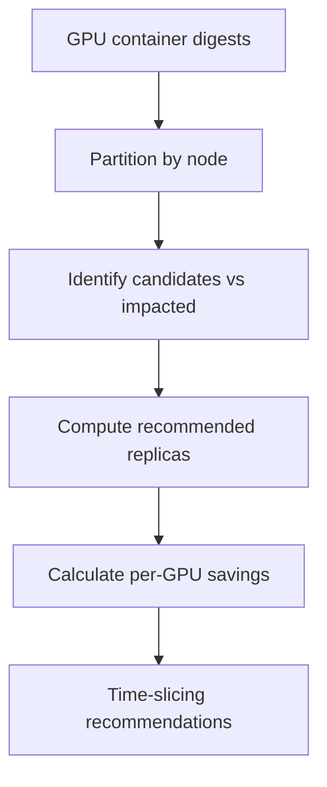

# GPU Time-Slicing Recommendations

!!! info "Quick Facts"
    **API:** `GET /api/cost-management/v1/recommendations/openshift/gpu/timeslicing`  
    **Scope:** Per-node  
    **Engines:** single (no cost/performance split)  
    **Savings:** Yes — per-GPU and total node savings  
    **Configurable:** Yes (thresholds via Settings API)

## Overview

GPU time-slicing recommends sharing underutilized GPUs across multiple workloads
via NVIDIA's time-slicing feature. Instead of each container getting exclusive
GPU access, time-slicing allows N containers to share a single GPU — reducing GPU
provisioning costs.

This complements [GPU MIG](gpu-mig.md), which uses hardware isolation at the
**container** level. Time-slicing applies at the **node** level and is the natural
action boundary for device-plugin configuration.

## When it applies

- **Non-MIG GPUs:** T4, L4, L40, L40S, A10
- **MIG-capable GPUs** (A100, H100) only get time-slicing if MIG was **not**
  recommended for that container
- Time-slicing and MIG are **mutually exclusive** per GPU container

## How it works



1. **Partition** — Group GPU containers by node and GPU model within the term
   window.
2. **Classify** — Containers that are `underutilized` or `compute_bound_underutil`
   (and don't have MIG recommendations) are candidates for time-slicing.
   `well_utilized` containers and MIG-recommended workloads are **impacted**.
3. **Majority check** — At least 50% of eligible GPU containers on the node must
   be candidates (unless all eligible containers are underutilized).
4. **Compute replicas** — Based on peak utilization (SM, DRAM, frame buffer):
   `replicas = floor(1 / peak_utilization)`, clamped to 2–8.
5. **Savings** — `savings_per_gpu = monthly_rate × (1 - 1/replicas)`; total node
   savings sum across candidate containers only.
6. **Confidence** — Base confidence from GPU classification, penalized by 30% for
   time-slicing risk, further penalized by the proportion of impacted containers.

Classification details: [GPU Classification](../architecture/gpu-classification.md).

## Skip conditions

| Condition | Reason |
|-----------|--------|
| Zero candidates on the node | Nothing to recommend |
| All containers are `idle` | Handled by the "remove GPU" path instead |
| MIG-capable GPU and all containers got MIG recommendations | MIG takes precedence |
| Below majority threshold with impacted containers present | Mixed node — time-slicing would hurt well-utilized workloads |
| Node telemetry stale (> 7 days) | No recent GPU digest data |
| Computed replicas below minimum (2) | Peak utilization too high for safe sharing |

## API

```http
GET /api/cost-management/v1/recommendations/openshift/gpu/timeslicing
```

Filters: `cluster_uuid`, `node_name`, `gpu_model`, `term`, `min_savings_usd`,
pagination (`limit`, `offset`), and sort keys (`node_name`, `gpu_model`,
`recommended_replicas`, `confidence`, `total_node_savings_usd`).

Summary counts and links: `GET .../recommendations/openshift/gpu`.

### Example (abbreviated)

```json
{
  "meta": {
    "count": 1,
    "limit": 10,
    "offset": 0,
    "total_savings_usd": 450.00,
    "currency": "USD"
  },
  "data": [{
    "node_name": "gpu-t4-worker-1",
    "cluster_uuid": "...",
    "term": "medium",
    "recommendation_type": "gpu_time_slicing",
    "gpu_model": "Tesla-T4",
    "recommended_replicas": 4,
    "savings_per_gpu_usd": 150.00,
    "total_node_savings_usd": 450.00,
    "confidence": 0.65,
    "candidate_containers": [{
      "namespace": "ml",
      "workload": "trainer",
      "container": "worker",
      "sm_active_avg": 0.12,
      "classification": "underutilized"
    }],
    "impacted_containers": [],
    "notification_codes": [36]
  }]
}
```

## Container cross-reference

When a node gets a time-slicing recommendation, each **candidate** container's
GPU block gains:

- Notification code **36** (`gpu_time_sharing_candidate`)
- `time_slicing_node` — the node name for drill-down
- `time_slicing_replicas` — the recommended replica count
- `estimated_monthly_timeslicing_savings_usd` — per-container share of node savings

Use these fields to link from container list/detail views to the filtered
time-slicing endpoint.

## Configurable thresholds

`GET/PUT/DELETE .../settings/thresholds?recommendation_type=gpu`

GPU classification thresholds (idle, underutilized, memory-bound) determine which
containers become candidates. Time-slicing-specific parameters:

| Parameter | Default | Purpose |
|-----------|---------|---------|
| `timeslicing_majority_threshold` | 0.50 | Min fraction of eligible containers that must be candidates |
| `timeslicing_min_replicas` | 2 | Minimum recommended replica count |
| `timeslicing_max_replicas` | 8 | Maximum recommended replica count |
| `timeslicing_base_penalty` | 0.70 | Confidence multiplier for time-slicing risk |
| `timeslicing_impacted_weight` | 0.30 | Confidence penalty per impacted container ratio |

See [Configurable Thresholds](configurable-thresholds.md) for the Settings API
workflow and [Configurability — GPU](../architecture/configurability.md#gpu) for
the full parameter catalog.

!!! warning "Expert configuration"
    GPU thresholds interact with NVIDIA hardware semantics. Change only with GPU
    workload expertise.

## Difference from GPU MIG

| Aspect | Time-Slicing | MIG |
|--------|-------------|-----|
| Isolation | Software (temporal) | Hardware (memory + compute) |
| Scope | Per-node recommendation | Per-container recommendation |
| GPUs | Non-MIG (T4, L4, L40, L40S, A10) | MIG-capable (A100, H100) |
| Output | Recommended replica count | Recommended MIG profile |
| Risk | Memory contention possible | Full isolation, no contention |

MIG-recommended workloads are excluded from time-slicing candidate lists.

## Roadmap

- **Multi-GPU containers** — Currently assumes 1 container = 1 GPU. Future:
  `gpu_request_count` field from the operator to handle multi-GPU workloads.
- **Other node recommendation types** — Instance type and reserved instance
  recommendations will follow the same `node_recommendations` table pattern.

## Related

- [GPU MIG](gpu-mig.md) — Hardware partitioning alternative
- [Node Consolidation & Right-Sizing](node-recommendations.md) — CPU/memory node recs (separate endpoint)
- [Savings Estimations](savings-estimations.md) — GPU savings in fleet summary
- [Recommendation Engines — GPU](../architecture/recommendation-engines.md#gpu-recommendations)
