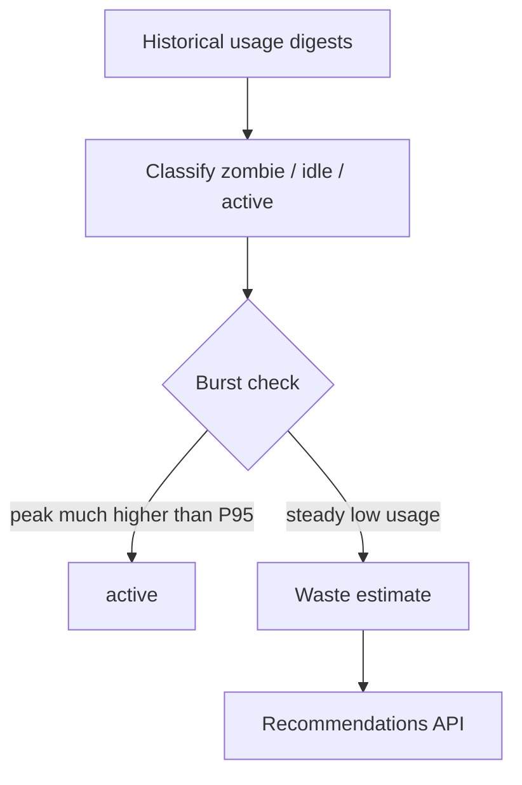

# Idle and Zombie Workload Detection

!!! info "Quick Facts"
    **API:** `GET /api/cost-management/v1/recommendations/openshift`  
    **Filter:** `?filter[idle_state]=zombie,idle`  
    **Configurable:** Yes (`ROS_IDLE_DETECTION_ENABLED` + threshold settings)  
    **Savings:** Full monthly waste (`estimated_monthly_waste`) — not a rightsizing reduction

## Overview

Idle and zombie detection finds OpenShift workloads that **reserve resources but barely
use them**. Unlike [container right-sizing](container-recommendations.md), which
recommends smaller requests, idle detection targets workloads you can **remove entirely**
— abandoned dev environments, forgotten pods, and GPUs waiting for jobs that never run.

| Classification | Meaning | Typical action |
|----------------|---------|----------------|
| **zombie** | Essentially no CPU activity (near-zero usage for days) | Terminate workload |
| **idle** | Requests exist but utilization is very low vs those requests | Terminate or scale down |
| **active** | Normal utilization profile | No idle action |

## How it works



1. **Observe** — ROS analyzes up to 14 days of container (and later GPU/PVC/node) metrics
   from the koku-metrics-operator.
2. **Classify** — Compare P95 usage to requests; detect zombies by near-zero CPU;
   skip bursty CronJob-style patterns when peak usage spikes far above P95.
3. **Estimate waste** — Report the **full monthly cost** of allocated CPU/memory (and
   GPU when enabled) as recoverable waste if the workload is removed.
4. **Expose** — List and filter recommendations; aggregate idle waste in
   [savings summary](savings-estimations.md).

### What we avoid flagging

- **CronJobs and burst jobs** — High peak vs low P95 → treated as active, not idle.
- **Sidecars** — A workload is not idle if its main application container is still active.
- **New deployments** — Containers need enough observation days (default 14) before classification.
- **System namespaces** — `kube-system`, `openshift-*`, and DaemonSets are excluded by default.
- **Opt-out** — Annotate pods with `idle-detection/exclude: "true"` to skip detection.

## Enable the feature

Set on the ROS API and processor deployments:

```yaml
env:
  ROS_IDLE_DETECTION_ENABLED: "true"
```

Optional tuning (admin environment variables; tenants can override several values via
[Configurable Thresholds](configurable-thresholds.md) after Phase 3):

| Variable | Default | Purpose |
|----------|---------|---------|
| `ROS_IDLE_MINIMUM_OBSERVATION_DAYS` | `14` | Days of data before classifying |
| `ROS_IDLE_CPU_UTILIZATION_PERCENT` | `2` | Max CPU % of request for **idle** |
| `ROS_IDLE_MEMORY_UTILIZATION_PERCENT` | `5` | Max memory % of request for **idle** |
| `ROS_IDLE_BURST_RATIO` | `10` | Peak/P95 ratio above which workload is **active** |
| `ROS_IDLE_EXCLUDE_NAMESPACES` | `kube-system,openshift-*` | Namespaces to skip |

When disabled, all workloads appear as `active` and idle-specific fields are omitted.

## API usage

### Filter idle workloads

```http
GET /api/cost-management/v1/recommendations/openshift
  ?filter[idle_state]=zombie,idle
  &filter[cluster]=my-cluster
```

### Example response fields

```json
{
  "container": "analytics-worker",
  "namespace": "data-science",
  "idle_state": "zombie",
  "idle_since": "2026-04-15",
  "idle_duration_days": 42,
  "peak_cpu_millicores": 2,
  "estimated_monthly_waste": {
    "value": "89.500000",
    "units": "USD"
  },
  "idle_recommendation": {
    "action": "terminate",
    "confidence": "high",
    "reason": "No meaningful CPU or memory activity for 42 days"
  }
}
```

### Fleet waste summary

```http
GET /api/cost-management/v1/recommendations/openshift/savings-summary
  ?group_by[idle_state]=*
```

Returns waste broken down by `zombie` vs `idle`, plus fleet totals such as
`total_idle_waste`, `idle_container_count`, and `zombie_container_count`.

Idle waste is reported **separately** from rightsizing savings so FinOps dashboards
do not mix “scale down” with “delete unused.”

## Rollout

The feature ships in phases: classification and API fields first, then waste dollars
and fleet metrics, then notifications and GPU/PVC/node support. See the internal
design doc for full details:
[`docs/features/idle-detection.md`](../../docs/features/idle-detection.md).

## Related features

- [Container right-sizing](container-recommendations.md) — reduce requests for busy workloads
- [Savings estimations](savings-estimations.md) — dollar impact and fleet summary
- [Configurable thresholds](configurable-thresholds.md) — tenant-tunable behavior
- [Node consolidation](node-recommendations.md) — underutilized nodes (complementary)
