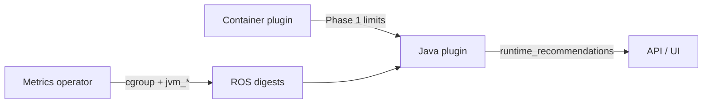

# Java & JVM Optimization

!!! warning "Status: Planned / Future Work"
    This feature is **not yet implemented**. The description below is the intended
    product direction for a future ROS-OCP release. Container, namespace, node, PVC,
    quota, and GPU recommendations remain available today.

!!! info "Quick Facts (planned)"
    **Scope:** JVM workloads on OpenShift (Spring Boot, Quarkus, plain Java)  
    **Plugin:** `java` (Enrich phase — builds on container recommendations)  
    **Analysis windows:** Same as containers (1 / 7 / 15 days) with JVM warmup exclusion  
    **Gate:** `ROS_ENABLE_JVM_RECS` (off by default until release)

---

## What it does

**Java & JVM Optimization** provides JVM-specific tuning recommendations for Java
applications running on OpenShift:

- **Heap sizing** — `MaxRAMPercentage` and effective heap limits aligned to real usage
- **Garbage collector selection** — Data-driven choice among G1, ZGC, Shenandoah, Parallel, Serial
- **Thread pool configuration** — Quarkus and Spring worker counts matched to CPU limits
- **Container memory optimization** — Limits that account for metaspace, thread stacks, and native memory — not just the heap

Recommendations appear **alongside** container right-sizing guidance, adding a
`runtime_recommendations` section on container detail — not a separate product silo.

---

## Supported frameworks

| Framework | Planned support |
|-----------|-----------------|
| Hotspot OpenJDK | Full heap, GC, container memory |
| Eclipse OpenJ9 / IBM Semeru | GC policy (`-Xgcpolicy`), heap sizing |
| Quarkus (JVM mode) | Heap, GC, thread pool, `application.properties` output |
| Quarkus (native image) | RSS-based container sizing only (no heap tuning) |
| Spring Boot | Heap, GC, Tomcat/Undertow thread pools |
| Plain Java | Heap and container memory via `jvm_*` metrics |

---

## The container memory problem

Java applications are often **OOMKilled even when the heap was not full.**

The JVM uses memory in several regions:

| Region | Examples |
|--------|----------|
| **Heap** | Application objects (what `-Xmx` / MaxRAMPercentage controls) |
| **Non-heap** | Metaspace (classes), thread stacks (~1 MiB × thread count), direct buffers, code cache, GC structures |

Generic container recommendations look at **total cgroup memory**. Without JVM metrics,
ROS cannot tell whether an OOM was caused by heap pressure or **metaspace / thread growth**.

This plugin understands JVM memory anatomy and recommends container limits that cover
**all** regions — and tells you when to raise the container limit instead of the heap.

**Example:**

> *"OOMKill detected with heap at 40% of limit. Root cause: metaspace growth. Recommend:
> increase container memory to 2.5 GiB — do not raise MaxRAMPercentage."*

---

## Recommendation types

### Heap sizing

Analyzes peak heap usage over your chosen window (after warmup exclusion) and recommends
`MaxRAMPercentage` so the JVM uses container memory efficiently without starving the guest.

**Example:**

> *"Your application uses 400 MiB of its 2 GiB heap allocation. Recommend
> MaxRAMPercentage=45% to save memory while maintaining performance."*

### Garbage collector

Uses GC pause percentiles to recommend a collector suited to your latency and heap size goals.

**Example:**

> *"High GC pause times detected (p95: 350 ms). Switching from G1GC to ZGC would reduce
> tail latency for this 8 GiB heap on JDK 21."*

### Thread pools

Aligns Quarkus or Spring worker threads with allocated CPU so thread pools are not starved
on small limits or oversized on large nodes.

**Example:**

> *"Your Quarkus app has 4 worker threads on 8 cores. Recommend core-threads=16 for better
> throughput under load."*

### Container limits

Combines heap target, non-heap peak, and a safety margin into a container memory recommendation
when cgroup usage exceeds what heap tuning alone can fix.

**Example:**

> *"Your container limit is 4 GiB but total JVM footprint peaks at 1.8 GiB. Safely reduce to
> 2.5 GiB."*

### OOM prevention

Classifies OOMKills where heap usage was low — pointing to non-heap causes and the right fix.

**Example:**

> *"OOMKill detected with low heap usage. Root cause: metaspace growth. Recommend: increase
> container limit, not heap."*

---

## Cost vs performance

ROS will apply the same **dual-engine** model used for containers:

| Profile | Behavior |
|---------|----------|
| **Cost** | Tighter heap percentiles (p95), smaller container margins (~15%), higher MaxRAMPercentage where safe, throughput-oriented GC |
| **Performance** | Higher percentiles (p99/max), larger margins (25–50%), lower MaxRAMPercentage for headroom, low-latency GC (ZGC / Shenandoah) when pauses are high |

You choose the engine per recommendation the same way as container right-sizing.

---

## How it works

1. **Detection** — Identifies JVM workloads when `jvm_info` (and related) metrics are present in scraped application data.
2. **Warmup exclusion** — Ignores the first **45 minutes** after pod start so JIT compilation does not skew heap and GC statistics.
3. **Analysis** — Computes heap, non-heap, GC pause, and thread signals over the same term windows as container recommendations (with per-type minimum-data gates).
4. **Enrichment** — Attaches JVM tuning to existing container recommendation detail; container CPU/memory recs remain the base layer.

---

## Prerequisites

| Requirement | Why |
|-------------|-----|
| **JVM metrics endpoint** | Application must expose Prometheus metrics (`/actuator/prometheus`, `/q/metrics`, or JMX exporter sidecar) |
| **User Workload Monitoring (UWM)** | Cluster must allow scraping workload metrics into the pipeline the operator uses |
| **Container recommendations** | Java plugin runs in Enrich phase — container plugin must produce base recs first |

Without JVM metrics, ROS will not emit high-confidence JVM guidance (heuristic-only mode is
**not** planned for initial release).

---

## Configuration

Same **three-tier** model as other ROS features:

1. **Environment variables** — Cluster-wide defaults (`ROS_ENABLE_JVM_RECS`, `ROS_JVM_WARMUP_MINUTES`, …)
2. **Settings API** — Per-organization overrides for thresholds and terms (`recommendation_type=java`)
3. **Compiled defaults** — Safe baselines in code

Key planned environment variables:

| Variable | Default | Purpose |
|----------|---------|---------|
| `ROS_ENABLE_JVM_RECS` | `false` | Master feature gate |
| `ROS_JVM_WARMUP_MINUTES` | `45` | Exclude post-start samples |
| `ROS_JVM_MIN_RAM_PERCENT` | `50` | Floor for MaxRAMPercentage |
| `ROS_JVM_MAX_RAM_PERCENT` | `90` | Ceiling for MaxRAMPercentage |
| `ROS_JVM_GC_PAUSE_HIGH_MS` | `200` | Pause threshold for low-latency GC bias |

See the internal design document for the full threshold table:
[`docs/design/java-recommendations.md`](../../../docs/design/java-recommendations.md).

---

## Related documentation

| Document | Scope |
|----------|-------|
| [Container Right-Sizing](container-recommendations.md) | Base CPU/memory recommendations JVM builds on |
| [Dual Engine (Cost vs Performance)](dual-engine.md) | Cost vs performance profiles |
| [Configurable Thresholds](configurable-thresholds.md) | Settings API and precedence |
| [Plugin Execution Phases](../architecture/plugin-phases.md) | Enrich-phase placement |
| Internal design | [`docs/design/java-recommendations.md`](../../../docs/design/java-recommendations.md) |
