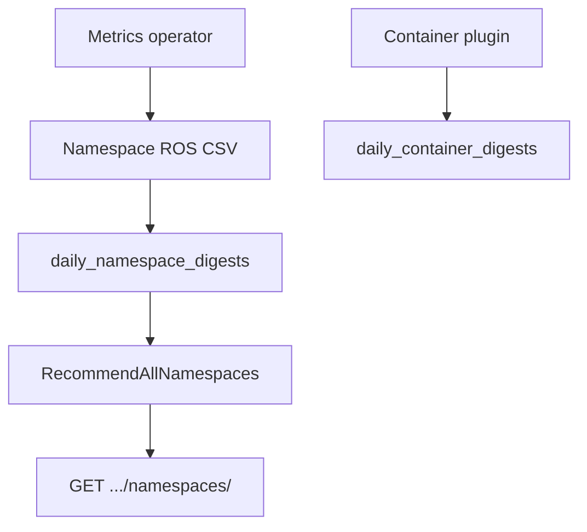

# Namespace Recommendations

!!! info "Quick Facts"
    **API:** `GET /api/cost-management/v1/recommendations/openshift/namespaces` (list),
    `GET .../namespaces/{id}` (detail),
    `GET .../namespaces/{id}/history` (per-term history)  
    **Plugin:** `namespace` (priority 90; stays enabled in Kruize mode for HTTP routes)  
    **Configurable:** Per-org Settings API + admin env vars  
    **Engines:** cost, performance (both stored; `filter[engine]` limits list/detail)  
    **Savings:** No dollar field — aggregate from container recommendations  
    **OpenShift only:** Requires namespace ROS CSV from the metrics operator

## Overview

The **namespace** plugin rolls up container usage digests per OpenShift namespace and
recommends CPU/memory **request** and **limit** targets for each term × engine. It
complements the [ResourceQuota](quota-recommendations.md) plugin, which right-sizes
existing `ResourceQuota` **hard** limits.

**Related:** [ResourceQuota recommendations](quota-recommendations.md) tune existing
`ResourceQuota` **hard** limits against container sums. Namespace recommendations
propose ideal namespace totals from observed usage — a different feature.

Internal design: [`docs/features/namespace-recommendations.md`](../features/namespace-recommendations.md) (repo `docs/` tree).

---

## How it works



1. The operator emits `ocp_ros_namespace_usage` (or `ros-openshift-namespace-*.csv`)
   for namespaces labeled for optimization (see [Enablement](#enablement)).
2. ROS ingests namespace digests; the container plugin runs first (lower priority).
3. `RecommendAllNamespaces` sizes each namespace × term × engine using percentile
   profiles, adaptive margin, limit multiplier, and optional OOM bump.
4. After container (and GPU) recommendations exist, `AggregateNamespaceIdleState` sets
   namespace `idle_state` from child workloads.
5. Snapshots are written to `historical_namespace_recommendation_sets` for the
   history API.

---

## Dual engine and terms

| Engine | CPU percentile (defaults) | Memory percentile (defaults) |
|--------|----------------------------|------------------------------|
| `cost` | P60 | P95 |
| `performance` | P98 | Max (P100) |

| Term | Window | Min data days |
|------|--------|---------------|
| `short_term` | 1 day | 1 |
| `medium_term` | 7 days | 3 |
| `long_term` | 15 days | 7 |

List and detail responses nest engines under
`recommendations.recommendation_terms.{short|medium|long}_term.{cost|performance}`.

See [Dual engine (cost vs performance)](dual-engine.md).

---

## API quick reference

| Concern | Detail |
|---------|--------|
| List filters | `filter[cluster]`, `filter[project]` (alias `filter[namespace]`), `filter[idle_state]`, `filter[stale]`, `filter[engine]`, `filter[tag:*]` |
| List sorting | `order_by`: `cluster`, `project`, `last_reported`, and 12 `*_variation_*` columns |
| History only | `filter[term]` (`short_term` / `medium_term` / `long_term`), `filter[engine]` |
| CSV | `Accept: text/csv` or `?format=csv` on the list endpoint |
| Terms | `GET/PUT/DELETE .../settings/terms?recommendation_type=namespace` |
| Business hours | Dual `all_hours` / `business_hours` sizing on detail when enabled — [Business hours](business-hours.md) |

### Endpoints

```http
GET /api/cost-management/v1/recommendations/openshift/namespaces
GET /api/cost-management/v1/recommendations/openshift/namespaces/{recommendation-id}
GET /api/cost-management/v1/recommendations/openshift/namespaces/{recommendation-id}/history
```

Legacy aliases (deprecated): `GET .../openshift/namespace/recommendations`,
`GET .../namespace/{recommendation-id}`.

### List filters and sorting

| Parameter | Description |
|-----------|-------------|
| `filter[cluster]` / `cluster` | Cluster UUID |
| `filter[project]` / `project` / `namespace` | Namespace name (exact; comma-separated OR) |
| `filter[idle_state]` | `active`, `idle`, or `zombie` (comma-separated OR) — see [Idle / zombie detection](idle-detection.md) |
| `filter[stale]` / `stale` | Staleness filter: `false` (default, exclude stale), `true` (include stale and fresh), `only` (stale rows only). Recommendations older than 48h without fresh cluster data. |
| `filter[engine]` | `cost` or `performance` (omits the other engine from each item) |
| `filter[tag:<key>]` | OpenShift label filter (`ROS_TAGS_ENABLED=true`) |
| `order_by` / `order_how` | Sort (e.g. `project`, `cluster`, `last_reported`, variation fields) |
| `limit` / `offset` | Pagination (default limit 100, max 1000) |

### History

History returns prior snapshots from `historical_namespace_recommendation_sets`.
Each DB row expands to separate **`cpu`** and **`memory`** entries.

| Parameter | Description |
|-----------|-------------|
| `filter[term]` | `short_term`, `medium_term`, `long_term` (or `short` / `medium` / `long`) |
| `filter[engine]` | `cost` or `performance` |
| `limit` | Snapshots to return (default 30, max 90) |

Each history entry includes `resource`, `term`, `recorded_at`, `recommended`,
`current`, and optional `notification_codes`.

Full parameter tables and handlers: [namespace plugin reference](../plugin-reference/namespace.md).

---

## Business hours

When `ROS_BUSINESS_HOURS_ENABLED=true` and a schedule exists (cluster, namespace,
or org), the engine persists rows per `schedule_type` (`all_hours`, `business_hours`).
Detail responses include a `business_hours` block under each engine after reship
completes. See [Business Hours](business-hours.md).

---

## Notification codes

Namespace recommendations use the native notification set (not Kruize optimization
notice codes `323004`–`324004`):

| Code | Name | Severity | Message |
|------|------|----------|---------|
| 1 | `LOW_CONFIDENCE` | WARNING | Less than 4 days of data available for this workload |
| 2 | `STALE_DATA` | WARNING | No new metrics data received for more than 48 hours |
| 7 | `NEW_WORKLOAD` | INFO | Less than 24 hours of data — recommendation may be unstable |
| 9 | `MEMORY_TRENDING_UP` | WARNING | Memory usage trend suggests capacity risk within 30 days |

Catalog: `GET .../notification-codes?filter[plugin]=namespace`. See [Notification codes — Namespaces](../architecture/notification-codes.md#namespaces).

!!! note
    Codes **70–72** belong to the [ResourceQuota](quota-recommendations.md) plugin, not namespace sizing.

---

## Configuration

**Settings API:** `GET` / `PUT` / `DELETE`
`/api/cost-management/v1/recommendations/openshift/settings/thresholds?recommendation_type=namespace`

**Term windows:** `GET` / `PUT` / `DELETE` `.../settings/terms?recommendation_type=namespace`

Key env vars: `ROS_NAMESPACE_CPU_COST_PERCENTILE`, `ROS_NAMESPACE_CPU_PERF_PERCENTILE`,
`ROS_NAMESPACE_MEM_*`, `ROS_NAMESPACE_CPU_FLOOR_MC`. See
[Configuration](../configuration.md) and [Configurable Thresholds](configurable-thresholds.md).

---

## Enablement

1. Add `namespace` to `ROS_ENABLED_PLUGINS` (default native engine includes it).
2. Label namespaces for ROS collection (operator ≥ 4.1.0):

   ```bash
   oc label namespace NAMESPACE cost_management_optimizations=true --overwrite
   ```

   Legacy label: `insights_cost_management_optimizations=true`.

Operator CSV fields: [Namespace metrics](https://github.com/project-koku/koku-metrics-operator/blob/main/docs/report-fields-description.md#2-namespace-metrics)
(29 columns including optional `*_namespace_used` quota-used sums).

---

## Operator data

The namespace ROS file includes workload aggregates plus optional ResourceQuota
**used** columns (`cpu_request_namespace_used`, `cpu_limit_namespace_used`,
`memory_request_namespace_used`, `memory_limit_namespace_used`) for observability.
Those columns feed digest ingestion; they do **not** replace the separate
[quota plugin](quota-recommendations.md) for ResourceQuota right-sizing.

---

## Related

- [Dual engine (cost vs performance)](dual-engine.md)
- [Idle / zombie detection](idle-detection.md) — namespace `idle_state` aggregation
- Internal design: [`docs/features/namespace-recommendations.md`](../features/namespace-recommendations.md)
