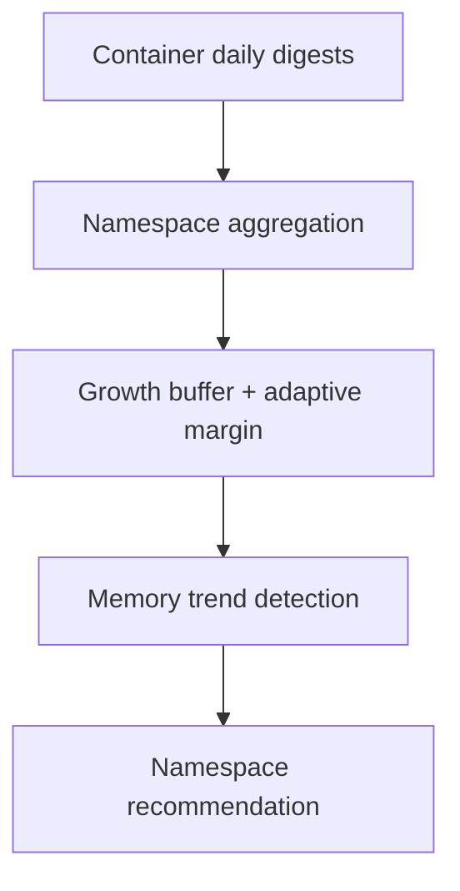

# Namespace Quota Optimization

!!! info "Quick Facts"
    **API:** `GET /api/cost-management/v1/recommendations/openshift/namespaces`,
    `GET .../namespaces/{recommendation-id}`  
    **Configurable:** Yes  
    **Engines:** cost, performance (both returned on every response)  
    **Savings:** Planned (no `estimated_monthly_savings_usd` today)

## Overview

Namespace quota optimization recommends **ResourceQuota**-level CPU and memory
settings for Kubernetes namespaces. Instead of sizing each container individually
at the quota layer, ROS aggregates container-level digests within a namespace and
produces a single recommendation per namespace × term × engine.

This helps platform teams set namespace quotas that match actual fleet usage
while leaving headroom for growth.

## How it works



1. **Aggregation** — CPU and memory usage series from all containers in the
   namespace are combined into namespace-level digest rows.
2. **Same sizing engine as containers** — Percentiles, adaptive margin, limit
   multiplier, and OOM bump logic mirror the container plugin (with namespace-specific
   defaults for trend thresholds).
3. **Growth buffer** — Recommendations include margin above observed peaks so
   new deployments within the namespace do not immediately hit quota limits.
4. **Output** — Recommended namespace CPU request, memory request, and limits
   per term and engine.

Deep implementation: [Recommendation Engines — Container & Namespace](../architecture/recommendation-engines.md#container--namespace-recommendations).

## Memory trend detection

Linear regression on namespace memory usage produces a slope (KiB/day). When the
slope exceeds `mem_trend_slope_threshold` (default **500 KiB/day** for namespace,
vs 100 for containers), a trending-up notification fires — useful for catching
runaway growth across many pods.

## Confidence tiers

Namespace uses the same term windows as container:

| Term | Default window | Min data days |
|------|----------------|---------------|
| short | 1 day | 1 |
| medium | 7 days | 3 |
| long | 15 days | 7 |

Confidence = `min(data_days / window_days, 1.0)`. Terms with insufficient data
are omitted from the response.

## Dual engine

Both **cost** and **performance** engines are always returned. The cost engine
uses tighter percentiles (CPU P60, memory P95); performance uses CPU P98 and
max memory. See [Dual Engine](dual-engine.md).

## API

```http
GET /api/cost-management/v1/recommendations/openshift/namespaces
GET /api/cost-management/v1/recommendations/openshift/namespaces/{recommendation-id}
```

Namespace rows omit `container`, `workload`, and `workload_type` fields. The
nesting pattern matches containers: `recommendations.{short|medium|long}_term.{cost|performance}`.

Legacy alias (deprecated): `GET .../namespace/{id}`.

### Example (abbreviated)

```json
{
  "project": "payments",
  "cluster_uuid": "02059694-68ab-4d58-8809-de1e91f1d0e5",
  "recommendations": {
    "medium_term": {
      "cost": {
        "config": {
          "requests": {
            "cpu": { "amount": 8, "format": "cores" },
            "memory": { "amount": 16, "format": "GiB" }
          }
        }
      },
      "performance": { }
    }
  }
}
```

## Configurable thresholds

`GET/PUT/DELETE .../settings/thresholds?recommendation_type=namespace`

| Parameter | Default | Notes |
|-----------|---------|-------|
| `cpu_cost_percentile` | 0.60 | Same semantics as container |
| `cpu_perf_percentile` | 0.98 | |
| `mem_cost_percentile` | 0.95 | |
| `mem_perf_percentile` | 1.0 | |
| `min_margin` / `max_margin` | 1.15 / 1.50 | |
| `limit_multiplier` | 1.05 | |
| `cpu_floor_mc` | 25 | |
| `idle_cpu_threshold_mc` | 10 | Idle namespace detection |
| `idle_mem_threshold_kib` | 10240 | |
| `mem_trend_slope_threshold` | **500** | KiB/day (higher than container) |
| `low_confidence_threshold` | 0.5 | |

Term windows: `GET .../settings/terms?recommendation_type=namespace`.

## Business hours

When business hours is enabled, namespace recommendations include both
**all_hours** and **business_hours** streams — same as containers. See
[Business Hours](business-hours.md).

## Related

- [Container Right-Sizing](container-recommendations.md) — Per-container source data
- [Configurable Thresholds](configurable-thresholds.md) — Settings API workflow
- [History & Quality](history-and-quality.md) — Namespace-level quality metrics (container scope today)
