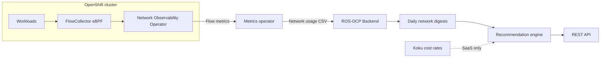

# Network Optimization Recommendations

!!! warning "Status: Planned / Future Work"
    This feature is **not yet implemented**. The description below is the intended
    product direction for a future ROS-OCP release. Container, node, PVC, quota, and
    GPU recommendations remain available today.

!!! info "Quick Facts (planned)"
    **Scope:** Workload and namespace network behavior on OpenShift  
    **Plugin:** `network` (Produce phase)  
    **Data source:** OpenShift **Network Observability Operator** (eBPF flows)  
    **Analysis windows:** 7 / 30 days (configurable)  
    **Gate:** `ROS_ENABLE_NETWORK_RECS` (off by default until release)

---

## What it does

**Network Optimization Recommendations** analyze how your workloads use the network
and tell you **what to change** — not just how to chart it.

ROS will identify:

- **Expensive internet egress** — namespaces and workloads sending large volumes off-cluster
- **DNS latency problems** — misconfiguration and resolver delays hurting tail latency
- **Unhealthy traffic paths** — elevated packet drops between important services
- **Co-location opportunities (v2)** — pairs of workloads exchanging huge cross-zone traffic
- **Egress cost attribution (SaaS)** — who drives cloud egress bills and top destinations

Recommendations appear in the same **Optimizations API and UI** as CPU and memory
rightsizing — so platform, SRE, and FinOps teams have one place to act.

---

## Why it matters

### Cloud egress is a top surprise cost

Public cloud providers charge for data leaving their network. Typical list prices (order of magnitude, varies by region):

| Provider | Internet egress (approx.) |
|----------|---------------------------|
| AWS | ~$0.09 / GiB |
| Azure | ~$0.087 / GiB |
| GCP | ~$0.12 / GiB |

A single microservice streaming **2.4 TiB/week** to external APIs can cost **thousands of dollars per month** — often **unbudgeted** because CPU/memory rightsizing looks fine.

**Example:**

> *"`payment-service` sends **2.4 TB/week** to external APIs. Consider response caching,
> payload compression, or a CDN for static assets."*

### Cross-zone traffic adds up silently

Even "internal" traffic can be expensive when pods in **different availability zones**
chat constantly:

> ~$0.01 / GiB × **millions of requests** × large payloads = material line item.

Cross-zone optimization is **planned for v2** after flow classification quality gates —
see [Co-location (v2)](#co-location-opportunity-v2) below.

### DNS misconfigurations cascade into latency

A pod with `ndots:5` and broad search domains can turn every hostname lookup into
**hundreds of milliseconds** of delay — showing up as "slow API" while CPU is idle.

**Example:**

> *"`legacy-batch` has p99 DNS resolution **220 ms** (cluster average: **5 ms**).
> Check `ndots`, CoreDNS capacity, and search domain configuration."*

### Chatty services on different nodes waste bandwidth and time

High-volume east-west traffic across zones or distant nodes increases **latency** and
**cost** (cloud) or **fabric load** (on-prem). ROS will surface the worst pairs for
architecture review and, in v2, topology-aware scheduling hints.

---

## Recommendation types

### High egress detection (Tier A — MVP)

Flags namespaces or workloads whose **internet-classified egress** exceeds tenant thresholds over 7–30 days.

**Example:**

> *"Namespace `integrations` workload `payment-service`: **2.4 TB/week** egress.
> Top protocols: HTTPS. Actions: enable response caching, compress JSON payloads,
> batch webhooks, move static assets to CDN."*

**Why it matters (FinOps):** Directly attacks unplanned cloud bills.

**Why it matters (on-prem):** Identifies dependency on external SaaS and WAN bottlenecks.

**What you'll see in the API (planned):**

```json
{
  "recommendation_type": "network_egress",
  "namespace": "integrations",
  "workload": "payment-service",
  "cluster_id": "prod-us-east",
  "metrics": {
    "egress_gib_per_week": 2457.6,
    "egress_vs_cluster_p95_ratio": 8.2
  },
  "recommended_actions": [
    "Enable HTTP caching for idempotent GET responses",
    "Review payload size — median response 1.2 MiB",
    "Consider regional egress endpoint"
  ],
  "confidence": 0.89,
  "term": "medium_term"
}
```

### DNS latency (Tier A — MVP)

Compares workload **DNS p99** to cluster baseline; fires when latency is absolutely high
and relatively an outlier.

**Example:**

> *"Workload `legacy-batch`: DNS p99 **220 ms**, cluster median **5 ms** (44×).
> Check: Pod `dnsConfig.options` ndots, CoreDNS replica count, search path length."*

**Why it matters:** DNS delays inflate **every outbound call** — connection pools,
health checks, and startup probes all pay the tax.

**Common fixes (customer-run):**

- Set `ndots:2` when FQDNs are used
- Shorten `dnsConfig.searches`
- Scale CoreDNS; verify NodeLocal DNS cache

### Network health — packet drops (Tier A — MVP)

Detects elevated **drop rates** between workload classes (for example frontend → cache).

**Example:**

> *"Elevated packet drops between `frontend` and `cache-cluster` (p95 drop rate **0.4%** vs cluster **0.02%**).
> Possible causes: MTU mismatch, CNI congestion, noisy neighbor on node."*

**Why it matters:** Drops cause **retries**, tail latency, and mysterious "network blips"
that CPU scaling cannot fix.

### Co-location opportunity (v2)

!!! note "Planned for v2"
    Cross-zone and topology recommendations require high-confidence flow
    classification. MVP focuses on egress, DNS, and drops to avoid false positives
    (including industry-known ClusterIP / egress misclassification issues).

**Example (future):**

> *"`analytics-worker` and `kafka-broker` exchange **800 GB/week** across availability zones.
> Consider topology-aware scheduling or a single-zone consumer group."*

**Why deferred:** Recommending placement changes on bad flow labels erodes trust.
v2 will require zone labels on both endpoints and sanity checks before promotion.

### Egress cost attribution (SaaS — Tier B)

When ROS runs with Koku **cloud rate** integration, high egress recommendations include **estimated monthly cost** and top destinations.

**Example:**

> *"Namespace `data-pipeline` accounts for **65%** of cluster egress cost (**~$4,200/month**).
> Top destinations: S3 (**40%**), `api.vendor.com` (**35%**)."*

**On-prem:** Dollar fields omitted; byte volumes and performance guidance remain.

```json
{
  "recommendation_type": "network_egress_cost",
  "namespace": "data-pipeline",
  "estimated_monthly_egress_cost_usd": 4200.00,
  "currency": "USD",
  "top_destinations": [
    {"name": "s3.us-east-1.amazonaws.com", "share_pct": 40},
    {"name": "api.vendor.com", "share_pct": 35}
  ],
  "recommended_actions": [
    "Enable S3 gateway endpoint if not present",
    "Compress pipeline output objects"
  ]
}
```

---

## On-prem vs cloud

| Deployment | Primary value | How savings are expressed |
|------------|---------------|---------------------------|
| **Cloud (ROSA, ARO on AWS/Azure/GCP)** | FinOps + performance | Egress $ estimates, % of cluster egress, top destinations |
| **On-prem OpenShift** | Performance engineering | Latency, DNS, drops, WAN dependency map — no egress $ |

**Both deployments benefit** from Tier A recommendations. The **metric that convinces finance** differs:

- Cloud: **dollars per namespace**
- On-prem: **latency and incident risk**, plus capacity planning for WAN links

---

## How it works



1. **Collect** — NetObserv FlowCollector captures eBPF flows (bytes, protocol, egress class, optional DNS/RTT/drops).
2. **Export** — Metrics operator includes network series in ROS upload CSVs (planned `ros-openshift-network-usage-*`).
3. **Summarize** — ROS builds **daily digests** per namespace/workload (egress totals, DNS p99, drop rates).
4. **Classify** — Compare to tenant thresholds and cluster baselines.
5. **Recommend** — Actionable text + optional $ (SaaS); same API patterns as other OpenShift optimizations.

**Lookback:** Default **7** and **30** day windows — network patterns often follow weekly release or batch cycles.

---

## Prerequisites

| Requirement | Why |
|-------------|-----|
| **Network Observability Operator installed** | Source of flow, egress class, DNS, drops |
| **FlowCollector configured** | Without collector, no flows |
| **Egress classification enabled** | Required for internet egress recommendations (FlowCollector processor settings) |
| **DNS tracking enabled** (optional) | Required for DNS latency recommendations |
| **Metrics operator ROS upload** | Brings network CSV into ROS pipeline |
| **Koku cost rates** (SaaS only) | Dollar attribution on egress |

**Without NetObserv:** Network recommendations will not appear. Container and node rightsizing are unaffected.

### FlowCollector checklist (customer)

- [ ] Operator installed in `netobserv` (or your chosen namespace)
- [ ] `FlowCollector` CR reaches Ready
- [ ] Prometheus or Loki export reachable by platform monitoring
- [ ] **Egress** feature enabled for internet-bound classification
- [ ] **DNS** metrics enabled if you want DNS latency recs
- [ ] Sufficient storage/retention for flow metrics (per NetObserv docs)

---

## Configuration

Uses the same **three-tier** model as other ROS features ([configurable thresholds](configurable-thresholds.md)):

| Setting | Default (planned) | Purpose |
|---------|-------------------|---------|
| `ROS_ENABLE_NETWORK_RECS` | `false` | Master gate |
| Egress threshold | 100 GiB/week/namespace | Minimum volume to flag high egress |
| DNS latency absolute | 100 ms p99 | Must exceed to consider outlier |
| DNS latency ratio | 3× cluster median | Relative outlier gate |
| Drop rate threshold | 0.1% p95 | Packet health notification |
| Min history days | 7 | Cold start |
| Top destinations cap | 10 | Limit cardinality in API |
| Cross-zone recommendations | `off` | v2 feature flag |

**Settings API (planned):**  
`GET/PUT/DELETE .../settings/ros/thresholds/?recommendation_type=network`

**Terms API (planned):**  
`GET/PUT/DELETE .../settings/ros/terms/?recommendation_type=network`

**SaaS integration:** Egress $ uses Koku `effective_rates` — same trust model as [savings estimations](savings-estimations.md).

---

## API (planned)

| Endpoint | Purpose |
|----------|---------|
| `GET .../recommendations/openshift/network/` | List network recommendations |
| `GET .../recommendations/openshift/network/:id` | Detail for one workload/namespace |

**Filters:** `filter[namespace]`, `filter[workload]`, `filter[cluster]`, `filter[type]` (egress, dns, health, egress_cost)

List responses follow pagination and identity conventions in the [UI Integration Guide](../ui-integration-guide.md).

---

## Relationship to other features

| Feature | Relationship |
|---------|--------------|
| [Container recommendations](container-recommendations.md) | CPU/memory — orthogonal; combine for full workload review |
| [Node recommendations](node-recommendations.md) | Node placement — v2 network topology complements |
| [Virtual machines](virtual-machines.md) | VM network metrics are separate (KubeVirt); host-level network plugin focuses on pods/services |
| [Seasonality](seasonality.md) | Recurring egress spikes (month-end reporting) may get proactive warnings in future |
| [Savings estimations](savings-estimations.md) | SaaS egress $ uses same rate infrastructure |

---

## Timeline (planned)

| Phase | Deliverable |
|-------|-------------|
| MVP (Tier A) | High egress, DNS latency, packet drops |
| Tier B | SaaS egress $ attribution and top destinations |
| v2 (Tier C) | Cross-zone co-location with strict classification QA |

See internal design: [`docs/design/network-recommendations.md`](../../docs/design/network-recommendations.md).

---

## Related documentation

| Document | Audience |
|----------|----------|
| [Internal design: network recommendations](../../docs/design/network-recommendations.md) | Engineering — tiers, risks, phases |
| [Features overview](index.md) | All ROS capabilities |
| [Configurable thresholds](configurable-thresholds.md) | Settings API |
| OpenShift docs | [Network Observability Operator](https://docs.openshift.com/container-platform/latest/networking/network_observability/installing-operators.html) |
