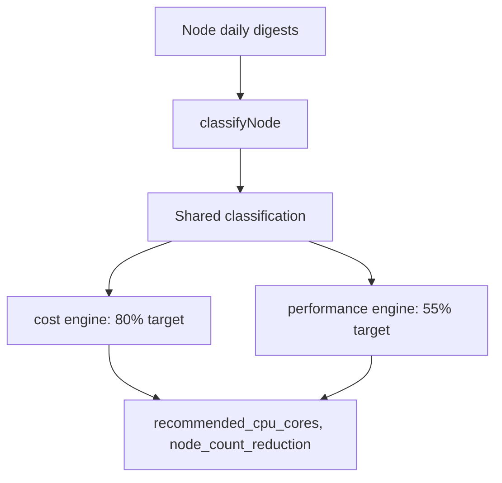

# Node Consolidation & Right-Sizing

!!! info "Quick Facts"
    **API:** `GET /api/cost-management/v1/recommendations/openshift/nodes`  
    **Configurable:** Yes  
    **Engines:** cost, performance (filter with `?engine=cost` or `?engine=performance`)  
    **Savings:** Yes — `estimated_monthly_savings` (`value` + `units`) per engine row

## Overview

Node recommendations analyze cluster-level CPU and memory utilization to identify
waste and sizing opportunities. Each node receives a **classification** (shared
across engines) plus **engine-specific sizing** and optional **consolidation**
guidance — recommending fewer nodes when workloads fit at a target utilization.

This is distinct from [GPU Time-Slicing](gpu-time-slicing.md), which covers
software GPU sharing at `GET .../gpu/timeslicing`.

## How it works



1. **Digest aggregation** — Node allocatable capacity, P95 usage, and pod
   request totals are computed per day within the term window.
2. **Classification** — Each node is labeled once (see table below).
3. **Dual-engine sizing** — Recommended capacity =
   `max(usage_p95, requests) / target_utilization`.
4. **Consolidation (Level 3)** — When underutilized, engines compute a per-node
   consolidation flag, then [`applyInstanceTypeConsolidation`](../../internal/engine/recommend_nodes.go)
   groups nodes by `instance_type` (from operator ROS CSV) when present, or by
   **capacity-based fleet keys** when it is absent: allocatable CPU and memory rounded
   to one decimal core/GiB (~10% tolerance) so similarly sized nodes consolidate
   together. Fleet math distributes `node_count_reduction` across the group (not
   only legacy per-node 0/1 binary reduction). When `machineset_name` is present on
   digests, list responses include it for UI grouping; Tier 2 MachineSet APIs remain
   planned (see roadmap).
5. **Instance type hints** — For stranded CPU/memory nodes, the engine may set
   `suggested_instance_type` and `instance_type_reason` by comparing capacity ratios
   across instance types already observed in the cluster (simplified catalog-free
   suggestion). Notification **13** also exposes `suggested_direction`
   (`memory-optimized` / `compute-optimized`).
6. **Savings** — Dollar estimates compare current vs recommended node CPU, memory,
   and monthly node cost. See [Cost Integration — Node Savings](../architecture/cost-integration.md#node-savings-cpumemory-utilization).
   When a Koku OCP cost model is updated, Koku notifies ROS to
   [recalculate persisted savings](../architecture/cost-integration.md#savings-recalculation-after-cost-model-changes)
   without waiting for the next operator upload.

## Classification types

| Type | Condition |
|------|-----------|
| **underutilized** | CPU P95 **and** memory P95 < 30% of allocatable |
| **overcommitted** | CPU requests / allocatable > 150% |
| **stranded_cpu** | EMA-smoothed CPU/memory imbalance > 0.6, CPU higher |
| **stranded_memory** | Same imbalance threshold, memory higher |
| **well_utilized** | None of the above |

Stranded-resource nodes have one dimension heavily used while the other sits idle
— a signal that instance type or workload placement may be mismatched.

## Dual engine behavior

| Aspect | Cost engine | Performance engine |
|--------|-------------|---------------------|
| Target utilization | 80% | 55% |
| Consolidation | Fleet-aware by `instance_type` when operator provides it | Same headroom guard; may assign `node_count_reduction = 0` when group cannot consolidate |
| Savings | More aggressive consolidation | Conservative; preserves headroom |

Filter list results: `?engine=cost` (default for sorting) or `?engine=performance`.

## Sizing output

| Field | Meaning |
|-------|---------|
| `recommended_cpu_cores` | Target CPU capacity for the node (or cluster slice) |
| `recommended_memory_gib` | Target memory capacity (GiB) |
| `node_count_reduction` | Suggested nodes to remove in this engine/term (0 or 1 per row; fleet sum may exceed 1) |
| `classification.idle_state` | `active`, `idle`, or `zombie` (node idle detection; migration **000111**) |
| `instance_type` | Cloud or cluster instance type from ROS metrics (e.g. `m5.xlarge`); omitted when unknown |
| `machineset_name` | MachineSet label when reported by the operator |
| `suggested_instance_type` | In-cluster alternative instance type for stranded nodes (see above) |
| `instance_type_reason` | Explanation when `suggested_instance_type` is set |
| `pod_capacity` | Max schedulable pods (from ROS CSV); omitted when unknown |
| `pod_scheduling_headroom` | `(pod_capacity − pod_count) / pod_capacity` when capacity is known |
| `estimated_monthly_savings` | Dollar delta vs current allocation (`value` + `units`) |

## Term support

Short, medium, and long terms use the same defaults as container (1d / 7d / 15d).
List API defaults to **medium** term for classification display; all terms are
nested under `recommendation_terms`.

## Cold start behavior

Node recommendations require **`min_data_days`** of collected data per term before
the engine emits results for that term. This is intentional — not a bug.

| Term | Default `min_data_days` |
|------|-------------------------|
| short | 1 |
| medium | 3 |
| long | 7 |

The multi-term design handles cold start gracefully:

- **Short-term** recommendations can appear after **1 day** of node digests.
- **Medium-term** recommendations appear after **3 days**.
- **Long-term** recommendations appear after **7 days**.

Users see progressively more confident recommendations as data accumulates. Until
a term’s threshold is met, that term is omitted or empty in API responses
(`recommendation_terms`); other terms may still return data.

Override defaults per org:

```http
PUT /api/cost-management/v1/recommendations/openshift/settings/terms?recommendation_type=node
```

Body includes `terms[].min_data_days` (must be ≤ `window_days` for each term).
See [Configurability — Node terms](../architecture/configurability.md#node).

## Consolidation model — current scope and limitations

Tier 1 consolidation is an **advisory fleet signal**, not a scheduling guarantee.

**Current scope (Tier 1):**

- Signals such as “you likely have N excess nodes in this fleet”
- Based on aggregate P95 utilization across nodes in a homogeneous group
- Groups nodes by MachineSet when known, else `instance_type`, else allocatable capacity bucket (~10% tolerance)
- Does **not** account for PodDisruptionBudgets, taints/tolerations/affinity, DaemonSet overhead, or whether pods can actually be placed on remaining nodes
- Matches industry practice for FinOps advisory tools (AWS Compute Optimizer, Kubecost, CAST AI, and similar products)

**PDB/scheduling-aware consolidation (Tier 2 estimate):** Would require PDB snapshots, pod tolerations/affinity, and a placement simulation (~O(pods × nodes) per candidate). Feasible as a follow-on with operator enhancements; not required for Tier 1 advisory mode. See [Node recommendations roadmap — consolidation limitations](../architecture/node-recommendations-roadmap.md#consolidation-model--current-scope-and-limitations).

## Fleet instance type suggestions (Tier 1)

When a node is **CPU-stranded** or **memory-stranded**, the engine can suggest a different **instance type that already exists in the same cluster** (no external catalog):

| Stranded | Suggestion logic |
|----------|------------------|
| CPU (memory-heavy workload) | Instance type in cluster with **lower** allocatable CPU:memory ratio |
| Memory (CPU-heavy workload) | Instance type in cluster with **higher** allocatable CPU:memory ratio |

Response fields: `suggested_instance_type`, `instance_type_reason`. Empty when no better in-cluster type exists (directional stranded notifications still apply).

A **full cloud catalog** (types not yet in the cluster, pricing-aware recommendations) is planned future work — see [roadmap](../architecture/node-recommendations-roadmap.md#fleet-instance-type-suggestions-tier-1-vs-cloud-catalog).

## API

### List and filters

```http
GET /api/cost-management/v1/recommendations/openshift/nodes
GET /api/cost-management/v1/recommendations/openshift/nodes?format=csv
```

| Parameter | Description |
|-----------|-------------|
| `filter[cluster]` | Cluster UUID |
| `filter[node]` | Node name (exact) |
| `filter[term]` | `short`, `medium`, `long` |
| `filter[engine]` | `cost`, `performance` |
| `filter[is_underutilized]` | `true` / `false` |
| `filter[is_overcommitted]` | `true` / `false` |
| `filter[idle_state]` | `active`, `idle`, `zombie` (comma-separated) |
| `filter[stranded_resource]` | `cpu`, `memory`, `none` |
| `filter[instance_type]` | Exact instance type |
| `filter[machineset_name]` | Exact MachineSet name |
| `order_by` | `estimated_monthly_savings` (default) or `node` |
| `limit` / `offset` | Pagination |

Legacy flat params (`?cluster_uuid=`, `?node=`, `?term=`, `?engine=`) still work.

### Single-node detail

```http
GET /api/cost-management/v1/recommendations/openshift/nodes?filter[cluster]=UUID&filter[node]=worker-0&limit=1
```

Same nested `recommendation_terms` payload as list. A path-style `GET .../nodes/{node}` is planned but not registered yet.

Deprecated list alias: `GET .../nodes/utilization`.

### Example (abbreviated)

```json
{
  "meta": { "count": 12, "currency": "USD" },
  "data": [{
    "node": "worker-3.example.com",
    "cluster_uuid": "...",
    "instance_type": "m5.2xlarge",
    "machineset_name": "worker",
    "pod_count": 42,
    "pod_capacity": 110,
    "pod_scheduling_headroom": 0.618,
    "suggested_instance_type": "m5.large",
    "instance_type_reason": "Memory-heavy workload; lower CPU:memory ratio than m5.2xlarge",
    "recommendation_type": "cpu_memory_utilization",
    "recommendation_terms": {
      "medium_term": {
        "recommendation_engines": {
          "cost": {
            "recommended_cpu_cores": 8,
            "recommended_memory_gib": 32,
            "node_count_reduction": 1,
            "estimated_monthly_savings": {
              "value": "850.000000",
              "units": "USD"
            }
          },
          "performance": {
            "recommended_cpu_cores": 12,
            "recommended_memory_gib": 48,
            "node_count_reduction": 0,
            "estimated_monthly_savings": {
              "value": "200.000000",
              "units": "USD"
            }
          }
        }
      }
    }
  }]
}
```

## Configurable thresholds

`GET/PUT/DELETE .../settings/thresholds?recommendation_type=node`

| Parameter | Default | Purpose |
|-----------|---------|---------|
| `underutil_threshold` | 0.30 | P95 util below → underutilized |
| `overcommit_threshold` | 1.50 | Request/allocatable ratio alert |
| `allocatable_factor` | 0.93 | Fallback when allocatable unknown |
| `stranded_imbalance_threshold` | 0.60 | CPU/memory imbalance detection |
| `ema_alpha` | 0.30 | EMA smoothing for trends |
| `cost_target_utilization` | 0.80 | Cost engine sizing target |
| `perf_target_utilization` | 0.55 | Performance engine sizing target |
| `perf_consolidation_headroom_multiplier` | 2.0 | Performance consolidation guard |
| `trend_min_days` | 3 | Min days for CPU trend slope |
| `zombie_cpu_p95_mc` | 200 | Zombie: CPU P95 below this (millicores) with few pods |
| `zombie_max_pods` | 5 | Zombie: max running pods |
| `idle_cpu_util_pct` | 10 | Idle: CPU util % of allocatable (0–100) |
| `idle_mem_util_pct` | 10 | Idle: memory util % of allocatable (0–100) |
| `idle_max_pods` | 10 | Idle: max running pods |
| `pod_headroom_consolidation_gate` | 0.15 | Min headroom before consolidation is suppressed |
| `pod_headroom_notification_threshold` | 0.10 | Headroom below this emits notification **74** |

Idle and zombie thresholds are tenant-configurable via the Settings API (not env-only).
Env vars: `ROS_NODE_*` — see [Configurability](../architecture/configurability.md#node).

## Roadmap / deferred

### Intentionally out of scope (Tier 1)

| Item | Rationale |
|------|-----------|
| **Business hours for nodes** | Nodes are always-on infrastructure; `idle_state` (`active` / `idle` / `zombie`) covers decommissioning without schedule complexity. Container and namespace recommendations retain business-hours support. |

### Planned future work (Tier 2 & Tier 3)

Tier 1 (this document) is **implemented**. The next tiers target the **actionable unit** in managed OpenShift: the **MachineSet**, then the **MachineAutoscaler**.

Full design, prerequisites, effort estimates, and schema notes:
**[Node recommendations roadmap — Tier 2 & Tier 3](../architecture/node-recommendations-roadmap.md)**.

#### Tier 2 — MachineSet right-sizing (~2–3 weeks)

**Goal:** Group nodes by MachineSet and recommend replica count and instance family/size at the MachineSet level.

| Deliverable | Summary |
|-------------|---------|
| Operator | Emit `machineset_name` from `machine.openshift.io/machine-set` (and replica counts for Tier 3) on ROS node CSV |
| Ingestion | Populate existing `machineset_name` on `daily_node_digests` |
| Engine | New `machineset` plugin: aggregate per-MachineSet, optimal replicas + instance type via **cloud instance catalog** |
| API | `GET /recommendations/openshift/machinesets` + `machineset_recommendations` table |
| Catalog | AWS/Azure/GCP instance specs (and optional pricing) for family/size recommendations |

**Limitation:** Only clusters using MachineSets (IPI). Bare metal, SNO, and UPI without Machine API stay on Tier 1 only (`machineset_name` NULL).

#### Tier 3 — MachineAutoscaler optimization (~4–6 weeks after Tier 2)

**Goal:** Analyze historical replica counts vs demand; recommend tighter `minReplicas`/`maxReplicas`; flag saturated, idle, or flapping autoscalers; optional scaling-policy guidance.

| Prerequisite | Why |
|--------------|-----|
| Tier 2 complete | MachineSet identity and replica metadata |
| Operator | MachineAutoscaler min/max/current + scaling history or hourly snapshots |
| Engine | Time-series analysis (not just point-in-time utilization) |

**Complexity:** More research-oriented than Tiers 1–2 (scheduling bursts, PDB/drain safety). Notification codes **14**, **16–17** are reserved — see [notification codes](../architecture/notification-codes.md).

## Related

- [Node recommendations roadmap (Tier 2 & 3)](../architecture/node-recommendations-roadmap.md) — MachineSet and MachineAutoscaler planned work
- [Dual Engine](dual-engine.md) — Cost vs performance trade-offs
- [Savings Estimations](savings-estimations.md) — Fleet-level node savings totals
- [GPU Time-Slicing](gpu-time-slicing.md) — Separate node-level GPU feature
