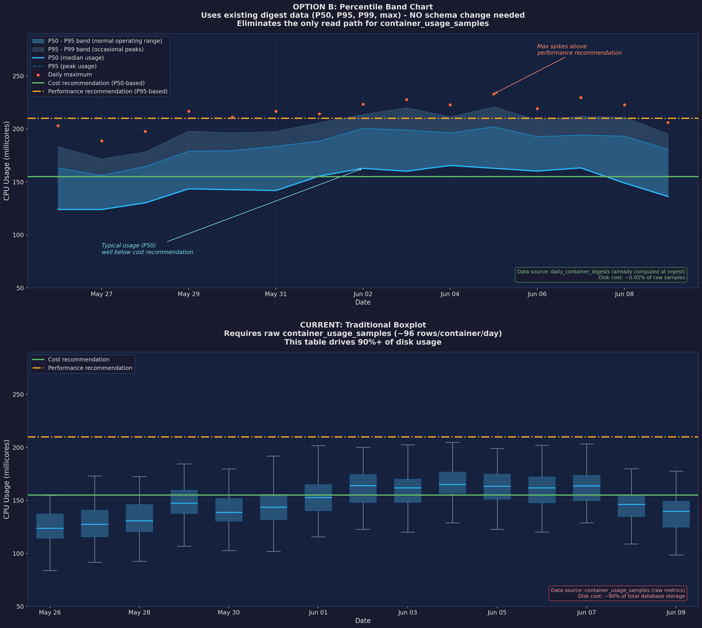

# Usage Percentile-Band Plots

Percentile-band plots replace the traditional boxplots that were previously used
to visualize container resource usage over time. They provide a richer, more
storage-efficient view of workload behavior and how recommendations compare to
historical patterns.

!!! info "Availability"
    Percentile-band plots are currently available for **container** recommendations.
    Support for additional recommendation types is planned — see
    [Future applicability](#future-applicability) below.

## Why we replaced boxplots

Traditional boxplots required retaining every raw 15-minute usage sample
(`container_usage_samples`) — roughly **96 rows per container per day**. This
table consumed **~90% of total database storage** and was the only remaining
read path for raw samples.

Percentile-band plots use **daily digest summaries** (`daily_container_digests`)
that are already computed during ingestion. Each digest row stores
`p50`, `p95`, `p99`, and `max` for a metric on a given day — one row per
container per metric per day, at **~0.05% of the raw sample disk cost**.

This change:

- **Eliminates the need for long-term raw sample retention** — samples are kept
  only for `ROS_SAMPLE_RETENTION_DAYS` (default 7) for real-time analysis, then
  pruned. Digests are retained for the full `ROS_DIGEST_RETENTION_DAYS` period
  (default 45).
- **Removes the only read path for `container_usage_samples`** — the table can
  shrink by orders of magnitude.
- **Provides richer distribution information** — four percentile bands vs three
  quartiles.

See [ADR-0292](../architecture/adrs.md) for the full decision record.

## How percentile-band plots work

Each daily digest stores four summary statistics per metric (CPU usage, memory
usage, etc.):

| Statistic | Meaning |
|-----------|---------|
| **p50** (median) | Typical usage — half of observations fall below this |
| **p95** | Normal operating ceiling — covers 95% of usage |
| **p99** | Spike threshold — only 1% of observations exceed this |
| **max** | Absolute peak observed that day |

The chart renders these as **shaded bands** over time:

| Band | Color | Interpretation |
|------|-------|----------------|
| p50–p95 | Solid fill | Normal operating range |
| p95–p99 | Lighter fill | Occasional peaks |
| p99–max | Dots / markers | Rare spikes |

Recommendation lines are overlaid on the bands:

- **Cost recommendation** (solid line) — based on p50 (median usage), optimizes
  for cost savings
- **Performance recommendation** (dashed line) — based on p95, ensures headroom
  for peak workloads

## Visual comparison

The image below compares the new percentile-band chart (top) with the legacy
boxplot (bottom) for the same CPU usage data:



**Key observations:**

- The **band chart** (top) shows continuous usage distribution with clear
  shading for typical vs peak ranges. The p50 line reveals that typical usage
  is well below the cost recommendation, while daily max spikes (orange dots)
  occasionally exceed the performance recommendation.
- The **boxplot** (bottom) shows the same data as discrete daily boxes with
  whiskers. While familiar, each box requires ~96 raw sample rows to compute,
  and the quartile boundaries provide less granularity than percentile bands.
- Both charts show the same recommendation lines, but the band chart makes the
  relationship between usage patterns and recommendations more intuitive.

## API response

Percentile-band plot data is returned on the **detail endpoint only** (not on
list responses, per [ADR-0293](../architecture/adrs.md)):

```http
GET /api/cost-management/v1/recommendations/openshift/{recommendation-id}
```

The `plots_data` field contains per-term arrays of daily digest values:

```json
{
  "plots_data": {
    "short_term": {
      "plots_data": [
        {
          "date": "2026-06-01",
          "cpu_usage": { "p50": 0.12, "p95": 0.18, "p99": 0.22, "max": 0.25 },
          "memory_usage": { "p50": 134217728, "p95": 201326592, "p99": 234881024, "max": 268435456 }
        }
      ]
    },
    "medium_term": { "plots_data": [...] },
    "long_term": { "plots_data": [...] }
  }
}
```

Each entry provides the four percentile values for that day's digest. The UI
renders these as the shaded bands described above.

## Data retention model

| Data | Retention | Purpose |
|------|-----------|---------|
| Raw samples (`container_usage_samples`) | `ROS_SAMPLE_RETENTION_DAYS` (default **7**) | Real-time analysis, fresh digest computation |
| Daily digests (`daily_container_digests`) | `ROS_DIGEST_RETENTION_DAYS` (default **45**) | Percentile-band plots, weighted percentile recommendations |

When the user changes recommendation terms (e.g., extends `long_term` from 90
to 180 days), recommendations are recalculated from digest data — no raw samples
are needed. The digests contain all the statistical information required for
percentile sizing.

## Future applicability

The digest + percentile-band architecture is designed to be reusable across
recommendation types. Percentile-band plots are planned for:

| Recommendation type | Status | Notes |
|---------------------|--------|-------|
| **Container** (CPU/memory) | **Shipped** | `daily_container_digests` → detail API |
| **VM** (vCPU/memory) | Planned | Same shape as container; would use `daily_vm_digests` |
| **Namespace** (quota utilization) | Planned | Shows how close to quota limits the namespace ran over time |
| **Java/JVM** | Planned | Heap, GC pause, thread pool utilization distributions |
| **Node** (consolidation) | Under evaluation | Node utilization bands could show fleet health, but node recs are about count rather than per-resource sizing |
| **MachineSet** | Not applicable | Fleet aggregation endpoint; no per-resource time-series |

As new recommendation types add digest pipelines, they will automatically
gain percentile-band plot support on their detail endpoints.

## Related documentation

| Document | Scope |
|----------|-------|
| [Container Right-Sizing](container-recommendations.md) | Full container recommendation lifecycle |
| [Recommendation Engines](../architecture/recommendation-engines.md) | How percentiles drive sizing |
| [Decay Weights](../architecture/decay-weights.md) | How recency weighting applies to digests |
| [ADR-0292](../architecture/adrs.md) | Decision record: boxplots → percentile-band plots |
