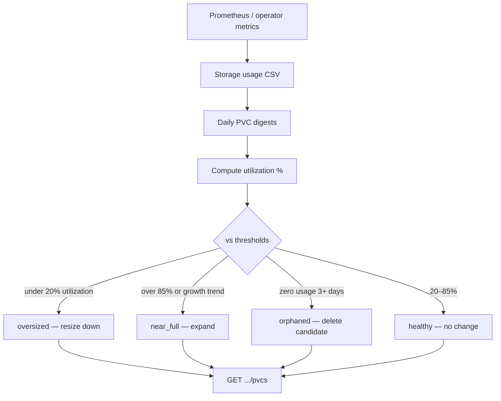

# PVC Right-Sizing

!!! info "Quick Facts"
    **What it does:** Identifies over-provisioned, under-provisioned (near-full), and orphaned PersistentVolumeClaims  
    **Data source:** koku-metrics-operator storage CSV (Prometheus: `kubelet_volume_stats_capacity_bytes`, `kubelet_volume_stats_used_bytes`)  
    **Update frequency:** Once per day (each ROS report ingestion cycle)  
    **Plugin:** `pvc` (priority 30, on by default in the native engine)  
    **API:** `GET /api/cost-management/v1/recommendations/openshift/pvcs`  
    **Configurable:** Yes — per-org Settings API + admin env vars (`ROS_PVC_*`)  
    **Key thresholds:** oversized when max usage &lt; 20% of capacity (default), near-full &gt; 85%, orphaned zero usage 3+ days  
    **Savings:** Yes on **oversized** rows when `KOKU_MASU_URL` and savings estimates are enabled

## Overview

PVC (PersistentVolumeClaim) right-sizing analyzes storage capacity vs. actual
usage and classifies PVCs to help reduce storage costs and prevent outages.

## How it works



1. **Collection** — The koku-metrics-operator reports PVC capacity and usage
   (`persistentvolumeclaim_capacity_bytes`, `persistentvolumeclaim_usage_byte_seconds`)
   in hourly storage CSV rows.
2. **Digestion** — ROS aggregates samples into `daily_pvc_digests` (min/max/avg usage per day).
3. **Utilization** — For each PVC in the configured term window, max usage is compared
   to provisioned capacity to compute `usage_ratio`.
4. **Classification** — Thresholds flag **oversized** (under-provisioned waste),
   **near-full** (capacity risk, including growth projection), **orphaned** (zero usage),
   or **healthy** (no action).
5. **Recommendation** — `RecommendPVCs()` writes `pvc_recommendation_sets` with
   recommended capacity, `resize_note`, notifications, and optional dollar savings.

## Data Source

The koku-metrics-operator already collects PVC metrics and writes them as
`cm-openshift-storage-usage-YYYYMM.csv` files in the upload tarball. No operator
changes are required for data collection.

> **File routing (implemented):** The storage CSV is in the manifest `files`
> array (cost pipeline). The Koku listener was updated to also route it to the
> ROS Kafka topic — see `koku/masu/external/kafka_msg_handler.py` (the
> `_ros_extra_patterns` tuple). See the [snapshot staleness design doc](features-f-snapshot-staleness.md#two-strategies-both-documented) for the
> architectural rationale behind this "Strategy A" approach.

**CSV columns used:**
- `interval_start`, `interval_end` — time window
- `namespace`, `persistentvolumeclaim`, `persistentvolume`, `storageclass`
- `persistentvolumeclaim_capacity_bytes` — provisioned capacity
- `persistentvolumeclaim_usage_byte_seconds` — usage × seconds (converted to bytes)
- `volume_request_storage_byte_seconds` — request × seconds

> **Configurable terms:** PVC uses the TermProvider trait with defaults of
> 7d (short), 30d (medium), 90d (long). The maximum allowed window is 365 days
> (storage growth patterns are slow-moving). Terms can be customized per-tenant
> via the Settings API or locked by administrators via environment variables.

## Classification

| Type | Condition | Action |
|------|-----------|--------|
| **Oversized** | max usage / capacity < 20% (sustained 3+ days) | Recommends 2× max usage (min 1 GiB) |
| **Near-full** | max usage / capacity > 85% | Recommends expansion to 2× current usage |
| **Orphaned** | zero usage for 3+ days | Recommends deletion |
| **Healthy** | usage between 20-85% | No action needed |

### Minimum data requirements

- **3 days** minimum for orphaned/oversized classification (avoids false positives on new PVCs)
- **7 days** minimum for growth trend projection

## Growth Trend Projection

Linear regression on daily average usage (bytes/day slope). When growth is
positive and capacity is finite, `days_to_full` projects when the PVC will
reach capacity at the current growth rate.

PVCs with `days_to_full < 30` receive a near-full notification even if current
usage is below 85%.

## Operational Notes

The API response includes a `resize_note` field with important context:

- **Oversized**: "Kubernetes does not support in-place PVC shrinking. Reducing
  this PVC requires creating a smaller volume, migrating data, and deleting the
  original."
- **Orphaned**: "This PVC has zero usage. If the data is no longer needed,
  deleting the PVC will reclaim the backing storage volume."

**Why PVC right-sizing saves money:** With dynamic provisioning (EBS, Azure Disk,
Ceph RBD via CSI), the backing volume is exactly the size of the PVC request.
You pay for provisioned capacity, not used capacity. Oversized PVCs mean paying
for storage you don't use.

## Dollar savings estimates

When `KOKU_MASU_URL` is configured and `ROS_SAVINGS_ESTIMATES_ENABLED=true` (default),
ROS computes `estimated_monthly_savings_usd` at ingestion for **oversized** PVCs using
storage rates from Masu `effective_rates`:

```
(current_gib - recommended_gib) × storage_gb_request_per_month
```

(falls back to `storage_gb_usage_per_month` when the request rate is zero).

Requires migration **000070**. When Masu is unavailable or savings are disabled,
the field is `$0` / null and notification code **25** (`NotifNoCostData`) is appended.

Full plugin matrix and troubleshooting: [architecture/cost-integration.md](architecture/cost-integration.md).

## Realizing PVC savings (migration path)

Most CSI drivers and cloud block storage backends **do not support in-place PVC
shrinking**. When ROS classifies a PVC as oversized, the `estimated_monthly_savings_usd`
field reflects the monthly cost difference between the current provisioned size
and the recommended size — but realizing that savings requires a manual migration:

1. Create a new PVC at the recommended (smaller) size.
2. Copy or migrate application data to the new volume (for example via a temporary
   Job, Velero, or application-specific tooling).
3. Update the workload to mount the new PVC.
4. Delete the old PVC to release the backing volume and stop paying for unused capacity.

The API `resize_note` on oversized PVCs repeats this guidance. Near-full and
orphaned PVC recommendations follow different actions (expand or delete). See
[Negative savings](architecture/cost-integration.md#negative-savings) when a
near-full recommendation implies expansion (negative savings = additional monthly cost).

## Notification Codes

| Code | Severity | Message |
|------|----------|---------|
| 20 | WARNING | PVC has zero usage across all intervals |
| 25 | INFO | No cost data available — savings estimate not computed |
| 29 | INFO | PVC capacity significantly exceeds sustained usage — consider shrinking |
| 30 | WARNING | PVC usage approaching capacity — consider expanding or investigate growth |

## API

`GET /api/cost-management/v1/recommendations/openshift/pvcs`

### Query Parameters

| Parameter | Type | Description |
|-----------|------|-------------|
| `cluster_uuid` | UUID | Filter by cluster |
| `namespace` | string | Filter by namespace |
| `recommendation_type` | enum | `oversized`, `near_full`, `orphaned`, `healthy` |
| `limit` | int | Results per page (1-100, default 20) |
| `offset` | int | Pagination offset |

### Response

```json
{
  "meta": { "count": 3, "limit": 20, "offset": 0, "currency": "USD" },
  "data": [
    {
      "cluster_uuid": "aaaaaaaa-...",
      "namespace": "production",
      "persistentvolumeclaim": "old-logs",
      "persistentvolume": "pv-123",
      "storageclass": "gp3",
      "capacity_bytes": 107374182400,
      "usage_bytes_max": 0,
      "usage_ratio": 0.0,
      "recommendation_type": "orphaned",
      "days_to_full": null,
      "growth_bytes_per_day": 0,
      "notifications": {
        "20": { "type": "WARNING", "message": "PVC has zero usage...", "code": 20 }
      },
      "data_days": 14,
      "estimated_monthly_savings_usd": 12.50,
      "resize_note": "This PVC has zero usage. If the data is no longer needed, deleting the PVC will reclaim the backing storage volume."
    }
  ]
}
```

## Database Tables

### `daily_pvc_digests` (partitioned by `bucket_date`)

Daily aggregated PVC metrics. Unique on `(cluster_uuid, namespace, pvc, date)`.

### `pvc_recommendation_sets`

Current PVC recommendations. Unique on `(org_id, cluster_uuid, namespace, pvc)`.
Overwritten on each ingestion cycle.

## Key Files

| File | Purpose |
|------|---------|
| `internal/ingestion/pvc.go` | CSV parsing, digest computation, upsert |
| `internal/engine/pvc_recommend.go` | Classification, growth trend, DB write |
| `internal/engine/pvc_savings.go` | Dollar savings from Masu storage rates |
| `internal/api/handlers_pvc.go` | API handler |
| `migrations/000047_create_pvc_tables.up.sql` | Schema |
| `migrations/000048_add_pvc_notification_codes.up.sql` | Notification seed |
| `migrations/000070_add_node_pvc_savings_columns.up.sql` | `estimated_monthly_savings_usd` column |

## Manual QE Verification

```bash
# 1. Generate OCP data with storage metrics (nise includes storage by default)
# 2. Ingest data
# 3. Query PVC recommendations:
IDENTITY=$(echo -n '...' | base64 -w0)
curl -s -H "x-rh-identity: $IDENTITY" \
  'http://localhost:8000/api/cost-management/v1/recommendations/openshift/pvcs' \
  | python3 -m json.tool

# Filter by type:
curl -s -H "x-rh-identity: $IDENTITY" \
  'http://localhost:8000/api/cost-management/v1/recommendations/openshift/pvcs?recommendation_type=oversized'

# Check digest data directly:
psql -c "SELECT * FROM daily_pvc_digests LIMIT 10;"
psql -c "SELECT * FROM pvc_recommendation_sets ORDER BY usage_ratio DESC LIMIT 10;"
```
