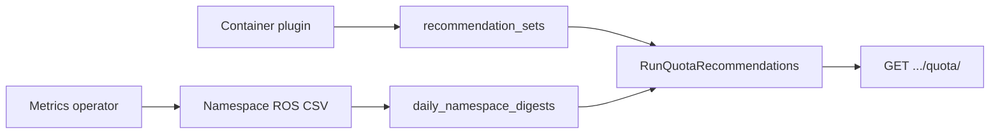

# ResourceQuota Recommendations

!!! info "Quick Facts"
    **API:** `GET /api/cost-management/v1/recommendations/openshift/quota/`  
    **Plugin:** `quota` (priority 35, on by default in the native engine)  
    **Configurable:** Per-org Settings API + admin env vars  
    **Savings:** Yes on `tighten` rows when cost integration is enabled

Right-size Kubernetes **ResourceQuota** hard limits per namespace by comparing
configured limits and observed usage against aggregated container recommendation totals.

**Related:** [Namespace recommendations](namespace-recommendations.md) recommend ideal
namespace CPU/memory totals from usage digests. The `quota` plugin tunes **existing**
ResourceQuota objects against container rightsizing output and optional `kube_resourcequota`
used metrics.

**ClusterResourceQuota** (OpenShift multi-namespace quotas) is implemented by the
**`cluster-quota`** plugin — see [ClusterResourceQuota Recommendations](cluster-resource-quota.md).

---

## How it works



1. The operator reports namespace-level quota **hard** (`*_namespace_sum`) and optional
   **used** (`*_namespace_used`) values from `kube_resourcequota`.
2. ROS ingests namespace digests and, in the same report cycle, runs container rightsizing.
3. After container `recommendation_sets` are written, `RunQuotaRecommendations` compares
   hard/used limits to aggregated container `term=medium` / `engine=cost` sums.
4. Each namespace with hard limits gets a recommendation type, risk level, and optional
   estimated savings on **tighten**.

Quota does **not** use an ingest hook: namespace CSV hooks run before container
recommendations exist, so the authoritative run is the explicit call at the end of
`processContainerCSVNative` in the report processor.

Internal design: [`docs/features/quota-recommendations.md`](../../docs/features/quota-recommendations.md).

---

## Recommendation types and risk

| `recommendation_type` | Meaning |
|----------------------|---------|
| `tighten` | Recommended hard limits are below current hard — reclaim stranded quota |
| `raise` | Usage or recommendation totals are near the hard limit — admission risk |
| `optimal` | Quota is reasonably aligned with workload needs |
| `none` | No hard limits on the namespace snapshot |

| `risk_level` | Typical utilization (max across CPU/memory request/limit) |
|--------------|-----------------------------------------------------------|
| `high` | ≥ high-risk threshold (default 90% of hard) |
| `medium` | ≥ medium threshold (default 70%) |
| `low` | Below medium but non-zero |
| `none` | No utilization signal |

Utilization uses the **greater** of quota **used** metrics and container recommendation sums
vs hard limits.

---

## Configuration

Resolution order: **per-org Settings API** → **environment variables** → **compiled defaults** (10 / 90 / 70).

| Variable | Default | Purpose |
|----------|---------|---------|
| `ROS_QUOTA_HEADROOM_PERCENT` | `10` | Margin on recommended hard values (10 → 110% of container rec sums) |
| `ROS_QUOTA_HIGH_RISK_THRESHOLD_PERCENT` | `90` | Triggers `raise` and `high` risk |
| `ROS_QUOTA_MEDIUM_RISK_THRESHOLD_PERCENT` | `70` | `medium` risk band |

**Settings API:** `GET` / `PUT` / `DELETE`
`/api/cost-management/v1/recommendations/openshift/settings/quota`

```json
{
  "headroom_percent": 10,
  "high_risk_threshold_percent": 90,
  "medium_risk_threshold_percent": 70,
  "locked_fields": []
}
```

PUT requires all three percent fields. `high_risk_threshold_percent` must be greater than
`medium_risk_threshold_percent`. Fields listed in `locked_fields` (set via `ROS_QUOTA_*`
env vars) cannot be updated through the API. DELETE clears per-org overrides.

For platform-wide defaults without tenant overrides, use deployment
env vars (Helm `ros.api.quotaRecommendations` on cost-onprem).

| Feature | Runtime tuning |
|---------|----------------|
| Idle detection | `GET/PUT/DELETE .../settings/idle-detection` + env locks |
| Snapshot | `GET/PUT .../settings/snapshot` + env locks |
| Container, namespace, node, GPU, PVC | `GET/PUT/DELETE .../settings/thresholds?recommendation_type=...` |
| Business hours | `.../settings/business-hours` (+ cluster/namespace overrides) |
| **ResourceQuota (`quota`)** | `GET/PUT/DELETE .../settings/quota` + env locks |

Disable the feature: `ROS_DISABLED_PLUGINS=quota` or omit `quota` from `ROS_ENABLED_PLUGINS`
(the list endpoint returns 404).

See [Configuration](../configuration.md#resourcequota-recommendations) for deployment notes.

---

## Timing

When a report bundle includes container CSV, quota runs **once** after container
recommendations are persisted. If only namespace CSV arrives in a cycle, quota uses
container sums from the **previous** cycle until container metrics are processed again.

---

## API

```http
GET /api/cost-management/v1/recommendations/openshift/quota/
```

| Parameter | Example | Description |
|-----------|---------|-------------|
| `filter[cluster]` | UUID | Limit to one cluster |
| `filter[project]` | `production` | Limit to one namespace |
| `filter[recommendation_type]` | `tighten,raise` | Filter by type |
| `filter[risk_level]` | `high,medium` | Filter by risk |
| `group_by[cluster]` | — | Aggregate rows per cluster |
| `group_by[project]` | — | Aggregate rows per namespace |

### Example response

```json
{
  "meta": {
    "count": 1,
    "limit": 100,
    "offset": 0,
    "currency": "USD"
  },
  "links": {
    "first": "/api/cost-management/v1/recommendations/openshift/quota/?limit=100&offset=0",
    "last": "...",
    "next": null,
    "previous": null
  },
  "data": [
    {
      "cluster_uuid": "550e8400-e29b-41d4-a716-446655440001",
      "namespace": "production",
      "recommendation_type": "tighten",
      "risk_level": "low",
      "quota_hard": {
        "cpu_request_millicores": 100000,
        "memory_request_bytes": 107374182400
      },
      "quota_used": {
        "cpu_request_millicores": 25000
      },
      "quota_recommended": {
        "cpu_request_millicores": 36000,
        "memory_request_bytes": 45097156608
      },
      "utilization": {
        "cpu_request_percent": 25.0
      },
      "capacity_freed": {
        "cpu_millicores": 64000,
        "memory_bytes": 62277025792
      },
      "estimated_savings": {
        "value": 142.50,
        "units": "USD",
        "currency": "USD"
      },
      "last_observed_at": "2026-05-28T12:00:00Z"
    }
  ]
}
```

Full schema: [OpenAPI specification](../openapi.md) and [`openapi.json`](../../openapi.json).

---

## Operator data

Hard limits (required): `cpu_request_namespace_sum`, `cpu_limit_namespace_sum`,
`memory_request_namespace_sum`, `memory_limit_namespace_sum`.

Used values (optional, backward compatible): `cpu_request_namespace_used`,
`cpu_limit_namespace_used`, `memory_request_namespace_used`, `memory_limit_namespace_used`.

Older operators without `*_namespace_used` columns still work; utilization falls back to
container recommendation sums where used metrics are absent.
