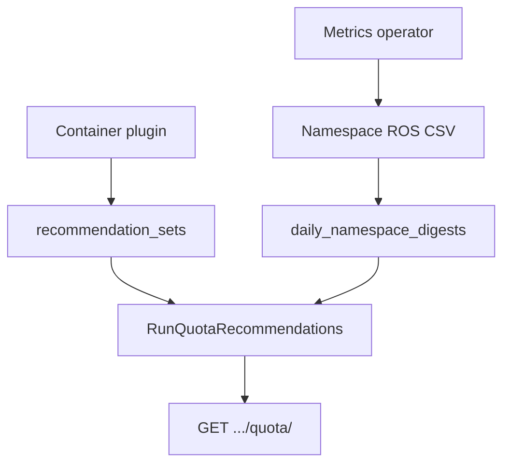

# ResourceQuota Recommendations

!!! info "Quick Facts"
    **API:** `GET /api/cost-management/v1/recommendations/openshift/quota/`  
    **Plugin:** `quota` (priority 35, on by default in the native engine)  
    **Configurable:** Per-org Settings API + admin env vars  
    **Savings:** Yes on `tighten` rows when cost integration is enabled

Right-size Kubernetes **ResourceQuota** hard limits per namespace by comparing
configured limits and observed usage against aggregated container recommendation totals.

Each recommendation row is keyed by **`(cluster_uuid, namespace, quota_name)`** when the
metrics operator exports the Prometheus `resourcequota` label. Namespaces with multiple
ResourceQuota objects therefore get one row per quota. Older operator builds without
`quota_name` merge all quotas in a namespace into a single row (empty `quota_name`).

**Related:** [Namespace recommendations](namespace-recommendations.md) recommend ideal
namespace CPU/memory totals from usage digests. The `quota` plugin tunes **existing**
ResourceQuota objects against container rightsizing output and optional `kube_resourcequota`
used metrics.

**ClusterResourceQuota** (OpenShift multi-namespace quotas) is implemented by the
**`cluster-quota`** plugin — see [ClusterResourceQuota Recommendations](cluster-resource-quota.md).

---

## What it does

| Problem | ROS guidance |
|---------|--------------|
| Over-provisioned quota hard limits | `tighten` — reduce hard limits toward rightsized container sums plus headroom |
| Quota near or at capacity | `raise` + elevated `risk_level` — admission pressure before deployments fail |
| Quota aligned with workloads | `optimal` — no change recommended |

Resources covered in recommendations and risk:

| Resource | Tighten / raise | Savings on tighten | Notes |
|----------|-----------------|-------------------|-------|
| CPU request / limit | Yes | Yes (hourly usage rates) | Utilization uses max of used vs container rec sums |
| Memory request / limit | Yes | Yes (hourly usage rates) | Same signal as CPU |
| Storage request | Yes | Yes when `storage_gb_request_per_month` exists | `capacity_freed.storage_request_bytes` |
| Pods | Yes | Count only — no dollar estimate | `capacity_freed.pods_freed` |
| Object counts (`count/*`) | Visibility only | No | Risk + blocking notifications only |

---

## How it works



1. The operator reports namespace-level quota **hard** (`*_namespace_sum`) and optional
   **used** (`*_namespace_used`) values from `kube_resourcequota`.
2. ROS ingests namespace digests and, in the same report cycle, runs container rightsizing.
3. After container `recommendation_sets` are written, `RunQuotaRecommendations` compares
   hard/used limits to aggregated container `term=medium` / `engine=cost` sums.
4. Each namespace with hard limits gets a recommendation type, risk level, and optional
   estimated savings on **tighten** (CPU, memory, and storage request capacity only).

Quota does **not** use an ingest hook: namespace CSV hooks run before container
recommendations exist, so the authoritative run is the explicit call at the end of
`processContainerCSVNative` in the report processor.

Internal design (timing, object-count policy, pod-savings analysis):
[`docs/features/quota-recommendations.md`](../../docs/features/quota-recommendations.md) in the repo `docs/` tree.

---

## Object-count resources

The operator reports aggregated **`object_count_*`** hard/used values (sum of Kubernetes
`count/*` quota types). ROS uses them for **visibility and alerting only**:

| Use case | Included? |
|----------|-----------|
| Risk level (`high` / `medium` / …) | Yes — counts toward max utilization across resources |
| Blocking notifications | Yes — code **72** (namespace), **73** (ClusterResourceQuota) when at hard limit |
| Tighten / raise recommendations | No — no workload-derived target from container rightsizing |
| Estimated savings | No — no cost-model rate for object counts in Koku `effective_rates` |

Operators should treat object-count signals as admission-risk indicators, not FinOps dollar impact.

---

## Pod capacity freed

When pod quota can be tightened, the API reports **`capacity_freed.pods_freed`** (count only).
Monthly **`estimated_savings`** on tighten rows includes CPU, memory, and storage request
capacity — not pod slots. There is no `pod_cost_per_month` metric in the cost model.

---

## Recommendation types and risk

| `recommendation_type` | Meaning |
|----------------------|---------|
| `tighten` | Recommended hard limits are below current hard — reclaim stranded quota |
| `raise` | Usage or recommendation totals are near the hard limit — admission risk |
| `optimal` | Quota is reasonably aligned with workload needs |
| `none` | No hard limits on the namespace snapshot |

| `risk_level` | Typical utilization (max across CPU/memory request/limit) |
|--------------|-----------------------------------------------------------|
| `high` | ≥ high-risk threshold (default 90% of hard) |
| `medium` | ≥ medium threshold (default 70%) |
| `low` | Below medium but non-zero |
| `none` | No utilization signal |

Utilization uses the **greater** of quota **used** metrics and container recommendation sums
vs hard limits.

### Notification codes

| Code | Name | When emitted |
|------|------|--------------|
| **70** | `NotifQuotaNearCapacity` | `risk_level` is `high` (utilization near hard limit) |
| **71** | `NotifQuotaOversized` | `recommendation_type` is `tighten` (quota hard exceeds rightsized need) |
| **72** | `NotifQuotaBlocking` | Any resource at or above hard limit (`used >= hard`) |

Code **73** (`NotifClusterQuotaAtCapacity`) applies to **ClusterResourceQuota** rows only.
See [Notification codes](../architecture/notification-codes.md).

---

## Configuration

Resolution order: **per-org Settings API** → **environment variables** → **compiled defaults** (10 / 90 / 70).

| Variable | Default | Purpose |
|----------|---------|---------|
| `ROS_QUOTA_HEADROOM_PERCENT` | `10` | Margin on recommended hard values (10 → 110% of container rec sums) |
| `ROS_QUOTA_HIGH_RISK_THRESHOLD_PERCENT` | `90` | Triggers `raise` and `high` risk |
| `ROS_QUOTA_MEDIUM_RISK_THRESHOLD_PERCENT` | `70` | `medium` risk band |

**Settings API:** `GET` / `PUT` / `DELETE`
`/api/cost-management/v1/recommendations/openshift/settings/quota`

```json
{
  "headroom_percent": 10,
  "high_risk_threshold_percent": 90,
  "medium_risk_threshold_percent": 70,
  "locked_fields": []
}
```

PUT requires all three percent fields. `high_risk_threshold_percent` must be greater than
`medium_risk_threshold_percent`. Fields listed in `locked_fields` (set via `ROS_QUOTA_*`
env vars) cannot be updated through the API. DELETE clears per-org overrides.

For platform-wide defaults without tenant overrides, use deployment
env vars (Helm `ros.api.quotaRecommendations` on cost-onprem).

| Feature | Runtime tuning |
|---------|----------------|
| Idle detection | `GET/PUT/DELETE .../settings/idle-detection` + env locks |
| Snapshot | `GET/PUT .../settings/snapshot` + env locks |
| Container, namespace, node, GPU, PVC | `GET/PUT/DELETE .../settings/thresholds?recommendation_type=...` |
| Business hours | `.../settings/business-hours` (+ cluster/namespace overrides) |
| **ResourceQuota (`quota`)** | `GET/PUT/DELETE .../settings/quota` + env locks |

Disable the feature: `ROS_DISABLED_PLUGINS=quota` or omit `quota` from `ROS_ENABLED_PLUGINS`
(the list endpoint returns 404).

See [Configuration](../configuration.md#resourcequota-recommendations) for deployment notes.

---

## Timing and one-cycle lag

Namespace quota **hard/used** metrics and container **recommendation sums** come from
different ROS CSV files. They can be up to **one operator upload cycle** out of phase.

**Mitigations (implemented):**

- After **container** CSV: quota runs when `recommendation_sets` are written (fresh sums).
- After **namespace** CSV: quota runs again so hard/used and blocking signals use the latest
  `kube_resourcequota` snapshots.

**Accepted behavior:** Split-CSV ingestion cannot merge both signals in a single pass when
only one file type arrives. For steady-state clusters that upload container and namespace
data regularly, one cycle of skew is expected and acceptable. On first deployment, allow one
full report cycle before tighten/raise fully align.

When a bundle includes container CSV, quota runs after container recommendations are
persisted. If only namespace CSV arrives in a cycle, quota refreshes hard/used immediately
but container sums remain from the **previous** cycle until container CSV is processed again.

---

## API

```http
GET /api/cost-management/v1/recommendations/openshift/quota/
GET /api/cost-management/v1/recommendations/openshift/quota/detail
```

### List filters, sorting, and grouping

| Parameter | Example | Description |
|-----------|---------|-------------|
| `filter[cluster]` | UUID | Limit to one cluster |
| `filter[project]` | `production` | Limit to one namespace |
| `filter[quota_name]` | `team-alpha-budget` | ResourceQuota object name (exact match) |
| `filter[resource_quota_name]` | `team-alpha-budget` | Alias for `filter[quota_name]` |
| `filter[recommendation_type]` | `tighten,raise` | Filter by type |
| `filter[risk_level]` | `high,medium` | Filter by risk |
| `order_by` | `utilization` | Sort key: `namespace`, `quota_name`, `utilization`, `estimated_monthly_savings`, `risk_level` |
| `order_how` | `desc` | `asc` (default) or `desc` |
| `group_by[cluster]` | — | Aggregate rows per cluster (sums capacity freed and savings) |
| `group_by[project]` | — | Aggregate rows per namespace |
| `limit` / `offset` | `20` / `0` | Pagination (default limit 20, max 100) |

Do not combine `group_by[cluster]` and `group_by[project]` in one request.

### Detail endpoint

```http
GET /api/cost-management/v1/recommendations/openshift/quota/detail
  ?cluster_uuid={uuid}&namespace={ns}&quota_name={name}
```

Returns the same fields as a list row plus **`history[]`** (90-day append-only snapshots
per resource). `quota_name` is optional when only one quota exists for the namespace.

### Example response

```json
{
  "meta": {
    "count": 1,
    "limit": 100,
    "offset": 0,
    "currency": "USD"
  },
  "links": {
    "first": "/api/cost-management/v1/recommendations/openshift/quota/?limit=100&offset=0",
    "last": "...",
    "next": null,
    "previous": null
  },
  "data": [
    {
      "cluster_uuid": "550e8400-e29b-41d4-a716-446655440001",
      "namespace": "production",
      "quota_name": "team-alpha-budget",
      "recommendation_type": "tighten",
      "risk_level": "low",
      "quota_hard": {
        "cpu_request_millicores": 100000,
        "memory_request_bytes": 107374182400,
        "storage_request_bytes": 536870912000,
        "pods": 500
      },
      "quota_used": {
        "cpu_request_millicores": 25000,
        "storage_request_bytes": 107374182400,
        "pods": 42
      },
      "quota_recommended": {
        "cpu_request_millicores": 36000,
        "memory_request_bytes": 45097156608,
        "storage_request_bytes": 118111600640,
        "pods": 55
      },
      "utilization": {
        "cpu_request_percent": 25.0,
        "storage_request_percent": 20.0,
        "pods_percent": 8.4
      },
      "capacity_freed": {
        "cpu_millicores": 64000,
        "memory_bytes": 62277025792,
        "storage_request_bytes": 418759311360,
        "pods_freed": 445
      },
      "estimated_savings": {
        "value": 142.50,
        "units": "USD",
        "currency": "USD"
      },
      "notifications": {
        "71": {
          "code": 71,
          "severity": "info",
          "description": "ResourceQuota hard limits exceed rightsized workload needs"
        }
      },
      "last_observed_at": "2026-05-28T12:00:00Z"
    }
  ]
}
```

Full schema: [OpenAPI specification](../openapi.md) and [`openapi.json`](../../openapi.json).

---

## Operator data

**Compute (required):** `cpu_request_namespace_sum`, `cpu_limit_namespace_sum`,
`memory_request_namespace_sum`, `memory_limit_namespace_sum`.

**Compute used (optional):** `cpu_request_namespace_used`, `cpu_limit_namespace_used`,
`memory_request_namespace_used`, `memory_limit_namespace_used`.

**Extended resources (optional, current operator builds):** storage request hard/used,
`pods_*`, `object_count_*`, and per-quota `quota_name`.

Older operators without `*_namespace_used` columns still work; utilization falls back to
container recommendation sums where used metrics are absent.

---

## Roadmap / Future Work

### Quota UI (deferred)

The **`quota`** and **`cluster-quota`** plugins, settings APIs, detail endpoints, notification
codes **70–73**, and `history[]` on detail responses are **API-ready**. Dedicated **koku-ui**
views are planned as future work (large effort; deferred from the ResourceQuota status report).

Planned UI scope:

- **List view** — utilization, risk level, recommendation type, estimated savings
- **Detail view** — hard / used / recommended breakdown, capacity freed, notifications
- **ClusterResourceQuota view** — aggregate CRQ recommendations across namespace selectors
- **Notifications** — surface codes 70–73 in the optimizations experience
- **Trends** — historical recommendation snapshots from detail `history[]`

Until UI ships, use the REST API or internal tooling. See
[UI integration guide](../ui-integration-guide.md#4b-resourcequota-and-clusterresourcequota-recommendations)
and [Deferred: Quota UI](../known-issues.md#deferred-quota-ui).

### Limitations

| Limitation | Impact |
|------------|--------|
| **Object-count quotas** | Included in risk and blocking (code **72**), but not in tighten/raise or savings |
| **Extended resources** | `requests.ephemeral-storage`, GPU quota, hugepages, custom device plugins — not collected (future work; see [CRQ doc](cluster-resource-quota.md#extended-resources-future-work)) |
| **Pod quota savings** | `pods_freed` is count-only; no `estimated_savings` for pod slots |
| **One-cycle lag** | Container rec sums and namespace quota hard/used can be one operator upload out of phase (see [Timing](#timing-and-one-cycle-lag)) |
| **Savings after cost model change** | Quota and cluster-quota `estimated_savings` refresh on ingestion and via Koku→ROS savings recalculation (same as container/node/PVC). See [Cost Integration — Savings recalculation](../architecture/cost-integration.md#savings-recalculation-after-cost-model-changes) |
| **Per-quota identity (legacy operators)** | Without `quota_name` in namespace CSV, multiple ResourceQuota objects merge into one row |

**Not planned:** Dollar savings for freed pod quota slots (see internal doc
[Pod savings feasibility](../../docs/features/quota-recommendations.md#pod-savings-feasibility-analysis)).
Use **`pods_freed`** for capacity reporting and node consolidation savings for node-level FinOps impact.
