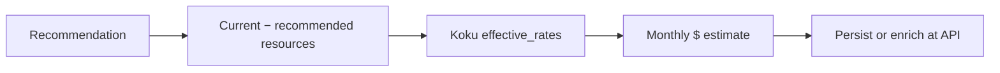

# Savings estimations

!!! info "Quick Facts"
    **Fleet savings API:** `GET /api/cost-management/v1/recommendations/openshift/savings-summary`  
    **Fleet counts API:** `GET /api/cost-management/v1/recommendations/openshift/fleet-summary`  
    **Per-rec field:** `estimated_monthly_savings` (`MoneyAmount`: `{"value": "12.34", "units": "USD"}`)  
    **Plugins with fleet rollup:** container, node, PVC, snapshot, VM (GPU excluded; quota/cluster-quota excluded to avoid double-count)  
    **Kill-switch:** `ROS_SAVINGS_ESTIMATES_ENABLED` (default `true`)

## Overview

Savings estimations translate resource recommendations into **estimated monthly
dollar impact** using rates from the tenant's Koku cost model. This helps FinOps
teams prioritize optimization work and populate dashboard hero metrics.

Amounts are exposed as structured [`MoneyAmount`](../../internal/money/format.go)
objects (`{"value": "12.34", "units": "USD"}`) with two decimal places. Currency
comes from Koku's `effective_rates` response (ISO 4217, default `USD`). List
endpoints that expose monetary fields also return `meta.currency`.

## How it works



1. **Resource delta** — Compare current requests/allocation vs recommended values
   (CPU cores, memory GiB, storage GiB, node count).
2. **Rate lookup** — Fetch `GET {KOKU_MASU_URL}/.../effective_rates/` per cluster
   (CPU, memory, storage, node monthly rates).
3. **Formula** — Apply plugin-specific formula (**730 hours/month** for compute).
4. **Persist or enrich** — Container, node, PVC, VM, and snapshot amounts stored
   at ingestion; GPU MIG/idle persisted at ingestion (`estimated_gpu_savings_cents`);
   GPU time-slicing computed at API read time.

Full formulas: [Cost Integration](../architecture/cost-integration.md).

## Covered plugins

| Plugin | List/detail field | When computed | Fleet rollup | Notes |
|--------|-------------------|---------------|--------------|-------|
| **Container** | `estimated_monthly_savings` | Ingestion (+ recalc) | `by_plugin.container` | Includes cost-model + infrastructure/distributed overhead; idle/abandoned use 100% of current allocation |
| **Node** | `estimated_monthly_savings` (per engine) | Ingestion (+ recalc) | `by_plugin.node` | Per engine row; includes `node_cost_per_month` on consolidation |
| **PVC** | `estimated_monthly_savings` | Ingestion (+ recalc) | `by_plugin.pvc` | Oversized/near-full/orphaned PVCs; storage rate from cost model |
| **VM** | `savings` | Ingestion | `by_plugin.vm` | Preview Beta (`ROS_ENABLE_VM_RECS=true`); recalc requires new ingestion cycle |
| **Snapshot** | `estimated_monthly_cost` | Ingestion | `by_plugin.snapshot` | Recoverable **cost** (waste), not savings; recalc requires new ingestion cycle |
| **Namespace** | — | — | — | No dollar savings field today — sizing targets only |
| **Quota / cluster-quota** | `estimated_savings` | Ingestion (+ recalc) | Excluded | Excluded from fleet summary to avoid double-count with container savings |
| **GPU MIG/idle** | `estimated_monthly_gpu_savings` on container `gpu` block | Ingestion (+ container recalc) | Excluded (`by_plugin.gpu` = 0) | Persisted in `estimated_gpu_savings_cents`; see [GPU savings](#gpu-savings) |
| **GPU time-slicing** | `estimated_monthly_timeslicing_savings` | API read | Excluded | Fleet-level candidate selection; see [GPU savings](#gpu-savings) |

`savings-summary` honors `?term=` (`short` / `medium` / `long`) and `?engine=`
(`cost` / `performance`). PVC uses `term` only; snapshot totals are
term-independent.

## Negative savings

When a recommendation suggests **scaling up** (more CPU, memory, storage, or
nodes), the savings field is **negative**. This means **additional monthly cost**
to implement the recommendation — typically for reliability (OOM prevention,
near-full PVC expansion).

UI guidance: display as "Additional cost: $X/month" rather than "Savings: -$X".
See [Cost Integration](../architecture/cost-integration.md) for formula context.

## API endpoints

### Per-recommendation field

```json
{
  "estimated_monthly_savings": { "value": "12.50", "units": "USD" },
  "currency": "USD"
}
```

Present on container list items, node engine rows, PVC recommendations, and VM
list/detail (`savings`). Idle/abandoned containers use 100% of current
allocation as recoverable savings. Snapshot rows expose `estimated_monthly_cost`
(holding cost, not savings).

GPU dollar fields on container `gpu` blocks:

```json
{
  "gpu": {
    "medium_term": {
      "estimated_monthly_gpu_savings": { "value": "45.00", "units": "USD" },
      "estimated_monthly_timeslicing_savings": { "value": "12.00", "units": "USD" }
    }
  }
}
```

### Fleet savings summary

```http
GET /api/cost-management/v1/recommendations/openshift/savings-summary?engine=cost&term=medium
```

```json
{
  "currency": "USD",
  "estimated_monthly_savings": { "value": "12500.75", "units": "USD" },
  "by_plugin": {
    "container": { "value": "5000.00", "units": "USD" },
    "node": { "value": "3000.00", "units": "USD" },
    "pvc": { "value": "1500.00", "units": "USD" },
    "snapshot": { "value": "500.00", "units": "USD" },
    "vm": { "value": "200.00", "units": "USD" },
    "gpu": { "value": "0.00", "units": "USD" }
  },
  "by_cluster": [
    {
      "cluster_uuid": "02059694-68ab-4d58-8809-de1e91f1d0e5",
      "cluster_alias": "prod-east",
      "estimated_monthly_savings": { "value": "8200.50", "units": "USD" },
      "has_cost_data": true
    }
  ],
  "gpu_savings_note": "GPU savings are computed at API read time and are not included in this fleet summary. Query container GPU recommendations or node GPU endpoints for per-workload dollar estimates."
}
```

| Query param | Default | Description |
|-------------|---------|-------------|
| `engine` | `cost` | `cost` or `performance` — affects container and node totals |
| `term` | `medium` | `short`, `medium`, or `long` — recommendation horizon |

`has_cost_data` per cluster is `false` when all recommendations lack cost model
rates (notification code **25**). Show "Cost model not configured" instead of
`$0.00` in that case.

### Fleet summary (counts + savings)

```http
GET /api/cost-management/v1/recommendations/openshift/fleet-summary
```

Org-wide container counts (idle, abandoned, active) plus total savings — useful
for overview dashboards alongside the plugin breakdown above.

```json
{
  "total_containers": 450,
  "active_containers": 420,
  "idle_containers": 15,
  "abandoned_containers": 8,
  "total_monthly_savings": { "value": "12500.75", "units": "USD" },
  "cluster_count": 5,
  "currency": "USD"
}
```

## Cost data source

ROS calls Koku Masu's internal **`effective_rates`** endpoint (service-to-service,
no user identity header). Response includes:

- `configured_rates` — tiered rates from the assigned OCP cost model
- `namespace_aggregates` — per-namespace cost breakdown (includes OCP-on-cloud
  infrastructure correlation when configured)
- `currency` — org's cost model currency

Rates come from Koku only — there is no standalone ROS cost-rate API. Update the
OCP cost model in Koku; rates refresh on the next ingestion cycle or via
[savings recalculation](../architecture/cost-integration.md#savings-recalculation-after-cost-model-changes)
when configured.

Prerequisites: `KOKU_MASU_URL` set on ros-processor and ros-api, cost model
assigned to the cluster source, `ROS_SAVINGS_ESTIMATES_ENABLED=true` (default).

## When cost data is unavailable

| Scenario | Behavior |
|----------|----------|
| Masu unreachable | Savings fields zero/`null`; recommendations still generated |
| No cost model | Empty rates → zero savings |
| Namespace missing from aggregates | Container savings `$0` + notification **25** (`NotifNoCostData`) |
| Kill-switch off | No Masu calls; code **25** on container, node, PVC; VM `savings` is `null` |

GPU endpoints omit code **25**; dollar fields are simply absent or zero.

## Engine filter

Savings differ between cost and performance engines because recommended resource
values differ. Use `?engine=performance` on `savings-summary` to aggregate the
conservative (headroom) perspective. See [Dual engine](dual-engine.md).

## GPU savings

**MIG and idle GPU savings** are persisted at ingestion in `estimated_gpu_savings_cents`
and refreshed when `container` savings are recalculated after a cost model change.
API list/detail reads persisted values when present.

**Node GPU time-slicing savings** are computed at API read time on
`GET .../gpu/timeslicing` because candidate selection is fleet-level and changes
with scheduling.

GPU dollar amounts are **excluded** from `GET .../savings-summary` totals
(`by_plugin.gpu` is always `{"value": "0.00", ...}`). The response includes
`gpu_savings_note` explaining why. Query container `gpu` blocks or the
time-slicing endpoint for GPU dollar estimates.

## Kill-switch

Set `ROS_SAVINGS_ESTIMATES_ENABLED=false` to skip Masu fetches. Container, node,
and PVC savings become zero; VM `savings` is `null`; GPU dollar fields are
omitted. Notification code **25** (`NotifNoCostData`) is appended on container,
node, and PVC when cost data is unavailable.

## Currency

`currency` (ISO 4217) is returned on fleet summaries (`savings-summary`,
`fleet-summary`) and `meta.currency` on list endpoints that expose monetary
fields. Defaults to `USD` when Masu is unreachable.

## Internal recalculation

After Koku applies cost model rates, masu calls:

```http
POST /api/cost-management/v1/internal/recalculate-savings
```

Supported `recommendation_types`: `container` (includes GPU MIG/idle persistence),
`node`, `pvc`, `quota`, `cluster-quota`. **VM and snapshot** require a new
ingestion cycle. Service-account bearer token required (same auth as tag sync).
Gated by `ROS_SAVINGS_RECALCULATION_ENABLED` (default `true`).

## Related

- [Cost Integration](../architecture/cost-integration.md) — Full contract and formulas
- [Dual engine](dual-engine.md) — Why savings differ by engine
- [Container right-sizing](container-recommendations.md) — Idle/abandoned 100% savings
- [PVC right-sizing](pvc-rightsizing.md) — Storage savings and migration path
- [GPU MIG](gpu-mig.md) — MIG profile savings
- [GPU time-slicing](gpu-time-slicing.md) — Node-level time-slicing savings
- [UI integration guide](../ui-integration-guide.md) — Response shapes and dashboard guidance
- [Plugin reference](../plugin-reference/index.md) — Per-plugin savings fields
