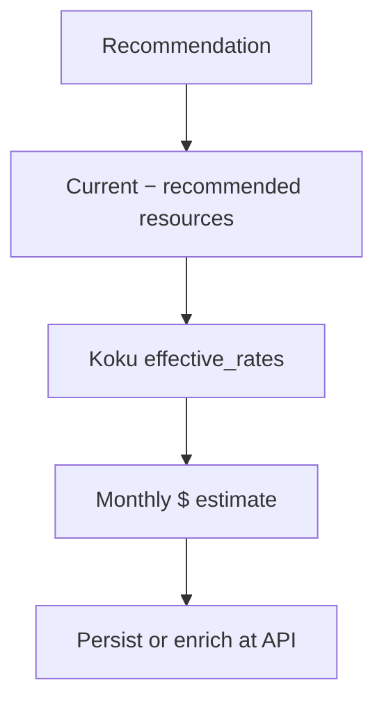

# Savings Estimations

!!! info "Quick Facts"
    **Fleet API:** `GET /api/cost-management/v1/recommendations/openshift/savings-summary`  
    **Per-rec field:** `estimated_monthly_savings` (`{"value": "12.340000", "units": "USD"}`)  
    **Plugins with savings:** container, node, PVC, snapshot, VM (GPU: API read only)  
    **Kill-switch:** `ROS_SAVINGS_ESTIMATES_ENABLED` (default `true`)

## Overview

Savings estimations translate resource recommendations into **estimated monthly
dollar impact** using rates from the tenant's Koku cost model. This helps FinOps
teams prioritize optimization work and populate dashboard hero metrics.

Currency comes from Koku's `effective_rates` response (ISO 4217, default `USD`).
API responses use a structured savings object with six-decimal string `value` and
`units` (typically `USD`).

## How it works



1. **Resource delta** — Compare current requests/allocation vs recommended values
   (CPU cores, memory GiB, storage GiB, node count).
2. **Rate lookup** — Fetch `GET {KOKU_MASU_URL}/.../effective_rates/` per cluster
   (CPU, memory, storage, node monthly rates).
3. **Formula** — Apply plugin-specific formula (730 hours/month for compute).
4. **Persist or enrich** — Container, node, and PVC savings stored at ingestion;
   GPU savings computed at API read time.

Full formulas: [Cost Integration](../architecture/cost-integration.md).

## Covered plugins

| Plugin | When computed | Notes |
|--------|---------------|-------|
| **Container** | Ingestion | Includes cost-model + infrastructure/distributed overhead |
| **Node** | Ingestion | Per engine row; includes `node_cost_per_month` on consolidation |
| **PVC** | Ingestion | Oversized PVCs only; storage rate from cost model |
| **Snapshot** | Ingestion | Recoverable **cost** (not savings) — `estimated_monthly_cost_usd` |
| **VM** | Ingestion | `savings` on list/detail; fleet `by_plugin.vm` at `medium_term` |
| **Namespace** | — | No USD field today |
| **GPU** | API read | Excluded from fleet summary (`by_plugin.gpu = 0`) |

## Negative savings

When a recommendation suggests **scaling up** (more CPU, memory, storage, or
nodes), the savings field is **negative**. This means **additional monthly cost**
to implement the recommendation — typically for reliability (OOM prevention,
near-full PVC expansion).

UI guidance: display as "Additional cost: $X/month" rather than "Savings: -$X".
See [Cost Integration — Negative savings](../architecture/cost-integration.md#negative-savings).

## API endpoints

### Per-recommendation field

```json
{
  "estimated_monthly_savings": {
    "value": "12.500000",
    "units": "USD"
  },
  "currency": "USD"
}
```

Present on container list items, node engine rows, PVC recommendations, VM list/detail
(`savings`), and GPU blocks (`estimated_monthly_gpu_savings`,
`estimated_monthly_timeslicing_savings`). Idle/abandoned containers and VMs use 100% of
current allocation (plus flat `vm_cost_per_month` when configured) as recoverable savings.

### Node recommendations

Nested under `recommendation_terms.<term>.recommendation_engines.{cost,performance}`:

```json
"cost": {
  "recommended_cpu_cores": 8,
  "recommended_memory_gib": 32,
  "node_count_reduction": 1,
  "estimated_monthly_savings": {
    "value": "850.000000",
    "units": "USD"
  }
}
```

Default list sort: `order_by=estimated_monthly_savings` (deprecated alias:
`order_by=estimated_monthly_savings_usd`).

### PVC recommendations

Top-level on each PVC row:

```json
{
  "persistentvolumeclaim": "data-pvc",
  "estimated_monthly_savings": {
    "value": "8.500000",
    "units": "USD"
  },
  "currency": "USD"
}
```

### GPU (container and time-slicing)

Container `gpu.<term>` blocks use structured MIG savings:

```json
"estimated_monthly_gpu_savings": {
  "value": "45.000000",
  "units": "USD"
}
```

Time-slicing list (`GET .../gpu/timeslicing`) still exposes numeric
`savings_per_gpu_usd` and `total_node_savings_usd` on each node row (not the
structured object). Per-container cross-reference:
`estimated_monthly_timeslicing_savings` on the container `gpu` block.

### Fleet savings summary

```http
GET /api/cost-management/v1/recommendations/openshift/savings-summary?engine=cost
```

```json
{
  "currency": "USD",
  "estimated_monthly_savings": {
    "value": "12500.750000",
    "units": "USD"
  },
  "by_plugin": {
    "container": 5000.0,
    "node": 3000.0,
    "pvc": 1500.0,
    "snapshot": 500.0,
    "vm": 1200.0,
    "gpu": 0.0
  },
  "by_cluster": [
    {
      "cluster_alias": "prod-east",
      "estimated_monthly_savings": {
        "value": "8200.500000",
        "units": "USD"
      },
      "has_cost_data": true
    }
  ],
  "gpu_savings_note": "GPU savings are computed at API read time..."
}
```

| Query param | Default | Description |
|-------------|---------|-------------|
| `engine` | `cost` | `cost` or `performance` — affects container, node, and VM totals |

### Fleet summary (counts + savings)

```http
GET /api/cost-management/v1/recommendations/openshift/fleet-summary
```

```json
{
  "total_containers": 120,
  "active_containers": 100,
  "total_monthly_savings": {
    "value": "4532.170000",
    "units": "USD"
  },
  "currency": "USD"
}
```

Org-wide container counts (idle, abandoned, stale) plus total savings — useful
for overview dashboards.

## Cost data source

ROS calls Koku Masu's internal **`effective_rates`** endpoint (service-to-service,
no user identity header). Response includes:

- `configured_rates` — tiered rates from the assigned OCP cost model
- `namespace_aggregates` — per-namespace cost breakdown (includes OCP-on-cloud
  infrastructure correlation when configured)
- `currency` — org's cost model currency

Prerequisites: `KOKU_MASU_URL` set, cost model assigned to the cluster source,
`ROS_SAVINGS_ESTIMATES_ENABLED=true`.

## When cost data is unavailable

| Scenario | Behavior |
|----------|----------|
| Masu unreachable | Savings fields omitted or zero; recommendations still generated |
| No cost model | Empty rates → zero savings |
| Namespace missing from aggregates | Container savings `$0` + notification **25** (`NotifNoCostData`) |
| Kill-switch off | No Masu calls; code **25** on container, node, PVC |

GPU endpoints omit code 25; dollar fields are simply absent.

## Engine filter

Savings differ between cost and performance engines because recommended resource
values differ. Use `?engine=performance` on `savings-summary` to aggregate the
conservative perspective.

## Related

- [Cost Integration](../architecture/cost-integration.md) — Full contract and formulas
- [Dual Engine](dual-engine.md) — Why savings differ by engine
- [Container Right-Sizing](container-recommendations.md) — Idle/abandoned 100% savings
- [PVC Right-Sizing](pvc-rightsizing.md) — Storage savings and migration path
