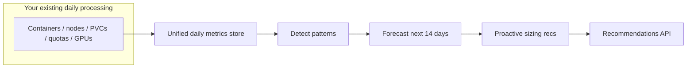

# Seasonality & Proactive Recommendations

!!! warning "Status: Planned / Future Work"
    This feature is **not yet implemented**. The description below is the intended
    product direction for a future ROS-OCP release. Reactive recommendations
    (rightsizing, quotas, nodes, PVCs, GPUs) remain available today.

!!! info "Quick Facts (planned)"
    **Scope:** All major optimization plugins (containers, nodes, PVCs, quotas, GPUs)  
    **Plugins:** `seasonality-detector` → `seasonality-forecast` → `seasonality-proactive`  
    **Phases:** Produce → Enrich → Optimize  
    **Forecasting:** [Augurs](https://github.com/grafana/augurs) (Grafana, Rust)  
    **History needed:** 90+ days of daily metrics (2+ years for annual patterns)

---

## The problem

Most recommendations today answer: *"Based on what you used recently, you should change this limit now."*

That helps after a spike has already stressed containers, quotas, nodes, or storage. Many teams already know their workloads are **seasonal** — holiday traffic, month-end batch jobs, Monday morning logins, steadily growing PVCs — but ROS does not yet warn them **ahead** of the next peak or capacity event.

**Seasonality & proactive recommendations** will learn recurring patterns from daily usage across your cluster and suggest changes **before** predictable demand arrives — for workloads, nodes, storage, quotas, and GPUs alike.

---

## What you will get

| Today (reactive) | Planned (proactive) |
|------------------|---------------------|
| "CPU request is too low for current usage" | "In 3 days, expect Monday 9am spike in `checkout` namespace — raise CPU request to 1200m" |
| "Namespace quota is nearly full" | "End-of-month peak in 7 days — raise production namespace CPU quota before the 28th" |
| "Node pool is busy now" | "Batch pattern suggests 10 nodes by month-end — scale worker pool from 6 now" |
| "PVC usage is high" | "At 1 GB/day growth, PVC fills in 18 days — expand to 150Gi before 2026-06-17" |
| Based on recent digest window | Based on detected weekly/monthly/annual cycles or growth trends |
| Applies when utilization is already high | Lead time configurable (default 7 days ahead) |

### Example: multiple plugins in one response

```json
{
  "proactive_recommendations": [
    {
      "plugin": "container",
      "entity": "checkout",
      "namespace": "ecommerce",
      "type": "seasonal_peak",
      "confidence": 0.94,
      "pattern": "weekly",
      "period_days": 7,
      "next_peak": "2026-06-02",
      "lead_time_days": 3,
      "detected_from": "12 prior occurrences (Mon 9am spike)",
      "current_values": {"cpu_request": "500m", "memory_limit": "1Gi"},
      "recommended_values": {"cpu_request": "1200m", "memory_limit": "2Gi"}
    },
    {
      "plugin": "pvc",
      "entity": "postgres-data-pvc",
      "namespace": "database",
      "type": "growth_projection",
      "confidence": 0.97,
      "pattern": "linear_growth",
      "days_until_full": 18,
      "current_usage_gb": 82,
      "capacity_gb": 100,
      "growth_rate_gb_per_day": 1.0,
      "recommended_action": "Expand PVC to 150Gi before 2026-06-17"
    },
    {
      "plugin": "node",
      "entity": "worker-pool",
      "cluster_id": "prod-east",
      "type": "seasonal_peak",
      "confidence": 0.88,
      "pattern": "monthly",
      "period_days": 30,
      "next_peak": "2026-06-28",
      "lead_time_days": 7,
      "detected_from": "4 prior occurrences (end-of-month batch)",
      "current_nodes": 6,
      "recommended_nodes": 10
    }
  ]
}
```

---

## Which optimizations are covered

Seasonality applies across ROS plugins, not only namespaces. Planned rollout order:

| When | Optimization area | Example pattern |
|------|-------------------|-----------------|
| First | **Containers** (namespace-level by default) | Weekly sale or Monday-morning CPU spike on an application namespace |
| First | **Nodes** | Recurring need for more workers before a known batch window |
| Next | **PVCs** | Steady growth — days until disk is full |
| Then | **Namespace & cluster quotas** | End-of-month or quarterly capacity ceilings |
| Later | **GPU** (time-slicing / MIG) | Retrain day spikes, weekday inference load |
| Not planned | **Snapshots** | Operational drift, not seasonal patterns |

If your charts already show repeating peaks or steady storage growth, proactive recommendations aim to turn that into **dated, plugin-specific actions**.

---

## Who benefits

- **E-commerce & retail** — Right-size `checkout-service` before Black Friday, not during it.
- **Finance & billing** — Add nodes and quota headroom before end-of-month batch (days 28–31).
- **Enterprise apps** — Plan for Monday-morning container and node surges.
- **Data platforms** — Expand PVCs before linear growth hits capacity.
- **Platform / FinOps** — Anticipate org-wide cluster quota peaks for budgeting.
- **ML teams** — Prepare GPU capacity before weekly retrain or weekday inference ramps.

---

## How it will work (high level)

ROS already collects **daily summaries** of usage from your cluster. Seasonality adds a shared history layer and three analysis plugins:



1. **Record** — Each optimization plugin stores one daily data point per workload, node, PVC, quota scope, etc. (no need to keep raw CSVs longer or re-read old recommendations).
2. **Detect** — Find weekly, monthly, longer cycles, or linear growth using proven time-series methods (not black-box AI).
3. **Forecast** — Project CPU, memory, storage, nodes, and GPU demand over the next two weeks (configurable).
4. **Recommend** — Combine the forecast with existing engines to produce concrete guidance per plugin: *set X to Y by date Z*.

Plugins run in three phases aligned with the [plugin execution model](../architecture/plugin-phases.md): pattern detection (Produce), forecasting (Enrich), proactive sizing (Optimize).

---

## Data and cold start

We **do not** need historical recommendation text or raw metric CSVs archived for years. We **do** need consistent **daily aggregated metrics** (many already derived from today's digest pipeline), kept long enough to see patterns repeat.

| Pattern | History needed |
|---------|----------------|
| Weekly (e.g. Monday surge) | ~2–3 weeks |
| Monthly (e.g. month-end batch) | ~2–3 months |
| Annual (e.g. holiday peak) | 2+ years |
| PVC growth trend | ~2 weeks of stable daily points |

| Retention | Purpose |
|-----------|---------|
| **90 days minimum** | Weekly and monthly pattern detection |
| **Up to 3 years** | Annual patterns; tiered daily → weekly → monthly storage |

Until enough daily history exists for an entity, proactive items for that entity will not appear — reactive rightsizing continues unchanged.

---

## Scale and storage

Seasonality is designed for **large clusters** (including 200k+ containers) without requiring hundreds of gigabytes of database storage.

### Namespace-level by default

For most fleets, ROS learns patterns at **namespace** scope (your application boundary), not for every individual container:

- **Applications live in namespaces** — Black Friday spikes and month-end batch jobs are namespace-wide events, not single-pod quirks.
- **Containers come and go** — pod restarts and reschedules make per-container history noisy and often meaningless.
- **Cleaner signal** — averaging usage across replicas in a namespace produces more reliable weekly and monthly patterns.
- **Matches how you act** — quota changes and capacity planning target namespaces and node pools, not ephemeral pod IDs.

Proactive container recommendations still name workloads in API responses; the underlying history is aggregated per namespace unless you opt in to finer granularity.

### Optional container-level tracking

If you need forecasts for specific critical namespaces (checkout, payments, ML inference, etc.), you can enable **container-level** seasonal tracking for those namespaces only via the Settings API — you do not need history for every sidecar in the cluster.

### Lightweight storage

Even on very large clusters, default settings keep storage modest (on the order of **~2 GB** for a 200k-container fleet with namespace-level metrics plus a handful of opt-in application namespaces). ROS skips stable workloads that show no seasonal variation, and long-term history uses coarser weekly and monthly aggregates after the first 90 days.

| Cluster profile | What ROS tracks by default |
|-----------------|----------------------------|
| Small (&lt;1000 containers) | Can track every container if desired |
| Medium to large (1k–200k+) | Namespace-level patterns; optional per-container history for namespaces you choose |

See the [internal design doc](../../../docs/design/seasonality-plugin.md#scalability) for technical sizing tables and operator decision guidance.

---

## Why Augurs (and not a large AI model)

ROS will use **[Augurs](https://github.com/grafana/augurs)** — an open-source Rust library from Grafana Labs built for **observability metrics** like the ones clusters already export.

| Benefit | Why it matters to you |
|---------|------------------------|
| Built for metrics | Same domain as Prometheus/OpenShift usage data |
| Fast & small | Runs on-prem without GPUs or multi-gigabyte Python stacks |
| Explainable | Recommendations cite pattern type, period, and prior occurrences — not "the model said so" |
| Proven methods | Seasonal decomposition (MSTL) and ETS forecasting — standard for periodic infrastructure load |

We evaluated larger forecasting systems ([Moirai](https://github.com/SalesforceAIResearch/Moirai), [TimesFM](https://github.com/google-research/timesfm), [Chronos-2](https://github.com/amazon-science/chronos-forecasting)) and Python toolkits ([Merlion](https://github.com/salesforce/Merlion), [Orbit](https://github.com/uber/orbit)). They are valuable for research and offline benchmarks, but **too heavy and opaque** for default on-prem deployment. An optional **premium sidecar** with GPU-backed models may be offered later for advanced tenants.

### GPU-accelerated forecasting (optional)

For **most workloads**, the default CPU-based engine (Augurs) is enough: it detects weekly and monthly patterns, projects PVC growth, and forecasts namespace-level demand without extra hardware.

Organizations that **already run GPU nodes** (SaaS or on-prem) can optionally enable a **second tier** that uses foundation-model forecasting ([Chronos-2](https://github.com/amazon-science/chronos-forecasting), Apache 2.0) for workloads where classical methods leave high unexplained variance — for example irregular retail spikes (Black Friday), end-of-quarter batch surges, or correlated CPU/memory/GPU ramps that simple seasonality misses.

| | Default (Tier 1) | Optional GPU tier (Tier 2) |
|--|------------------|----------------------------|
| **Requires GPUs** | No | Yes |
| **Configuration** | On with seasonality | Opt-in (`ROS_SEASONALITY_GPU_ENABLED`) |
| **Best for** | Regular weekly/monthly patterns, steady PVC growth | Complex, irregular, multi-metric peaks |
| **When we ship** | First | After Tier 1 is stable |

This tier is **opt-in via configuration** — ROS works fully without GPUs. Benefits of enabling it include better accuracy on irregular spikes and improved multi-metric correlation when several signals move together before a known event.

---

## Configuration (planned)

Settings will follow the same pattern as other ROS features (environment variables + per-org Settings API):

| Setting | Default | Purpose |
|---------|---------|---------|
| Enable seasonality | off | Master switch |
| Scope (`ROS_SEASONALITY_SCOPE`) | `namespace` | Learn container patterns per namespace (recommended for large clusters) |
| Container-level namespaces | *(none)* | Opt-in list for per-container history in critical namespaces |
| Minimum history days | 90 | Wait until enough daily metrics |
| Confidence threshold | 0.8 | Suppress uncertain patterns |
| Forecast horizon | 14 days | How far ahead to project |
| Lead time | 7 days | How early to warn before a peak |
| Daily / weekly / monthly retention | 90 / 52 / 36 | Tiered history for long-term patterns without excess storage |

Individual optimization plugins (container, node, PVC, etc.) stay enabled via existing plugin settings; seasonality consumes their daily metrics when those plugins run.

**Settings API (planned):** `PUT /recommendations/openshift/settings/seasonality` with fields such as `container_level_namespaces` for opt-in container tracking.

---

## Relationship to other features

- **[Business hours](business-hours.md)** — You define fixed schedules (Mon–Fri 9–5). Seasonality **learns** patterns from data; both can apply to scheduled clusters.
- **[Container](container-recommendations.md), [node](node-recommendations.md), [PVC](pvc-rightsizing.md), [quota](quota-recommendations.md), [cluster quota](cluster-resource-quota.md), [GPU time-slicing](gpu-time-slicing.md) / [GPU MIG](gpu-mig.md)** — Proactive sizing reuses the same engines, adding forward-looking context per plugin.
- **[History & quality](history-and-quality.md)** — Tracks how past recommendations behaved over time; seasonality uses **usage** history, not past recommendation rows.

---

## Timeline

Delivery is planned in phases:

1. **Containers + nodes** (highest impact)
2. **PVCs** (predictable growth)
3. **Namespace and cluster quotas**
4. **GPU** (if demand warrants)
5. **Snapshots** — not in scope for seasonality

Core functionality is estimated at **10–14 weeks** engineering plus QA (see internal design for detail). Optional calendar-aware annual enhancements may follow.

[`docs/design/seasonality-plugin.md`](../../../docs/design/seasonality-plugin.md)

---

## Related documentation

| Document | Audience |
|----------|----------|
| [Plugin execution phases](../architecture/plugin-phases.md) | How phased plugins run |
| [Configurability](../architecture/configurability.md) | Settings precedence model |
| Internal design | [`docs/design/seasonality-plugin.md`](../../../docs/design/seasonality-plugin.md) |
