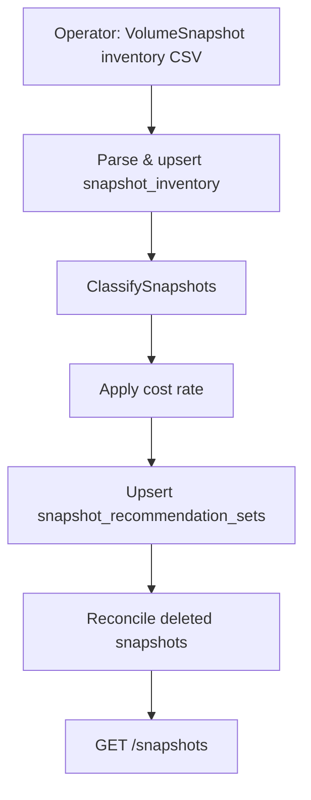

# Snapshot Staleness Detection

!!! info "Quick Facts"
    **API:** `GET /api/cost-management/v1/recommendations/openshift/snapshots`  
    **Scope:** Per VolumeSnapshot  
    **Engines:** single (no cost/performance split; no term windows)  
    **Savings:** Yes — recoverable **monthly cost** (`estimated_monthly_cost_usd`)  
    **Configurable:** Yes (dedicated Settings API)

## Overview

Snapshot staleness detection identifies Kubernetes `VolumeSnapshot` objects that
accumulate storage cost without providing ongoing value. ROS classifies each
snapshot as orphaned, stale, redundant, never-restored, managed by a backup tool,
or active — and estimates the monthly cost of retaining it.

This complements [PVC Right-Sizing](pvc-rightsizing.md), which optimizes live
PersistentVolumeClaim capacity. Snapshots address the often-forgotten storage
layer that persists after backups, migrations, or PVC deletion.

## When it applies

- **Clusters with CSI snapshot support** — The `snapshot.storage.k8s.io` CRDs and
  a VolumeSnapshotClass must be installed. The koku-metrics-operator skips
  collection gracefully when the CRD is absent.
- **Any namespace** — Inventory covers all VolumeSnapshots the operator can list.
- **All snapshots are classified** — Including backup-managed snapshots (shown as
  `managed`, not hidden) and active snapshots with no notification.

Snapshots with an empty `source_pvc_name` (e.g., created from pre-provisioned
VolumeSnapshotContent) skip orphaned and redundant checks but can still be
classified as stale, never-restored, managed, or active.

## How it works



1. **Collection** — The koku-metrics-operator lists `VolumeSnapshot` objects and
   cross-references PVC `dataSource` fields to count restores and detect whether
   the source PVC still exists. Output is a snapshot-inventory CSV (filename must
   contain the substring `"snapshot"`).
2. **Ingestion** — ROS parses the CSV into `snapshot_inventory` (raw staging,
   retained ~48 hours).
3. **Classification** — The latest inventory per cluster (within a 6-hour fresh
   window) is evaluated against tenant thresholds.
4. **Cost estimate** — `estimated_monthly_cost_usd = (restore_size_bytes / GiB) × cost_per_gib_month_usd`.
   This is a ceiling estimate for providers with incremental snapshot behavior.
5. **Persistence** — One row per snapshot in `snapshot_recommendation_sets`, updated
   on each ingestion. Snapshots deleted from the cluster are removed on the next
   reconcile cycle.

## Classification

Evaluated in priority order (first match wins):

| Type | Condition | Code | Severity |
|------|-----------|------|----------|
| **orphaned** | Source PVC deleted and age > `orphan_age_days` | 31 | WARNING |
| **managed** | Backup-tool label detected (Velero, Kasten K10, OADP, Trilio, Stash) | 35 | INFO |
| **redundant** | More than `redundant_threshold` snapshots for same source PVC; this one is outside the N most recent and age > `stale_days` | 33 | INFO |
| **stale** | Age > `stale_days` and `restored_pvc_count == 0` | 34 | INFO |
| **never_restored** | Age > `never_restored_days` and never restored | 32 | INFO |
| **active** | Recent snapshot or has active restores | — | — |

Orphaned takes precedence even for managed snapshots. Managed supersedes
stale/redundant/never-restored so backup retention policies are not flagged as waste.

Redundant detection avoids noise on intentional retention windows: a team keeping
seven recent daily snapshots gets no redundancy alerts until older snapshots exceed
the keep count **and** the staleness threshold.

## API

```http
GET /api/cost-management/v1/recommendations/openshift/snapshots
```

Filters: `cluster_uuid`, `namespace`, `recommendation_type` (`orphaned`,
`never_restored`, `redundant`, `stale`, `managed`, `active`), pagination
(`limit`, `offset`; default limit 20, max 100). Results sort by `age_days`
descending.

Settings (separate from the unified thresholds API):

```http
GET /api/cost-management/v1/recommendations/openshift/settings/snapshot
PUT /api/cost-management/v1/recommendations/openshift/settings/snapshot
DELETE /api/cost-management/v1/recommendations/openshift/settings/snapshot
```

DELETE returns `204` and clears per-org snapshot threshold overrides. Blocked when
`ROS_SETTINGS_LOCKED_SNAPSHOT` is true under global lock (GET includes `settings_locked: true`).

### Example (abbreviated)

```json
{
  "meta": { "count": 1, "limit": 20, "offset": 0, "currency": "USD" },
  "data": [{
    "cluster_uuid": "...",
    "namespace": "production",
    "snapshot_name": "db-backup-2025-12-01",
    "source_pvc_name": "postgres-data",
    "volume_snapshot_class": "csi-aws-vsc",
    "storageclass": "gp3",
    "creation_timestamp": "2025-12-01T03:00:00Z",
    "restore_size_bytes": 53687091200,
    "age_days": 158,
    "source_pvc_exists": true,
    "restored_pvc_count": 0,
    "managed_by": "",
    "recommendation_type": "stale",
    "estimated_monthly_cost_usd": 2.50,
    "notifications": {
      "34": {
        "type": "INFO",
        "message": "Snapshot older than retention threshold with no known usage",
        "code": 34
      }
    }
  }]
}
```

Fleet cost rollup: `GET .../recommendations/openshift/savings-summary` includes
snapshot totals in `by_plugin.snapshot` as **recoverable cost**, not savings.

## Configurable thresholds

`GET/PUT/DELETE .../settings/snapshot`

| Parameter | Default | Purpose |
|-----------|---------|---------|
| `orphan_age_days` | 7 | Min age before orphaned; also the "active" ceiling |
| `never_restored_days` | 30 | Min age for never-restored classification |
| `stale_days` | 90 | Age threshold for stale and redundant filter |
| `redundant_threshold` | 3 | Max snapshots to keep per source PVC before flagging older ones |
| `cost_per_gib_month_usd` | 0.05 | Monthly rate for cost estimation |

Precedence for threshold fields: env var (locks field) → tenant DB row → compiled
default. Env locks appear in `locked_fields`; PUT on a locked field returns `403`.

Cost rate resolution at ingestion (when no org DB override exists):

1. Per-org Settings API value
2. `ROS_SNAPSHOT_COST_PER_GIB_MONTH` env var
3. `storage_gb_usage_per_month` from Koku `effective_rates` (when savings estimates enabled)
4. Compiled default ($0.05/GiB/month)

Admin-only operational settings (not exposed via Settings API):

| Env variable | Default | Purpose |
|--------------|---------|---------|
| `ROS_SNAPSHOT_INVENTORY_FRESH_HOURS` | 6 | Recent-ingest window for classification and reconcile |
| `ROS_SNAPSHOT_INVENTORY_RETENTION_HOURS` | 48 | Raw inventory row retention |
| `ROS_SNAPSHOT_STALE_GRACE_HOURS` | 48 | Skip reconcile during transient ingest gaps |

See [Cost Integration](../architecture/cost-integration.md) for the savings
formula and [Savings Estimations](savings-estimations.md) for fleet-summary
behavior.

## Limitations

- **No historical restore tracking** — `restored_pvc_count` reflects only PVCs
  that currently exist with `dataSource` pointing to the snapshot. Restores that
  were later deleted are invisible.
- **Same-namespace restores only** — Cross-namespace restores via
  VolumeSnapshotContent are not counted.
- **Incremental snapshot pricing** — Cost based on `restoreSize` is a ceiling for
  providers like AWS EBS where subsequent snapshots are incremental.
- **Single org-wide cost rate** — Per-VolumeSnapshotClass rates are not yet supported;
  `volume_snapshot_class` is collected for future use.

## Related

- [PVC Right-Sizing](pvc-rightsizing.md) — Live PVC capacity optimization
- [Savings Estimations](savings-estimations.md) — Fleet cost rollup (`by_plugin.snapshot`)
- [Cost Integration](../architecture/cost-integration.md) — Rate resolution and formulas
