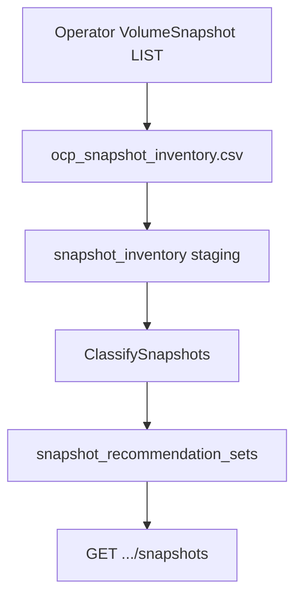

# Snapshot Staleness

!!! info "Quick Facts"
    **What it does:** Classifies VolumeSnapshots as orphaned, stale, redundant, never-restored, or backup-managed  
    **Data source:** koku-metrics-operator snapshot inventory CSV (`ocp_snapshot_inventory.csv`)  
    **Update frequency:** Once per operator upload cycle (default ~6 hours)  
    **Plugin:** `snapshot` (priority 40, native engine)  
    **API:** `GET /api/cost-management/v1/recommendations/openshift/snapshots`  
    **Configurable:** Yes — per-org Settings API + admin env vars (`ROS_SNAPSHOT_*`)  
    **Key thresholds:** orphan 7d, never-restored 30d, stale/redundant 90d, redundant cap 3 per PVC  
    **Savings:** Reclaimable holding cost on non-`active` / non-`managed` rows when savings estimates are enabled

## Overview

VolumeSnapshots accumulate over time and consume backing storage (EBS, Azure Disk, Ceph/ODF).
Snapshot staleness ingests cluster inventory, classifies each snapshot, and surfaces cleanup
candidates with estimated monthly holding cost and notification codes for the UI.

Detection is **read-only** — ROS does not delete snapshots or orchestrate backup retention.

## How it works



1. **Collection** — Operator lists `VolumeSnapshot` objects and cross-references PVC
   `dataSource` for restore counts (skipped if `snapshot.storage.k8s.io` CRDs are absent).
2. **Ingestion** — ROS upserts `snapshot_inventory` rows per upload.
3. **Classification** — Priority: orphaned → managed → redundant → stale → never_restored → active.
4. **Reconciliation** — Recommendations not in fresh inventory are removed on the next cycle.
5. **API** — List and namespace/cluster summary endpoints expose classifications, notifications, and reclaimable totals.

## Classification categories

| Type | Rule (simplified) | Notification |
|------|-------------------|--------------|
| **orphaned** | Source PVC deleted and age > `orphan_age_days` | Code **31** (WARNING) |
| **managed** | Backup-tool labels (Velero, Kasten, OADP, etc.) | Code **35** (INFO) |
| **redundant** | More than `redundant_threshold` snapshots per PVC; this one is older than the N newest and age > `stale_days` | Code **33** (INFO) |
| **stale** | Age > `stale_days`, never restored, not managed | Code **34** (INFO) |
| **never_restored** | `restored_pvc_count == 0`, age > `never_restored_days`, not managed | Code **32** (INFO) |
| **active** | Recent or has restores | No snapshot notification code |

Empty `source_pvc_name` skips orphaned/redundant rules but still allows stale, never_restored, and managed.

## API endpoints

### List

`GET /api/cost-management/v1/recommendations/openshift/snapshots`

Returns one row per classified snapshot (default sort: `age_days` descending).

### Summary

`GET /api/cost-management/v1/recommendations/openshift/snapshots/summary`

Aggregates by namespace (`group_by=project`, default) or cluster (`group_by=cluster`).
Reclaimable size and cost exclude `active` and `managed` snapshots.

### Settings

| Method | Path |
|--------|------|
| GET | `/api/cost-management/v1/recommendations/openshift/settings/snapshot` |
| PUT | `/api/cost-management/v1/recommendations/openshift/settings/snapshot` |
| DELETE | `/api/cost-management/v1/recommendations/openshift/settings/snapshot` |

DELETE returns **204 No Content** and removes per-org overrides (env-locked fields unchanged).

## Query parameters (list)

| Parameter | Type | Description |
|-----------|------|-------------|
| `filter[cluster]` | UUID | Cluster UUID (RBAC-scoped) |
| `filter[project]` | string | Namespace |
| `filter[recommendation_type]` | enum | `orphaned`, `never_restored`, `redundant`, `stale`, `managed`, `active` |
| `limit` | int | 1–100 (default 20) |
| `offset` | int | Pagination offset (default 0) |

Legacy flat names (`cluster_uuid`, `namespace`, `recommendation_type`) may be accepted where documented in [query parameters](../plugin-reference/query-parameters.md).

**List sorting:** Results are ordered by `age_days` descending (no `order_by` on the list endpoint).

### Summary `order_by`

When using the summary endpoint:

| `order_by` | Sorts by |
|------------|----------|
| `reclaimable_monthly_holding_cost_usd` | Reclaimable monthly cost (default when `order_by` set) |
| `reclaimable_restore_size_gib` | Reclaimable restore size |
| `actionable_snapshot_count` | Non-active, non-managed count |
| `snapshot_count` | Total snapshots in group |

Use `order_how=asc` or `desc` (default `desc` when `order_by` is present). `limit` 1–100 (default 10), `offset` for pagination.

## Settings

| API field | Env var (locks field) | Default | Purpose |
|-----------|----------------------|---------|---------|
| `orphan_age_days` | `ROS_SNAPSHOT_ORPHAN_AGE_DAYS` | 7 | Orphan + active ceiling |
| `never_restored_days` | `ROS_SNAPSHOT_NEVER_RESTORED_DAYS` | 30 | Never-restored threshold |
| `stale_days` | `ROS_SNAPSHOT_STALE_DAYS` | 90 | Staleness and redundant age gate |
| `redundant_threshold` | `ROS_SNAPSHOT_REDUNDANT_THRESHOLD` | 3 | Snapshots to keep per PVC |
| `cost_per_gib_month_usd` | `ROS_SNAPSHOT_COST_PER_GIB_MONTH` | 0.05 | Monthly $/GiB holding estimate |
| `inventory_fresh_hours` | `ROS_SNAPSHOT_INVENTORY_FRESH_HOURS` | 6 | Fresh inventory window for classify/reconcile |

GET also returns `locked_fields` for env-overridden values. PUT on a locked field returns **403**.

Example GET response:

```json
{
  "orphan_age_days": 7,
  "never_restored_days": 30,
  "stale_days": 90,
  "redundant_threshold": 3,
  "cost_per_gib_month_usd": 0.05,
  "inventory_fresh_hours": 6,
  "locked_fields": []
}
```

## Notification codes

Filter the catalog: `GET /recommendations/openshift/notification-codes?filter[plugin]=snapshot`.

| Code | Severity | Classification | Message |
|------|----------|----------------|---------|
| **31** | WARNING | orphaned | Source PVC was deleted; snapshot may no longer be needed |
| **32** | INFO | never_restored | Snapshot has never been used to restore a volume |
| **33** | INFO | redundant | Newer snapshot exists for the same PVC |
| **34** | INFO | stale | Snapshot older than retention threshold with no known usage |
| **35** | INFO | managed | Snapshot is managed by backup tool — review retention policy for cost optimization |

List rows expose a `notifications` map (string code keys → `{type, message, code}`). `active` rows omit snapshot codes.

See [Notification codes — Snapshots](../architecture/notification-codes.md#snapshots).

## RBAC

When RBAC is enabled, list and summary results are limited to clusters in the caller's
`openshift.cluster` permissions. Unauthenticated requests return **401**.

## Plugin management

Include `snapshot` in `ROS_ENABLED_PLUGINS` (or leave the allowlist empty for all native plugins).
When disabled, snapshot routes return **404**.

Per-tenant enable/disable: `GET|PUT|DELETE /recommendations/openshift/settings/snapshot` (plugin settings block).
See [Configurability — Snapshot](../architecture/configurability.md#snapshot).

## Reclaimable storage savings

Estimated monthly holding cost:

```
estimated_monthly_cost_usd = (restore_size_bytes / 1073741824) * cost_per_gib_month_usd
```

`restore_size_bytes` comes from VolumeSnapshot `.status.restoreSize` (logical size — a ceiling for incremental providers).

- **Summary** — `reclaimable_restore_size_bytes`, `reclaimable_monthly_holding_cost_usd` sum non-active, non-managed snapshots per namespace or cluster.
- **Fleet rollup** — `GET /recommendations/openshift/savings-summary` includes `by_plugin.snapshot` when the plugin is enabled and cost data exists.

When `ROS_SAVINGS_ESTIMATES_ENABLED=false`, dollar fields are omitted; classifications and notifications still apply.

Cost rate resolution: per-org settings → env lock → Masu `storage_gb_usage_per_month` (when enabled) → default $0.05/GiB. See [cost integration](../architecture/cost-integration.md).

## Related documentation

- [Plugin reference — snapshot](../plugin-reference/snapshot.md)
- [Internal design](../../docs/features-f-snapshot-staleness.md)
- [IQE requirement `cost_ros_ocp_snapshot`](../testing/iqe-requirements-registration.md)
