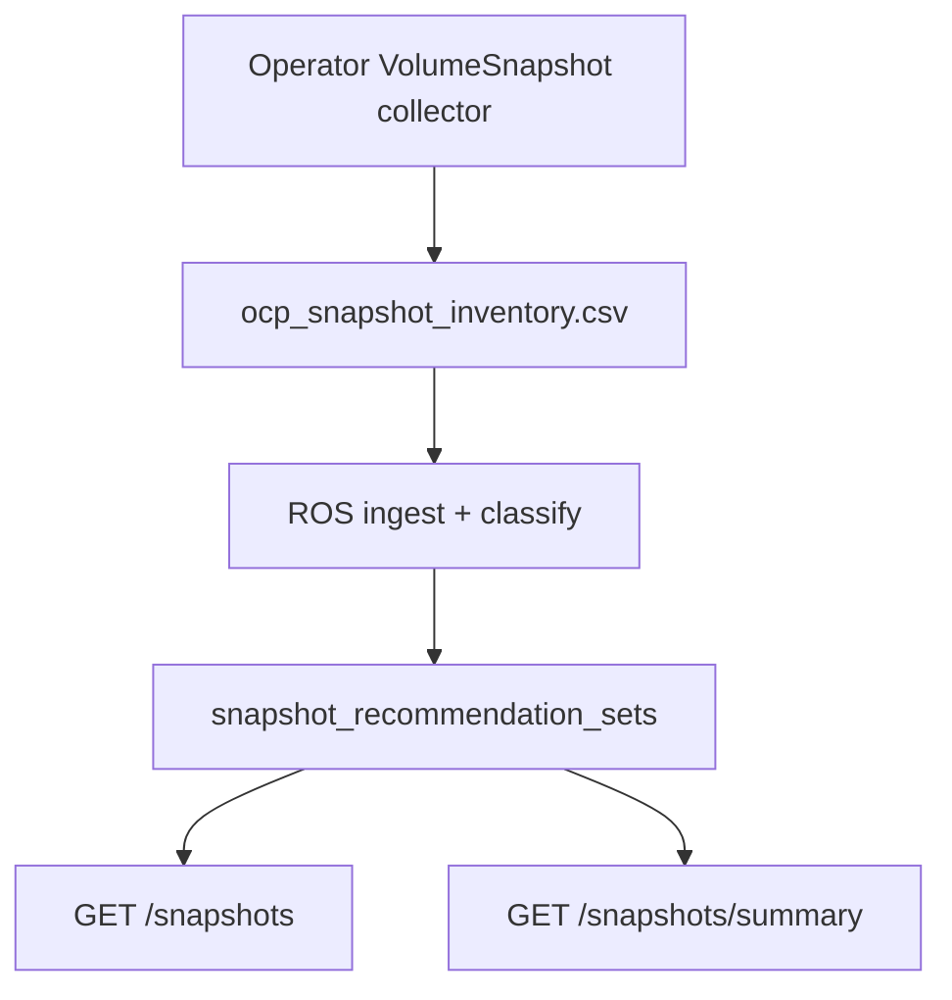

# Snapshot Staleness

!!! info "Quick Facts"
    **What it does:** Classifies VolumeSnapshots as orphaned, never-restored, redundant, stale, managed, or active  
    **Data source:** koku-metrics-operator snapshot inventory CSV (`ocp_snapshot_inventory.csv`)  
    **Update frequency:** Once per operator upload cycle (default every 6 hours)  
    **Plugin:** `snapshot` (priority 40; enable via `ROS_ENABLED_PLUGINS` or empty allowlist)  
    **API:** `GET .../snapshots`, `GET .../snapshots/summary`, `GET|PUT|DELETE .../settings/snapshot`  
    **Configurable:** Yes — per-org Settings API + admin env vars (`ROS_SNAPSHOT_*`)  
    **Savings:** Reclaimable monthly holding cost from `restore_size_bytes` × `cost_per_gib_month_usd` when savings estimates are enabled

## Overview

VolumeSnapshots accumulate on OpenShift clusters and often outlive the workloads they
protected. Each snapshot consumes backing storage (EBS, Azure Disk, Ceph/ODF, etc.) with
ongoing cost. Snapshot staleness detection ingests operator inventory, classifies each
snapshot, and surfaces cleanup candidates with notification codes and reclaimable cost
estimates.

## How it works



1. **Collection** — The koku-metrics-operator lists `VolumeSnapshot` objects and
   cross-references PVC `dataSource` for restore counts (skipped if CRDs are not installed).
2. **Ingestion** — ROS parses inventory rows into `snapshot_inventory`, then classifies
   and upserts `snapshot_recommendation_sets`.
3. **Reconciliation** — Snapshots absent from fresh inventory are removed from recommendations.
4. **API** — List and summary endpoints expose classifications, notifications, and reclaimable totals.

See the [snapshot plugin reference](../plugin-reference/snapshot.md) for handler links and
the [internal design doc](../../docs/features-f-snapshot-staleness.md) for full classification rules.

## Classification types

Precedence when multiple rules apply: **orphaned** → **managed** → **redundant** → **stale** → **never_restored** → **active**.

| Type | When | User action |
|------|------|-------------|
| **orphaned** | Source PVC no longer exists and age > `orphan_age_days` (default 7) | Review whether the snapshot is still needed after PVC deletion |
| **never_restored** | `restored_pvc_count == 0`, age > `never_restored_days` (30), not managed | Snapshot has never been used to restore a volume |
| **redundant** | More than `redundant_threshold` (3) snapshots per source PVC; this one is not among the N newest; age > `stale_days`; not managed | Older snapshot superseded by newer ones for the same PVC |
| **stale** | Age > `stale_days` (90), never restored, not managed | Snapshot exceeds retention threshold with no known usage |
| **managed** | Labels match a known backup tool (Velero, Kasten, OADP, etc.) | Review backup retention policy — not a false stale alert |
| **active** | Recent snapshot or `restored_pvc_count > 0` | No notification (healthy) |

`active` rows do not emit snapshot notification codes (31–35).

## API endpoints

Base path: `/api/cost-management/v1/recommendations/openshift/`

### List recommendations

```
GET /snapshots
```

Returns one row per classified VolumeSnapshot.

| Parameter | Type | Description |
|-----------|------|-------------|
| `filter[cluster]` | UUID | Filter by cluster (`cluster`, `cluster_uuid`) |
| `filter[project]` | string | Filter by namespace (`namespace`, `project`) |
| `filter[recommendation_type]` | enum | `orphaned`, `never_restored`, `redundant`, `stale`, `managed`, `active` |
| `limit` | int | Results per page (1–100, default 20) |
| `offset` | int | Pagination offset |

List rows are sorted by `age_days` descending. `order_by` and `order_how` apply only on
`GET /snapshots/summary` (see below), not on the list endpoint.

Bracket syntax is preferred; see [API query parameters](../plugin-reference/query-parameters.md).

### Summary (aggregated)

```
GET /snapshots/summary
```

Rolls up metrics per namespace (default; use `group_by=project` or `group_by=namespace`) or per cluster (`group_by=cluster`).
Use reclaimable fields to prioritize namespaces with orphaned, stale, never-restored, or
redundant snapshots (excludes **active** and **managed** from reclaimable totals).

| Parameter | Type | Description |
|-----------|------|-------------|
| `group_by` | enum | `project` or `namespace` (default per-namespace rollup) or `cluster` |
| `filter[cluster]` | UUID | Filter by cluster |
| `filter[project]` | string | Filter by namespace |
| `filter[recommendation_type]` | enum | Same values as list |
| `order_by` | string | `reclaimable_monthly_holding_cost_usd`, `reclaimable_restore_size_gib`, `actionable_snapshot_count`, `snapshot_count` |
| `order_how` | string | `asc` or `desc` (default `desc` for reclaimable cost) |
| `limit` | int | Page size (1–100, default 10) |
| `offset` | int | Pagination offset |

Summary row fields include `snapshot_count`, `actionable_snapshot_count`, `counts_by_type`,
`reclaimable_restore_size_bytes`, `reclaimable_restore_size_gib`, and
`reclaimable_monthly_holding_cost_usd`.

### Settings

```
GET    /settings/snapshot
PUT    /settings/snapshot
DELETE /settings/snapshot
```

| Field | Purpose |
|-------|---------|
| `orphan_age_days` | Min age for orphaned; also ceiling for **active** |
| `never_restored_days` | Min age for **never_restored** |
| `stale_days` | Staleness and redundant age gate |
| `redundant_threshold` | Max snapshots to keep per PVC before flagging excess |
| `cost_per_gib_month_usd` | Monthly $/GiB for holding cost estimates |
| `inventory_fresh_hours` | Hours of recent inventory used for classify/reconcile |
| `locked_fields` | Settings fixed by `ROS_SNAPSHOT_*` env vars (PUT returns 403) |

Administrators lock thresholds with `ROS_SNAPSHOT_ORPHAN_AGE_DAYS`, `ROS_SNAPSHOT_STALE_DAYS`,
`ROS_SNAPSHOT_NEVER_RESTORED_DAYS`, `ROS_SNAPSHOT_REDUNDANT_THRESHOLD`,
`ROS_SNAPSHOT_COST_PER_GIB_MONTH`, `ROS_SNAPSHOT_INVENTORY_FRESH_HOURS`, etc.
See [Configurability — Snapshot](../architecture/configurability.md#snapshot).

## Notification codes

Filter the catalog: `GET /recommendations/openshift/notification-codes?filter[plugin]=snapshot`.

| Code | Severity | Classification | Message (summary) |
|------|----------|----------------|-------------------|
| **31** | WARNING | Orphaned | Source PVC was deleted; snapshot may no longer be needed |
| **32** | INFO | Never restored | Snapshot has never been used to restore a volume |
| **33** | INFO | Redundant | Newer snapshot exists for the same PVC |
| **34** | INFO | Stale | Snapshot older than retention threshold with no known usage |
| **35** | INFO | Managed | Snapshot is managed by a backup tool — review retention for cost |

See [Notification codes — Snapshots](../architecture/notification-codes.md#snapshots).

## RBAC

When `RBAC_ENABLE=true`, snapshot list and summary endpoints scope results to clusters the
caller may read (`openshift.cluster:*:*`, consistent with quota, PVC, and node plugins).

- **Permission:** `openshift.cluster` (read on allowed cluster UUIDs).
- **Behavior:** Results are limited to authorized clusters. `filter[cluster]` for an
  unknown or unauthorized cluster UUID returns **200** with an empty `data` array and
  `meta.count` of **0** (not **403**), matching other ROS list APIs.
- **No ROS permissions:** Identity middleware returns **403**.

Project-level filtering via `openshift.project` applies where configured on shared list patterns.

## Savings estimates

Reclaimable cost uses snapshot logical size (`restore_size_bytes`) and a configurable
monthly rate:

```
estimated_monthly_cost_usd = (restore_size_bytes / 1073741824) * cost_per_gib_month_usd
```

**Reclaimable** totals on the summary endpoint sum **orphaned**, **stale**, **never_restored**,
and **redundant** rows only (not **managed** or **active**).

When `ROS_SAVINGS_ESTIMATES_ENABLED=false`, ingestion skips Masu effective-rates lookup; dollar
fields still use the per-org Settings API value, env-locked rate, or compiled `$0.05`/GiB default.
Classifications always apply. Fleet rollup: `GET /recommendations/openshift/savings-summary`
includes snapshot plugin totals from persisted `estimated_monthly_cost_usd` values.

Rate resolution: per-org Settings API → `ROS_SNAPSHOT_COST_PER_GIB_MONTH` env → Koku
`storage_gb_usage_per_month` from effective rates (when Masu is available) → compiled default
`$0.05`/GiB/month. Billing-derived snapshot costs are planned in [COST-7523](https://redhat.atlassian.net/browse/COST-7523).

## Plugin management

| Control | Purpose |
|---------|---------|
| `ROS_ENABLED_PLUGINS` | Allowlist; include `snapshot` to enable (empty allowlist = all native plugins) |
| `ROS_DISABLED_PLUGINS` | Denylist; omit `snapshot` from enabled set |
| Disabled plugin | **404** on `/snapshots`, `/snapshots/summary`, and `/settings/snapshot` |

Per-tenant plugin toggles follow the same pattern as other native plugins when exposed by
your deployment. See [Plugin architecture](../architecture/plugin-architecture.md).

## Fleet savings rollup

```
GET /api/cost-management/v1/recommendations/openshift/savings-summary
```

Includes snapshot reclaimable totals in `by_plugin.snapshot` when the plugin is enabled and
cost data exists.

## Limitations (v1)

- **Detection only** — ROS does not delete snapshots or orchestrate backup retention.
- **Restore history** — `restored_pvc_count` reflects currently mounted PVCs with `dataSource`
  pointing at the snapshot, not historical restores.
- **Incremental snapshots** — `restore_size_bytes` is a ceiling estimate on cloud providers
  with incremental snapshot billing.
- **CRD requirement** — Operator skips collection when `snapshot.storage.k8s.io` is not installed.

See [known issues](../known-issues.md) and the
[internal design doc](../../docs/features-f-snapshot-staleness.md#limitations-and-considerations).

## Related documentation

- [Snapshot plugin reference](../plugin-reference/snapshot.md)
- [Configurability — Snapshot](../architecture/configurability.md#snapshot)
- [Internal design doc](../../docs/features-f-snapshot-staleness.md)
