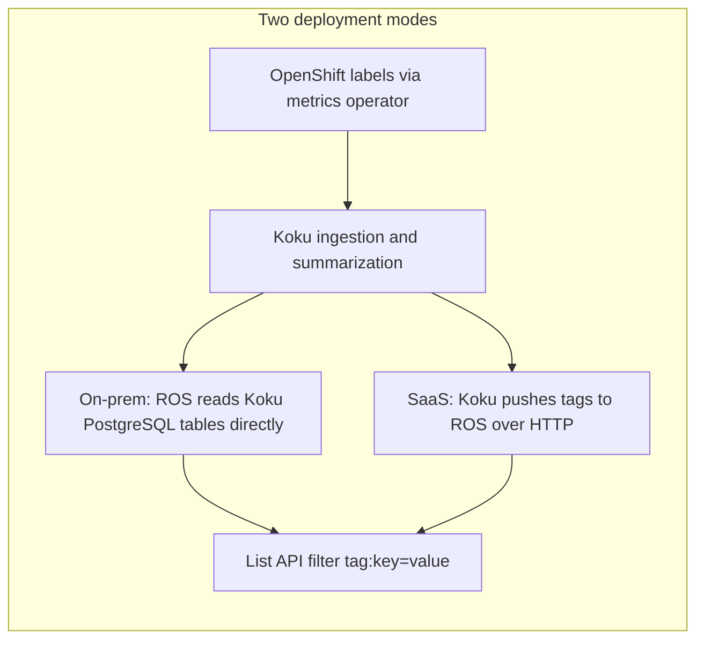

# Tag Filtering

Filter ROS recommendations by OpenShift labels (tags) that Cost Management already
tracks for billing — for example, show only workloads in `environment=production`.

Tag filtering uses the same bracket syntax as Koku Cost Management reports. The feature
must be enabled with `ROS_TAGS_ENABLED=true` on the ROS API deployment.

---

## How tags reach ROS

Tags flow from your cluster through Cost Management ingestion. **How ROS reads them**
depends on your deployment:



### On-prem (default): shared database

In cost-onprem and similar deployments, Koku and ROS use the **same PostgreSQL
database**. ROS reads enabled tag keys and values from Koku tenant tables at query
time. There is no separate sync step, no push API, and no ServiceAccount authentication
between services.

**Operator checklist:**

1. Enable tag keys in Cost Management **Settings → Tags** (same as for cost reports).
2. Set `ROS_TAGS_ENABLED=true` and `ROS_TAGS_SOURCE=db` on ROS (default).
3. Ensure ROS database credentials can read Koku tenant schemas (`org{org_id}`).

Tags are as fresh as the last OCP cost summarization — typically within one daily
processing cycle after new labels appear on pods.

#### Caveats and operational risks (`ROS_TAGS_SOURCE=db`)

When ROS reads tags directly from Koku PostgreSQL tables, list filtering depends on
**stable Koku schema and table names** in each tenant schema (`org{org_id}`):

| Koku table | ROS usage |
|------------|-----------|
| `reporting_enabledtagkeys` | Which OCP tag keys are enabled for filtering |
| `reporting_ocptags_values` | Distinct tag key/value pairs scoped to cluster and namespace |

**Coupling risk:** If a Koku upgrade renames, splits, or restructures these tables (or changes
column semantics ROS JOINs on), tag filtering can fail at query time even when ROS itself is
healthy.

**Startup health check limits:** With `ROS_TAGS_SOURCE=db`, ROS probes
`reporting_enabledtagkeys` at startup ([`internal/tags/verify.go`](../../internal/tags/verify.go)).
That confirms the table is reachable (or empty). It does **not** detect schema drift — for
example renamed columns, moved data, or incompatible type changes that still allow
`SELECT 1 … LIMIT 1` to succeed.

**Recommendations for operators:**

1. Pin ROS and Koku to a **known compatible version pair** in on-prem releases (same Helm chart
   revision or documented matrix).
2. **Monitor Koku migrations** that touch `reporting_enabledtagkeys` or
   `reporting_ocptags_values` before upgrading production.
3. After Koku upgrades, smoke-test tag filters on a non-production tenant before wide rollout.
4. Prefer SaaS push mode (`ROS_TAGS_SOURCE=api`) when databases are separate — ROS stores a
   copy in `org_container_keys.resolved_tags` and is insulated from Koku table layout (still
   depends on Koku push payload shape).

See also [Configuration → Tag Sync](../configuration.md#tag-sync) and the internal reference
[`docs/features/tag-filtering.md`](../../docs/features/tag-filtering.md).

### SaaS: push sync

On console.redhat.com, Koku and ROS run in separate data stores. After OCP
summarization or tag settings changes, Koku pushes resolved namespace tags to ROS
via an internal HTTP API. ROS stores tags in `org_container_keys.resolved_tags` for
fast local filtering.

**Operator checklist:**

1. Enable tag keys in Cost Management Settings (same as on-prem).
2. Set `ROS_TAGS_ENABLED=true` and `ROS_TAGS_SOURCE=api` on **both** Koku worker and ROS API.
3. Configure `ROS_OCP_BACKEND_URL` on Koku to reach the ROS API.
4. Ensure the Koku worker ServiceAccount can authenticate to ROS (TokenReview).

**Freshness:** Event-driven sync runs after settings changes and summarization. A
**6-hour safety-net** Celery job retries all tenants if a push fails. Worst-case
staleness is therefore up to ~6 hours. Monitor
`GET /internal/tags/status?org_id=<org_id>` and compare `synced_at` to your
expectations.

---

## Running in API Mode (SaaS)

Use this section when Koku and ROS run against **separate databases** (for example
console.redhat.com). Tag data is pushed from Koku to ROS over HTTP — ROS never sends
tags back to Koku.

### Data flow

```
Cost Management (Koku)  ──POST /internal/tags/sync──▶  ROS API
     ▲                                                        │
     │  source of truth                                       ▼
  Settings API, OCP summarization              org_container_keys.resolved_tags
```

| Question | Answer |
|----------|--------|
| **Who pushes?** | Koku (`koku-worker` Celery process) |
| **To whom?** | ROS internal API (`POST /api/cost-management/v1/internal/tags/sync`) |
| **Direction** | One-way: Koku → ROS only |
| **How often?** | Within seconds of settings changes or summarization; worst case every **6 hours** |
| **What triggers it?** | Tag enable/disable, mapping changes, OCP summarization complete, plus Celery Beat every 6h |

### Prerequisites

Configure **both** services:

**ROS API:**

```yaml
env:
  ROS_TAGS_ENABLED: "true"
  ROS_TAGS_SOURCE: "api"
  ROS_TAGS_ALLOWED_SERVICE_ACCOUNTS: "system:serviceaccount:<namespace>:koku-worker"
```

**Koku worker:**

```yaml
env:
  ROS_TAGS_ENABLED: "true"
  ROS_TAGS_SOURCE: "api"
  ROS_OCP_BACKEND_URL: "https://ros-api.internal.example.com"
```

Koku authenticates with a Kubernetes ServiceAccount token (TokenReview on the ROS side).
For local/docker-compose without projected SA tokens, set the **same**
`ROS_TAGS_DEV_TOKEN` on both Koku and ROS.

### Manual sync

If tags appear stale, operators can force a sync without waiting for the 6-hour safety-net.

**Masu API** (when available in your environment):

```bash
curl -s "http://masu:5042/api/cost-management/v1/sync_ros_tags/?schema=org1234567"
```

**From a Koku worker pod — Django shell:**

```python
from masu.processor.ros_tag_sync import sync_ros_ocp_tags
sync_ros_ocp_tags.delay("org1234567")
```

**From a Koku worker pod — Celery:**

```bash
celery -A koku call masu.processor.ros_tag_sync.sync_ros_ocp_tags --args='["org1234567"]'
```

Replace `org1234567` with the tenant schema name (`org` + bare numeric `org_id`).

### Monitoring sync health

1. **ROS freshness** — call the status endpoint with a bearer token (same auth as push):

```bash
curl -s -H "Authorization: Bearer $TOKEN" \
  "$ROS_URL/api/cost-management/v1/internal/tags/status?org_id=1234567"
```

Use the bare org ID (`1234567`), not the schema name. If `synced_at` is **more than
~6 hours old**, investigate Koku worker logs and connectivity.

2. **Koku worker logs** — search for sync activity:

```bash
kubectl logs -l app=koku-worker --tail=200 | grep -E "ROS tag sync (completed|failed)"
```

Successful runs log `ROS tag sync completed` with `namespace_count` and `updated` counts.
Failures log `ROS tag sync failed` with the error message.

### When sync fails

| Symptom | Likely cause | Action |
|---------|--------------|--------|
| `401` / `403` on push | SA token or allowlist mismatch | Verify `ROS_TAGS_ALLOWED_SERVICE_ACCOUNTS`; check SA mount on Koku worker |
| `ROS tag sync failed` in Koku logs | ROS unreachable or HTTP error | Check `ROS_OCP_BACKEND_URL`; verify ROS pods healthy |
| Stale `synced_at` for hours | Missed events + periodic not yet run | Manual trigger (above) or wait for next 6h beat cycle |
| Filters empty but tags exist in Cost Management | No successful push yet | Confirm `ROS_TAGS_SOURCE=api` on **both** services; trigger manual sync |

A failed sync does **not** corrupt existing tags — ROS rejects bad auth before writing,
and full-replace runs in a transaction that rolls back on error. The last successful sync
remains visible until the next successful push.

---

## Configuration examples

### On-prem (Helm / cost-onprem)

**ROS API deployment:**

```yaml
env:
  ROS_TAGS_ENABLED: "true"
  ROS_TAGS_SOURCE: "db"
```

No additional Koku environment variables are required for tag sync.

### SaaS / separate databases

**ROS API deployment:**

```yaml
env:
  ROS_TAGS_ENABLED: "true"
  ROS_TAGS_SOURCE: "api"
  # Optional: restrict which ServiceAccounts may push
  ROS_TAGS_ALLOWED_SERVICE_ACCOUNTS: "cost-management-koku-worker"
```

**Koku worker deployment:**

```yaml
env:
  ROS_TAGS_ENABLED: "true"
  ROS_TAGS_SOURCE: "api"
  ROS_OCP_BACKEND_URL: "https://ros-api.example.com"
```

**Local development (no projected SA token):** set the same static value on both
services:

```yaml
ROS_TAGS_DEV_TOKEN: "dev-only-change-me"
```

See [Configuration → Tag Sync](../configuration.md#tag-sync) for the full variable table.

---

## API usage

Tag filters apply to **container list** recommendation endpoints when
`ROS_TAGS_ENABLED=true`.

### Filter syntax

ROS accepts **both** Koku bracket notation and legacy flat `tag=` parameters:

```
# Koku-aligned
GET /api/cost-management/v1/recommendations/openshift
  ?filter[tag:environment]=production
  &filter[tag:team]=platform,cost

# ROS legacy (used by koku-ui-ros and IQE)
GET /api/cost-management/v1/recommendations/openshift
  ?tag=environment:production&tag=team:platform
```

| Syntax | Meaning |
|--------|---------|
| `filter[tag:environment]=production` | Exact value match |
| `filter[tag:environment]=prod,staging` | OR across comma-separated values |
| `tag=environment:production` | Legacy exact match (repeat for multiple keys) |
| Multiple tag keys | AND across keys |
| `filter[tag:environment]=*` | Tag key present (any value) |

**Example — production deployments only:**

```bash
curl -s -H "x-rh-identity: $IDENTITY" \
  'https://ros.example.com/api/cost-management/v1/recommendations/openshift?filter[tag:environment]=production&limit=20'
```

**Example — platform team in staging or production:**

```bash
curl -s -H "x-rh-identity: $IDENTITY" \
  'https://ros.example.com/api/cost-management/v1/recommendations/openshift?filter[tag:team]=platform&filter[tag:environment]=staging,production'
```

Wildcards on values (e.g. `prod*`) are **not** supported in v1.

Full parameter reference: [Query Parameters → Tag filtering](../api-reference/query-parameters.md#tag-filtering).

---

## Freshness guarantees

| Mode | When filters reflect new labels | Worst case |
|------|----------------------------------|------------|
| **On-prem (`db`)** | After Koku processes the next OCP report containing those labels | Summarization schedule (typically daily) |
| **SaaS (`api`)** | After summarization **and** a successful push to ROS | ~6 hours if pushes fail repeatedly |

**Settings changes** (enable/disable tag key):

- **On-prem:** Effective on next list query for enabled keys; values follow summarization.
- **SaaS:** Immediate push queued; filters update after successful sync.

**Checking SaaS sync freshness:**

```bash
curl -s -H "Authorization: Bearer $SA_TOKEN" \
  "$ROS_URL/api/cost-management/v1/internal/tags/status?org_id=1234567"
```

Compare `synced_at` in the response to your last manifest completion time.

---

## Troubleshooting

### Tag filter returns no results but labels exist on pods

1. Confirm the tag key is **enabled** in Cost Management Settings → Tags.
2. Verify `ROS_TAGS_ENABLED=true` on ROS.
3. Wait for the next OCP report ingestion and summarization cycle.
4. **SaaS only:** Check `/internal/tags/status` — stale `synced_at` indicates a failed push.
5. Confirm you filter on **namespace-level** tags (v1 does not apply pod-only overrides).

### Tag filter parameter ignored entirely

- `ROS_TAGS_ENABLED=false` — tag query params are silently ignored.
- Unsupported syntax — use `filter[tag:key]=value` (Koku) or `tag=key:value` (ROS legacy).
  Other flat filter names like `?project=` are supported; see
  [Query Parameters](../api-reference/query-parameters.md).

### SaaS: `401` / `403` on tag sync

- Koku worker ServiceAccount token expired or not mounted — check projected volume.
- SA name not in `ROS_TAGS_ALLOWED_SERVICE_ACCOUNTS` (if restricted).
- For local dev, set matching `ROS_TAGS_DEV_TOKEN` on Koku and ROS.

### SaaS: tags stale for hours

- Check Koku worker logs for `ROS tag sync failed`.
- Verify `ROS_TAGS_SOURCE=api` and `ROS_TAGS_ENABLED=true` on Koku.
- Wait for the 6-hour safety-net or trigger a tag settings save to force immediate sync.

### On-prem: ROS cannot read tags

- Confirm ROS and Koku use the same PostgreSQL instance and ROS credentials can `SELECT`
  from `org{org_id}.reporting_ocptags_values`.
- Verify org_id in identity matches schema (`1234567` → `org1234567`, not `orgorg1234567`).

### Push endpoint returns 404

Expected when `ROS_TAGS_SOURCE=db` — on-prem mode does not expose push sync.

---

## Related documentation

- [Configuration → Tag Sync](../configuration.md#tag-sync)
- [Query Parameters](../api-reference/query-parameters.md)
- Internal architecture reference: [`docs/features/tag-filtering.md`](../../docs/features/tag-filtering.md)
- Koku integration: [ros-ocp-integration.md](https://github.com/project-koku/koku/blob/main/docs/architecture/ros-ocp-integration.md)
