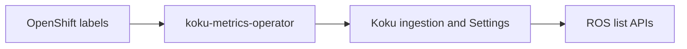

# Tag Filtering

Filter OpenShift optimization recommendations by labels (tags) that Cost Management
already tracks for billing. The same `filter[tag:key]=value` syntax works across ROS
list APIs and matches Koku report filters.

## Self-gating

Tag filtering is **enabled by default** on ROS (`ROS_TAGS_ENABLED=true` in the cost-onprem
Helm chart). There is no separate deployment toggle to turn off tag support for operators.

Which tag keys accept filters is controlled in Cost Management **Settings → Tags** (org
admins enable or disable keys). If a filter uses a key that is not enabled, or no keys are
enabled at all, the API returns **all** recommendations (no narrowing) and may include
`meta.warnings` explaining that the key is unknown or not in the enabled catalog.

| Variable | Default | On-prem | SaaS |
|----------|---------|---------|------|
| `ROS_TAGS_ENABLED` | **`true`** | `true` (chart default) | `true` |
| `ROS_TAGS_SOURCE` | `db` | `db` (shared PostgreSQL with Koku) | `api` (Koku push sync) |

On-prem: ROS must connect to the **same PostgreSQL** as Koku when `ROS_TAGS_SOURCE=db`.
Enable OCP tag keys in **Settings → Tags** before filters narrow results by label value.

See [Configuration → Tag Sync](../configuration.md#tag-sync) for full variable reference.

## Filter syntax

```
GET /api/cost-management/v1/recommendations/openshift?filter[tag:environment]=production
GET /api/cost-management/v1/recommendations/openshift/nodes?filter[tag:team]=platform
```

| Pattern | Semantics |
|---------|-----------|
| `filter[tag:key]=value` | Exact match |
| `filter[tag:key]=a,b` | OR within the same key |
| Multiple `filter[tag:*]` | AND across keys |
| `filter[tag:key]=*` | Key present (any value) |
| `?tag=key:value` | Legacy flat form (also accepted) |

### `meta.warnings`

When `ROS_TAGS_ENABLED=true` and a tag filter returns **zero** rows, list responses may
include `meta.warnings` (string array) with hints such as:

- The tag key is **not enabled** in Settings → Tags (or is unknown to the org).
- In SaaS **`api`** mode, tags may be **stale** — check
  `GET /api/cost-management/v1/internal/tags/status?org_id=<org_id>` for `synced_at`.

Warnings are omitted when results are non-empty or when tag filtering is disabled.

## Supported endpoints

| Resource | Path |
|----------|------|
| Containers | `GET .../recommendations/openshift` |
| Container history | `GET .../recommendations/openshift/history` |
| Namespaces | `GET .../recommendations/openshift/namespaces` |
| Nodes (utilization) | `GET .../recommendations/openshift/nodes` |
| PVCs | `GET .../recommendations/openshift/pvcs` |
| GPU MIG | `GET .../recommendations/openshift/gpu/mig` |
| GPU time-slicing | `GET .../recommendations/openshift/gpu/timeslicing` |
| VMs | `GET .../recommendations/openshift/vm` |
| Resource quotas | `GET .../recommendations/openshift/quota` |
| Cluster resource quotas | `GET .../recommendations/openshift/cluster-quota` |

**Group by tag (fleet savings only):**

```
GET /api/cost-management/v1/recommendations/openshift/savings-summary?group_by[tag:environment]=*
```

Flat alias: `?group_by=tag:environment`. Response shape:

```json
{
  "meta": { "count": 2 },
  "data": [
    { "tag_value": "production", "estimated_monthly_savings": { "value": "...", "units": "USD" } },
    { "tag_value": "staging", "estimated_monthly_savings": { "value": "...", "units": "USD" } }
  ]
}
```

Only **container** savings are grouped per tag value; node, PVC, and snapshot totals are not
split by tag. List and history endpoints do **not** support `group_by[tag:key]`.

## Tag sync architecture

Labels flow: **OpenShift cluster → koku-metrics-operator → Koku → ROS**. Koku is the
authority on enabled keys; ROS does not read labels directly from the cluster.



### On-prem (`ROS_TAGS_SOURCE=db`) {#on-prem-default-shared-database}

Koku and ROS share one PostgreSQL instance. ROS **JOINs** Koku tenant tables at query time
(`reporting_enabledtagkeys`, `reporting_ocptags_values`). No HTTP push or Celery sync is
required.

- **Freshness:** After the last Koku OCP summarization for the tenant.
- **Schema:** `org` + bare `org_id` (e.g. `1234567` → `org1234567`).
- **Risk:** Koku migrations that change tag tables can break ROS filters; validate tag
  filters after Koku upgrades.

### SaaS (`ROS_TAGS_SOURCE=api`) {#running-in-api-mode-saas}

Koku and ROS use separate databases. After summarization or Settings changes, Koku pushes
resolved namespace tags to ROS (`POST /internal/tags/sync`). List filters read
`org_container_keys.resolved_tags`.

| Trigger | Typical latency |
|---------|-----------------|
| Tag enabled/disabled in Settings | Seconds (Celery) |
| OCP summarization complete | After summarization + push |
| Periodic safety-net (every 6h) | Up to ~6 hours if event syncs fail |

Monitor `GET /internal/tags/status?org_id=` — alert if `synced_at` is older than ~6 hours.

See [Configuration → Tag Sync](../configuration.md#tag-sync) for auth, manual sync, and
environment variables.

## Tag discovery

| Use case | API |
|----------|-----|
| UI typeahead / end users | `GET /api/cost-management/v1/tags/openshift/` (Koku) |
| Sync freshness (operators) | `GET /api/cost-management/v1/internal/tags/status?org_id=` (ROS, internal) |

ROS does not expose a public `/tags` endpoint; use Koku for tag key/value discovery.

## Limitations

- **Namespace-scoped resolution** — All containers in a namespace share the same resolved
  tags for filtering. Pod-level labels are not individually resolvable.
- **Filter-only** — Recommendation JSON does not include a `labels` or `tags` field; use
  Koku Tags API or OpenShift console to inspect labels.
- **`group_by[tag:key]`** — Supported only on
  `GET .../recommendations/openshift/savings-summary`, not on list or history endpoints.

## Future work

| Item | Description |
|------|-------------|
| Tag display in responses | Expose resolved labels on list/detail payloads |
| `group_by[tag:key]` on list/history | Nested bucket responses per tag value |
| Pod-level tag overrides | Per-pod label resolution beyond namespace scope |

Internal reference: [`docs/features/tag-filtering.md`](../../docs/features/tag-filtering.md).
