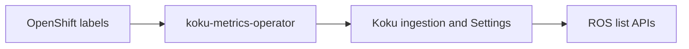

# Tag Filtering

Filter OpenShift optimization recommendations by labels (tags) that Cost Management
already tracks for billing. The same `filter[tag:key]=value` syntax works across ROS
list APIs and matches Koku report filters.

## Enable the feature

| Variable | Default | On-prem | SaaS |
|----------|---------|---------|------|
| `ROS_TAGS_ENABLED` | **`false`** | Set `true` on ROS | Set `true` on ROS |
| `ROS_TAGS_SOURCE` | `db` | `db` (shared PostgreSQL with Koku) | `api` (Koku push sync) |

On-prem: ROS must connect to the **same PostgreSQL** as Koku when `ROS_TAGS_SOURCE=db`.
Enable OCP tag keys in Cost Management **Settings → Tags** before filtering.

See [Configuration → Tag Sync](../configuration.md#tag-sync) for full variable reference.

## Filter syntax

```
GET /api/cost-management/v1/recommendations/openshift?filter[tag:environment]=production
GET /api/cost-management/v1/recommendations/openshift/nodes?filter[tag:team]=platform
```

| Pattern | Semantics |
|---------|-----------|
| `filter[tag:key]=value` | Exact match |
| `filter[tag:key]=a,b` | OR within the same key |
| Multiple `filter[tag:*]` | AND across keys |
| `filter[tag:key]=*` | Key present (any value) |
| `?tag=key:value` | Legacy flat form (also accepted) |

When a tag filter returns zero rows, responses may include `meta.warnings` with hints
(unknown key, stale sync in SaaS `api` mode).

## Supported endpoints

| Resource | Path |
|----------|------|
| Containers | `GET .../recommendations/openshift` |
| Container history | `GET .../recommendations/openshift/history` |
| Namespaces | `GET .../recommendations/openshift/namespaces` |
| Nodes | `GET .../recommendations/openshift/nodes` |
| PVCs | `GET .../recommendations/openshift/pvcs` |
| GPU (MIG / time-slicing) | `GET .../recommendations/openshift/gpu/mig`, `.../gpu/timeslicing` |
| VMs | `GET .../recommendations/openshift/vm` |
| Resource quotas | `GET .../recommendations/openshift/quota` |
| Cluster resource quotas | `GET .../recommendations/openshift/cluster-quota` |

**Group by tag (fleet savings):** `GET .../recommendations/openshift/savings-summary?group_by[tag:environment]=*`
aggregates container savings per tag value. List and history endpoints do not support
`group_by[tag:key]`.

## How labels reach ROS



1. **koku-metrics-operator** collects pod, namespace, node, and PV labels from Prometheus.
2. **Koku** ingests labels, resolves them, and controls which keys are enabled for filtering.
3. **ROS** reads tags from Koku — SQL join on shared PostgreSQL (on-prem) or HTTP push (SaaS).

There is no direct operator → ROS path; Koku is the tag authority.

## Tag discovery

| Use case | API |
|----------|-----|
| UI typeahead / end users | `GET /api/cost-management/v1/tags/openshift/` (Koku) |
| Sync freshness (operators) | `GET /api/cost-management/v1/internal/tags/status?org_id=` (ROS, internal) |

ROS does not expose a public `/tags` endpoint; use Koku for tag key/value discovery.

## Limitations and roadmap

- Tags are **filter-only** — recommendation responses do not include a `labels` field today.
- Resolution is **namespace-scoped** (all containers in a namespace share the same tags).
- `group_by[tag:key]` on list/history is **not** supported (savings-summary only).

Internal reference: [`docs/features/tag-filtering.md`](../../docs/features/tag-filtering.md).
