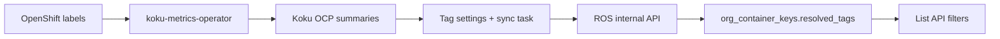

# Tag Filtering

Filter OpenShift recommendations by cluster labels (tags) that Cost Management
already uses for cost allocation.

## What it does

When enabled, ROS list APIs accept tag filters such as:

```
GET /api/cost-management/v1/recommendations/openshift
  ?filter[tag:environment]=production
  &filter[tag:team]=platform,payments
```

This returns only containers whose namespace carries matching resolved tags.

Multiple `filter[tag:*]` parameters combine with **AND**. Comma-separated values
within one key combine with **OR**.

## How tags flow



1. The operator collects namespace/pod labels into OCP cost reports.
2. Koku ingests reports and stores labels on daily summary line items.
3. Operators enable tag keys in Cost Management **Settings → Tags**.
4. Koku pushes enabled keys and namespace-resolved values to ROS.
5. ROS stores tags on container rows and applies them during list queries.

Tags are **namespace-level** in the current release: all containers in a namespace
share the same resolved tag map.

## API usage

**Filter by one tag:**

```
?filter[tag:environment]=production
```

**Filter by multiple values (OR):**

```
?filter[tag:environment]=production,staging
```

**Filter by multiple keys (AND):**

```
?filter[tag:environment]=production&filter[tag:team]=platform
```

Supported on container recommendation list endpoints when `ROS_TAGS_ENABLED=true`.

See [Query Parameters](../api-reference/query-parameters.md#tag-filtering) for the
full parameter reference.

## Freshness guarantees

| Event | Expected latency |
|-------|------------------|
| Enable/disable tag in Settings | Immediate sync queued |
| New tag values from cluster | After next OCP summarization + sync |
| Missed sync (network blip) | Recovered within **6 hours** (periodic safety-net) |

Check sync freshness:

```
GET /api/cost-management/v1/internal/tags/status?org_id=1234567
```

Compare `synced_at` to your last data processing window.

## Configuration

Enable on **both** Koku and ROS:

| Service | Variable | Purpose |
|---------|----------|---------|
| Koku | `ROS_TAGS_ENABLED=true` | Run sync Celery tasks |
| Koku | `ROS_OCP_BACKEND_URL` | ROS API base URL |
| ROS | `ROS_TAGS_ENABLED=true` | Accept sync + apply list filters |
| ROS | `ROS_TAGS_ALLOWED_SERVICE_ACCOUNTS` | Restrict pushing ServiceAccounts (optional) |
| Dev | `ROS_TAGS_DEV_TOKEN` | Static bearer token for local testing |

**Authentication (production):** Koku sends a Kubernetes ServiceAccount bearer token;
ROS validates it via the TokenReview API.

**Authentication (development):** Set matching `ROS_TAGS_DEV_TOKEN` on both services.

Details: [Configuration → Tag Sync](../configuration.md#tag-sync)

## Known limitations

- Tag filters apply to **container list** endpoints only (not namespace/node/GPU lists in v1).
- Wildcard tag values (`*`) are not supported.
- Pod-level label overrides are not synced separately from namespace labels.
- Flat legacy syntax (`?tag=key:value`) is **not** supported — use `filter[tag:key]=value`.
- `group_by[tag:key]` aggregation is planned but not yet available.

## Future roadmap

- **mTLS** between Koku and ROS for on-prem deployments
- **Tag autocomplete API** for UI typeahead
- **`group_by[tag:key]=*`** in report responses
- **Webhook-driven sync** to reduce reliance on the 6-hour safety-net
- **Cross-provider tag unification** with AWS/Azure/GCP cost tags

Internal design reference: [`docs/features/tag-filtering.md`](../../docs/features/tag-filtering.md)
