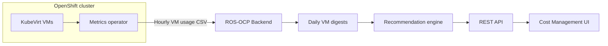

# Virtual Machine Recommendations

!!! warning "Status: Planned / Future Work"
    This feature is **not yet implemented**. The description below is the intended
    product direction for a future ROS-OCP release. Container, node, PVC, quota, and
    GPU recommendations remain available today.

!!! info "Quick Facts (planned)"
    **Scope:** OpenShift Virtualization (KubeVirt) virtual machines  
    **Plugin:** `vm` (Produce phase)  
    **Analysis windows:** 7 / 30 / 90 days (configurable)  
    **Gate:** `ROS_ENABLE_VM_RECS` (off by default until release)

---

## What it does

**Virtual Machine Recommendations** right-size OpenShift Virtualization workloads the
same way ROS already optimizes containers — but tuned for how VMs actually run.

For each virtual machine, ROS will analyze historical CPU, memory, and disk signals
and recommend:

- Optimal **vCPU count** (whole cores, not millicores)
- Optimal **memory** (whole GiB, with guest-OS-aware floors)
- Best-fit **instance type** from the OpenShift Virt catalog (for example `m1.large`)
- **Idle** VMs that consume cluster resources with almost no utilization
- **Disk growth** and **I/O profile** guidance for storage planning

Example messages you can expect in the UI:

> *"Your VM uses 2 of its 8 allocated cores; consider **m1.large** (4 vCPU)."*  
> *"Memory recommendation: **8 GiB** (currently 32 GiB allocated)."*  
> *"This VM has been idle for 30+ days — CPU and memory usage are near zero."*  
> *"At current growth rate, disk will be full in ~45 days — expand before then."*

---

## Why it matters

### VMs are often over-provisioned

Lift-and-shift migrations frequently land VMs on OpenShift with **generous** vCPU and
memory “just in case.” Industry studies consistently find a large share of VMs are
**idle or oversized** — often more waste at the VM layer than at the pod layer.

### Resize is expensive — recommendations must be confident

Unlike containers, changing a VM’s CPU or memory typically requires a **restart** or
disruptive migration. ROS will therefore be **conservative on downsizing** (strong
hysteresis, minimum meaningful change sizes) while still **recommending upsizing**
when usage shows risk of starvation.

You get fewer, higher-confidence VM actions instead of noisy “shrink by one core”
churn.

### Cost visibility without optimization leaves money on the table

Koku already reports **what VMs cost** through the metrics operator. This feature
closes the loop: **what you should run instead**, mapped to OpenShift’s native
instance type catalog.

---

## Recommendation types

### vCPU optimization

Analyzes sustained CPU usage (high percentiles over your chosen window), adds a
safety margin, and rounds **up** to whole vCPUs so the guest always has integer cores.

**Customer view:** Compare allocated cores to recommended cores; see dollar impact
when savings estimates are enabled.

### Memory optimization

Uses the same statistical approach with a minimum headroom above peak usage. Applies
sensible **floors** by guest OS family (for example higher baseline for Windows guests)
before rounding to whole GiB.

**Customer view:** *"You allocated 32 GiB; usage supports 8 GiB."*

### Instance type suggestions

When your cluster uses **VirtualMachineClusterInstancetype** (series such as **cx1**,
**m1**, **u1**, **gn1**, **o1**), ROS maps recommended vCPU and memory to the
**smallest cost-effective type** that still fits the workload profile:

| Workload signal | Typical series direction |
|-----------------|--------------------------|
| Steady, CPU-heavy | CPU-optimized (cx1) |
| Balanced apps | General purpose (m1) |
| Low utilization / utility | Cost-focused (u1) |
| GPU workloads | GPU (gn1) |
| Bursty patterns | Burstable (o1) |

**Customer view:** *"Switch from **m1.2xlarge** to **m1.large** based on your usage pattern."*

VMs defined with raw CPU/memory in the VM spec (no instance type) still receive
vCPU and memory guidance; instance type fields may be omitted.

### Idle VM detection

Flags VMs whose CPU and memory usage stay below very low thresholds for the analysis
window — candidates for power-off, archival, or deletion review.

**Customer view:** *"This VM has been idle for 30+ days."*

This is separate from rightsizing savings: idle detection highlights **full waste**
of provisioned resources, not incremental trim.

### Disk growth trending

Tracks provisioned disk size over time, projects growth forward (default **30-day**
trend), adds headroom, and rounds to practical sizes (for example **10 GiB** steps).

**Customer view:** *"At current growth rate, disk will be full in 45 days."*

!!! note "Allocated vs used"
    Without a guest agent, ROS sees **allocated** disk capacity from the platform, not
    in-guest free space. Recommendations focus on allocation trends and capacity planning,
    not filesystem-level utilization percentages.

### Disk I/O profile (informational)

For storage-heavy VMs, ROS summarizes read/write **IOPS** and throughput peaks and can
hint when workloads look **I/O intensive** (for example total p95 IOPS above ~3000).

**Customer view:** *"High IOPS workload detected; consider a faster storage class."*

Specific storage class names are **not** auto-selected in the first release — classes
vary too much by cluster (Ceph, cloud disks, NFS, etc.).

---

## How it works (high level)

1. **Collect** — The metrics operator gathers KubeVirt Prometheus metrics (CPU, memory,
   disk allocation; additional I/O metrics for ROS).
2. **Summarize** — ROS builds **daily digests** per VM (percentiles and peaks), same
   philosophy as container recommendations — no long-term raw metric store in the database.
3. **Analyze** — Over configurable **7-, 30-, or 90-day** windows, ROS applies
   percentile-based sizing with safety margins and VM-specific downsize rules.
4. **Map** — Recommended resources are matched to **instance types** where a catalog exists.
5. **Deliver** — List and detail APIs expose current vs recommended values, flags, and
   notification codes for the Optimizations experience.

---

## Instance type intelligence

OpenShift Virtualization provides a first-class **instance type** model (similar in
spirit to cloud instance families). Planned ROS behavior:

- Understands built-in series (**cx1**, **m1**, **u1**, **gn1**, **o1**, **n1**, …)
  and sizes from **small** through **8xlarge**
- Incorporates **custom instance types** defined in your cluster
- Uses **VirtualMachinePreference** resources when present as hints for workload class

You keep using the platform’s native objects — ROS does not invent arbitrary sizing;
it recommends types that actually exist in your cluster.

---

## Configuration

VM recommendations use the **same three-tier configuration model** as containers,
nodes, and PVCs:

| Tier | Source | Example |
|------|--------|---------|
| 1 | Compiled defaults | 95th percentile CPU, 20% memory margin |
| 2 | Tenant Settings API | Your org adjusts idle thresholds |
| 3 | Environment locks | Platform admin enforces bounds |

**Thresholds:**  
`GET/PUT/DELETE .../settings/ros/thresholds/?recommendation_type=vm`

**Analysis windows (terms):**  
`GET/PUT/DELETE .../settings/ros/terms/?recommendation_type=vm`

Administrators can lock sensitive fields via environment variables so tenants cannot
override safety limits.

The feature remains off until **`ROS_ENABLE_VM_RECS`** is enabled in the deployment.

---

## Conservative by design

VM recommendations deliberately bias toward **operator trust**:

| Direction | Behavior |
|-----------|----------|
| **Downsize** | Only when usage is clearly low **and** the change is large enough to matter (strong ratio threshold and minimum vCPU/GiB delta) |
| **Upsize** | More willing to recommend headroom — under-provisioned VMs fail loudly after restart |
| **Idle** | Informational and actionable for cleanup workflows, not automatic shutdown |
| **Storage class** | Informational I/O hints only in MVP |

This matches how platform teams actually operate VMs: prove savings before asking for
a maintenance window.

---

## Comparison to container recommendations

| Topic | Containers | Virtual machines |
|-------|------------|------------------|
| Units | millicores, Mi/Gi | vCPUs, GiB |
| Typical action | Patch deployment resources | Resize VM / change instance type |
| Downtime | Often rolling | Usually full restart for size change |
| Idle detection | Available today | Planned (VM-specific thresholds) |
| Instance types | N/A | cx1, m1, u1, … |

Container recommendations are **unchanged** when VM recommendations ship; VM analysis
is a separate plugin and API surface.

---

## API (planned)

| Endpoint | Purpose |
|----------|---------|
| `GET .../recommendations/openshift/virtual-machines/` | List VM recommendations |
| `GET .../recommendations/openshift/virtual-machines/:id` | Detail for one VM |

**Filters:** `vm_name`, `namespace`, `cluster`, `recommendation_status`

Responses include current and recommended resources, optional instance type, idle/oversized
flags, term metadata, and informational disk/I/O fields — parallel to existing OpenShift
recommendation list patterns. See the [Frontend Integration Guide](../ui-integration-guide.md)
for pagination and identity headers.

---

## Related documentation

| Document | Audience |
|----------|----------|
| [Internal design: VM recommendations](../../../docs/design/vm-recommendations.md) | Engineering — algorithms, metrics, phases |
| [Requirements §12b (Phase 8b)](../../../docs/architecture/requirements.md#12b-phase-8b-vm-recommendations-weeks-1218) | Full REQ traceability |
| [Performance analysis §30](../../../docs/architecture/performance-analysis.md#30-openshift-virtualization-vm-recommendations) | Ecosystem gap analysis |
| [Container right-sizing](container-recommendations.md) | Available today |
| [Configurable thresholds](configurable-thresholds.md) | Settings API precedence |

---

## Coming soon checklist

When this feature ships, expect:

- [ ] New VM usage CSV from the metrics operator (including disk I/O metrics)
- [ ] VM recommendations in the Optimizations API and UI
- [ ] Settings and terms for `recommendation_type=vm`
- [ ] Idle and oversized VM badges (notification codes 18–19)
- [ ] Optional savings estimates tied to VM cost model rates in Koku

Until then, use **container**, **node**, and **PVC** recommendations for workload
optimization; use **OpenShift cost reports** for VM spend visibility.
