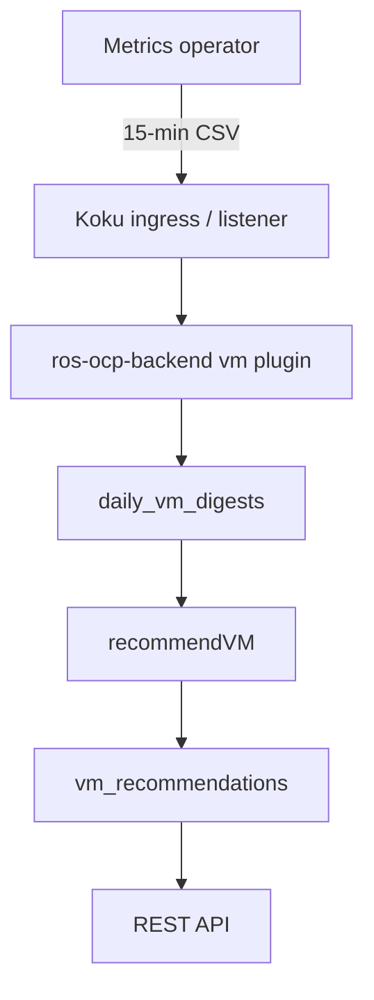

# Virtual Machine Recommendations

!!! info "Quick Facts"
    **Status:** Preview (Beta) — enabled by default (`ROS_ENABLE_VM_RECS=true`)  
    **API:** `GET /api/cost-management/v1/recommendations/openshift/vm` (list),
    `GET .../vm/detail` (detail with daily digests)  
    **Settings:** `GET/PUT/DELETE .../settings/vm`, `GET/PUT/DELETE .../settings/vm/terms`  
    **Configurable:** Yes (Settings API + env-var locks)  
    **Engines:** cost, performance (`filter[engine]=cost|performance`) — native only; Kruize does not support VMs  
    **Savings:** `savings` object on list/detail when `ROS_SAVINGS_ESTIMATES_ENABLED=true` and Koku rates are available; otherwise `null`  
    **Business hours:** not applicable (container and namespace only)

## Overview

OpenShift Virtualization (KubeVirt) workloads need different right-sizing than
containers: resources are **whole vCPUs and whole GiB**, changes often require a
**VM restart**, and lift-and-shift VMs are commonly **5–20× overprovisioned**.

ROS analyzes **15-minute** VM usage samples from the
[koku-metrics-operator](https://github.com/project-koku/koku-metrics-operator),
aggregates them into daily digests, runs the **native Go engine only** (Kruize has
no VM recommendation path), and exposes results through the REST API. **Cost** and
**performance** are two native engine variants (`filter[engine]=cost|performance`),
not a Kruize vs native choice. Koku continues to consume hourly
`cm-openshift-vm-usage-*.csv` for **cost only**; ROS uses
`ros-openshift-vm-usage-*.csv` for optimization.

Technical design (maintainers): [`docs/design/vm-recommendations.md`](../../docs/design/vm-recommendations.md).

### Cost reporting vs optimization UI

**Cost reporting** for VMs is available in koku-ui via
`reports/openshift/resources/virtual-machines/` (historical cost and usage from
the Cost Management pipeline). **ROS VM optimization recommendations** (list,
detail, settings, GPU actions) are API-ready; a dedicated recommendations
experience in koku-ui is planned for a future release.

## How it works



| Step | What happens |
|------|----------------|
| **Collection** | Operator queries Prometheus/Thanos for VM CPU, memory, disk, I/O, optional guest-agent filesystem metrics, and KubeVirt network rates (bytes/sec, packets/sec, drops). |
| **Ingestion** | `vm` plugin (Produce phase, priority **40**) parses `ros-openshift-vm-usage-*.csv`, builds `daily_vm_digests`. |
| **Recommendation** | `recommendVM()` applies percentiles, margins, classification, disk projection, and instance-type matching per term × engine. |
| **API** | List and detail endpoints return current vs recommended sizing, metadata flags, notifications, and optional daily digest history. |

If no VM CSV is present for a cluster, the plugin no-ops silently.

### Operator integration

The operator emits two CSV streams from the same 15-minute collection (Strategy 3):

| File | Cadence | Consumer | Purpose |
|------|---------|----------|---------|
| `ros-openshift-vm-usage-*.csv` | 15 min | ROS-OCP | Percentiles, I/O, filesystem, recommendations |
| `cm-openshift-vm-usage-*.csv` | Hourly (aggregated) | Koku | Cost reporting (unchanged) |

The operator also exports `cluster_instance_types.json` with
`VirtualMachineClusterInstancetype` and `VirtualMachineClusterPreference` CRs for
per-cluster instance type matching. See [Instance type matching](#instance-type-matching).

### Test data (nise)

For local and E2E testing, use nise with the VM generator:

```bash
nise report ocp --static-report-file examples/ocp_vm/vm_static_data.yml \
  --ocp-cluster-id <CLUSTER-UUID> --ros-ocp-info \
  -s 2026-05-01 -e 2026-05-03 -w
```

- **`--ros-ocp-info`** — Required for `ocp_ros_vm_usage.csv` (15-minute ROS samples).
- **Template:** `nise/examples/ocp_vm/vm_static_data.yml` — Linux/Windows, guest agent on/off, idle, abandoned profiles.
- **On-prem E2E:** `cost-onprem-chart/tests/data/nise_templates/ocp_report_vm.yml`.

Package the typed CSVs in the manifest as `ocp_ros_vm_usage.csv` (not combined `openshift_report` files).

## CPU sizing

| Aspect | Behavior |
|--------|----------|
| **Percentile** | Cost engine: CPU **P95**; performance engine: CPU **P99** |
| **Margin** | Adaptive **15–50%** above percentile (variability-driven) |
| **Rounding** | Ceil to **whole vCPUs** (minimum 1 for active VMs) |
| **Downsize hysteresis** | Recommend downsize only if `recommended/current < 0.60` **or** drop ≥ `min_vcpu_change` (default **2**) vCPUs |

Tune via Settings API `thresholds.*` or `ROS_VM_CPU_*` env vars.

## Memory sizing

| Data source | When used |
|-------------|-----------|
| **Guest agent** | `high` confidence: working set from `memory_available` percentiles (request − available P95) |
| **Hypervisor** | `moderate` / `low`: `mem_usage_*` P95/P99 from hypervisor metrics |

| Step | Behavior |
|------|----------|
| **Margin** | P95 + margin (minimum **20%**) |
| **OS floors** | Linux default **1** GiB; Windows default **2** GiB (`memory_floors`) |
| **Rounding** | Ceil to **whole GiB** (minimum 1 for non-abandoned VMs) |
| **Downsize hysteresis** | Same ratio as CPU, or ≥ `min_gib_change` (default **2**) GiB |
| **Windows kernel reserve** | Subtract `memory_floors.windows_kernel_reserve_gib` (default **1.5** GiB) from usage before sizing |

`guest_os` from CSV drives idle thresholds and memory floors. Empty `guest_os` uses Linux defaults and notification **46**.

### Windows-specific handling

- Higher idle thresholds (200 millicores / 3072 MiB) and **2** GiB memory floor.
- **Kernel reserve** (default 1.5 GiB) removed from working set before memory recommendations.
- **Update spike** notification **47** when P99 is much higher than P95 (CPU or memory).

### Time-aware downsize (performance engine only)

Cost engine may downsize when hysteresis thresholds pass. Performance engine also requires **each of the last N days** (default **3**, per-day **P95**) to stay below the downsize threshold; otherwise sizing holds at current and notification **49** is emitted. Configure `stability.downsize_stability_days`.

### Crash loop detection

The operator exports `restart_count` per 15-minute sample (KubeVirt `Running` phase transitions). Summed daily as `restart_count_sum`. Notification **48** when the term-window total meets `stability.crash_loop_restart_threshold` (default **3**).

## Idle VM detection

Both CPU and memory **P95** must be below OS-specific thresholds (non-zero usage allowed):

| Guest OS | CPU P95 | Memory P95 |
|----------|---------|------------|
| **Linux** (default) | &lt; 50 millicores | &lt; 512 MiB |
| **Windows** | &lt; 200 millicores | &lt; 3072 MiB |

- Sets `metadata.is_idle=true` and notification **18** (`warning`).
- Recommended sizing: **1 vCPU** + OS memory floor.
- **Abandoned** classification supersedes idle (no dual flags).

See also [Idle / Zombie Detection](idle-detection.md) for container parallels.

## Abandoned VM detection

Stricter than idle: **every** daily digest in the term window must have
`cpu_usage_max = 0` and `mem_usage_max = 0`, for at least `abandoned_min_days`
(default **3** ≈ 72 hours at daily granularity).

| Classification | Recommended sizing | Notification |
|----------------|-------------------|--------------|
| **Abandoned** | **0** vCPU, **0** GiB (deallocate) | **43** `critical` |
| **Idle** | 1 vCPU + memory floor | **18** `warning` |

Configure `thresholds.abandoned_min_days` via Settings API or `ROS_VM_ABANDONED_MIN_DAYS`.

## Disk projection

Two strategies — **never mixed** for the same VM in one run.

??? note "Strategy A — guest-agent filesystem (high confidence)"
    When **≥ 2 days** have `filesystem_used` and `filesystem_capacity` metrics:

    - Linear growth from earliest→latest daily filesystem usage vs capacity.
    - Sets `disk_projection.days_until_full` when growth &gt; 0.
    - Notification **40** (`warning`) when `days_until_full < 90`.
    - Notification **42** (`critical`) when latest used/capacity **&gt; 90%**.

??? note "Strategy B — hypervisor allocated bytes (moderate confidence)"
    OLS slope on daily `disk_allocated_max_bytes`:

    - Requires **≥ 2 days** with positive allocation samples.
    - Slope must be ≥ `disk.min_growth_mib_per_day` (default **100** MiB/day).
    - Sets `growth_gib_per_day` and `recommended_expand_gib` (30-day projection × headroom, rounded to `round_step_gib`).
    - **`days_until_full` is always `null`** — allocated bytes do not represent in-guest free space.
    - Notification **37** (`info`) when growth is significant.

With `confidence=low` (&lt; 20 samples on the latest day), **no disk projection** is emitted.

## I/O profiling

From daily digest P95 read/write IOPS and throughput:

- When read+write P95 exceeds `io.high_iops_threshold` (default **3000**), sets `io_profile.hint` and notification **39** (`warning`).

## Instance type matching

Built-in catalog (OpenShift Virtualization defaults): **u1** (general-purpose),
**cx1** (compute-optimized), **m1** (memory-optimized), **gn1** (GPU, when DCGM metrics
are present), and **n1** (network-optimized, when KubeVirt network columns are present and
`network.enable_network_series` is true).

**Algorithm:**

1. Compute recommended vCPU and GiB from usage + margins.
2. Run GPU classification when DCGM metrics are present (see [GPU recommendations](#gpu-recommendations)).
3. Classify preferred series via CPU:memory ratio (`vmClassifySeries`); idle → general-purpose; **network-saturated + balanced ratio → `network-optimized`**; **GPU VMs → `gpu` series**.
4. If the VM has a `VirtualMachine.spec.preference` in `cluster_instance_types.json`, **preference class overrides ratio**.
5. If `instance_type_matching` is enabled (default **true**), `MatchInstanceType()` picks the smallest fitting type (vCPU, memory, and GPU memory when applicable).
6. Fall back to **u1** / general-purpose if no match in preferred series (non-GPU VMs never receive `gn1.*`).
7. Notification **41** when a type is recommended.

### Network-optimized (n1)

When `ros-openshift-vm-usage-*.csv` includes `net_rx_bytes_per_sec`, `net_tx_bytes_per_sec`,
and related packet/drop columns (KubeVirt `kubevirt_vmi_network_*` rates from the operator),
ROS computes daily P95 throughput and PPS plus max drop ratio. A VM is **network-bound** when
sustained throughput (default ≥ 500 Mbps aggregate) **or** sustained high PPS with drops exceeds
thresholds for `network_sustained_days` (default **7**) and the recommended vCPU:memory ratio
is balanced (0.5–2.0). `MatchInstanceType()` then recommends **n1.*** sizes and sets
`is_network_bound=true` (notification **55**).

Configure via `GET/PUT .../settings/vm` → `network` (`throughput_threshold_bps`,
`pps_threshold`, `drop_ratio_bp`, `sustained_days`, `enable_network_series`) or admin env
`ROS_VM_NETWORK_*`. Older CSVs without network columns still parse (fields default to zero).

## GPU recommendations

When a VM uses GPU passthrough or vGPU (NVIDIA DCGM metrics on the virt-launcher pod), the operator adds GPU columns to `ros-openshift-vm-usage-*.csv`. ROS classifies utilization and may recommend:

### How VM GPU sharing differs from containers

ROS uses **different mechanisms** per workload type. VM recommendations are not interchangeable with container GPU APIs.

| Workload | Sharing mechanism | Catalog | API hints |
|----------|-------------------|---------|-----------|
| Containers & OpenShift AI (Pods/Jobs) | MIG + node time-slicing (`nvidia.com/gpu.replicas`) | `gpu_catalog.yaml` only | Replica count; no vGPU profile name — see [GPU time-slicing](gpu-time-slicing.md) and [GPU MIG](gpu-mig.md) |
| **This page (KubeVirt VMs)** | MIG + **vGPU C-series profiles** (`grid_*`) + guest time-slicing | `gpu_catalog.yaml` + `vgpu_profiles.yaml` | `recommended_time_slice_count` and optional **`recommended_vgpu_profile`** (VM-only field) |

- **`recommended_vgpu_profile`** appears **only** on VM list/detail responses (notification **56**). Container GPU endpoints never return a vGPU profile name.
- **`vgpu_profiles.yaml`** is **VM-only** (A100D, A30, T4 C-series). Containers use MIG profiles from `gpu_catalog.yaml` and integer replica counts for time-slicing.
- **Q-series** (graphics / VDI) profiles are not recommended today; see the design doc for planned workload-type detection.

Maintainers: [GPU sharing by workload type](../../docs/design/vm-recommendations.md#gpu-sharing-mechanisms-by-workload-type).
GPU catalogs are validated against official NVIDIA documentation — see
[GPU Catalogs](../architecture/gpu-catalogs.md) for data sources and update procedures.

| Classification | Action | Notification |
|----------------|--------|--------------|
| Idle | Remove GPU assignment | **50** |
| Underutilized | `use_mig_profile`, `enable_time_slicing`, or legacy `consider_vgpu_or_mig` | **51** |
| Memory saturated | Larger GPU / more frame buffer | **52** |
| Compute saturated | More powerful GPU | **53** |
| Well utilized | No change | — |

For **underutilized** GPUs:

- **MIG-capable** (A100, A30, H100, …): `recommended_gpu_profile` from frame-buffer headroom (`OptimalMIGProfile()`); MIG is preferred over time-slicing when the GPU supports it.
- **Non-MIG** (e.g. T4): production time-slicing via `RecommendVMTimeSlicing()` — same multi-signal model as container [GPU time-slicing](gpu-time-slicing.md): peak of SM, DRAM, and frame-buffer utilization sets `recommended_time_slice_count`, with FB safety (default 80%), DRAM bandwidth penalty, and confidence (`gpu_timeslice_confidence`, `gpu_timeslice_rationale`). Optional **`recommended_vgpu_profile`** (e.g. `grid_t4-4c`) from VM-only `vgpu_profiles.yaml` (C-series compute profiles).

List/detail API responses include a `gpu` object (`gpu_count`, `gpu_classification`, `recommended_gpu_action`, `recommended_gpu_profile`, `recommended_time_slice_count`, `gpu_timeslice_confidence`, `gpu_timeslice_rationale`, `recommended_vgpu_profile`, etc.). Filters: `filter[has_gpu]=true|false`, `filter[gpu_classification]=idle,underutilized,...`.

Configure time-slicing via `GET/PUT .../settings/vm` → `gpu` block (`gpu_timeslice_min_replicas`, `gpu_timeslice_max_replicas`, `gpu_timeslice_fb_safety_threshold_bp`, `gpu_timeslice_dram_penalty_threshold_bp`) or admin env vars `ROS_VM_GPU_TIMESLICE_*`.

Container GPU MIG profiling is documented in [GPU MIG Profiling](gpu-mig.md).

**Preference class mapping:**

| KubeVirt class label | ROS `series` |
|----------------------|--------------|
| `general-purpose` | `general-purpose` |
| `compute-intensive`, `compute` | `compute-optimized` |
| `memory-intensive`, `memory` | `memory-optimized` |
| unknown / empty | ratio classification |

Detail API adds `metadata.preference_name` and `metadata.preference_class` when configured.

## Graduated confidence

Confidence reflects **guest-agent stability on the latest day**, not whether the agent was ever installed.

| Level | Condition | Memory sizing | Disk |
|-------|-----------|---------------|------|
| **high** | Latest day ≥ **20** samples and ≥ **80%** agent samples | Guest-agent working set | Strategy A if ≥ 2 filesystem days; else B |
| **moderate** | Agent missing, unstable (&lt; 80% on latest day), or no agent in window | Hypervisor usage | Strategy B |
| **low** | &lt; 20 samples on latest day (&lt; one full day) | Hypervisor usage | None |

**Transitions (no artificial multi-day penalty):**

- New VM with agent from boot → **high** after the first full day (≥ 20 samples, ≥ 80% agent).
- Agent installed mid-day → **high** next day if that day reaches ≥ 80% coverage; else **moderate** until stable.
- Agent removed or flapping → **moderate** + notification **44** (not **38**).
- Never had agent → **moderate** + notification **38**.

API: `filter[confidence]=high|moderate|low`, `filter[guest_agent_detected]=true|false`.

## Dual engine (cost vs performance)

| Aspect | Cost engine | Performance engine |
|--------|-------------|---------------------|
| CPU percentile | P95 | P99 |
| Memory percentile | P95 (+ margin) | P99 (+ margin) |
| Use case | Minimize allocation | Preserve headroom |

Filter list/detail with `filter[engine]=cost` or `filter[engine]=performance`. Default term for display is typically **medium_term**.

Default term windows (plugin `TermProvider`):

| Term | Window | Min data days |
|------|--------|---------------|
| short_term | 7 days | 3 |
| medium_term | 15 days | 7 |
| long_term | 30 days | 15 |

Max lookback: **90** days. Configure windows via Settings API terms endpoints.

See [Dual Engine](dual-engine.md) for the shared cost/performance model.

## Notifications

For the full cross-system catalog (containers, nodes, GPU, PVC, snapshots, and reserved codes),
see [Notification codes](../architecture/notification-codes.md).

All VM codes below appear in the `notifications` array on list and detail responses:

| Code | Type | When |
|------|------|------|
| **18** | warning | VM is idle (CPU and memory P95 below OS thresholds) |
| **19** | warning | VM is oversized (meaningful downsize vs current) |
| **37** | info | Hypervisor disk allocation growing; no guest capacity metric |
| **38** | info | QEMU guest agent never installed (hypervisor-only sizing) |
| **39** | warning | High disk I/O (total P95 IOPS above threshold) |
| **40** | warning | Guest filesystem filling (`days_until_full` &lt; 90) |
| **41** | info | Instance type recommendation available |
| **42** | critical | Guest filesystem &gt; 90% used |
| **43** | critical | VM abandoned (zero CPU and memory max for N days) |
| **44** | info | Guest agent interrupted (was present, latest day &lt; 80% stable) |
| **45** | info | Insufficient data (`confidence=low`) |
| **46** | info | Unknown guest OS (`guest_os` empty); Linux defaults applied |
| **47** | info | Windows update spike (P99−P95 spread &gt; 50% CPU or &gt; 30% memory) |
| **48** | warning | Crash loop (`restart_count` sum ≥ threshold in term window) |
| **49** | info | Performance engine: downsize held (unstable N-day P95 pattern) |
| **50** | warning | GPU idle — remove GPU assignment |
| **51** | info | GPU underutilized — smaller MIG profile or consider vGPU/MIG |
| **52** | warning | GPU memory saturated — larger GPU / more frame buffer |
| **53** | warning | GPU compute saturated — more powerful GPU |
| **54** | warning | Mixed idle/active GPUs — reduce GPU count |
| **55** | warning | Network-saturated workload — recommend **n1** network-optimized instance type |
| **56** | info | vGPU profile recommended (`recommended_vgpu_profile`) |
| **57** | warning | GPU time-slicing not safe — frame-buffer pressure |
| **58** | info | Sequential I/O pattern — throughput-oriented storage |
| **59** | info | Random I/O pattern — IOPS-oriented storage |
| **60** | warning | Redundant VMs co-located on same node — consider adding anti-affinity rules |
| **61** | info | Uneven VM distribution across nodes — consider topologySpreadConstraints |
| **62** | info | VM shares storage with other VMs — correlated workload group detected |
| **63** | warning | VM memory exceeds single NUMA node capacity — NUMA pinning not possible |
| **64** | info | Mostly idle on observed days — consider scheduling power-off |
| **65** | info | Network-bound with high throughput or drops — SR-IOV may help |
| **66** | info | Network-bound with high PPS and small packets — DPDK may help |
| **67** | info | Sustained minimal disk I/O — lower-cost storage tier candidate |
| **68** | info | Sustained random high IOPS — IOPS-optimized storage recommended |
| **69** | info | Sustained sequential high throughput — throughput-optimized storage |

Abandoned VMs emit **43** only (not **18**). Power-off candidate (**64**) applies when a VM is
mostly idle but not abandoned. Placement flags: `is_redundant_placement` (**60**),
`has_shared_storage` (**62**), `numa_oversized` (**63**).

## Configuration

### Three-tier precedence

1. Compiled defaults  
2. Tenant **Settings API** (partial PUT)  
3. Environment variable **locks** (`locked_fields` in GET settings)

Deployment gate: `ROS_ENABLE_VM_RECS` (default `true`) — not exposed via Settings API.

### Settings API

| Method | Path | Purpose |
|--------|------|---------|
| GET | `/recommendations/openshift/settings/vm` | Thresholds, memory floors, disk, I/O, **network**, **gpu**, instance type matching |
| PUT | `/recommendations/openshift/settings/vm` | Partial update of allowed blocks |
| DELETE | `/recommendations/openshift/settings/vm` | Reset VM settings to compiled defaults (`204`) |
| GET | `/recommendations/openshift/settings/vm/terms` | Term windows |
| PUT | `/recommendations/openshift/settings/vm/terms` | Replace term windows (1–3 terms) |
| DELETE | `/recommendations/openshift/settings/vm/terms` | Reset VM term windows to plugin defaults (`204`) |

**Platform lock:** With `ROS_SETTINGS_LOCKED=true` (and `ROS_SETTINGS_LOCKED_VM=true`, the default),
PUT/DELETE return `403` and GET includes `settings_locked: true` plus `locked_fields: ["*"]`. Set
`ROS_SETTINGS_LOCKED_VM=false` to allow tenant VM settings while other features stay frozen.
Generic `.../settings/terms?recommendation_type=vm` also honors `ROS_SETTINGS_LOCKED_TERMS` when set.

??? example "GET settings (abbreviated)"
    ```json
    {
      "enabled": true,
      "thresholds": {
        "cpu_percentile_cost": 0.95,
        "cpu_percentile_perf": 0.99,
        "cpu_margin_min": 0.15,
        "cpu_margin_max": 0.50,
        "mem_margin_min": 0.20,
        "downsize_hysteresis_ratio": 0.60,
        "min_vcpu_change": 2,
        "min_gib_change": 2,
        "idle_cpu_mc": 50,
        "idle_memory_mib": 512,
        "idle_cpu_mc_windows": 200,
        "idle_memory_mib_windows": 3072,
        "abandoned_min_days": 3
      },
      "memory_floors": { "linux_gib": 1, "windows_gib": 2, "windows_kernel_reserve_gib": 1.5 },
      "stability": { "downsize_stability_days": 3, "crash_loop_restart_threshold": 3 },
      "disk": {
        "projection_window_days": 30,
        "headroom_pct": 0.25,
        "round_step_gib": 10,
        "min_growth_mib_per_day": 100
      },
      "io": { "high_iops_threshold": 3000 },
      "network": {
        "throughput_threshold_bps": 62500000,
        "pps_threshold": 100000,
        "drop_ratio_bp": 10,
        "sustained_days": 7,
        "enable_network_series": true
      },
      "gpu": {
        "gpu_timeslice_min_replicas": 2,
        "gpu_timeslice_max_replicas": 16,
        "gpu_timeslice_fb_safety_threshold_bp": 8000,
        "gpu_timeslice_dram_penalty_threshold_bp": 5000
      },
      "placement": {
        "enable_placement_checks": true,
        "placement_skew_ratio": 3,
        "enable_shared_pvc_correlation": true,
        "numa_node_memory_gib": 64
      },
      "instance_type_matching": true,
      "locked_fields": [],
      "settings_locked": false
    }
    ```

Key env vars (each maps to a Settings API field): `ROS_VM_CPU_PERCENTILE_COST`,
`ROS_VM_IDLE_CPU_MC`, `ROS_VM_ABANDONED_MIN_DAYS`, `ROS_VM_DISK_*`,
`ROS_VM_HIGH_IOPS_THRESHOLD`, `ROS_VM_ENABLE_INSTANCE_TYPE_MATCHING`,
`ROS_VM_WINDOWS_KERNEL_RESERVE_GIB`, `ROS_VM_DOWNSIZE_STABILITY_DAYS`,
`ROS_VM_CRASH_LOOP_RESTART_THRESHOLD`, `ROS_VM_NETWORK_*`, `ROS_VM_GPU_TIMESLICE_*`, `ROS_VM_ENABLE_PLACEMENT_CHECKS`,
`ROS_VM_PLACEMENT_SKEW_RATIO`, `ROS_VM_ENABLE_SHARED_PVC_CORRELATION`,
`ROS_VM_NUMA_NODE_MEMORY_GIB`, and others.
Full list: [VM design doc](../../docs/design/vm-recommendations.md#environment-variables) and
[Configurability Reference](../architecture/configurability.md).

## API endpoints

Routes return **404** when `ROS_ENABLE_VM_RECS=false` or the `vm` plugin is disabled.

### List recommendations

```http
GET /api/cost-management/v1/recommendations/openshift/vm
```

| Parameter | Description |
|-----------|-------------|
| `limit` / `offset` | Pagination (limit 1–100, default 10) |
| `order_by` / `order_how` | Sort by `vm_name`, `namespace`, `confidence`, `is_idle`, `is_abandoned`, sizing fields, `savings` (maps to `estimated_savings_cents`), etc. |
| `filter[cluster]` | Cluster UUID (RBAC-scoped) |
| `filter[namespace]` / `filter[project]` | Namespace (project is a Koku-aligned alias) |
| `filter[vm_name]` | VM name |
| `format` | `csv` or `Accept: text/csv` for bulk export |
| `filter[term]` | `short_term`, `medium_term`, `long_term` |
| `filter[engine]` | `cost` or `performance` |
| `filter[confidence]` | `high`, `moderate`, `low` |
| `filter[is_idle]` / `filter[is_abandoned]` / `filter[is_oversized]` | Boolean |
| `filter[is_network_bound]` | Boolean — network-saturated VMs eligible for **n1** |
| `filter[guest_os]` | Case-insensitive substring (comma-separated OR) |
| `filter[guest_agent_detected]` | Boolean |
| `filter[has_gpu]` | Boolean |
| `filter[gpu_classification]` | Comma-separated (`idle`, `underutilized`, `well_utilized`, `saturated`, …) |

??? example "List response (abbreviated)"
    ```json
    {
      "meta": { "count": 1, "limit": 10, "offset": 0 },
      "data": [{
        "vm_name": "legacy-app-02",
        "namespace": "finance",
        "cluster_uuid": "02059694-68ab-4d58-8809-de1e91f1d0e5",
        "guest_os": "linux",
        "current": { "vcpu": 8, "memory_gib": 32, "disk_gib": 500, "instance_type": null },
        "recommended": { "vcpu": 4, "memory_gib": 16, "disk_gib": 600, "instance_type": "u1.xlarge", "series": "general-purpose" },
        "metadata": {
          "guest_agent_detected": false,
          "confidence": "moderate",
          "term": "medium_term",
          "engine": "cost",
          "is_idle": false,
          "is_abandoned": false,
          "is_oversized": true,
          "is_network_bound": false,
          "is_redundant_placement": false,
          "has_shared_storage": false,
          "numa_oversized": false
        },
        "io_profile": { "read_iops_p95": 1200, "write_iops_p95": 800, "hint": null },
        "disk_projection": { "days_until_full": null, "growth_gib_per_day": 2.1, "recommended_expand_gib": 100 },
        "notifications": [
          { "code": 19, "type": "warning", "message": "VM is oversized: recommended resources are significantly below current allocation" },
          { "code": 38, "type": "info", "message": "QEMU guest agent not installed: recommendations based on hypervisor metrics only (moderate confidence)" }
        ],
        "last_recommended_at": "2026-05-30T12:00:00Z"
      }]
    }
    ```

### Detail (with daily digests)

```http
GET /api/cost-management/v1/recommendations/openshift/vm/detail
```

**Required:** `cluster_uuid` (or `filter[cluster]`), `vm_name`, `namespace`  
**Optional:** `term` (default `medium_term`), `engine` (default `cost`)

Adds `daily_digests[]` with per-day percentile fields for charts.

### Recommendation history

```http
GET /api/cost-management/v1/recommendations/openshift/vms/{vm_name}/history
```

**Required:** `cluster_uuid`, `vm_name`, `namespace` (or `filter[project]`)  
**Optional:** `term`, `engine`, `limit`, `offset`, `format=csv`

History results respect the same **cluster RBAC** filtering as the VM list.

### Tag filtering

VM list supports `filter[tag:<key>]=value` when tags are enabled in Cost Management (default: `ROS_TAGS_ENABLED=true`). Keys must be enabled under Settings → Tags; tag values are resolved automatically during ingestion. See [Tag filtering](tag-filtering.md) — this is **production-ready**, not an MVP-only feature flag.

### Access control (RBAC)

List, detail, and history filter clusters using `openshift.cluster` permissions (same as other ROS OpenShift endpoints). A dedicated `openshift.vm` permission is planned; tracked as **COST-7240**. Until then, cluster-scoped roles are sufficient for VM recommendations.

### Cost in Koku vs ROS savings

**Koku cost reporting** for VMs uses direct cost model rates (`vm_cost_per_month`, `vm_core_cost_per_hour`, and usage-based CPU/memory/GPU rates). VMs do **not** receive platform or worker **overhead distribution** applied to container projects — that is intentional: VMs usually map to dedicated node capacity, and distributing shared overhead again would double-count node-level costs.

**ROS `savings`** on list/detail estimates monthly savings from those same direct rates when `ROS_SAVINGS_ESTIMATES_ENABLED=true`.

### Placement and NUMA {#placement-and-numa}

Cluster-wide placement checks run during `recommendVM()` when `placement.enable_placement_checks`
is true (default). Redundant VMs are grouped primarily by namespace and derived VM name prefix
(for example `web-server-01` / `web-server-02` → `web-server`); when no prefix peers exist, the
engine falls back to matching vCPU/memory/disk profile (HA-style pairs without `app` labels on
the VM CSV today).

| Code | Metadata flag | Meaning |
|------|---------------|---------|
| **60** | `is_redundant_placement` | Another VM in the same prefix (or profile) group runs on the same node |
| **61** | — | Uneven spread of that group across nodes (skew ratio, default 3:1) |
| **62** | `has_shared_storage` | Correlated peers in the namespace (profile proxy; true PVC mapping is future work) |
| **63** | `numa_oversized` | Recommended memory exceeds per-NUMA cap from `daily_node_digests` when available (`node memory / numa_assumed_sockets`), else `placement.numa_node_memory_gib` (default 64 GiB) |

Tune via `GET/PUT .../settings/vm` → `placement` block or env vars listed above.

### Savings estimates

When `ROS_SAVINGS_ESTIMATES_ENABLED=true` (default) and `KOKU_MASU_URL` points at a reachable
Koku masu instance, list and detail responses include a `savings` object (`value` + `units`) or
`null` when rates are unavailable. Idle and abandoned VMs may also include a flat
`vm_cost_per_month` from the cost model in addition to CPU, memory, and GPU monthly charges.

Savings estimates are computed at recommendation generation time using the cost model rates
available at that moment. If Koku is temporarily unavailable, savings will be null until the
next recommendation cycle. If cost model rates change, previously stored recommendations retain
their original savings values until recomputed. Currency changes in the cost model are also not
retroactively applied to existing recommendations.

Fleet totals: `GET /recommendations/openshift/savings-summary` aggregates VM savings under
`by_plugin.vm` (medium term, same `engine` filter as container and node).

### Cluster instance types

```http
GET /api/cost-management/v1/recommendations/openshift/instance-types
```

Reports discovered cluster instancetypes, preferences, and `preferences.configured` counts.

Plugin source reference: [vm plugin](../plugin-reference/vm.md).

## Requirements

| Requirement | Notes |
|-------------|-------|
| **OpenShift Virtualization** | KubeVirt VMs with metrics operator collecting VM usage |
| **Metrics operator** | v1.x+ with VM ROS CSV and optional `cluster_instance_types.json` |
| **QEMU guest agent** | Optional; improves memory sizing, Strategy A disk projection, and `high` confidence |
| **Identity** | `x-rh-identity` + cost-management entitlement (same as other ROS endpoints) |

## Limitations and known gaps

| Gap | Notes |
|-----|-------|
| **Multi-GPU VMs** | Per-device `gpu_devices` digest and notification **54** when some GPUs are idle |
| **MIG optimization** | Coarse **next-smaller MIG profile** step-down from utilization (`OptimalMIGProfile()`), not a full multi-objective vGPU optimizer across all catalog profiles |
| **VM time-slicing scope** | Guest-level slice count and vGPU profile guidance only — not node-level `nvidia.com/gpu.replicas` like container time-slicing |
| **GPU metrics dependency** | GPU passthrough/vGPU recommendations require NVIDIA DCGM Exporter on the cluster |
| **Network metrics dependency** | **n1** active recommendations require KubeVirt `net_*` columns on `ros-openshift-vm-usage-*.csv`; without them, `is_network_bound` stays false |
| **Placement / NUMA (60–63)** | Implemented; see [Placement and NUMA](#placement-and-numa) below. App labels and per-VM PVC names on ROS CSV are future operator enhancements |
| **Live migration targets** | Placement/redundancy detection exists today; recommending destination nodes for live migration is [future work](#live-migration-future) |
| **`current_instance_type`** | Populated via exact catalog match on current vCPU/memory |
| **No per-mountpoint disk** | Single filesystem aggregate |
| **Recommendation history** | `GET /recommendations/openshift/vms/{vm_name}/history`; retention days read-only on `GET .../settings/vm` as `history_retention_days` (env `ROS_VM_REC_HISTORY_RETENTION_DAYS`, default 90) |
| **No koku-ui VM page** | Cost reports in koku-ui; ROS recommendation UI API-only today |

## Future enhancements

| Item | Notes |
|------|-------|
| **Shared PVC correlation (full accuracy)** | Notification **62** uses profile matching today; needs `persistentvolumeclaim_name` on ROS VM CSV — [design doc](../../docs/design/vm-recommendations.md#shared-pvc-correlation-future) |
| **Network flow correlation** | OVN flow logs or eBPF between VMs |
| **Full NUMA optimization** | LLC miss rate and per-socket topology from the operator |
| **Smart co-location** | Affinity for communicating VMs — [Smart co-location (future)](#smart-co-location-future) |
| **Network QoS (simplified)** | **Implemented** — notifications **65**–**66** for network-bound VMs (SR-IOV / DPDK hints); Settings `network_qos` block — [Network QoS hints](#network-qos-hints-6566) |
| **Storage tiering (simplified)** | **Implemented** — notifications **67**–**69** from multi-day I/O patterns; Settings `storage_tiering` block — [Storage tiering hints](#storage-tiering-hints-6769) |
| **Storage tiering (full)** | StorageClass comparison, tier map, savings, migration feasibility — [design doc](../../docs/design/vm-recommendations.md#full-storage-tiering-future) |
| **Power-off scheduling (simplified)** | **Implemented** — notification **64**, `is_power_off_candidate`, `power_off_idle_pct`; Settings `power_schedule` block |
| **Node consolidation** | Bin-pack VMs onto fewer nodes to free hosts — see design doc |
| **Full power-off scheduling** | Per-hour idle, cron stop/start, business hours — future |
| **Node consolidation** | Bin-pack VMs onto fewer nodes when node utilization is low — **effort:** high (3–4 weeks); **value:** high on 50+ node clusters. Prerequisites: greedy bin-packing, per-node VM request sums, anti-affinity, Koku `node_cost_per_month`, live-migration feasibility, autoscaler awareness. See [design doc](../../docs/design/vm-recommendations.md#node-consolidation-future) |
| **Live migration recommendations** | Target-node recommendations for live migration — see [Live migration (future)](#live-migration-future) |
| **Full Network QoS recommendations** | NIC type upgrades/downgrades with VF availability, DPDK feasibility, `recommended_nic_type` — see [design doc](../../docs/design/vm-recommendations.md#full-network-qos-future) |

### Network QoS hints (65–66) {#network-qos-hints-6566}

When a VM is **network-bound** (`is_network_bound`, n1 series) and latest digest metrics exceed thresholds, ROS may emit:

| Code | When |
|------|------|
| **65** | High sustained throughput and/or packet drops — consider **SR-IOV** |
| **66** | Very high PPS with small average packet size (&lt;256 B) — consider **DPDK** |

Tune via `GET/PUT .../settings/vm` → `network_qos` or env vars `ROS_VM_NETWORK_QOS_*` (see [configuration](../configuration.md)).

### Storage tiering hints (67–69) {#storage-tiering-hints-6769}

When enough daily digests exist in the term window, ROS classifies each day’s disk I/O (same rules as aggregate `io_pattern`) and may emit:

| Code | When |
|------|------|
| **67** | Many days with minimal I/O (`low-io`) — consider a **lower-cost** storage tier |
| **68** | Many days with **random** I/O and high peak IOPS — **IOPS-optimized** storage |
| **69** | Many days with **sequential** I/O and high peak throughput — **throughput-optimized** storage |

These hints do not name a StorageClass or compute dollar savings; full tiering is [future work](../../docs/design/vm-recommendations.md#full-storage-tiering-future).

Tune via `GET/PUT .../settings/vm` → `storage_tiering` or env vars `ROS_VM_STORAGE_TIERING_*` (see [configuration](../configuration.md)).

### Live migration (future) {#live-migration-future}

**Today:** ROS detects redundant or uneven VM placement (notifications **60**–**63**) and surfaces metadata such as `is_redundant_placement` and `has_shared_storage`.

**Planned:** Recommend **which node** to migrate a VM to for consolidation, HA spread, or hot-spot relief — including feasibility checks (shared storage, GPU passthrough, migration already running).

This is separate from sizing recommendations: migration guidance will appear when the operator and API expose enough node capacity and migration state.

### Smart co-location (future) {#smart-co-location-future}

**Goal:** Recommend that communicating VMs be placed on the same node (or rack/failure domain) to reduce network latency and bandwidth consumption.

**Core requirement:** Knowledge of which VMs talk to each other and how much traffic flows between them. This is the fundamental signal that no simplified proxy can reliably replace.

**Why no simplified version is feasible today:**

| Proxy approach | Why it doesn't work well |
|----------------|--------------------------|
| Shared PVC | Already implemented (notification **62**). Co-location doesn't reduce PVC latency — storage is network-attached regardless of VM placement. |
| Same-namespace + both network-heavy | Weak signal — two network-heavy VMs may talk to external services, not each other. |
| Correlated CPU/network activity | Requires sub-daily (hourly) metric resolution. Daily digests are too coarse — trivial day/night correlation in all business VMs would generate false positives. |
| Label-based grouping (`app=X`, `tier=Y`) | Good signal, but `app` labels are not on the ROS VM CSV today. |

**What's already covered:** Notification **62** (`has_shared_storage`) provides the best available proxy for coupled VMs with current data. See [Placement and NUMA](#placement-and-numa).

**Prerequisites to implement fully:**

1. **App/service labels on ROS VM CSV** (operator enhancement) — cheapest unlock; enables label-based service group detection. Also improves same-node redundancy detection (notification **60**).
2. **OVN flow logs or NetworkPolicy audit data** — real per-destination traffic volumes (high effort).
3. **Per-destination network metrics** — custom eBPF exporter or OVN conntrack Prometheus exporter.
4. **Sub-daily metric resolution** — hourly digests for meaningful activity correlation.

**Algorithm (when data is available):** Build a weighted VM graph from traffic volumes → identify communicating clusters → if spread across nodes, recommend affinity → respect HA anti-affinity.

**Shared unlock:** Exporting the `app` label on the ROS VM CSV also improves notifications **60** and **62**, not only co-location.

**Estimated effort:** Medium-High (2–3 weeks including operator label export)  
**Estimated value:** High for multi-tier applications (database + app + cache)  
**Key blocker:** No per-destination traffic data from standard Prometheus metrics

Maintainers: full analysis in [design doc](../../docs/design/vm-recommendations.md#smart-co-location-future).

## Related documentation

| Document | Topic |
|----------|-------|
| [Dual Engine](dual-engine.md) | Cost vs performance engines |
| [Configurable Thresholds](configurable-thresholds.md) | Settings API precedence |
| [Plugin Reference — vm](../plugin-reference/vm.md) | Go plugin traits and ingestion |
| [Idle Detection](idle-detection.md) | Container idle/zombie parallels |
| [docs/design/vm-recommendations.md](../../docs/design/vm-recommendations.md) | Internal design source of truth |
