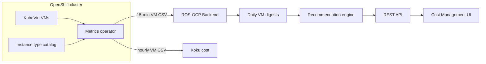

# Virtual Machine Recommendations

!!! warning "Status: Planned / Future Work"
    This feature is **not yet implemented**. The description below is the intended
    product direction for a future ROS-OCP release. Container, node, PVC, quota, and
    GPU recommendations remain available today.

!!! info "Quick Facts (planned)"
    **Scope:** OpenShift Virtualization (KubeVirt) virtual machines  
    **Plugin:** `vm` (Produce phase, **priority 40**)  
    **Collection:** **15-minute** metrics; operator emits dual CSV (15-min for ROS, hourly for Koku)  
    **Analysis windows:** 7 / 30 / 90 days (configurable)  
    **Gate:** `ROS_ENABLE_VM_RECS` (**on by default**; no-ops if no VM data)  
    **Confidence:** `high` (guest agent) or `moderate` (hypervisor-only) per VM  
    **Units:** Whole vCPUs and whole GiB (not millicores)

---

## What it does

**Virtual Machine Recommendations** right-size OpenShift Virtualization workloads the
same way ROS already optimizes containers — but tuned for how VMs actually run on KubeVirt.

For each virtual machine, ROS analyzes historical CPU, memory, and disk signals at
**15-minute** resolution and recommends:

- Optimal **vCPU count** (whole cores, not millicores)
- Optimal **memory** (whole GiB, with guest-OS-aware floors)
- Best-fit **instance type** from the OpenShift Virtualization catalog (for example `m1.large`) — **from day one**
- **Idle** VMs that consume cluster resources with almost no utilization — **OS-aware** (Linux vs Windows thresholds)
- **Disk growth**, **per-mountpoint filesystem** sizing (with guest agent), and **I/O profile** guidance — **disk I/O included from day one**

Example messages you can expect in the Optimizations UI:

> *"Your VM uses 2 of its 8 allocated cores; consider **m1.large** (4 vCPU)."*  
> *"Memory recommendation: **8 GiB** (currently 32 GiB allocated)."*  
> *"VM `legacy-app-02` has been idle for 45 days — CPU and memory usage are near zero."*  
> *"At current growth rate (2.1 GiB/day), disk will be full in 45 days — expand by 100 GiB now."*  
> *"Mount `/var` at 92% used — recommend expanding this volume."* (guest agent)  
> *"High IOPS detected (p95: 4,200 IOPS); consider a faster storage class than `standard`."*

---

## The problem — why VMs are different from containers

### Lift-and-shift over-provisioning

VMs migrated from VMware, Hyper-V, or physical hardware often land on OpenShift with
**the same sizing as the old world**:

> *"We gave it **16 vCPUs** and **64 GiB** because that's what the physical server had."*

Industry experience shows a large share of VMs are **idle or substantially oversized** —
often **more waste at the VM layer** than at the pod layer, because VMs change less
frequently and carry legacy assumptions.

### Resize is expensive — recommendations must be confident

| Aspect | Containers | Virtual machines |
|--------|------------|------------------|
| Typical change | Patch requests/limits; rolling restart | Change domain resources or instance type |
| Downtime | Often minimal with rolling updates | **Usually full VM restart** or disruptive live migration |
| Granularity | 250m CPU, 512 MiB | **Whole vCPUs**, **whole GiB** |
| Operator trust | Frequent small tweaks acceptable | Fewer, higher-confidence actions |

Unlike containers, shrinking a VM by one vCPU still implies a **maintenance window** for many teams. ROS will be **conservative on downsizing** and more willing to recommend **upsize** when usage shows starvation risk.

### Full guest vs cgroup view

VMs run a **full guest operating system** with its own scheduler, page cache, and
background services. Container metrics reflect cgroup limits on a single process
group; VM metrics reflect the **virt-launcher** pod and hypervisor view of the guest.

That means:

- Memory "usage" may not expose in-guest OOM without a guest agent
- CPU usage can look low while the guest is actually **waiting on disk or network**
- Disk recommendations start from **allocated volume size** unless guest tools are present

### Guest agent: adaptive quality per VM

ROS detects whether QEMU guest agent metrics are available **for each VM**:

| Mode | When | What you get | `confidence` |
|------|------|--------------|--------------|
| **Enhanced** | Guest agent metrics present | Working-set memory, per-mountpoint filesystem used %, swap hints | `high` |
| **Hypervisor-only** | Guest agent absent | CPU/memory/disk from hypervisor with wider safety margins | `moderate` |

The API exposes `guest_agent_detected` and `confidence` so operators know how much to trust each recommendation before scheduling a restart.

### Cost visibility without optimization

Koku already reports **what VMs cost** through the metrics operator and cost models.
This feature closes the loop: **what you should run instead**, mapped to OpenShift's
native **VirtualMachineClusterInstancetype** catalog.

---

## Collection strategy — one scrape, two CSVs

The metrics operator uses **Strategy 3: unified 15-minute collection**:

1. Scrape all VM Prometheus metrics **once** every 15 minutes.
2. Write **`ros-openshift-vm-usage-*.csv`** at 15-min resolution for ROS.
3. Write **`cm-openshift-vm-usage-*.csv`** at **hourly** aggregates for Koku (unchanged cost pipeline).

**You do not pay duplicate query cost** for basic rightsizing — ROS and Koku share the same underlying scrape. At ~1,000 VMs, the extra compressed upload size over a 6-hour cycle is about **1 MB** — negligible for typical clusters.

---

## Recommendation types

### vCPU optimization

Analyzes sustained CPU usage (high percentiles over your chosen window), applies a
safety margin, and rounds **up** to whole vCPUs so the guest always has integer cores.

**Example:**

> *"VM `erp-backend` in namespace `finance`: allocated **8 vCPUs**, p95 usage **1.7 cores**
> over 30 days. Recommend **4 vCPUs** via **m1.large** — saves **4 vCPUs** of cluster
> capacity with 20% headroom above p95."*

**Why it matters:** Cluster schedulers reserve full vCPU requests; oversized VM CPU
blocks other workloads from scheduling even when the guest is idle.

**Customer view:** Current vs recommended vCPU, optional monthly savings when cost
rates are configured.

### Memory optimization

Uses percentile-based sizing with minimum headroom above peak usage. Applies sensible
**floors** by guest OS family (higher baseline for Windows guests) before rounding to whole GiB.
With guest agent, working-set memory improves accuracy (`confidence: high`).

**Example:**

> *"Peak memory usage is **8.2 GiB** over 90 days (p95). Current allocation: **32 GiB**.
> Recommend **16 GiB** (p95 + 20% margin, rounded to whole GiB)."*

**Why it matters:** Memory is reserved for the VM's request; 32 GiB allocated for an
8 GiB workload is pure stranded RAM on the node.

**Customer view:** *"You allocated 32 GiB; usage supports 16 GiB."*

### Instance type suggestions (day one)

When your cluster defines **VirtualMachineClusterInstancetype** resources, ROS maps
recommended vCPU and memory to the **smallest cost-effective type** that still fits the workload profile.
The operator lists cluster instance types into the upload manifest so recommendations reference types that **exist in your cluster**.

**Example:**

> *"Your VM shows CPU-heavy pattern (**75%** CPU utilization vs **20%** memory pressure).
> Recommend **cx1.large** instead of **m1.2xlarge**."*

VMs defined with raw CPU/memory in the VM spec (no instance type) still receive vCPU
and memory guidance; instance type fields may be omitted in the API.

### Idle VM detection (OS-aware)

Flags VMs whose CPU and memory usage stay below OS-specific thresholds for the analysis window.

| Guest OS | CPU p95 | Memory p95 |
|----------|---------|------------|
| **Linux** | < 50 millicores | < 512 MiB |
| **Windows** | < 200 millicores | < 3072 MiB (3 GiB) |

OS family is read from the `os` label on `kubevirt_vmi_info` (from the VM spec, even without guest agent).

**Example (Linux):**

> *"VM `legacy-app-02` has been idle (**< 50 millicores** CPU p95, **< 512 MiB** memory p95)
> for **45 days**. Consider decommissioning."*

**Why it matters:** Idle VMs often still incur **full instance-type or node reservation**
cost. This is **full waste** of provisioned resources, not incremental rightsizing savings.

### Disk growth trending

Tracks provisioned disk size over time, projects growth forward (default **30-day**
linear trend), adds headroom, and rounds to practical sizes (for example **10 GiB** steps).

**With guest agent:** Per-mountpoint recommendations use filesystem used and capacity metrics.

**Example:**

> *"At current growth rate (**2.1 GiB/day**), disk will reach allocated capacity in
> **45 days**. Recommend expanding by **100 GiB** now to avoid emergency resize."*

!!! note "Allocated vs used"
    Without a QEMU guest agent, ROS sees **allocated** disk capacity from the platform,
    not in-guest filesystem free space. With guest agent, per-mountpoint **used %** drives
    filesystem recommendations (`confidence: high`).

**Why it matters:** PVC-style surprises apply to VM disks; lead time beats paging at 95% full.

### Disk I/O profile (day one)

For storage-heavy VMs, ROS summarizes read/write **IOPS** and throughput peaks from day one.

**Example:**

> *"High IOPS workload: read+write p95 **4,200 IOPS**. Storage class `standard` may be
> insufficient — consider **`fast`** or SSD-backed classes."*

**Why it matters:** Database and analytics VMs are often **I/O bound** while CPU looks healthy.

Specific storage class names are **not** auto-selected — classes vary by cluster (Ceph, cloud disks, NFS, etc.). ROS provides **actionable hints**, not blind StorageClass changes.

---

## Instance type intelligence

### What instance types are

OpenShift Virtualization provides **VirtualMachineClusterInstancetype** (and preference)
CRDs — a cluster-wide catalog of **approved VM sizes**, similar in spirit to cloud
instance families (but running on your metal or cloud workers).

Each instance type specifies:

- **Guest vCPU** count (whole cores)
- **Guest memory** (GiB)
- Optional **series** metadata (compute-optimized, general purpose, GPU, etc.)

Using instance types enforces **standard sizes** across teams, simplifies quota math,
and makes recommendations portable in the UI ("move from m1.2xlarge to m1.large").

### Series breakdown

| Series | Profile | Best for | Example workload |
|--------|---------|----------|------------------|
| **cx1** | Compute-optimized (high CPU:memory ratio) | CPU-bound batch, encoders, compilers | Java build farm, video transcode |
| **m1** | General purpose (balanced) | Most enterprise apps | ERP, web app servers, middleware |
| **u1** | Micro / utility | Low footprint services, dev sandboxes, jump boxes | Small Linux utility VM |
| **gn1** | GPU-attached | ML inference, rendering, CUDA workloads | GPU inference guest |
| **o1** | Overcommitted / burstable | Dev/test, bursty non-production | CI dev environments |
| **n1** | Network-optimized | High packet rates, proxies, load generators | Network lab VMs (when available) |

Sizes typically run from **small** through **8xlarge** within each series.

### How ROS maps usage to a series

1. Compute recommended **vCPU** and **GiB** from usage percentiles + margins.
2. Derive **CPU:memory utilization ratio** and variance (bursty vs steady).
3. Apply **idle** and **GPU** flags from metrics and labels.
4. Honor **VirtualMachinePreference** hints when present (development vs high-performance).
5. Select the **smallest** instance type in the chosen series that satisfies recommended vCPU and memory.

**Walkthrough example:**

| Signal | Interpretation |
|--------|----------------|
| CPU p95 = 75% of request, memory p95 = 20% of request | CPU-heavy → bias **cx1** |
| Both CPU and memory moderate, steady | Default **m1** |
| Very low utilization 30+ days | **u1** or idle notification |
| GPU metrics or instance type already gn1 | Stay in **gn1** family |
| High short-term variance, non-prod labels | **o1** candidate |

**Customer message:**

> *"Workload profile: CPU-heavy. Recommend **cx1.large** (4 vCPU, 8 GiB) instead of
> **m1.2xlarge** (8 vCPU, 32 GiB)."*

### Custom instance types

Clusters may define **custom** `VirtualMachineClusterInstancetype` objects. The operator
lists them into the upload catalog — recommendations always reference types that **exist in your cluster**.

---

## Conservative approach — why we are careful with VMs

VM resize implies **restart risk** for many applications. ROS biases toward **operator trust**:

| Direction | Behavior | Rationale |
|-----------|----------|-----------|
| **Downsize** | Only when usage is clearly low **and** change is meaningful: recommend downsize only if recommended/current **< 0.60** **or** drop ≥ **2 vCPU** **or** ≥ **2 GiB** | Avoid "save one core" churn that still needs a maintenance window |
| **Upsize** | Standard safety margins; performance engine uses higher percentiles | Under-provisioned VMs fail loudly after restart |
| **Idle** | Informational; triggers cleanup workflows, not auto power-off | Decommission is a business decision |
| **Storage class** | Informational I/O hints only | Wrong storage class change can break databases |

**Why:** Platform teams need to justify a change window to application owners. Noisy
recommendations get ignored; a smaller set of high-confidence recs gets adopted.

---

## Time windows — why VMs use longer terms than containers

| Resource | Typical ROS terms | Default windows | Min data points (planned) |
|----------|-------------------|-----------------|---------------------------|
| **Containers** | short / medium / long | 1 / 7 / 15 days | 1 / 3 / 7 days |
| **Virtual machines** | short / medium / long | **7 / 30 / 90 days** | **3 / 14 / 30 days** |

**Why longer for VMs:**

- VMs are **long-running**; a single busy day should not drive a downsize.
- Weekly and monthly business cycles appear in **30–90 day** windows.
- Restart cost means recommendations should reflect **sustained** behavior, not pod-style noise.

At **15-minute** sampling, each term has enough points for stable percentiles (672 / 2880 / 8640 samples for 7 / 30 / 90 days).

**Customer impact:** Short-term spikes still appear in metrics, but ROS waits until
the pattern is stable across the configured window before recommending a smaller size.

---

## Metrics — Strategy 3, no duplicate burden

| Signal | Collection | Consumer |
|--------|------------|----------|
| CPU / memory usage, requests, limits | 15-min scrape → hourly aggregate | ROS + Koku |
| Disk allocated, VM info | 15-min scrape → hourly aggregate | ROS + Koku |
| Memory available (balloon) | 15-min, ROS only | Headroom |
| Disk IOPS + throughput (queries 7–10) | 15-min, ROS only | **Day one** |
| Filesystem used/capacity per mount (queries 13–14) | 15-min, ROS only | Guest agent |
| Instance type catalog | Operator list CRs | **Day one** |

**Customer-friendly summary:** One monitoring pass feeds both **cost** and **optimization**.
ROS adds disk I/O and (when guest agent is installed) filesystem metrics — you do not need a second operator or duplicate Prometheus rules for basic rightsizing.

---

## How it works (high level)



1. **Collect** — Operator gathers KubeVirt metrics at **15-minute** resolution (dual CSV for ROS and Koku).
2. **Summarize** — ROS builds **daily digests** per VM (percentiles and peaks).
3. **Analyze** — Over **7-, 30-, or 90-day** windows, percentile-based sizing with VM-specific downsize rules and OS-aware idle detection.
4. **Adapt** — Per-VM guest agent detection sets `confidence` and enables filesystem recs when available.
5. **Map** — Match recommended resources to **instance types** from the cluster catalog.
6. **Deliver** — List and detail APIs expose current vs recommended values, `confidence`, and notification codes.

---

## Configuration

VM recommendations use the **same three-tier configuration model** as containers,
nodes, and PVCs:

| Tier | Source | Example |
|------|--------|---------|
| 1 | Compiled defaults | 95th percentile CPU, 20% memory margin |
| 2 | Tenant Settings API | Adjust idle thresholds, downsize ratio |
| 3 | Environment locks | Platform admin enforces minimum change sizes |

**Thresholds:**  
`GET/PUT/DELETE .../settings/ros/thresholds/?recommendation_type=vm`

**Analysis windows (terms):**  
`GET/PUT/DELETE .../settings/ros/terms/?recommendation_type=vm`

### Parameters (defaults)

| Parameter | Default | Purpose |
|-----------|---------|---------|
| CPU percentile (cost) | 0.95 | Sustained CPU for rightsizing |
| CPU percentile (performance) | 0.99 | Headroom for critical VMs |
| CPU margin min / max | 15% / 50% | Adaptive margin |
| Memory margin min | 20% | Above p95 peak |
| Downsize hysteresis ratio | 0.60 | Must be below 60% of current to downsize |
| Min vCPU change | 2 | Minimum cores delta to recommend |
| Min GiB change | 2 | Minimum memory delta to recommend |
| Idle CPU (Linux) | 50 millicores | p95 below → idle candidate |
| Idle memory (Linux) | 512 MiB | p95 below → idle candidate |
| Idle CPU (Windows) | 200 millicores | p95 below → idle candidate |
| Idle memory (Windows) | 3072 MiB | p95 below → idle candidate |
| Disk projection window | 30 days | Linear growth horizon |
| Disk headroom | 25% | On projected size |
| Disk round step | 10 GiB | Practical resize steps |
| High IOPS hint | 3000 | Informational read+write p95 |

### Environment variables

| Variable | Default |
|----------|---------|
| `ROS_ENABLE_VM_RECS` | `true` |
| `ROS_VM_CPU_PERCENTILE` | `0.95` |
| `ROS_VM_CPU_PERCENTILE_PERFORMANCE` | `0.99` |
| `ROS_VM_CPU_MARGIN_MIN` | `0.15` |
| `ROS_VM_CPU_MARGIN_MAX` | `0.50` |
| `ROS_VM_MEMORY_MARGIN_MIN` | `0.20` |
| `ROS_VM_DOWNSIZE_HYSTERESIS` | `0.60` |
| `ROS_VM_MIN_VCPU_CHANGE` | `2` |
| `ROS_VM_MIN_GIB_CHANGE` | `2` |
| `ROS_VM_IDLE_CPU_MC` | `50` |
| `ROS_VM_IDLE_MEMORY_MIB` | `512` |
| `ROS_VM_IDLE_CPU_MC_WINDOWS` | `200` |
| `ROS_VM_IDLE_MEMORY_MIB_WINDOWS` | `3072` |
| `ROS_VM_DISK_HEADROOM` | `0.25` |
| `ROS_VM_DISK_PROJECTION_DAYS` | `30` |
| `ROS_VM_DISK_ROUND_GIB` | `10` |
| `ROS_VM_HIGH_IOPS_HINT` | `3000` |

**Master gate:** `ROS_ENABLE_VM_RECS` defaults to **`true`**. If no VM usage CSV is uploaded, the plugin **no-ops silently** (same as GPU plugins). Set `false` to disable VM recommendations entirely.

See [Configurable thresholds](configurable-thresholds.md) for precedence rules.

---

## API (planned)

| Endpoint | Purpose |
|----------|---------|
| `GET .../recommendations/openshift/virtual-machines/` | List VM recommendations |
| `GET .../recommendations/openshift/virtual-machines/:id` | Detail for one VM |

**Filters:** `filter[vm_name]`, `filter[namespace]`, `filter[cluster]`, `filter[recommendation_status]`, `filter[confidence]`

### Example list item (abbreviated)

```json
{
  "vm_name": "erp-backend",
  "namespace": "finance",
  "cluster_id": "prod-east",
  "guest_os_name": "RHEL 9",
  "guest_agent_detected": true,
  "confidence": "high",
  "current": {
    "vcpu": 8,
    "memory_gib": 32,
    "instance_type": "m1.2xlarge",
    "disk_gib": 500
  },
  "recommended": {
    "vcpu": 4,
    "memory_gib": 16,
    "instance_type": "m1.large",
    "disk_gib": 600
  },
  "notifications": [
    {"code": 19, "type": "INFO", "message": "VM is oversized based on 30-day usage."}
  ],
  "term": "medium_term",
  "engine": "cost",
  "disk_projection": {
    "days_until_full": 45,
    "growth_gib_per_day": 2.1,
    "recommended_expand_gib": 100
  },
  "filesystem_mounts": [
    {"mount": "/", "used_percent_p95": 72, "recommended_expand_gib": 20}
  ],
  "io_profile": {
    "read_iops_p95": 2100,
    "write_iops_p95": 2100,
    "hint": "Consider faster storage class"
  }
}
```

Full shapes will align with the [UI Integration Guide](../ui-integration-guide.md).

---

## Prerequisites

| Requirement | Why |
|-------------|-----|
| **OpenShift Virtualization** installed | KubeVirt metrics and VM CRs |
| **VMs running** with active VMIs | Metrics join on `phase='running'` |
| **Metrics operator** uploading VM usage CSV (dual 15-min + hourly) | Data path into ROS and Koku |
| **Instance types configured** (optional) | Enables `m1.large`-style recommendations; raw sizing still works without them |
| **QEMU guest agent** (optional) | `confidence: high`, filesystem per-mount recs, working-set memory |

---

## Comparison to container recommendations

| Topic | Containers | Virtual machines |
|-------|------------|------------------|
| Units | millicores, Mi/Gi | vCPUs, GiB |
| Typical action | Patch deployment resources | Resize VM / change instance type |
| Downtime | Often rolling | Usually full restart for size change |
| Sampling | Hourly digests | **15-minute** → daily digests |
| Idle detection | Available today | OS-aware (Linux / Windows) |
| Instance types | N/A | cx1, m1, u1, gn1, o1, n1, … |
| Confidence | N/A | `high` / `moderate` (guest agent) |
| OOM feedback | Yes | Limited without guest agent |

Container recommendations are **unchanged** when VM recommendations ship.

---

## Related documentation

| Document | Audience |
|----------|----------|
| [Internal design: VM recommendations](../../../docs/design/vm-recommendations.md) | Engineering — Strategy 3, metrics, algorithms, phases |
| [Seasonality](seasonality.md) | Planned proactive peaks for long-running VMs |
| [Container right-sizing](container-recommendations.md) | Available today |
| [Configurable thresholds](configurable-thresholds.md) | Settings API precedence |
| [Dual engine](dual-engine.md) | Cost vs performance profiles |

---

## Coming soon checklist

When this feature ships, expect:

- [ ] Strategy 3 VM CSV from the metrics operator (15-min ROS + hourly Koku, 14 queries)
- [ ] Instance type catalog in operator manifest
- [ ] VM recommendations in the Optimizations API and UI
- [ ] Settings and terms for `recommendation_type=vm`
- [ ] Idle and oversized VM badges (notification codes 18–19)
- [ ] Per-VM `confidence` and `guest_agent_detected` in API responses
- [ ] Optional savings estimates tied to VM cost model rates in Koku

Until then, use **container**, **node**, and **PVC** recommendations for workload
optimization; use **OpenShift cost reports** for VM spend visibility.
