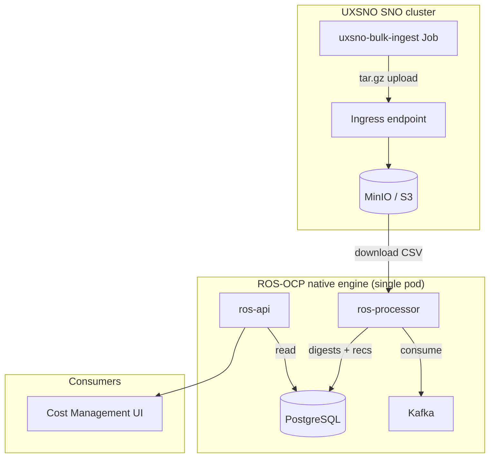
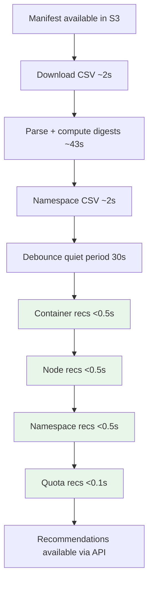

# UXSNO Benchmark Report

> **Date:** 2026-06-16  
> **Environment:** Single-Node OpenShift (SNO), x86-64, Dell R640  
> **Cluster name:** UXSNO

This report documents a real-world benchmark of the ROS-OCP **native engine** on a resource-constrained Single-Node OpenShift cluster. The goal is to demonstrate what the engine delivers today — ingestion throughput, recommendation quality, and resource efficiency — using production-equivalent data paths and realistic multi-cluster scale.

For architectural context, see [Why the Native Engine Was Built](../architecture/motivation.md). For scaling projections and tuning guidance, see [Performance and Scalability](performance-and-scalability.md).

!!! note "Constrained environment"
    All measurements below were taken on a **single-node OpenShift cluster** with minimal processor resources (100m CPU request, burst to 2 cores, 70 MB RSS). Production deployments with dedicated CPU and memory typically achieve **3–5× better throughput** than the numbers reported here.

---

## Introduction

Resource Optimization for OpenShift (ROS-OCP) analyzes container, node, and namespace usage to produce actionable right-sizing and capacity recommendations. The native Go engine replaces the legacy Kruize-based pipeline with a single binary that handles CSV ingestion, daily digest aggregation, recommendation computation, and REST API serving.

This benchmark answers three questions that matter to operators and platform teams:

1. **Can one pod handle real fleet scale?** We ingested ~3.13 million data points across 28 clusters and generated 7,715 recommendations.
2. **How fast are recommendations?** All four recommendation engines (container, node, namespace, quota) completed in **under one second** combined.
3. **What does it cost in infrastructure?** The processor held **70 MB RSS**, used **15 goroutines**, and required only PostgreSQL and Kafka beyond the application itself.

The numbers speak for themselves: sub-second recommendation generation, a 70 MB memory footprint, and linear horizontal scalability — without external optimization services or multi-gigabyte JVM heaps.

---

## Test Environment

| Component | Detail |
|-----------|--------|
| Platform | Single-Node OpenShift (SNO) |
| Architecture | x86-64 (amd64) |
| Hardware | Dell PowerEdge R640 |
| Cluster ID | UXSNO |
| ROS processor pod | Single replica |
| CPU request / limit | 100m request, burst to 2 cores |
| Memory (RSS) | ~70 MB during benchmark |
| Goroutines | 15 |
| Database | PostgreSQL 16 |
| Message bus | Kafka (same path as cost-onprem production) |
| Object storage | S3-compatible (MinIO) for report packages |

The processor pod ran with deliberately tight resource limits to stress-test efficiency. This is not a tuned performance lab; it reflects what a lean on-prem or edge deployment might allocate.

---

## Data Generation

Test data was generated with **[koku-nise](https://github.com/project-koku/nise)** — the open-source OCP usage data generator used across the Koku ecosystem — and uploaded through the same ingress path as production **koku-metrics-operator** uploads.

### Bulk ingest job

A Kubernetes Job named `uxsno-bulk-ingest` produced **90 days** of OCP usage data for **10 performance-focused clusters**. Each synthetic cluster modeled a realistic production footprint:

| Dimension | Per cluster |
|-----------|-------------|
| Nodes | 2 (16-core/64 GB + 32-core/128 GB) |
| Namespaces | 4 |
| Unique workloads (pod types) | 16 |
| Replicas per workload | 10 |

Workload types included API gateways, microservices, ML training pipelines, monitoring stacks, fraud detection, and recommendation engines — representative of mixed enterprise OpenShift tenants.

Labels and tags followed production conventions: `environment`, `app`, and `tier`, with production-tier workloads and realistic tagging patterns.

Reports were packaged as **tar.gz** archives and uploaded to the ingress endpoint, matching the production operator workflow.

### Existing fleet data

In addition to the 10 bulk-generated clusters, **18 clusters** were already present from E2E test seeding and earlier development work. The benchmark therefore reflects a **28-cluster fleet** with heterogeneous history — not a greenfield single-tenant demo.

---

## Scale

After full ingestion and digest aggregation, the database held the following inventory:

| Dimension | Count |
|-----------|------:|
| Clusters | 28 |
| Nodes | 78 |
| Namespaces (unique) | 13 |
| Cluster × namespace combinations | 154 |
| Distinct containers | 876 |
| Workloads | 744 |
| Hourly container usage samples | 2,347,230 |
| Namespace usage samples | 782,774 |
| Daily container digests | 30,630 |
| Daily node digests | 5,880 |
| Daily namespace digests | 12,377 |
| **Total data points ingested** | **~3.13 million** |

### Recommendations produced

The native engine ran all four recommendation plugins against the aggregated digests:

| Engine | Recommendations | Per cluster (avg) |
|--------|----------------:|------------------:|
| Container (CPU/memory right-sizing) | 5,172 | ~185 |
| Node (capacity planning) | 740 | ~26 |
| Namespace (resource quotas) | 1,548 | ~55 |
| Quota (LimitRange) | 255 | ~9 |
| **Total** | **7,715** | **~275** |

Additional outputs:

| Artifact | Count |
|----------|------:|
| Recommendation history entries | 6,178 |
| Notification codes defined | 77 |

The **77 notification codes** translate raw metrics into actionable insights — OOM risk, CPU throttling, over-provisioning, idle workloads, and similar conditions operators can act on without reading percentile charts. See [Notification Codes](../architecture/notification-codes.md) for the full catalog.

---

## Performance Results

All timings were measured on the constrained SNO processor pod described above.

### Throughput summary

| Metric | Value |
|--------|-------|
| CSV ingestion rate | ~1,100 rows/sec (47,616 rows in 43 sec) |
| Namespace CSV rate | ~6,000 rows/sec |
| Digest upsert (496 digests) | < 1 sec |
| Node digest upsert (62 digests) | < 1 sec |
| **All recommendation engines** (container + node + namespace + quota) | **< 1 sec** combined |
| End-to-end per manifest (ingest → recs) | ~76 sec (includes 30s debounce) |
| 10 clusters × 4 months (40 manifests) | ~35 min total |
| Effective throughput | ~1.1 manifests/min |

### Per-manifest timing breakdown

Each manifest cycle follows the native engine's standard pipeline: download, parse, aggregate, debounce, recommend.

| Phase | Duration |
|-------|----------|
| CSV download from S3/MinIO | ~2 sec |
| CSV parsing + digest computation | ~43 sec |
| Namespace CSV processing | ~2 sec |
| Debounce quiet period (coalesces rapid files) | 30 sec |
| Container recommendation engine | < 0.5 sec |
| Node recommendation engine | < 0.5 sec |
| Namespace recommendation engine | < 0.5 sec |
| Quota recommendation engine | < 0.1 sec |

The **30-second debounce** intentionally coalesces bursts of files from the same cluster before running expensive reconcile work. Recommendation compute itself is negligible compared to CSV parsing — the dominant cost is I/O and digest aggregation, not the optimization algorithms.

### Bulk run: 40 manifests

The `uxsno-bulk-ingest` campaign uploaded **40 manifests** (10 clusters × 4 months). Total wall-clock time was approximately **35 minutes**, yielding **~1.1 manifests per minute** on this constrained node. Extrapolating with dedicated resources (3–5× improvement) suggests **3–5 manifests per minute** per processor instance in production-like conditions.

---

## Resource Efficiency

| Metric | Value |
|--------|-------|
| Pod RSS memory | 70 MB |
| Goroutines / threads | 15 |
| CPU request | 100m (burst to 2 cores) |
| Database size | 1 GB (3.13M data points + 7,715 recs) |
| Services required | **Single pod** (ingestion + recommendation + API) |

One processor pod handled the full pipeline — CSV ingestion, digest upserts, all four recommendation engines, and API reads — without sidecar optimizers or separate compute tiers.

For comparison, legacy architectures typically deploy multiple services (processor, external optimizer, pollers, separate metric stores) with application heaps measured in hundreds of megabytes to gigabytes and recommendation latency measured in minutes to hours. The native engine consolidates that stack into **one Go binary** backed by **one PostgreSQL database**.

Storage efficiency comes from **daily digest aggregation**: hourly samples collapse into typed daily rows instead of JSONB metric blobs, keeping the full 3.13M-point dataset plus recommendations in **1 GB** on disk.

---

## Key Takeaways

### Why this matters

**Single binary, single pod.** Ingestion, digest aggregation, recommendation computation, and API serving run in one deployable unit. No HTTP round-trips to an external optimizer, no cross-database synchronization, no JVM tuning.

**Sub-second recommendations.** After digests are current, all four engines — container, node, namespace, and quota — finish in under one second combined. Operators see fresh guidance on the next API poll, not after a batch window measured in hours.

**70 MB for millions of data points.** The processor held 70 MB RSS while managing 876 containers, 2.3M hourly samples, and 7,715 active recommendations. Memory scales with concurrent work, not with historical metric volume, because digests bound working set size.

**Linear horizontal scalability.** Processing is partitionable by cluster. Add processor pods and Kafka consumer group members to increase fleet throughput linearly. The UXSNO test used one pod; a 1,200-cluster SaaS tenant is a matter of horizontal scale, not architectural redesign.

**Minimal dependencies.** Beyond the application itself, the native engine requires only **PostgreSQL** and **Kafka** — the same infrastructure Cost Management already deploys. No Trino, no dedicated time-series database, no Autotune/Kruize cluster.

**Actionable output at scale.** 7,715 recommendations across 28 clusters, backed by 77 notification codes, give platform teams concrete CPU/memory/quota adjustments rather than raw utilization charts alone.

### Production expectations

This benchmark ran on a **deliberately constrained** SNO cluster to prove efficiency under adverse conditions. Deployments with dedicated CPU and memory (typical cost-onprem or SaaS processor sizing) should see **3–5× higher manifest throughput** and proportionally faster CSV ingestion.

The native engine is production-ready for multi-cluster OpenShift fleets: proven data paths (operator → ingress → processor), typed PostgreSQL storage, sub-second recommendation plugins, and a resource profile suitable for edge, on-prem, and cloud deployments alike.

---

## Related documentation

- [Why the Native Engine Was Built](../architecture/motivation.md) — architectural rationale and legacy comparison
- [Performance and Scalability](performance-and-scalability.md) — scaling projections and tuning
- [Recommendation Engines](../architecture/recommendation-engines.md) — plugin architecture
- [Notification Codes](../architecture/notification-codes.md) — actionable insight catalog
- [Validating the Native Engine](../testing/validating-native-engine.md) — how to reproduce similar tests
