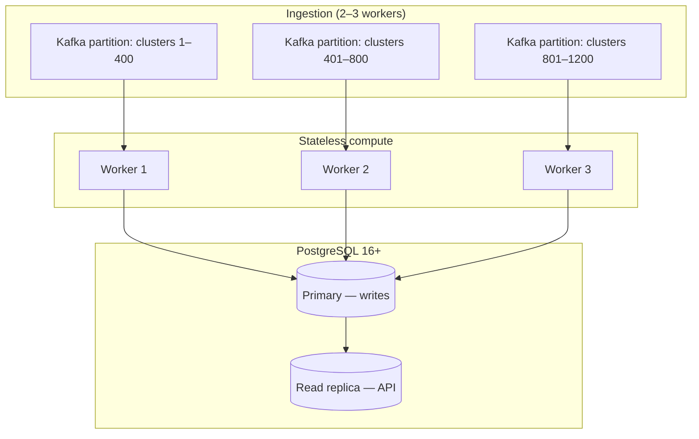

# Performance and Scalability

> **Date:** 2026-06-16

This page documents the native engine's performance characteristics, benchmark results, scaling projections for large multi-cluster deployments, and production tuning guidance.

For the architectural rationale behind the native engine (serialization hops, JSONB anti-pattern, Kruize comparison), see [Why the Native Engine Was Built](../architecture/motivation.md).

---

## Single-Instance Benchmarks

All numbers below were measured on a **single ros-ocp-backend processor instance** backed by **plain PostgreSQL 16+** with no Trino, no Kruize, and no secondary databases.

| Metric | Value |
|--------|-------|
| Ingestion throughput | **15,000 containers/sec** |
| Recommendation throughput | **60,000 containers/sec** |
| Max containers in 1-hour SLA | **~5,000,000** |
| Storage (50K containers, 91 days) | **6 GB** |
| Application RAM | **50–100 MB** |
| Infrastructure | **1 service** (app + PostgreSQL) |

Benchmarks reflect the full ingest path: CSV parse → daily digest aggregation → recommendation compute → bulk write. Recommendation throughput measures end-to-end reconcile (read digests, compute percentiles, write `recommendation_sets`).

---

## Legacy vs Native Comparison

| Metric | Legacy Kruize | Native Engine | Factor |
|--------|---------------|---------------|--------|
| Ingestion throughput | 8 containers/sec | 15,000 containers/sec | **~1,900×** |
| Recommendation throughput | 24 containers/sec | 60,000 containers/sec | **~2,500×** |
| Max containers (1-hour SLA) | ~1,000 | ~5,000,000 | **~5,000×** |
| Metrics storage (50K containers, 91 days) | 5.7 TB | 6 GB | **~950×** |
| Application RAM | 350–700 MB | 50–100 MB | **~5×** |
| Infrastructure | 4 services (2 apps + 2 DBs) | 1 service | **4× fewer** |

The storage reduction comes primarily from **daily digest aggregation**: 96 fifteen-minute intervals collapse into one row per container per day, stored in typed columns instead of JSONB blobs with repeated field names.

---

## Scaling to Large Deployments

Red Hat's largest SaaS tenants operate roughly **1,200 OpenShift clusters** totaling **~100 million containers**. The native engine's compute layer is **stateless and embarrassingly parallel** — partition work by cluster and scale workers horizontally.

### Per-cluster math

```
100,000,000 containers ÷ 1,200 clusters ≈ 83,000 containers/cluster
```

At 60,000 containers/sec recommendation throughput:

```
83,000 ÷ 60,000 ≈ 1.4 seconds per cluster (recommendations)
```

### Fleet-wide wall clock

| Workers | Time for 1,200 clusters | Fits 1-hour SLA? |
|---------|-------------------------|------------------|
| 1 | ~28 minutes | Yes |
| 3 | ~9 minutes | Yes (with headroom) |

Ingestion at 15,000 containers/sec processes 100M containers in ~111 minutes on a single worker. For a **1-hour upload window**, deploy **2–3 processor instances** with Kafka consumer group partitioning (one partition per cluster or cluster batch).

### Storage at 100M containers

Daily digests at fleet scale:

```
100M containers × ~200 bytes/row/day × 91 days ≈ 12 TB (daily digests only)
```

Recommendation tables add modest overhead (6 rows per container for term × engine combinations, refreshed on reconcile). This is manageable with standard PostgreSQL tooling:

- **Range partitioning** by `usage_start` / digest date (monthly partitions, already used in ros-ocp-backend migrations)
- **Hash partitioning** by `cluster_uuid` for very large single-org deployments
- **Read replicas** for API read traffic
- **Tablespaces on NVMe** for hot partitions
- **`pg_partman` retention** to drop partitions older than `ROS_RETENTION_MONTHS`



---

## Why PostgreSQL Scales for Native but Not for Kruize

Both paths use PostgreSQL. The difference is **what gets stored** and **how it is written and read**.

| Factor | Kruize (legacy) | Native engine |
|--------|-----------------|---------------|
| Row granularity | 1 row per 15-min interval | 1 row per day (96× compression) |
| Column types | JSONB blobs | Typed `float64`, `int`, `timestamptz` |
| Write mechanism | Per-row HTTP → INSERT | `COPY FROM` bulk load |
| Read pattern | Deserialize all history every cycle | Index scan on digest date range |
| Compute location | JVM (separate service) | In-process Go (same binary) |
| Parallelism | Single Kruize instance | Horizontal worker scaling |

### The 100M-container thought experiment

At Kruize's measured **8 containers/sec** ingestion rate:

```
100,000,000 containers ÷ 8 containers/sec = 12,500,000 seconds ≈ 145 days
```

Kruize would need **145 days** to ingest a single hour's worth of data for 100M containers.

At the native engine's **15,000 containers/sec** with **3 workers**:

```
100,000,000 ÷ (15,000 × 3) ≈ 2,222 seconds ≈ 37 minutes (ingestion)
+ ~9 minutes (recommendations with 3 workers)
≈ 46 minutes total — within the 1-hour SLA
```

---

## Production Tuning Recommendations

### Processor / ingestion

| Setting | Default | Scale-up guidance |
|---------|---------|-------------------|
| `ROS_KAFKA_WORKERS` | `3` | Increase when consumer lag grows; cap at ~CPU cores minus headroom |
| `ROS_KAFKA_PARALLEL` | `true` | Keep enabled for multi-partition topics |
| `ROS_DB_MAX_CONNS` | `10` | Raise with workers (rule of thumb: `workers × 3`, max ~50) |
| `ROS_DB_MIN_CONNS` | `2` | Set to ~25% of max for warm pool |
| `ROS_DB_ACQUIRE_TIMEOUT_SECS` | `5` | Increase only if pool is correctly sized; sustained timeouts mean too many workers |

Monitor `rosocp_db_pool_acquired_conns` vs `rosocp_db_pool_max_conns` — sustained acquisition at max indicates pool saturation. See [Monitoring](../monitoring.md#connection-pool-pgxpool).

### Database

| Practice | Rationale |
|----------|-----------|
| PostgreSQL 16+ | Required; uses modern planner and `COPY` optimizations |
| NVMe storage for primary | Digest writes are sequential bulk loads; NVMe reduces flush latency |
| `shared_buffers` ≈ 25% RAM | Keeps hot digest partitions in cache |
| `work_mem` 64–256 MB | Sort/hash for percentile queries over digest windows |
| Monthly range partitions | Already created by migrations; verify `partitioned_tables` registry |
| `CREATE INDEX CONCURRENTLY` on large DBs | See [migrations README](../../migrations/README.md) before applying new indexes |
| Read replica for API | Offload list/aggregation queries from ingestion primary |

### Retention

| Setting | Default | Purpose |
|---------|---------|---------|
| `ROS_RETENTION_MONTHS` | `3` | Drop monthly digest partitions |
| `ROS_MAX_LOOKBACK_DAYS` | `90` | Recommendation window cap |
| `ROS_SAMPLE_RETENTION_DAYS` | varies | Raw sample cleanup |
| `ROS_HISTORY_RETENTION_DAYS` | varies | Historical recommendation rows |

Aggressive retention reduces storage linearly. Daily digests already compress 96× vs raw intervals — retention policies operate on the compressed layer.

### API read path

Large orgs (200k+ containers) should rely on:

- **Keyset pagination** via `org_container_keys` (not offset deep pages)
- **Partial indexes** matching `WHERE stale = false AND term = 'medium' AND engine = 'cost'`
- **Fleet summary cache** (`ROS_FLEET_SUMMARY_CACHE_TTL`, default 300s)

See [Query Performance](../query-performance.md) for the full audit methodology and index design principles.

### Horizontal scaling checklist

1. **Kafka topic partitions** ≥ desired worker count (partition by cluster UUID hash).
2. **Processor replicas** = worker count; each joins the same consumer group.
3. **API replicas** scale independently; stateless, read from PostgreSQL (prefer read replica).
4. **Single PostgreSQL primary** for writes; add read replicas before sharding.
5. **Unique image tags** on deploy — `imagePullPolicy: IfNotPresent` caches stale images (see cost-onprem chart docs).

### When to add capacity

| Signal | Action |
|--------|--------|
| Kafka consumer lag > 15 min sustained | Add processor workers or partitions |
| `rosocp_ingestion_errors_total` rising with workers | Reduce workers or increase `ROS_DB_MAX_CONNS` |
| `rosocp_db_pool_acquire_duration_seconds` growing | Pool too small or queries too slow |
| API P95 > 500 ms on list routes | Read replica, cache tuning, index audit |
| Storage growth > plan | Verify retention job runs; check `rosocp_retention_partitions_dropped_total` |
| `rosocp_ingest_groups_in_memory` sustained high | Reduce flush batch size or add processor memory |

---

## Related Documentation

| Document | Scope |
|----------|-------|
| [Why the Native Engine Was Built](../architecture/motivation.md) | Architectural rationale |
| [Query Performance](../query-performance.md) | API read-path optimization |
| [Monitoring](../monitoring.md) | Prometheus metrics and Grafana dashboard |
| [Configuration](../configuration.md) | Full environment variable reference |
| [Validating the Native Engine](../testing/validating-native-engine.md) | Benchmark reproduction steps |
