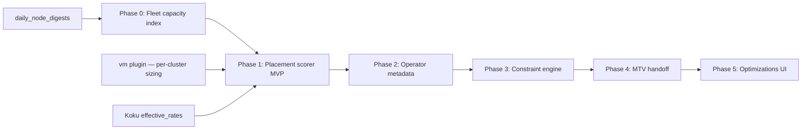

# Cross-Cluster VM Placement

!!! warning "Status: Planned / Future Work"
    This feature is **not yet implemented**. The description below is the intended
    product direction for a future ROS-OCP release. [Virtual Machine recommendations](../features/virtual-machines.md)
    (Preview), container right-sizing, node consolidation, and other recommendation
    types remain available today — all scoped to **within a single cluster**.

!!! info "Quick Facts (planned)"
    **Scope:** Advisory recommendations for which OpenShift cluster is the best target to place or migrate a KubeVirt / OpenShift Virtualization VM  
    **Depends on:** Shipped VM plugin, node digests, Koku `effective_rates`, multi-cluster ingestion  
    **In-cluster today:** Placement checks (notifications **60**–**63**) — same-node redundancy, uneven spread, shared-storage proxy, NUMA fit  
    **Execution partner:** MTV / Forklift (migration plan and apply) — ROS stays advisory  
    **API (planned):** `GET /api/cost-management/v1/recommendations/openshift/vm/placement`  
    **Est. effort:** **~2–3 months** MVP advisory; **~6–9 months** production-grade with constraints and MTV handoff

---

## What it will do

**Cross-Cluster VM Placement** will answer: *given a VM (or a workload profile), which
cluster in the fleet is the best place to run it?*

ROS will rank **candidate clusters** using fleet-wide signals — allocatable headroom,
estimated monthly cost from Koku cost models, and (in later phases) scheduling and
storage constraints — then surface an **advisory placement recommendation** with
rationale and confidence.

| Signal | Example recommendation |
|--------|------------------------|
| **Fleet headroom** | `legacy-app-02` needs 4 vCPU / 16 GiB; **cluster-b** has 38% CPU and 42% memory headroom vs **cluster-a** at 8% / 12% |
| **Cost delta** | Same sizing on **cluster-b** estimated **$200/mo less** (lower node rates + better utilization) |
| **Constraint blockers** | GPU passthrough VM cannot target **cluster-c** — no compatible GPU nodes; RWX StorageClass `ocs-storagecluster-ceph-rbd` absent on **cluster-d** |
| **Migration handoff** | Export ranked targets + sizing as MTV/Forklift migration-plan input (Phase 4) |

**Positioning:** ROS answers *"this VM should be 4 vCPU / 16 GiB and cluster B has headroom
at $200/mo less."* MTV/Forklift answers *"here is how to move it."*

---

## Why it matters

### Multi-cluster fleets need FinOps-driven placement

Platform teams running **two or more OpenShift clusters** (hub/spoke, region pairs,
dev/stage/prod, tenant-dedicated clusters) routinely decide where to land new VMs or
where to evacuate overloaded clusters. Today that decision is manual: spreadsheets,
tribal knowledge, or "put it on the cluster with free capacity last Tuesday."

Without fleet-level guidance, teams either **over-provision every cluster** (waste) or
**concentrate VMs on one cluster** until live migration or cold migration becomes urgent
(risk).

### ROS optimizes within a cluster, not across clusters

[Virtual Machine recommendations](../features/virtual-machines.md) (Preview) right-size
vCPU, memory, disk, instance type, and GPU settings **on the cluster where the VM already
runs**. [Node consolidation](../features/node-recommendations.md) and
[MachineSet recommendations](machineset-recommendations.md) optimize **that cluster's**
node fleet.

Cross-cluster placement closes the gap between **per-VM sizing** and **fleet-level
capacity and cost** — the same FinOps lens Cost Management already applies to
multi-cluster **cost comparison** via Koku.

---

## Current state

ROS-OCP already has **multi-cluster visibility** but treats clusters as **independent
silos** for recommendation purposes.

| Capability | Status | Notes |
|------------|--------|-------|
| **Multi-cluster ingestion** | Shipped | Each cluster uploads via koku-metrics-operator; ROS stores `cluster_uuid` on digests and recommendations |
| **Per-cluster VM recommendations** | Preview (Beta) | `GET .../recommendations/openshift/vm` — sizing, idle/abandoned, instance type, savings |
| **In-cluster VM placement checks** | Shipped | Notifications **60**–**63**: same-node redundancy (**60**), uneven spread (**61**), shared-storage correlation (**62**), NUMA oversize (**63**); `placement` settings block on VM Settings API |
| **Per-cluster cost comparison** | Shipped (Koku) | Cost Management reports compare spend across clusters; ROS `effective_rates` per provider for savings |
| **Node capacity digests** | Shipped | `daily_node_digests` — allocatable vs requested CPU/memory per node |
| **Cross-cluster placement scorer** | **Not implemented** | No fleet index, no candidate ranking, no placement API |
| **Cluster metadata for placement** | **Partial / missing** | Region, zone, tier, StorageClass inventory not normalized for placement |
| **MTV / Forklift export** | **Not implemented** | No migration-plan handoff |

In-cluster placement (anti-affinity hints, topology spread, NUMA fit) helps **where on
a node** a VM should run. Cross-cluster placement helps **which cluster** should host it.

---

## Phase overview

| Phase | Deliverable | Automation posture |
|-------|-------------|-------------------|
| **0** | Fleet capacity index — per-cluster headroom from node digests | Read-only index; no user-facing recs yet |
| **1** | Placement scorer (MVP advisory) — rank clusters by fit + estimated cost | **Advisory** — human or MTV applies migration |
| **2** | Operator enhancements — cluster metadata, StorageClass inventory, PVC→VM mapping | Richer signals for scorer |
| **3** | Constraint engine — affinity, GPU passthrough, storage compatibility matrix | Blockers and warnings on candidates |
| **4** | MTV/Forklift integration — export placement rec as migration plan input | ROS advisory; execution in MTV |
| **5** | UI — fleet placement view in Optimizations | Review and act from Cost Management UI |



---

## Phase 0 — Fleet capacity index

**Goal:** Aggregate **per-cluster headroom** from existing `daily_node_digests` without
new operator CSVs.

| Metric | Computation (planned) |
|--------|----------------------|
| **CPU headroom** | Sum(node `cpu_allocatable`) − sum(workload CPU requests) — cluster-wide and by node pool label if present |
| **Memory headroom** | Same pattern for memory allocatable vs requests |
| **GPU headroom** | Sum GPU allocatable − requested (when DCGM / GPU columns present) |
| **Pod capacity** | Sum `node_capacity_pods` − scheduled pods (proxy for scheduling pressure) |

Expose internally (and optionally via a debug/admin API) as `fleet_capacity_snapshots`
keyed by `(org_id, cluster_uuid, date)`.

**Prerequisite data:** Shipped node digests from the `node` plugin and operator node
capacity metrics. No customer action beyond existing ROS ingestion.

---

## Phase 1 — Placement scorer (MVP advisory)

**Goal:** Given a VM's **recommended sizing** (from the shipped `vm` plugin) or a
hypothetical profile (`vcpu`, `memory_gib`, `needs_gpu`, `storage_classes`), return a
**ranked list of candidate clusters**.

| Scoring dimension | Weight (illustrative) | Source |
|-------------------|----------------------|--------|
| **Fit / headroom** | High | Phase 0 fleet index — penalize clusters below headroom floor |
| **Estimated cost** | High | Koku `effective_rates` — same trust model as [savings estimations](../features/savings-estimations.md) |
| **Utilization balance** | Medium | Prefer clusters with moderate utilization over nearly-full or nearly-empty extremes |
| **Affinity to source** | Low (optional) | Same region/zone label when metadata exists (Phase 2) |

**Example API response (illustrative):**

```json
{
  "vm_name": "legacy-app-02",
  "namespace": "finance",
  "source_cluster_uuid": "02059694-68ab-4d58-8809-de1e91f1d0e5",
  "recommended_sizing": { "vcpu": 4, "memory_gib": 16, "instance_type": "u1.xlarge" },
  "candidates": [
    {
      "cluster_uuid": "cluster-b-uuid",
      "cluster_display_name": "prod-us-west",
      "rank": 1,
      "score": 0.91,
      "estimated_monthly_cost_usd": 420.00,
      "estimated_monthly_savings_vs_source_usd": 200.00,
      "headroom": { "cpu_pct": 38, "memory_pct": 42, "gpu_pct": null },
      "blockers": [],
      "warnings": ["Cross-region placement — latency not modeled"]
    },
    {
      "cluster_uuid": "cluster-a-uuid",
      "cluster_display_name": "prod-us-east",
      "rank": 2,
      "score": 0.54,
      "estimated_monthly_cost_usd": 620.00,
      "estimated_monthly_savings_vs_source_usd": 0,
      "headroom": { "cpu_pct": 8, "memory_pct": 12, "gpu_pct": null },
      "blockers": ["insufficient_memory_headroom"],
      "warnings": []
    }
  ],
  "confidence": "moderate",
  "term": "medium_term"
}
```

**Notification codes (planned, reserved):** TBD — expect codes in the **64–69** VM/placement
range; finalize during implementation alongside
[notification codes](../architecture/notification-codes.md).

---

## Phase 2 — Operator enhancements

**Goal:** Collect cluster-level metadata and storage inventory so the scorer moves beyond
raw headroom math.

| Signal | Collection (planned) | Placement use |
|--------|---------------------|---------------|
| **Cluster labels** | Region, zone, environment tier, cost center | Affinity, data-residency hints |
| **StorageClass inventory** | Available SCs per cluster, access modes, provisioner | RWO vs RWX compatibility |
| **PVC → VM mapping** | PVC names, sizes, StorageClasses bound to KubeVirt VMs | Storage mobility assessment |
| **Node pool / MachineSet labels** | GPU pools, high-memory pools | Target pools for GPU or NUMA-heavy VMs |

Likely delivered as new operator snapshot files in the ROS tarball (parallel to
`cluster_instance_types.json` today) and ingested by a **`fleet` or `placement` plugin**
(Phase 2 Enrich).

---

## Phase 3 — Constraint engine

**Goal:** Encode **hard blockers** and **soft warnings** so ranked candidates reflect
real migration feasibility.

| Constraint type | Examples |
|-----------------|----------|
| **Scheduling** | Pod/VM affinity and anti-affinity rules that cannot be satisfied on target |
| **GPU passthrough** | Target lacks compatible GPU model / MIG profile / vGPU slice count |
| **Storage class matrix** | Source PVC on `ocs-storagecluster-ceph-rbd` (RWX) — target must expose equivalent class or require copy migration |
| **NUMA / instance type** | Recommended memory exceeds largest NUMA node on target (extends notification **63** logic fleet-wide) |
| **Network topology** | Cross-zone / cross-region latency — warning until [network optimization](network.md) topology signals mature |
| **Licensing / compliance** | Cluster tier labels (e.g. `pci=true`) — organizational policy gates |

Constraint evaluation reuses in-cluster placement metadata flags (`is_redundant_placement`,
`numa_oversized`, `has_shared_storage`) where applicable, extended to **target cluster**
context.

---

## Phase 4 — MTV / Forklift integration

**Goal:** Export Phase 1–3 output as **migration plan input** for
[Migration Toolkit for Virtualization (MTV)](https://docs.openshift.com/container-platform/latest/virt/about-virt.html)
/ Forklift — without ROS executing migration.

| ROS responsibility | MTV / Forklift responsibility |
|---------------------|------------------------------|
| Ranked target cluster + recommended sizing | Migration plan CR, storage mapping, network mapping |
| Cost and headroom rationale | Execution, cutover, rollback |
| Constraint blockers as pre-check failures | Warm/cold migration, KubeVirt live migration orchestration |

**OpenShift Virtualization live migration** remains a **cluster-local** operation once the
VM exists on the target; ROS does not trigger `VirtualMachineInstanceMigration` objects.

Integration patterns (planned):

- REST export payload (JSON) consumable by MTV automation
- Optional **Red Hat Advanced Cluster Management (RHACM)** policy that surfaces ROS placement recs on managed clusters
- GitOps-friendly YAML snippet for review-before-apply workflows

---

## Phase 5 — Optimizations UI

**Goal:** Fleet placement view in Cost Management **Optimizations** — alongside existing
VM, container, and node recommendations.

| UI element | Purpose |
|------------|---------|
| **Fleet placement table** | VMs with a better target cluster than current |
| **Candidate detail drawer** | Headroom, cost delta, blockers, link to VM detail |
| **MTV handoff action** | Copy/export migration input (Phase 4) |
| **Filters** | `filter[cluster]`, namespace, `filter[has_placement_opportunity]`, savings threshold |

Depends on koku-ui work; API-first delivery in Phases 0–1 remains usable via REST and
external automation.

---

## Data gaps today

Signals **missing or incomplete** for cross-cluster placement:

| Gap | Impact | Mitigation phase |
|-----|--------|------------------|
| **Cluster labels** (region, zone, tier) | Cannot prefer locality or enforce residency | Phase 2 |
| **Storage mobility map** | PVC StorageClass on source vs target unknown fleet-wide | Phase 2 |
| **Network topology** | Cross-cluster latency and egress not modeled | Phase 3 / [network.md](network.md) v2 |
| **License / compliance metadata** | Policy gates manual only | Phase 2–3 |
| **Migration feasibility status** | In-flight MTV plans, maintenance windows unknown | Phase 4 (read-only MTV status optional) |
| **Workload coupling** | Shared RWX volumes, service mesh east-west chatter | Phase 2–3 (extends notification **62** proxy) |
| **Historical placement outcomes** | No feedback loop after migration | Future — post-MVP |

---

## Integration points

| System | Role |
|--------|------|
| **[Koku Cost Management](../architecture/cost-integration.md)** | Per-cluster `effective_rates`, historical cost reports, provider UUID → cluster mapping |
| **koku-metrics-operator** | ROS CSV upload, node/VM metrics, future cluster metadata snapshots (Phase 2) |
| **OpenShift Virtualization (KubeVirt)** | Live migration on target cluster after placement; instance types via `cluster_instance_types.json` |
| **MTV / Forklift** | Migration plan creation and execution — **downstream of ROS advisory** |
| **RHACM** | Multi-cluster inventory and policy; optional surfacing of placement recommendations on managed clusters |
| **ROS VM plugin** | Source of recommended `vcpu` / `memory_gib` / `instance_type` / GPU requirements |

---

## Advisory-first delivery

In all deployment modes (SaaS, on-prem, multi-cluster), cross-cluster placement will be
**advisory**:

1. ROS computes ranked candidates centrally from uploaded metrics and Koku rates.
2. Users review in the Optimizations UI (Phase 5) or query the REST API (Phase 1+).
3. Users or **MTV/Forklift** execute migration on the cluster.

ROS does **not** move VMs, patch `VirtualMachine` CRs on remote clusters, or invoke
KubeVirt migration APIs. The koku-metrics-operator collects metrics and uploads reports —
it does not apply placement decisions.

### Safety gates (planned)

| Gate | Purpose |
|------|---------|
| **Confidence threshold** | Show placement opportunity only when VM sizing confidence ≥ configured floor |
| **Headroom floor** | Do not recommend targets below minimum CPU/memory/GPU headroom % |
| **Constraint blockers** | Hard-fail candidates with incompatible GPU, storage, or affinity |
| **Change magnitude** | Require review when estimated savings exceed threshold or cross region |
| **Maintenance window** | Surface warning when target cluster has active MTV migration or cordoned nodes (Phase 4+) |

---

## Dependencies

Cross-cluster placement should ship **after** the within-cluster VM story is stable:

| Prerequisite | Status | Why |
|--------------|--------|-----|
| **VM list/detail API** | Preview (Beta) | Placement needs authoritative recommended sizing |
| **VM Optimizations UI page** | Planned (koku-ui) | Users need in-cluster VM context before fleet view |
| **Live migration target selection (in-cluster)** | Partial — placement notifications **60**–**63** shipped | Validates placement logic before fleet extension |
| **Node consolidation Tier 1** | Shipped | Fleet headroom semantics align with node `pod_scheduling_headroom` |
| **Koku `effective_rates` for VMs** | Shipped | Cost comparison across clusters |
| **Savings on VM recommendations** | Shipped (when rates available) | Same formula extended to candidate clusters |

---

## Estimated effort

| Scope | Calendar estimate | Deliverables |
|-------|-------------------|--------------|
| **MVP advisory (Phases 0–1)** | **~2–3 months** | Fleet capacity index, placement scorer API, basic rankings |
| **Production-grade (Phases 2–4)** | **+4–6 months** | Operator metadata, constraint engine, MTV export |
| **Full UX (Phase 5)** | **+1–2 months** (parallel with Phase 4 where possible) | Optimizations UI fleet placement view |

Estimates assume one backend squad plus operator touchpoints; UI and MTV integration may
run on separate tracks.

---

## Planned API shape

Exact fields will be finalized during implementation. Expect endpoints consistent with
other ROS resources:

```http
GET /api/cost-management/v1/recommendations/openshift/vm/placement
GET /api/cost-management/v1/recommendations/openshift/vm/placement/{recommendation-id}
POST /api/cost-management/v1/recommendations/openshift/vm/placement/simulate
```

| Endpoint | Purpose |
|----------|---------|
| **List** | VMs with a placement opportunity (source cluster suboptimal vs best candidate) |
| **Detail** | Full candidate ranking for one VM |
| **Simulate** | Hypothetical profile (`vcpu`, `memory_gib`, `storage_classes`, `gpu_model`) without an existing VM row |

**Filters (planned):** `filter[cluster]`, `filter[namespace]`, `filter[vm_name]`,
`filter[has_blockers]`, `filter[min_savings]`, `filter[term]`, keyset pagination.

Authenticate with `x-rh-identity` (same as the UI). See [UI Integration Guide](../ui-integration-guide.md).

---

## Timeline (planned)

| Phase | Deliverable | Target |
|-------|-------------|--------|
| **0** | Fleet capacity index (internal + optional admin API) | MVP prep |
| **1** | Placement scorer — list/detail/simulate API | **MVP advisory** |
| **2** | Operator cluster metadata + StorageClass inventory | Production signals |
| **3** | Constraint engine — blockers and warnings | Production-grade |
| **4** | MTV/Forklift export payload | Migration handoff |
| **5** | Optimizations UI fleet placement view | Full UX |

---

## Related documentation

| Document | Audience |
|----------|----------|
| [Virtual Machine recommendations](../features/virtual-machines.md) | Shipped per-cluster VM sizing (Preview) |
| [Notification codes — VMs](../architecture/notification-codes.md) | Codes **60**–**63** (in-cluster placement) |
| [Cost integration](../architecture/cost-integration.md) | `effective_rates` and savings trust model |
| [Node consolidation](../features/node-recommendations.md) | Per-cluster headroom and fleet advisory |
| [Network optimization](network.md) | Future cross-zone / topology signals |
| [MachineSet recommendations](machineset-recommendations.md) | Fleet capacity at the node/MachineSet layer |
