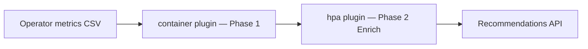

# HPA Recommendations

!!! warning "Status: Planned / Future Work"
    This feature is **not yet implemented**. The description below is the intended
    product direction for a future ROS-OCP release. Container right-sizing, node
    consolidation, quota optimization, and other recommendation types remain
    available today.

!!! info "Quick Facts (planned)"
    **Scope:** Horizontal Pod Autoscaler (HPA) tuning for Deployments and similar workloads  
    **Plugin:** `hpa` (Phase 2 Enrich — builds on container recommendations)  
    **Depends on:** `container` plugin (Phase 1 Produce)  
    **Notification codes:** **21** (`HPA_SATURATED`), **22** (`HPA_ACTIVE`) — reserved, not emitted today  
    **API (planned):** `GET /api/cost-management/v1/recommendations/openshift/hpa`

---

## What it will do

**HPA Recommendations** will analyze how Horizontal Pod Autoscalers behave relative
to actual workload utilization and suggest tuning for `minReplicas`, `maxReplicas`,
and metric targets — without fighting container right-sizing or the autoscaler itself.

| Signal | Example recommendation |
|--------|------------------------|
| **Saturation** | HPA at `maxReplicas` for a sustained window — consider raising `maxReplicas` or lowering the metric target |
| **Idle floor** | HPA never scales above `minReplicas` — consider lowering `minReplicas` to reduce baseline cost |
| **ScalingLimited** | Metric target or quota prevents scale-up — investigate target, ResourceQuota, or cluster capacity |
| **Flapping** | Rapid scale up/down — widen stabilization windows or revisit metric choice |

When HPA manages a workload, ROS will **suppress conflicting replica-count advice**
(notification code **22**, `HPA_ACTIVE`) so container rightsizing focuses on
per-pod CPU/memory requests rather than replica counts.

**Why it matters:** Many teams run HPAs with defaults set at deploy time and never
revisit them. Saturated HPAs cap throughput during peaks; oversized `minReplicas`
waste capacity 24/7. HPA analysis closes the loop between pod-level rightsizing
and fleet-level scaling policy.

---

## Two-plugin architecture

HPA recommendations are **not** a standalone CSV ingestor. They follow the ROS
Phase 2 Enrich pattern:



| Phase | Plugin | Role |
|-------|--------|------|
| **1 — Produce** | `container` | CPU/memory rightsizing, idle/zombie classification, usage digests |
| **2 — Enrich** | `hpa` | Reads container outputs + HPA status metrics; emits HPA tuning guidance |

See [Plugin Execution Phases](../architecture/plugin-phases.md) for the full
phase table and ordering rules. The `hpa` plugin will run after all Phase 1
plugins complete and alongside other Enrich plugins (`java`, `vpa`, etc.).

**Data sources (planned):** Operator collection of `kube_horizontalpodautoscaler_*`
metrics (current/desired replicas, conditions, metric targets) combined with
container recommendation context for the same workload.

---

## Advisory-first delivery

In all deployment modes (SaaS, on-prem, multi-cluster), HPA recommendations will
be **advisory**:

1. ROS computes recommendations centrally from uploaded metrics.
2. Users view them in the Optimizations UI or query the REST API.
3. Users (or external automation) apply changes to HPA CRs on the cluster.

ROS does **not** ship an in-product actuator that patches HPA objects. The
koku-metrics-operator collects metrics and uploads reports — it does not write
recommendations back to the cluster.

---

## What you can do today

### Container right-sizing

Apply per-pod CPU and memory recommendations for HPA-managed workloads today via
[Container Right-Sizing](container-recommendations.md). Use notification code **22**
(reserved) as a signal that replica advice may be suppressed once the HPA plugin ships.

### External automation

You can automate workload changes **today** using tools that read the ROS REST API
and patch cluster resources:

| Approach | Pattern |
|----------|---------|
| **Ansible Automation Platform** | Poll ROS API → evaluate confidence → patch via `kubernetes.core` |
| **SonataFlow (Developer Hub Orchestrator)** | REST workflow with approval gates → Kubernetes API apply |
| **GitOps (Argo CD / Flux)** | ROS API → generate YAML diff → PR review → sync |
| **CronJobs / custom operators** | On-cluster job curls ROS API and patches labeled workloads |

Shipped API endpoints for automation consumers:

| Resource | Endpoint | Status |
|----------|----------|--------|
| Containers | `GET /recommendations/openshift` | **Shipped** |
| Nodes | `GET /recommendations/openshift/nodes` | **Shipped** |
| PVC | `GET /recommendations/openshift/pvcs` | **Shipped** |
| HPA | `GET /recommendations/openshift/hpa` | **Planned** |

Authenticate with `x-rh-identity` (same as the UI). Paginate list endpoints and
persist recommendation IDs in change audit logs.

### Safety gates

Whether a human applies manually or automation patches overnight, use safety gates
before changing production scaling policy:

| Gate | Purpose |
|------|---------|
| **PDB awareness** | Ensure PodDisruptionBudgets allow safe rollouts before replica or resource changes |
| **Maintenance windows** | Apply HPA changes during low-traffic periods with on-call coverage |
| **Canary rollout** | Start with one non-critical namespace (label `ros.redhat.com/auto-apply: canary`) |
| **Confidence threshold** | Auto-apply only when statistical confidence is high (e.g., ≥ 0.8) |
| **Change magnitude** | Alert or require approval for large `maxReplicas` or target changes |
| **Rollback** | Snapshot HPA spec before patch; revert on error-rate or latency regression |

Node consolidation uses the same advisory model with built-in headroom gates —
see [Node Recommendations Roadmap — Tier 1](../architecture/node-recommendations-roadmap.md#tier-1--advisory-consolidation-with-safety-gates-shipped).

### VPA dual-advisor validation (available today)

Even without the HPA plugin, you can validate container rightsizing confidence
using Kubernetes VPA in `updateMode: Off`. See
[Validating recommendations with VPA](container-recommendations.md#validating-recommendations-with-vpa)
and [VPA Recommendations](vpa-recommendations.md).

---

## Planned API shape (illustrative)

Exact fields will be finalized during implementation. Expect list and detail
endpoints consistent with other ROS resources:

```http
GET /api/cost-management/v1/recommendations/openshift/hpa
GET /api/cost-management/v1/recommendations/openshift/hpa/{recommendation-id}
```

Filters will align with existing conventions: `filter[cluster]`, `filter[namespace]`,
`filter[workload]`, `filter[engine]`, `filter[term]`, keyset pagination.

---

## Related

- [VPA Recommendations](vpa-recommendations.md) — planned VPA policy plugin (Phase 2 Enrich)
- [Container Right-Sizing](../features/container-recommendations.md) — shipped; foundation for HPA analysis
- [Plugin Execution Phases](../architecture/plugin-phases.md) — Phase 1 vs Phase 2 architecture
- [Notification codes — Containers](../architecture/notification-codes.md#containers) — codes 21, 22 reserved for HPA
