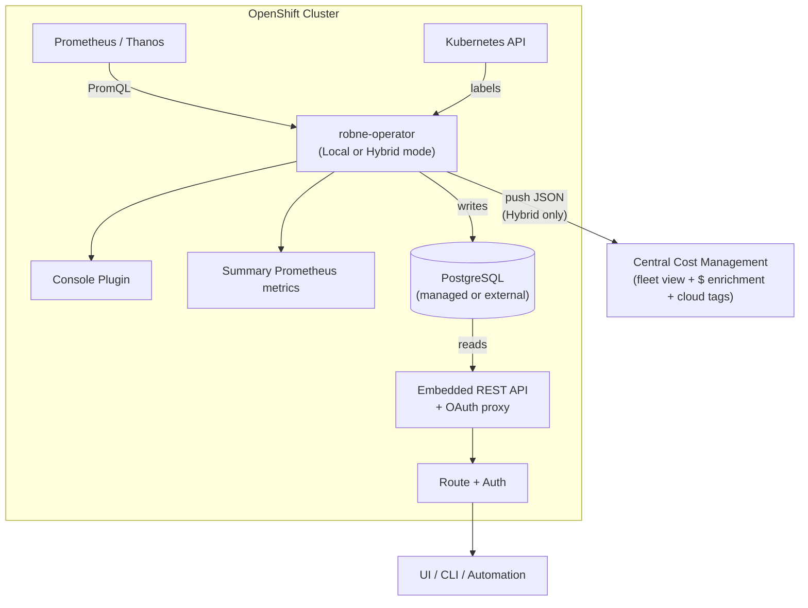
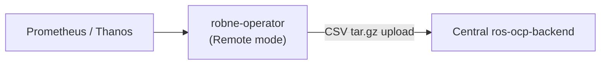

# Resource Optimization for OpenShift — On-Cluster Modes

!!! warning "Status: Planned / Future Work"
    This feature is **not yet implemented**. The description below is the intended
    product direction for a future release. All current recommendation features
    remain available today via the existing remote/upload architecture
    (koku-metrics-operator → central ros-ocp-backend).

!!! info "Quick Facts (planned)"
    **Operator:** Red Hat Lightspeed Resource Optimization Operator (`robne-operator`)  
    **CRD:** `ResourceOptimizationConfig` (`resource-optimization.openshift.io/v1beta1`)  
    **Modes:** Local (on-cluster only), Remote (central compute), Hybrid (both)  
    **Data source:** Prometheus / Thanos (direct PromQL, no CSV intermediary in Local/Hybrid)  
    **Tags:** Kubernetes labels (real-time) + cloud tags reconciled at central enrichment  
    **Local API:** Embedded REST API (same contract as central ros-ocp-backend)  
    **Storage:** Managed PostgreSQL (~70 MB / 1000 containers; in-cluster or external)  
    **Fleet view:** Hybrid mode pushes recommendations + digests to central Cost Management

---

## What it does

The **Red Hat Lightspeed Resource Optimization Operator** (`robne-operator`) is a
standalone operator — separate from koku-metrics-operator — that delivers Resource
Optimization on OpenShift clusters. It supports three operating modes so customers
can choose the right balance of on-cluster freshness, fleet visibility, and
operational footprint.

| Mode | Engine | Local API | Push to Central | Use case |
|------|--------|-----------|-----------------|----------|
| **Local** | On-cluster | Yes | No | Disconnected, single-cluster, latency-sensitive |
| **Remote** | Central (ros-ocp-backend) | No | CSV metrics (same as koku-metrics-operator today) | Drop-in replacement for koku-metrics-operator ROS |
| **Hybrid** | On-cluster | Yes | Recs + digests (JSON) | Fleet view + local freshness |

In **Local** and **Hybrid** modes, the operator queries Prometheus directly and
computes recommendations on-cluster. Results are written to PostgreSQL and
served through an embedded REST API and OpenShift Console plugin. In **Hybrid**
mode, pre-computed recommendations and daily digests are also pushed to central
Cost Management for fleet-wide visibility and dollar savings enrichment.

In **Remote** mode, the operator is a lightweight collector and uploader only —
the same role koku-metrics-operator plays for ROS today. Recommendation
computation remains on central ros-ocp-backend.

!!! note "Companion operators"
    Clusters that need both **Cost Management** and **Resource Optimization**
    install both operators: koku-metrics-operator for cost metrics, and
    robne-operator for optimization. They are designed to coexist during the
    migration period.

---

## Why it matters

### Faster recommendations

The current pipeline introduces 6–12 hours of end-to-end latency (operator upload
cycle + Koku processing + ROS ingestion). Local and Hybrid modes provide
recommendations within minutes of workload changes.

### Higher data fidelity

Today the operator samples metrics at 15-minute intervals, 4 times per hour
(96 data points per container per day). On-cluster modes leverage Prometheus
`quantile_over_time()` and `avg_over_time()` over the full-resolution scrape data —
no sampling loss.

### Dramatically simpler pipeline

| Current (7 stages) | Local / Hybrid (2 stages) |
|---------------------|---------------------------|
| Prometheus → Operator → CSV → tar.gz → Upload → S3 → Kafka → ROS | Prometheus → robne-operator (engine) → PostgreSQL |

### Works in disconnected environments

Clusters without external connectivity can run **Local** mode and compute
recommendations entirely on-cluster. Dollar savings are unavailable without Cost
Management access, but CPU/memory right-sizing, idle detection, and GPU
classification all function from Prometheus data alone.

### 50x bandwidth reduction (Hybrid mode)

Instead of uploading raw metrics (~50 MB/day for 1000 containers), Hybrid mode
pushes only pre-computed recommendation JSON and compressed daily digests
(~1 MB/day).

---

## Architecture overview

### Local and Hybrid modes



### Remote mode



In Remote mode, no engine, database, API, console plugin, or summary metrics are
deployed. The operator collects ROS metrics and uploads CSV payloads — a
drop-in replacement for koku-metrics-operator's ROS functionality.

---

## Operating modes in detail

### Mode-dependent components

| Component | Local | Hybrid | Remote |
|-----------|-------|--------|--------|
| Prometheus collection | Active | Active | Active |
| Recommendation engine | Active | Active | Inactive |
| Managed PostgreSQL | Active | Active | Inactive |
| REST API pod | Configurable (default on) | Configurable (default on) | Unavailable |
| Console Plugin | Configurable (default on) | Configurable (default on) | Unavailable |
| Summary Prometheus metrics | Configurable (default on) | Configurable (default on) | Unavailable |
| CSV packaging + upload | Inactive | Active (JSON format) | Active (CSV format) |

!!! warning "Remote mode restrictions"
    The CRD rejects `spec.api.enabled: true` and `spec.console_plugin.enabled: true`
    when `spec.mode` is `remote`. These components are only available in Local and
    Hybrid modes.

### Switching modes

You can change `spec.mode` at any time:

| Transition | Behavior |
|------------|----------|
| Local → Hybrid | Engine continues; push to central starts |
| Hybrid → Local | Push stops; engine continues |
| Local/Hybrid → Remote | Engine stops; API and plugin torn down; PostgreSQL scaled to 0 (PVC retained) |
| Remote → Local/Hybrid | PostgreSQL provisioned or resumed; engine starts; first recommendations after one cycle |

### Managed PostgreSQL lifecycle

- **Default:** The operator deploys a PostgreSQL StatefulSet, PVC, and Service.
- **External database:** Set `database.type: "external"` and provide a Secret with
  connection details.
- **Switch to Remote:** StatefulSet scaled to 0; PVC retained (default
  `retain_data: true`).
- **Explicit cleanup:** Set `database.managed_config.retain_data: false` to delete
  the StatefulSet and PVC.
- **CR deletion:** All managed resources are garbage-collected via `ownerReference`.

---

## How it works

### On-cluster computation (Local / Hybrid)

1. Operator queries Prometheus using the same PromQL patterns as today (results
   consumed directly instead of written to CSV)
2. Prometheus computes aggregations server-side:
   `quantile_over_time()`, `avg_over_time()`, `max_over_time()`
3. Recommendation engine applies decay weighting and recommendation logic
   (same algorithms as central ros-ocp-backend)
4. Recommendations written to PostgreSQL
5. **Hybrid only:** Pre-computed recommendations and daily digests pushed to
   central Cost Management as compressed JSON tar.gz

### Local data access

Three ways to consume on-cluster recommendations:

| Access path | Description |
|-------------|-------------|
| **REST API** | Embedded in the operator binary; same contract as central ros-ocp-backend. OAuth proxy auth by default (`oc login` credentials) or JWT (Keycloak/RHBK). |
| **Console Plugin** | Ships with the operator; provides recommendations in the OpenShift Console. |
| **Summary metrics** | Alerting-focused Prometheus gauges (not per-container detail). See [Summary metrics](#summary-prometheus-metrics) below. |

Per-container detail is available through the REST API, not through Prometheus metrics.

### Central enrichment (Hybrid mode)

1. Receives lightweight recommendation JSON and daily digests (not raw metrics)
2. Enriches with dollar savings using cost model rates
3. Reconciles tags: applies enabled/disabled policy, resolves tag mappings, and
   re-associates cloud tags via OCP-on-cloud correlation
4. Stores in the fleet-wide recommendation database
5. UI displays aggregated view across all clusters

Central can also re-compute recommendations with different parameters (fleet-wide
business hours, tag policies) using the pushed daily digests.

---

## Tag and label reconciliation

On-cluster recommendations carry raw Kubernetes labels from the cluster. When
pushed to central Cost Management (Hybrid mode), full tag functionality is
preserved through the enrichment step:

### OCP labels (real-time on-cluster)

The operator reads pod and namespace labels directly from the Kubernetes API —
no delay, no sampling. All labels are pushed with each recommendation.
Central applies the **enabled/disabled** tag policy at query time, so only
approved tag keys appear in API responses.

### Tag mappings (resolved centrally)

If an organization maps `ocp:app` to `aws:Application`, the central system
resolves this during enrichment. A recommendation carrying `app=frontend` becomes
filterable by both `filter[tag:app]=frontend` and `filter[tag:Application]=frontend`.
The same tag-mapping mechanism used today applies unchanged.

### Cloud tags (re-associated via OCP-on-cloud correlation)

Cloud provider tags (AWS tags, Azure tags, GCP labels) that exist only on
infrastructure resources are re-associated with recommendations at central.
This uses the existing OCP-on-cloud correlation data (pod → node → cloud
instance → cloud tags) that is already computed for cost attribution.

This requires cloud billing integration to be active — which it already is
for any customer needing dollar savings (the `effective_rates` endpoint
requires cost model rates + cloud costs).

### Disconnected clusters (Local mode)

Bare-metal and air-gapped clusters have no cloud tags by definition. Local mode
is fully self-contained for tag filtering using Kubernetes labels alone.

---

## Summary Prometheus metrics

Summary gauges are exposed for alerting and dashboards. Per-container recommendations
are available only through the REST API.

```
robne_idle_containers_total{cluster, namespace}
robne_oversized_containers_total{cluster, namespace}
robne_undersized_containers_total{cluster, namespace}
robne_optimal_containers_total{cluster, namespace}
robne_estimated_monthly_savings_usd{cluster}
robne_stale_recommendations_total{cluster}
robne_recommendation_freshness_seconds{cluster}
robne_idle_nodes_total{cluster}
robne_consolidation_candidates_total{cluster}
robne_recommendation_cycles_total{cluster}
robne_recommendation_errors_total{cluster, plugin}
```

---

## Key differences from current architecture

| Aspect | Current (koku-metrics-operator + central) | Local / Hybrid (robne-operator) |
|--------|------------------------------------------|--------------------------------|
| Operator | koku-metrics-operator (ROS CSV upload) | robne-operator (standalone) |
| Recommendation freshness | 6–12 hours | Minutes (configurable) |
| Data fidelity | 96 samples/day | Full Prometheus resolution |
| On-cluster footprint (Remote) | ~50 Mi (collector only) | ~50 Mi (collector only) |
| On-cluster footprint (Local/Hybrid) | N/A | ~200 Mi (operator + engine + DB) |
| PostgreSQL | Central only | Dedicated (managed or external) |
| Storage per 1000 containers | ~20 GiB (central, digests+samples) | ~70 MB (recs only) |
| Local API access | No (central API only) | Yes (embedded REST API) |
| Console plugin | No | Yes (configurable) |
| OCP labels | Synced from Koku (hours delay) | Kubernetes API (real-time) |
| Cloud tags | Native (central correlates) | Re-associated at central enrichment |
| Tag mappings | Applied centrally | Applied centrally (same mechanism) |
| Disconnected support | No | Yes (Local mode; minus dollar savings and cloud tags) |
| Fleet visibility | Native (central computes) | Hybrid push to central |
| Dollar savings | Always available | Available after central enrichment, or optional `effective_rates` fetch |

---

## Who benefits

- **Disconnected / air-gapped clusters** — Local mode without external upload
- **Latency-sensitive environments** — minute-level freshness
- **Single-cluster customers** — no need for full Kafka + S3 + remote ROS stack
- **Bandwidth-constrained environments** — 50x reduction in upload size (Hybrid)
- **RHACM users** — Thanos provides unlimited lookback for long-term recommendations
- **Existing ROS customers** — Remote mode as a drop-in koku-metrics-operator replacement

---

## Planned CRD configuration

```yaml
apiVersion: resource-optimization.openshift.io/v1beta1
kind: ResourceOptimizationConfig
metadata:
  name: resourceoptimizationcfg
spec:
  mode: "hybrid"   # "local", "remote", or "hybrid"
  prometheus_config:
    service_address: "https://thanos-querier.openshift-monitoring.svc:9091"
    context_timeout: 120
    collect_previous_data: true
  engine:
    recommendation_cycle: 900
    plugins:
      container: {enabled: true}
      namespace: {enabled: true}
      node: {enabled: true}
      vm: {enabled: true}
      pvc: {enabled: true}
      quota: {enabled: true}
      cluster_quota: {enabled: true}
      gpu: {enabled: true}
      snapshot: {enabled: true}
    idle_detection: {enabled: true}
    business_hours: {enabled: true}
    savings_estimation: {enabled: true}
  database:
    type: "managed"
    managed_config:
      storage_size: "1Gi"
      retain_data: true
  api:
    enabled: true
    route: true
    auth:
      type: "oauth-proxy"   # or "jwt"
  console_plugin:
    enabled: true
  central:
    api_url: "https://console.redhat.com"
    authentication:
      type: "token"         # or "service-account"
    upload:
      upload_cycle: 360
      upload_toggle: true
    effective_rates:
      enabled: false        # optional on-cluster dollar savings
  source:
    name: ""
    create_source: false
  volume_claim_template:
    spec:
      accessModes: ["ReadWriteOnce"]
      resources:
        requests:
          storage: "10Gi"
```

### Plugins and features

All plugins are enabled by default. Each can be disabled individually via
`spec.engine.plugins.<name>.enabled: false`:

`container`, `namespace`, `node`, `vm`, `pvc`, `quota`, `cluster_quota`, `gpu`, `snapshot`

Additional engine features: `idle_detection`, `business_hours`, `savings_estimation`.

### Authentication

| Path | Mechanism | Notes |
|------|-----------|-------|
| Local API | OAuth proxy (default) | Uses OpenShift OAuth; `oc login` credentials |
| Local API | JWT | Keycloak / RHBK tokens |
| Central connection | Token | From pull-secret (same as koku-metrics-operator) |
| Central connection | Service account | `client_credentials` flow |

### Dollar savings in Local mode

Cost and performance engines differ only in thresholds. Without `effective_rates`,
dollar values are unavailable but all sizing recommendations still work. Optionally
configure `spec.central.effective_rates.enabled: true` to fetch rates from a Cost
Management instance (same auth as the central connection).

When `spec.api.enabled` or `spec.console_plugin.enabled` is `false`, recommendations
are still written to PostgreSQL and accessible via direct database queries or
summary Prometheus metrics.

---

## Migration from koku-metrics-operator

| Phase | Change |
|-------|--------|
| **Phase 1** | robne-operator ships alongside koku-metrics-operator (overlap period) |
| **Phase 2** | koku-metrics-operator removes ROS queries in a future version |
| **Phase 3** | koku-metrics-operator documentation references robne-operator for Resource Optimization |

!!! info "OLM dependency"
    The relationship between operators is documented but **not declared as an OLM
    dependency**, to avoid installation friction for customers who install only one
    operator.

For existing deployments, set `spec.mode: "remote"` on robne-operator to replicate
current koku-metrics-operator ROS behavior, then migrate to Hybrid or Local when
ready.

---

## Prometheus requirements

- Standard OpenShift monitoring stack (Prometheus or Thanos via RHACM)
- Same RBAC patterns as koku-metrics-operator (no additional permissions beyond
  what each mode requires)
- Prometheus retention affects long-term recommendations:
  - 15-day retention: short and medium terms fully supported; long term degraded
  - With Thanos (RHACM): unlimited lookback, all terms fully supported
  - Graceful degradation: terms with insufficient data report lower confidence

---

## Business hours and reship

In the current (Remote / koku-metrics-operator) architecture, changing a business-hours
schedule triggers a **reship**: Koku re-publishes historical ROS CSV files from S3 to
Kafka so that ros-ocp-backend can re-ingest them with the new time-of-day
weighting applied. This works because raw CSVs persist in S3 for ~90 days.

Local and Hybrid modes eliminate the reship mechanism entirely. Instead:

**With Thanos (RHACM):** The operator re-queries Thanos for the full
recommendation window with the new business-hours weighting. Thanos has
unlimited retention, so retroactive re-computation is immediate and complete.
This is strictly superior to the CSV reship approach (faster, higher fidelity,
no S3/Kafka dependency).

**With Prometheus only (~15-day retention):** The operator re-queries Prometheus
for whatever data is within retention. For data beyond the retention window,
the new schedule takes effect **forward-only** — old recommendations gradually
age out as the sliding window advances. After N days (where N = Prometheus
retention), the recommendation window is fully converged to the new schedule.

| Scenario | Retroactive BH re-computation |
|----------|-------------------------------|
| Thanos (RHACM) | Immediate and complete (unlimited lookback) |
| Prometheus only (15d retention) | Last 15 days immediate; older days converge forward-only over 15 days |
| Current architecture (reship) | Full retroactive via S3 CSV re-ingestion (up to 90 days) |

Since business-hours schedules change infrequently (typically once per quarter),
the forward-only convergence period is acceptable for Prometheus-only
deployments. Customers requiring instant retroactive BH re-computation across
the full window should use Thanos via RHACM.

!!! note "Future enhancement"
    If customer demand warrants it, a lightweight daily aggregate table could be
    introduced to store hourly-bucketed percentiles locally, enabling full
    retroactive BH re-computation without Thanos. This would add ~5–10 MB per
    1000 containers per 90-day window.

---

## Limitations (planned)

- Dollar savings require connectivity to central Cost Management, or optional
  `effective_rates` API access for on-cluster computation
- Cloud tags on recommendations require cloud billing integration to be active
  at central (already required for dollar savings); disconnected clusters have
  OCP labels only
- Cloud tag association may lag by up to 24 hours for newly provisioned nodes
  (same latency as the current architecture — CUR/export data is not real-time)
- Business-hours schedule changes on Prometheus-only clusters (no Thanos) take
  effect forward-only; full convergence after the Prometheus retention period
  (typically 15 days)
- Boxplot API queries Prometheus at request time (not pre-stored)
- Fleet-wide view requires Hybrid mode with the push-to-central path configured
  and reachable
- Remote mode does not expose a local API, console plugin, or summary metrics
