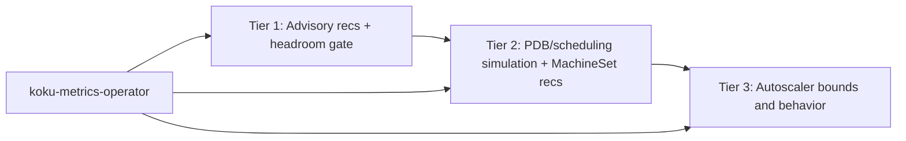
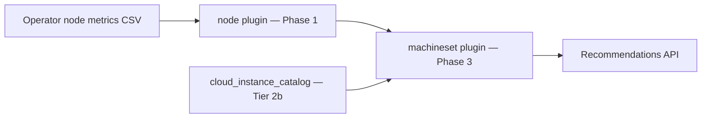

# MachineSet Recommendations (Tier 2)

!!! warning "Status: Planned / Future Work"
    Tier 1 **aggregation** at `GET .../machinesets` is **shipped**. Tier 2a (replica
    engine, persistence, detail API) is **specified and ready to implement**. Tier 2b
    (instance type from cloud catalog) follows after catalog integration.

!!! info "Quick Facts"
    **Scope:** OpenShift MachineSet replica and instance-type right-sizing (IPI clusters)  
    **Plugin:** `machineset` (Phase 3 Optimize)  
    **Shipped today:** `GET /api/cost-management/v1/recommendations/openshift/machinesets` (Tier 1 aggregation)  
    **Tier 2a (next):** Persisted recommendations, detail endpoint, history, notifications 77–79  
    **Tier 2b (later):** Instance family/size from cloud catalog (REQ-8c.6)  
    **Internal spec:** [machineset-recommendations.md](../../docs/features/machineset-recommendations.md)

**Related:** [Node consolidation (Tier 1)](../features/node-recommendations.md), [REQ-8c in requirements.md](../architecture/requirements.md), [notification codes](../architecture/notification-codes.md) (codes 14, 16–17 reserved for Tier 3)

---

## Tier overview

Three tiers differ by **how much automation is safe**, not by whether recommendations exist.

| Tier | Status | Purpose | Automation posture | Primary API |
|------|--------|---------|-------------------|-------------|
| **1** | **Shipped** | Per-node classification, sizing, **advisory** fleet consolidation | **Human review required** — no PDB/scheduling simulation | `GET .../recommendations/openshift/nodes` |
| **2** | Planned (partial: machinesets list) | MachineSet replica + instance-family right-sizing; **PDB/scheduling-aware** consolidation | **Safe to auto-execute** (with guardrails) once simulation ships | `GET .../recommendations/openshift/machinesets` (+ catalog-driven engine) |
| **3** | Planned | MachineAutoscaler min/max and scaling behavior | **Autonomous scaling** — tune autoscaler bounds/policies | Extension of machinesets API or dedicated endpoint |

| Tier | Actionable unit | Est. remaining effort |
|------|-----------------|----------------------|
| **1** | Individual node (+ fleet grouping for advisory `node_count_reduction`) | — |
| **2** | MachineSet | **~2–3 weeks** for catalog + replica engine (aggregation API **done**) |
| **3** | MachineSet + MachineAutoscaler | **~4–6 weeks** after Tier 2 |

### Tier 1 — Advisory consolidation with safety gates (shipped)

- **Advisory only:** `node_count_reduction` and fleet sums are FinOps signals for platform review, not drain/scale commands.
- **Safety gates today:** `pod_scheduling_headroom` vs `pod_headroom_consolidation_gate` suppresses consolidation on nodes with little spare pod capacity; idle/zombie and performance-engine headroom multipliers add further guards.
- **Does not include:** PDB checks, scheduling simulation, or MachineSet replica metrics from the operator.
- **Industry alignment:** Same advisory model as AWS Compute Optimizer, Kubecost, and CAST AI (recommendations without automated apply).

See [Node consolidation (Tier 1)](../features/node-recommendations.md#fleet-consolidation-advisory-only-tier-1) for full Tier 1 behavior.

### Tier 2 — PDB/scheduling-aware (“safe to auto-execute”)

- **Goal:** Recommendations that account for whether workloads **can** reschedule after node removal while respecting PDBs, taints, and affinity.
- **Adds:** Operator collection of PDB/toleration/affinity snapshots; engine placement simulation (~O(pods × nodes) per candidate); MachineSet **replica count** and catalog-driven instance family/size changes.
- **Outcome:** Consolidation and replica reductions can be exposed with a **safe-to-apply** (or equivalent) confidence tier for automation integrations — still subject to org change control.

### Tier 3 — Autoscaler integration (“autonomous scaling”)

- **Goal:** Tune **MachineAutoscaler** `minReplicas` / `maxReplicas` (and optionally policy hints) from historical replica vs utilization time series.
- **Depends on:** Tier 2 MachineSet identity and operator metrics (`machineset_replicas`, desired/available, HPA/autoscaler state).
- **Outcome:** Bound recommendations and saturation/idle/flapping notifications suitable for policy-driven or semi-autonomous scaling — highest risk; conservative heuristics and manual-review messaging expected first.

See [Autoscaler optimization](autoscaler-optimization.md) for Tier 3 design.



---

## What Tier 2 will do

MachineSet recommendations move fleet optimization from per-node signals to
**actionable MachineSet-level guidance** — the unit cluster admins change in
IPI-provisioned OpenShift (replica count, instance type).

| Capability | Tier | Example |
|------------|------|---------|
| **Replica recommendations** | 2a | “Reduce `worker-us-east-1a` from 5 → 3 nodes” |
| **Dedicated persistence** | 2a | `machineset_recommendations` table with lifecycle |
| **Detail + history** | 2a | `GET .../machinesets/{name}` with trend data |
| **Fleet health notifications** | 2a | Heterogeneous capacity, scale-down, optimal |
| **Instance family/size** | 2b | “Switch `m5.4xlarge` → `m5.2xlarge`” from catalog |
| **Cost comparison** | 2b | Dollar savings for type + replica changes |
| **PDB conflicts** | 2a/2b | Notification when PDBs affect workloads (manual review) |

Individual node recommendations (Tier 1) remain informational. Nodes without
`machineset_name` (bare metal, SNO, manual) stay Tier 1 only.

### Goal

Group nodes by **MachineSet** (not only by `instance_type`) and recommend **replica count** and **instance family/size** changes at the MachineSet level — the unit cluster admins actually change in IPI clusters.

### Prerequisites and implementation steps

1. **Operator (koku-metrics-operator)**
   - Collect `machine.openshift.io/machine-set` (or equivalent) from node labels via Prometheus.
   - Emit `machineset_name` on ROS container CSV (production path). **Nise** also generates `machineset_name` and `node_capacity_pods` for test data.
   - Optional for Tier 2 core: MachineSet replica counts (`machineset_replicas`, `desired`/`available`) — required before Tier 3.

2. **Ingestion (ros-ocp-backend)** — **done for Tier 1**
   - Parse `machineset_name` / `node_capacity_pods` from ROS CSV into `daily_node_digests`.
   - Digest aggregation retains `machineset_name`, `instance_type`, and `pod_capacity`.

3. **Engine**
   - New **`machineset` plugin** (or extension of node plugin phase):
     - Group digests by `(org_id, cluster_uuid, machineset_name)`.
     - Compute fleet-level CPU/memory P95, replica recommendation, instance type from catalog.
   - Reuse Tier 1 stranded-resource signals for family recommendations.
   - Integrate **cloud instance catalog** (REQ-8c.6): `cloud_instance_catalog` table, public pricing/spec APIs (AWS bulk JSON, Azure Retail Prices, GCP `machineTypes.list`), optional EC2 API when IAM allows.

4. **API**
   - List/detail handlers mirroring node patterns: `cluster_uuid`, `machineset_name`, `current_instance_type`, `is_underutilized`, pagination, `estimated_monthly_savings`.

5. **Cloud catalog**
   - Lookup vCPU/RAM by `instance_type` for “smallest fit” and cost comparison; on-prem may skip instance-type *changes* when catalog is empty (capacity-based logic still applies).

### Limitations

- **Machine API / MachineSets only:** Helps IPI-provisioned clusters using MachineSets. Does **not** help bare metal, single-node OpenShift (SNO), or UPI/manual nodes without `machineset_name` (those nodes stay Tier 1 only; `machineset_name` is `NULL` → skip Tier 2/3 for that node).
- **PDB / drain safety:** Tier 2 recommends counts; PDB-aware automation is notification-only (see REQ-8c.5 in [requirements.md](../architecture/requirements.md)).
- **HA floor:** Configurable minimum replicas (`ROS_MIN_MACHINESET_REPLICAS`, default 1 — never recommend 0).

### Relationship to Tier 1 today

Tier 1 already groups fleet consolidation by **`instance_type`** when the operator provides it. Tier 2 replaces that grouping key with **MachineSet** for clusters where labels exist, and adds replica + catalog-driven instance changes. Nodes without `machineset_name` continue to use Tier 1 behavior only.

---

## What ships today (Tier 1 aggregation)

`GET /api/cost-management/v1/recommendations/openshift/machinesets` groups
`node_recommendations` by `machineset_name`:

| Field | Meaning |
|-------|---------|
| `current_node_count` | Nodes in the MachineSet with a recommendation row |
| `excess_nodes` | Sum of per-node `node_count_reduction` |
| `recommended_node_count` | `current_node_count - excess_nodes` |
| `total_monthly_savings` | Sum of member node savings |
| `avg_cpu_utilization` / `avg_memory_utilization` | Average P95 across members |

Also supported today: **keyset pagination** (`after` cursor), **CSV export**
(`Accept: text/csv`), filters `filter[cluster]`, `filter[machineset_name]`,
`filter[term]`.

This is **not** the Tier 2 engine — no persistence, no MachineSet-specific
notifications, no detail endpoint, no instance-type catalog recommendations.

---

## Consolidation model — current scope and limitations

Tier 1 consolidation (`applyInstanceTypeConsolidation` in [recommend_nodes.go](../../internal/engine/recommend_nodes.go)) is **advisory only** — see [Tier 1 — Advisory consolidation](#tier-1-advisory-consolidation-with-safety-gates-shipped) above and the [feature doc](../features/node-recommendations.md#fleet-consolidation-advisory-only-tier-1).

### Current scope (Tier 1)

- Advisory signal: “you likely have N excess nodes in this fleet”
- Based on aggregate P95 utilization across the fleet group
- Groups nodes by MachineSet (when labeled) → `instance_type` → capacity bucket
- **Pod scheduling headroom gate** (`podSchedulingBlocksConsolidation`) blocks consolidation when `(pod_capacity − pod_count) / pod_capacity` is below `pod_headroom_consolidation_gate` (default 0.15)
- Does **not** account for: PodDisruptionBudgets, scheduling constraints (taints/tolerations/affinity), DaemonSet overhead, or actual pod placement feasibility
- **Action path:** platform team reviews recommendation → checks PDBs/constraints manually → scales down MachineSet or removes nodes
- Aligns with FinOps advisory tools (AWS Compute Optimizer, Kubecost, CAST AI recommendations) — none perform PDB/scheduling simulation in Tier-1-style products

### PDB/scheduling-aware consolidation (Tier 2 — safe to auto-execute)

Additional data required:

| Data | Source | Storage estimate |
|------|--------|------------------|
| PodDisruptionBudgets | `policy/v1` PDB resources | ~1 KB per PDB × namespaces |
| Node taints | `node.spec.taints` | Already in node labels CSV |
| Pod tolerations | `pod.spec.tolerations` | ~100 B per pod × pods |
| Node/pod affinity rules | `pod.spec.affinity` | ~200 B per pod with affinity |
| DaemonSet pod list | `apps/v1` DaemonSet resources | ~50 B per DS × nodes |

Processing estimate:

- For each candidate node removal, simulate whether non-DaemonSet pods can reschedule to remaining nodes while respecting PDBs, taints, and affinity
- Essentially a **scheduling simulation** (mini kube-scheduler) — ~O(pods × nodes) per candidate
- Example: 100-node cluster, 5000 pods → ~500K placement checks per consolidation evaluation
- Latency: seconds per evaluation (acceptable at recommendation time, not real-time)

**Storage:** ~50 MB additional per large cluster (PDB/affinity/toleration snapshots)
**Processing:** ~5–10 s additional per cluster recommendation cycle

**Verdict:** Feasible for Tier 2 but requires operator enhancements (collect PDB + affinity data) and significant engine work. This is the tier that unlocks **safe-to-auto-execute** consolidation; Tier 1 intentionally stops at advisory signals plus the pod headroom gate.

---

## Fleet instance type suggestions (Tier 1 vs cloud catalog)

### Implemented (Tier 1 — in-cluster fleet)

When `stranded_resource` is `cpu` or `memory`, [RecommendNodes](../../internal/engine/recommend_nodes.go) compares the node’s allocatable CPU:memory ratio to **distinct instance types already observed** in `daily_node_digests` for that cluster:

- **CPU-stranded:** suggest a type with a **lower** CPU:memory allocatable ratio (compute-leaning shape already in the fleet)
- **Memory-stranded:** suggest a type with a **higher** CPU:memory allocatable ratio
- Persisted on `node_recommendations.suggested_instance_type` / `instance_type_reason` (migration **000123**)
- Exposed on list and `GET .../nodes/{node}` detail APIs

If no strictly better in-cluster type exists, fields remain empty; stranded directional notifications still apply.

### Future work — full cloud catalog (Tier 2+)

**Status:** Planned enhancement — **no delivery timeline** (tracked here and in [node recommendations feature](../features/node-recommendations.md#future-external-cloud-instance-catalog)).

Not implemented in Tier 1. A full catalog path would:

- Query an external instance catalog (AWS EC2, Azure VM, GCP Compute pricing APIs, or a bundled catalog table — see REQ-8c.6 in [requirements.md](../architecture/requirements.md))
- Recommend instance types **not yet present** in the cluster
- Factor in on-demand and reserved **pricing** for cost-optimized family/size changes
- Require **provider-specific** catalog loaders and refresh jobs

Tier 2 MachineSet recommendations will reuse catalog data for replica and instance family changes; Tier 1 fleet-only suggestions avoid catalog dependency and stay accurate for homogeneous on-prem / single-family clusters.

---

## Two-phase delivery

### Tier 2a — No cloud catalog (implementable now)

Replica guidance, persistence, API depth, and fleet-health signals — **no
dependency on cloud pricing APIs**.

#### Replica count engine

Tier 2a reuses Tier 1 fleet consolidation output (`node_count_reduction` per
node). The formula matches the shipped list API:

```
current_replicas     = count of nodes in the MachineSet
excess               = sum of node_count_reduction across those nodes
recommended_replicas = current_replicas - excess
```

| Rule | Value |
|------|-------|
| Minimum replicas | Never 0 (configurable floor, default 1) |
| No change | When `excess = 0`, `recommended_replicas = current_replicas` |
| Scale-down | When `recommended_replicas < current_replicas` |

#### MachineSet-level confidence

```
confidence_level = minimum confidence across all member nodes
```

If any member node has low confidence, the MachineSet recommendation is
flagged as uncertain.

#### Heterogeneous fleet detection

When nodes in the same MachineSet have CPU or memory capacity differing by
more than 10%, the recommendation is marked heterogeneous and emits
notification **77** (`MACHINESET_HETEROGENEOUS_FLEET`).

#### Notification codes (Tier 2a)

| Code | Name | When |
|------|------|------|
| **76** | `NODE_FLEET_CONSOLIDATION` | Per-**node** rows only (Tier 1, shipped) |
| **77** | `MACHINESET_HETEROGENEOUS_FLEET` | Mixed capacities within MachineSet |
| **78** | `MACHINESET_SCALE_DOWN_RECOMMENDED` | `recommended_replicas < current_replicas` |
| **79** | `MACHINESET_OPTIMAL` | No replica change needed |

#### API surface (Tier 2a)

| Endpoint | Status | Notes |
|----------|--------|-------|
| `GET .../machinesets` | Shipped → table-backed | Filters, pagination, CSV unchanged |
| `GET .../machinesets/{name}` | **Planned** | Detail + member nodes + history |

**Detail endpoint**

```
GET /api/cost-management/v1/recommendations/openshift/machinesets/{machineset_name}
```

| Query param | Required | Notes |
|-------------|----------|-------|
| `cluster_uuid` | When ambiguous | Same name in multiple clusters |
| `filter[term]` | No | Default `medium_term` |

Response includes: replica counts, savings, confidence, notifications,
`member_nodes[]` with per-node utilization and reduction, and `history[]`
(30 most recent snapshots).

#### List filters (Tier 2a additions)

| Filter | Values |
|--------|--------|
| `filter[recommendation_type]` | `scale_down`, `optimal`, `heterogeneous_warning` |
| `filter[term]` | `short_term`, `medium_term`, `long_term` |

#### Sorting (`order_by`)

| Value | Default direction |
|-------|-------------------|
| `estimated_savings` | DESC (default) |
| `machineset_name` | ASC |
| `recommended_replicas` | ASC |
| `current_replicas` | DESC |

#### History

Recommendation history tracks how `recommended_replicas` changes over time
(daily snapshots on recalc). Detail endpoint returns up to 30 history entries.

---

### Tier 2b — Requires cloud instance catalog

Ships after `cloud_instance_catalog` (REQ-8c.6) and catalog refresh jobs.

#### Instance type recommendation

Compare current instance type specs (CPU, memory, GPU) against actual peak
usage across MachineSet members. Recommend smaller, larger, or different-family
shapes from the catalog.

| Workload profile | Recommended family |
|------------------|-------------------|
| CPU-heavy | Compute-optimized (`c*` family) |
| Memory-heavy | Memory-optimized (`r*` family) |
| Balanced | General purpose (`m*` family) |
| GPU workloads | GPU instances (`p*` / `g*` family) |

**Hysteresis:** Instance type changes only when savings exceed 20% (reduces churn).

#### Cost comparison

```
current monthly cost  = current_replicas × hourly_rate(current_type)  × 730
recommended monthly   = recommended_replicas × hourly_rate(recommended_type) × 730
savings               = current - recommended
```

When the catalog is unavailable, Tier 2a replica recommendations still work;
instance-type fields remain empty.

#### Catalog sources

| Provider | Source |
|----------|--------|
| AWS | Public Bulk Pricing JSON (default) or EC2 API (opt-in) |
| Azure | Retail Prices API |
| GCP | `machineTypes.list` |

Catalog refreshes daily. Cached data used for up to 48 hours on API failure.

**On-prem:** Tier 2a applies without catalog; instance-type fields omitted when catalog is empty.

### Estimated effort

**~2–3 weeks** total (Tier 2a + Tier 2b), assuming Tier 1 and cost integration remain stable.

---

## Schema and API sketch (planned)

- `daily_node_digests.machineset_name` — **exists** (operator population done).
- `node_recommendations.machineset_name` — **exists** for correlation.
- `machineset_recommendations` + `machineset_recommendation_history` — **not created** (see [REQ-8c.5 in requirements.md](../architecture/requirements.md#req-8c5-tier-2--machineset-right-sizing-high--not-implemented)).

**Shipped:** `GET .../machinesets` with `filter[cluster]`, `filter[machineset_name]`, keyset pagination, CSV.

**Tier 2a additions:** detail endpoint, `filter[recommendation_type]`, `order_by`.

**Tier 3 additions (future):** `is_saturated`, `is_idle`, `is_flapping` — see [Autoscaler optimization](autoscaler-optimization.md).

---

## Plugin architecture



| Phase | Plugin | Role |
|-------|--------|------|
| **1 — Produce** | `node` | Per-node classification, `node_count_reduction` |
| **1 — Produce** (2b) | `instance-type` | Catalog refresh, smallest-fit lookup |
| **3 — Optimize** | `machineset` | MachineSet aggregation, replica + instance recs |

See [Plugin Execution Phases](../architecture/plugin-phases.md).

---

## Advisory-first delivery

MachineSet recommendations are **advisory** in all deployment modes:

1. ROS computes guidance from uploaded metrics.
2. Platform teams review in the Optimizations UI or REST API.
3. Teams apply via `oc scale machineset`, Machine API, or GitOps.

ROS does not patch MachineSets automatically. PDB-aware consolidation
(safe-to-auto-execute) is a later enhancement.

---

## Acceptance criteria (summary)

### Tier 2a

- Replica counts match Tier 1 aggregation formula
- Never recommend 0 replicas
- Detail endpoint returns member nodes and history
- Confidence = min across members; heterogeneous detection at >10% variance
- Notifications 77/78/79 on appropriate conditions
- List filters and `order_by` work with persisted table

### Tier 2b

- Smallest-fit and family migration from catalog
- 20% savings hysteresis for instance changes
- Graceful fallback when catalog unavailable
- On-prem without catalog: Tier 2a only

Full criteria: [internal implementation spec](../../docs/features/machineset-recommendations.md).

---

## Related

- [Node consolidation (Tier 1)](../features/node-recommendations.md)
- [Autoscaler optimization (Tier 3)](autoscaler-optimization.md)
- [node plugin reference](../plugin-reference/node.md)
- [Notification codes](../architecture/notification-codes.md)
- [Cost integration](../architecture/cost-integration.md) — node savings; MachineSet savings will extend the same `effective_rates` patterns
- [Configurability](../architecture/configurability.md) — future `ROS_MIN_MACHINESET_REPLICAS`, catalog refresh interval
