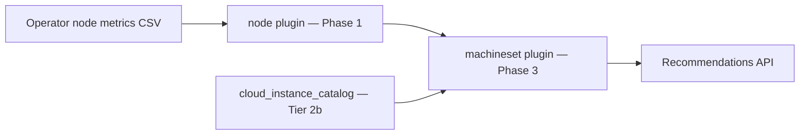

# MachineSet Recommendations (Tier 2)

!!! warning "Status: Planned / Future Work"
    Tier 1 **aggregation** at `GET .../machinesets` is **shipped**. Tier 2a (replica
    engine, persistence, detail API) is **specified and ready to implement**. Tier 2b
    (instance type from cloud catalog) follows after catalog integration.

!!! info "Quick Facts"
    **Scope:** OpenShift MachineSet replica and instance-type right-sizing (IPI clusters)  
    **Plugin:** `machineset` (Phase 3 Optimize)  
    **Shipped today:** `GET /api/cost-management/v1/recommendations/openshift/machinesets` (Tier 1 aggregation)  
    **Tier 2a (next):** Persisted recommendations, detail endpoint, history, notifications 77–79  
    **Tier 2b (later):** Instance family/size from cloud catalog (REQ-8c.6)  
    **Internal spec:** [machineset-recommendations.md](../../docs/features/machineset-recommendations.md)

---

## What Tier 2 will do

MachineSet recommendations move fleet optimization from per-node signals to
**actionable MachineSet-level guidance** — the unit cluster admins change in
IPI-provisioned OpenShift (replica count, instance type).

| Capability | Tier | Example |
|------------|------|---------|
| **Replica recommendations** | 2a | “Reduce `worker-us-east-1a` from 5 → 3 nodes” |
| **Dedicated persistence** | 2a | `machineset_recommendations` table with lifecycle |
| **Detail + history** | 2a | `GET .../machinesets/{name}` with trend data |
| **Fleet health notifications** | 2a | Heterogeneous capacity, scale-down, optimal |
| **Instance family/size** | 2b | “Switch `m5.4xlarge` → `m5.2xlarge`” from catalog |
| **Cost comparison** | 2b | Dollar savings for type + replica changes |
| **PDB conflicts** | 2a/2b | Notification when PDBs affect workloads (manual review) |

Individual node recommendations (Tier 1) remain informational. Nodes without
`machineset_name` (bare metal, SNO, manual) stay Tier 1 only.

---

## What ships today (Tier 1 aggregation)

`GET /api/cost-management/v1/recommendations/openshift/machinesets` groups
`node_recommendations` by `machineset_name`:

| Field | Meaning |
|-------|---------|
| `current_node_count` | Nodes in the MachineSet with a recommendation row |
| `excess_nodes` | Sum of per-node `node_count_reduction` |
| `recommended_node_count` | `current_node_count - excess_nodes` |
| `total_monthly_savings` | Sum of member node savings |
| `avg_cpu_utilization` / `avg_memory_utilization` | Average P95 across members |

Also supported today: **keyset pagination** (`after` cursor), **CSV export**
(`Accept: text/csv`), filters `filter[cluster]`, `filter[machineset_name]`,
`filter[term]`.

This is **not** the Tier 2 engine — no persistence, no MachineSet-specific
notifications, no detail endpoint, no instance-type catalog recommendations.

---

## Two-phase delivery

### Tier 2a — No cloud catalog (implementable now)

Replica guidance, persistence, API depth, and fleet-health signals — **no
dependency on cloud pricing APIs**.

#### Replica count engine

Tier 2a reuses Tier 1 fleet consolidation output (`node_count_reduction` per
node). The formula matches the shipped list API:

```
current_replicas     = count of nodes in the MachineSet
excess               = sum of node_count_reduction across those nodes
recommended_replicas = current_replicas - excess
```

| Rule | Value |
|------|-------|
| Minimum replicas | Never 0 (configurable floor, default 1) |
| No change | When `excess = 0`, `recommended_replicas = current_replicas` |
| Scale-down | When `recommended_replicas < current_replicas` |

#### MachineSet-level confidence

```
confidence_level = minimum confidence across all member nodes
```

If any member node has low confidence, the MachineSet recommendation is
flagged as uncertain.

#### Heterogeneous fleet detection

When nodes in the same MachineSet have CPU or memory capacity differing by
more than 10%, the recommendation is marked heterogeneous and emits
notification **77** (`MACHINESET_HETEROGENEOUS_FLEET`).

#### Notification codes (Tier 2a)

| Code | Name | When |
|------|------|------|
| **76** | `NODE_FLEET_CONSOLIDATION` | Per-**node** rows only (Tier 1, shipped) |
| **77** | `MACHINESET_HETEROGENEOUS_FLEET` | Mixed capacities within MachineSet |
| **78** | `MACHINESET_SCALE_DOWN_RECOMMENDED` | `recommended_replicas < current_replicas` |
| **79** | `MACHINESET_OPTIMAL` | No replica change needed |

#### API surface (Tier 2a)

| Endpoint | Status | Notes |
|----------|--------|-------|
| `GET .../machinesets` | Shipped → table-backed | Filters, pagination, CSV unchanged |
| `GET .../machinesets/{name}` | **Planned** | Detail + member nodes + history |

**Detail endpoint**

```
GET /api/cost-management/v1/recommendations/openshift/machinesets/{machineset_name}
```

| Query param | Required | Notes |
|-------------|----------|-------|
| `cluster_uuid` | When ambiguous | Same name in multiple clusters |
| `filter[term]` | No | Default `medium_term` |

Response includes: replica counts, savings, confidence, notifications,
`member_nodes[]` with per-node utilization and reduction, and `history[]`
(30 most recent snapshots).

#### List filters (Tier 2a additions)

| Filter | Values |
|--------|--------|
| `filter[recommendation_type]` | `scale_down`, `optimal`, `heterogeneous_warning` |
| `filter[term]` | `short_term`, `medium_term`, `long_term` |

#### Sorting (`order_by`)

| Value | Default direction |
|-------|-------------------|
| `estimated_savings` | DESC (default) |
| `machineset_name` | ASC |
| `recommended_replicas` | ASC |
| `current_replicas` | DESC |

#### History

Recommendation history tracks how `recommended_replicas` changes over time
(daily snapshots on recalc). Detail endpoint returns up to 30 history entries.

---

### Tier 2b — Requires cloud instance catalog

Ships after `cloud_instance_catalog` (REQ-8c.6) and catalog refresh jobs.

#### Instance type recommendation

Compare current instance type specs (CPU, memory, GPU) against actual peak
usage across MachineSet members. Recommend smaller, larger, or different-family
shapes from the catalog.

| Workload profile | Recommended family |
|------------------|-------------------|
| CPU-heavy | Compute-optimized (`c*` family) |
| Memory-heavy | Memory-optimized (`r*` family) |
| Balanced | General purpose (`m*` family) |
| GPU workloads | GPU instances (`p*` / `g*` family) |

**Hysteresis:** Instance type changes only when savings exceed 20% (reduces churn).

#### Cost comparison

```
current monthly cost  = current_replicas × hourly_rate(current_type)  × 730
recommended monthly   = recommended_replicas × hourly_rate(recommended_type) × 730
savings               = current - recommended
```

When the catalog is unavailable, Tier 2a replica recommendations still work;
instance-type fields remain empty.

#### Catalog sources

| Provider | Source |
|----------|--------|
| AWS | Public Bulk Pricing JSON (default) or EC2 API (opt-in) |
| Azure | Retail Prices API |
| GCP | `machineTypes.list` |

Catalog refreshes daily. Cached data used for up to 48 hours on API failure.

---

## Plugin architecture



| Phase | Plugin | Role |
|-------|--------|------|
| **1 — Produce** | `node` | Per-node classification, `node_count_reduction` |
| **1 — Produce** (2b) | `instance-type` | Catalog refresh, smallest-fit lookup |
| **3 — Optimize** | `machineset` | MachineSet aggregation, replica + instance recs |

See [Plugin Execution Phases](../architecture/plugin-phases.md).

---

## Advisory-first delivery

MachineSet recommendations are **advisory** in all deployment modes:

1. ROS computes guidance from uploaded metrics.
2. Platform teams review in the Optimizations UI or REST API.
3. Teams apply via `oc scale machineset`, Machine API, or GitOps.

ROS does not patch MachineSets automatically. PDB-aware consolidation
(safe-to-auto-execute) is a later enhancement.

---

## Acceptance criteria (summary)

### Tier 2a

- Replica counts match Tier 1 aggregation formula
- Never recommend 0 replicas
- Detail endpoint returns member nodes and history
- Confidence = min across members; heterogeneous detection at >10% variance
- Notifications 77/78/79 on appropriate conditions
- List filters and `order_by` work with persisted table

### Tier 2b

- Smallest-fit and family migration from catalog
- 20% savings hysteresis for instance changes
- Graceful fallback when catalog unavailable
- On-prem without catalog: Tier 2a only

Full criteria: [internal implementation spec](../../docs/features/machineset-recommendations.md).

---

## Related

- [Node consolidation (Tier 1)](../features/node-recommendations.md)
- [Node recommendations roadmap](../architecture/node-recommendations-roadmap.md)
- [node plugin reference](../plugin-reference/node.md)
- [Notification codes](../architecture/notification-codes.md)
