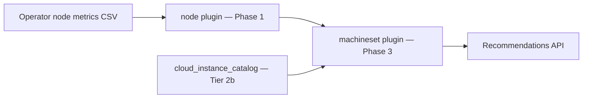

# MachineSet Recommendations (Tier 2)

!!! warning "Status: Planned / Future Work"
    This feature is **not yet implemented** as a dedicated engine. Tier 1 **aggregation**
    at `GET .../machinesets` is **shipped** (groups existing per-node recommendations).
    The description below is the intended product direction for Tier 2. Node consolidation
    and per-node `node_count_reduction` remain available today.

!!! info "Quick Facts (planned)"
    **Scope:** OpenShift MachineSet replica and instance-type right-sizing (IPI clusters)  
    **Plugin:** `machineset` (Phase 3 Optimize — builds on node + instance-type)  
    **Depends on:** `node` plugin (Phase 1), optional `instance-type` plugin + cloud catalog (Tier 2b)  
    **Shipped today:** `GET /api/cost-management/v1/recommendations/openshift/machinesets` (Tier 1 aggregation)  
    **API (planned):** `GET .../machinesets/{name}` detail with recommendation history  
    **Persistence (planned):** `machineset_recommendations` table  
    **Notification codes (planned):** **4** (`PDB_CAVEAT`), **23**–**24** (catalog), MachineSet fleet codes (see below)

---

## What Tier 2 will do

**MachineSet Recommendations** will move fleet optimization from per-node advisory signals
to **actionable MachineSet-level guidance** — the unit cluster admins change in
IPI-provisioned OpenShift (replica count, instance type, MachineAutoscaler bounds in Tier 3).

| Capability | Example |
|------------|---------|
| **Replica recommendations** | “Reduce `worker-us-east-1a` from 5 → 3 nodes” when fleet P95 utilization is sustained below target |
| **Instance family/size** | “Switch `m5.4xlarge` → `m5.2xlarge`” when peak usage fits a smaller catalog entry; `m5` → `c5` / `r5` for stranded CPU/memory |
| **Dedicated persistence** | `machineset_recommendations` rows with their own lifecycle, separate from per-node `node_recommendations` |
| **Detail + history** | `GET .../machinesets/{name}` with full recommendation history and trend fields |
| **Fleet health notifications** | Heterogeneous capacity within a MachineSet, HA floor warnings, scaling headroom |
| **PDB conflicts** | Notification when PodDisruptionBudgets affect workloads on MachineSet nodes (manual review before scale-down) |
| **Cloud catalog integration** | Map current instance types to priced alternatives (AWS, Azure, GCP) based on actual usage patterns |

Individual node recommendations (Tier 1) remain informational. MachineSet recommendations
are the consolidation and right-sizing surface for IPI clusters where `machineset_name`
is present on node digests.

**Scope limit:** Machine API / MachineSets only. Bare metal, SNO, UPI/manual nodes
without `machineset_name` stay Tier 1 only.

---

## What ships today (Tier 1 aggregation)

`GET /api/cost-management/v1/recommendations/openshift/machinesets` groups existing
`node_recommendations` rows by `machineset_name` (cost engine, non-empty name):

| Field | Meaning |
|-------|---------|
| `current_node_count` | Nodes in the MachineSet with a recommendation row |
| `excess_nodes` | Sum of per-node `node_count_reduction` |
| `recommended_node_count` | `current_node_count - excess_nodes` |
| `total_monthly_savings` | Sum of member node savings |
| `avg_cpu_utilization` / `avg_memory_utilization` | Average P95 across members |

This is **not** the Tier 2 engine — it does not persist `machineset_recommendations`,
emit MachineSet-specific notifications, or recommend instance-type changes from a
cloud catalog. See [Node consolidation — MachineSet aggregation](node-recommendations.md#machineset-aggregation).

---

## Two-phase delivery: Tier 2a and Tier 2b

Tier 2 is split so the team can ship value **without waiting** for the cloud instance
catalog (REQ-8c.6).

### Tier 2a — No cloud catalog required

Build first; delivers replica guidance, persistence, API depth, and fleet-health signals.

| Item | Can build now? | Depends on | Value on its own |
|------|----------------|------------|------------------|
| **Replica count recommendations** | **Yes** | `daily_node_digests`, Tier 1 `node_count_reduction` / fleet P95 math; optional operator `machineset_replicas` for validation (Tier 3) | Actionable “scale this MachineSet to N nodes” without catalog |
| **`machineset_recommendations` table** | **Yes** | DB migration; engine write path | Stable MachineSet rows, filters, savings rollup independent of list-time GROUP BY |
| **`GET .../machinesets/{name}` detail** | **Yes** | Table or enriched aggregation + member node list | Drill-down UI, audit trail entry point |
| **Recommendation history / trends** | **Yes** (partial) | History rows keyed by `(org_id, cluster_uuid, machineset_name, term, engine)`; daily snapshots on recalc | Shows how replica guidance changes over weeks |
| **MachineSet-level confidence** | **Yes** | Min `data_days` across member nodes in term window | Suppresses noisy replica advice on young MachineSets |
| **Heterogeneous fleet detection** | **Yes** | Compare `cpu_allocatable` / `memory_allocatable` across nodes sharing `machineset_name` | Warns when nodes in one MachineSet have different actual capacities (misconfiguration) |
| **Fleet health / scaling notifications** | **Yes** (partial) | Node digests + Tier 1 classifications aggregated per MachineSet | HA floor, underutilized fleet, consolidation opportunity without instance-type change |
| **PDB conflict notification (code 4)** | **Yes** (notification only) | Operator PDB metrics (kube-state-metrics); does **not** algorithmically change replica count | Alerts operator to review before scale-down |

**Tier 2a formula (replica count):** From REQ-8c.5:

```
rec_replicas = ceil(current_replicas × max(cpu_util_p95, mem_util_p95) / target_util)
```

- `target_util` default **0.70** (configurable)
- Minimum **2** replicas for HA (`ROS_MIN_MACHINESET_REPLICAS`)
- Hysteresis: only recommend reduction when savings exceed threshold (align with Tier 1 fleet consolidation)

### Tier 2b — Requires cloud instance catalog

Ship after `cloud_instance_catalog` (REQ-8c.6) and refresh jobs exist.

| Item | Can build now? | Depends on | Value on its own |
|------|----------------|------------|------------------|
| **Instance family/size recommendations** | **No** | `cloud_instance_catalog` (AWS Bulk Pricing JSON, Azure Retail Prices, GCP `machineTypes.list`); provider/region context | Right-size to smaller **or** different-family shapes not present in cluster |
| **Cost comparison (current vs recommended type)** | **No** | Catalog pricing + Koku `effective_rates` | Dollar savings for instance-type migration |
| **Stranded-resource family switch** | **No** (full) | Catalog families (`m5` → `c5` / `r5`) + pricing | Tier 1 in-cluster `suggested_instance_type` only covers types **already in the fleet** |
| **Deprecated / unlisted instance handling** | **No** | Catalog lookup + codes **23**, **24** | Safe guidance when running on generations not in public pricing APIs |
| **“Smallest fit” catalog sizing** | **No** | Catalog vCPU/RAM vs per-node P95 × headroom | Recommends `m5.2xlarge` when `m5.4xlarge` is over-provisioned |

**On-prem note:** When no cloud APIs are configured, Tier 2b instance-type changes are
skipped; Tier 2a replica and fleet-health guidance still applies using Prometheus
capacity metrics (not catalog specs).

---

## Plugin architecture (planned)

MachineSet recommendations follow the Phase 3 Optimize pattern (global fleet view):



| Phase | Plugin | Role |
|-------|--------|------|
| **1 — Produce** | `node` | Per-node classification, `node_count_reduction`, digests |
| **1 — Produce** (Tier 2b) | `instance-type` | Catalog refresh, smallest-fit lookup |
| **3 — Optimize** | `machineset` | Cross-node MachineSet aggregation, replica + instance recs, persistence |

See [Plugin Execution Phases](../architecture/plugin-phases.md).

**Industry alignment:** Replica guidance resembles Cluster Autoscaler / Karpenter
fleet sizing signals; instance-family recommendations resemble AWS Compute Optimizer
and CAST AI node-pool right-sizing — all advisory until PDB/scheduling simulation
(Tier 2 “safe to auto-execute”) matures.

---

## API surface (planned)

| Endpoint | Tier | Status |
|----------|------|--------|
| `GET .../machinesets` | 1 aggregation / 2 engine | **Shipped** (Tier 1 GROUP BY) |
| `GET .../machinesets/{name}` | 2 | Planned — detail + history |
| Filters: `is_underutilized`, `has_replica_reduction`, `has_instance_change` | 2 | Planned |

Detail response will mirror node detail patterns: `recommendation_terms` blocks,
`current_replicas` / `rec_replicas`, `current_instance_type` / `rec_instance_type`,
member `nodes[]`, `notifications`, `confidence_level`, and `estimated_monthly_savings`.

---

## Notification codes (planned)

MachineSet-specific and shared codes (see [Notification codes — Nodes](../architecture/notification-codes.md#nodes)):

| Code | Severity | When (planned) |
|------|----------|----------------|
| **4** | WARNING | PDBs affect workloads on MachineSet nodes — manual review before scale-down |
| **23** | INFO | Current instance type not in cloud catalog (no resize needed) |
| **24** | INFO | Deprecated/unlisted instance type — consider catalog alternative |
| **76** | INFO | Fleet consolidation opportunity (today on **node** list; Tier 2 also on MachineSet rows) |

Additional Tier 2a codes (reserved): heterogeneous capacity within MachineSet, HA
floor prevents replica reduction, fleet underutilized below consolidation threshold.

Tier 3 autoscaler codes (**14**, **16**, **17**, **75**) remain separate — see
[node recommendations roadmap](../architecture/node-recommendations-roadmap.md#tier-3--machineautoscaler-optimization).

---

## Advisory-first delivery

MachineSet recommendations will be **advisory in all deployment modes** (SaaS, on-prem,
multi-cluster):

1. ROS computes MachineSet guidance centrally from uploaded metrics.
2. Platform teams review in the Optimizations UI or REST API.
3. Teams apply changes via `oc scale machineset`, Machine API, or GitOps — not via ROS actuation.

Tier 2 **PDB/scheduling-aware consolidation** (placement simulation) is a later
enhancement that unlocks “safe to auto-execute” confidence for external automation;
Tier 2a replica guidance remains review-first.

ROS does not patch MachineSets or scale nodes automatically. External automation
(Ansible, GitOps, cluster policies) may consume the API with org-specific safety gates.

---

## Related

- [Node consolidation (Tier 1)](../features/node-recommendations.md) — per-node recommendations and aggregation API
- [Node recommendations roadmap (Tier 2 & 3)](../architecture/node-recommendations-roadmap.md) — prerequisites, effort, schema
- [node plugin reference](../plugin-reference/node.md) — current endpoints and filters
