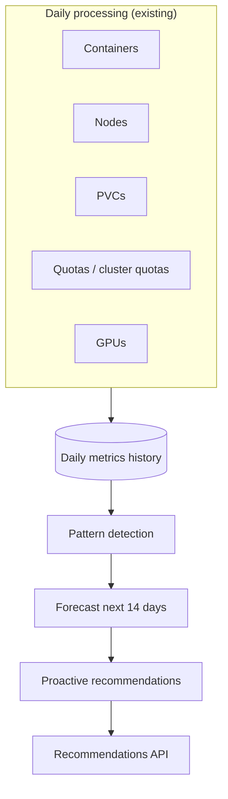

# Seasonality & Proactive Recommendations

!!! warning "Status: Planned / Future Work"
    This feature is **not yet implemented**. The description below is the intended
    product direction for a future ROS-OCP release. Reactive recommendations
    (rightsizing, quotas, nodes, PVCs, GPUs) remain available today.

!!! info "Quick Facts (planned)"
    **Scope:** All major optimization plugins (containers, nodes, PVCs, quotas, GPUs, VMs)  
    **Plugins:** `seasonality-detector` → `seasonality-forecast` → `seasonality-proactive`  
    **Phases:** Produce → Enrich → Optimize  
    **Forecasting:** [Augurs](https://github.com/grafana/augurs) (Grafana, Rust) — CPU-only by default  
    **History needed:** 90+ days of daily metrics (2+ years for annual patterns)  
    **Advance warning:** Configurable 7 / 14 / 30 days before predicted peaks

---

## The problem

Most recommendations today answer: *"Based on what you used recently, you should change this limit now."*

That helps **after** a spike has already stressed containers, quotas, nodes, or storage. Many teams already know their workloads are **seasonal** — holiday traffic, month-end batch jobs, Monday morning logins, steadily growing PVCs — but ROS does not yet warn them **ahead** of the next peak or capacity event.

**Seasonality & proactive recommendations** will learn recurring patterns from daily usage across your cluster and suggest changes **before** predictable demand arrives — for workloads, nodes, storage, quotas, GPUs, and (when enabled) virtual machines.

| Reactive (today) | Proactive (planned) |
|------------------|---------------------|
| Rightsize when utilization is already high | Warn **days before** the next known peak |
| Quota alerts when you're nearly full | Raise quota headroom before month-end batch |
| Node consolidation based on recent averages | Scale worker pools before recurring surge windows |
| PVC alerts when usage is high | Expand storage before linear growth hits capacity |

---

## Detailed use cases

The same underlying engine applies across plugins; what changes is the **entity** (namespace, node pool, PVC, quota scope) and the **metric** (CPU, memory, nodes, GiB, GPU share).

### E-commerce and retail

**Pattern:** Annual and event-driven spikes — Black Friday, Cyber Monday, holiday gift seasons, flash sales.

**Scenario:** Your `checkout` namespace in `ecommerce-prod` has needed roughly **3× baseline CPU** every November for three consecutive years. CPU request today is 500m; reactive rightsizing only reacts once carts are already queuing.

**What you'll see (planned):**

> *"Annual pattern detected (confidence 0.91). Next predicted peak: **2026-11-29** (Black Friday window). Recommend raising CPU request to **1200m** and memory limit to **2 GiB** by **2026-11-22** (7-day lead time)."*

**Why it matters:** One hour of checkout degradation during peak season often costs more than a week of extra cluster capacity. Proactive sizing buys lead time for change windows, autoscaling policy updates, and quota approvals.

**Related patterns:**

- **Cyber Monday** — second peak within the same week; weekly + annual components may both fire.
- **Daily lunch rush** — smaller daily cycle on top of holiday ramps (see retail daily patterns below).

### Financial services and billing

**Pattern:** End-of-month and end-of-quarter batch processing — ledger close, reporting ETL, payment reconciliation.

**Scenario:** `batch-processing` namespace and the `worker-pool` node group spike CPU and memory on days **28–31** every month. Namespace ResourceQuota and cluster node count are the limiting factors, not individual pod limits.

**What you'll see:**

> *"Monthly pattern (period 30 days, confidence 0.88). Next peak: **2026-06-28**. Recommend increasing production namespace CPU quota from 80 cores to **120 cores** before the 28th. Worker pool: scale from **6 → 10 nodes** by **2026-06-21**."*

**Why it matters:** Batch jobs that miss their window create regulatory and operational risk; capacity planning is calendar-driven, not utilization-driven.

### SaaS and enterprise applications

**Pattern:** Weekly cadence — Monday morning login surges, Friday afternoon reporting, weekday vs weekend traffic.

**Scenario:** `customer-portal` sees predictable CPU growth every **Monday 08:00–10:00** in the cluster timezone (12 prior occurrences logged in the recommendation).

**What you'll see:**

> *"Weekly pattern (period 7 days, confidence 0.94). Next peak: **2026-06-02** (Monday 09:00). Recommend CPU request **1200m** (currently 500m) for namespace `customer-portal`."*

**Why it matters:** Rightsizing to **Tuesday's** average leaves Monday under-provisioned every week. Proactive recommendations align limits with the **peak day**, not the quiet day.

### Retail — daily, weekly, and payroll cycles

| Cadence | Example | Plugin impact |
|---------|---------|---------------|
| **Daily** | Lunch-hour order spike (12:00–14:00) | Container / namespace CPU |
| **Weekly** | Weekend web traffic vs weekday B2B | Container, node pool |
| **Bi-weekly / monthly** | Payroll namespace spikes every 14 or 30 days | Quota, container |
| **Annual** | Holiday catalog refresh | Container, cluster quota |

**Scenario (daily):** `pos-api` namespace shows a reliable midday CPU bump; proactive guidance may suggest a **higher Monday–Friday ceiling** or integration with [business hours](../features/business-hours.md) for dual profiles.

**Why it matters:** FinOps teams budget for **peak** capacity; SRE teams need **dated** actions, not another generic "you might be oversized" message during the quiet season.

### Data platforms and storage

**Pattern:** Monotonic PVC growth — databases, observability backends, ML feature stores.

**Scenario:** `postgres-data-pvc` grows ~**1 GiB/day**; capacity is 100 GiB with 82 GiB used.

**What you'll see:**

> *"Linear growth (confidence 0.97). At current rate, capacity exhausted in **18 days** (**2026-06-17**). Recommend expanding PVC to **150 GiB** before that date."*

**Why it matters:** PVC expansion often needs change approval and backup verification; 18 days of lead time is actionable; "PVC 95% full" today is often too late.

### ML and GPU workloads

**Pattern:** Weekly retrain (e.g. every Tuesday night), weekday inference ramps, quarter-end model refresh.

**What you'll see:**

> *"Weekly GPU utilization peak detected on `gpu-training` namespace. Next peak: **2026-06-03**. Consider increasing time-slicing replicas or MIG profile headroom before retrain window."*

**Why it matters:** GPU capacity is expensive and slow to procure; seasonal GPU guidance ties to the same calendar finance already uses.

---

## How it works (customer-visible)

ROS already builds **daily summaries** from cluster usage. Seasonality adds a **shared history layer** and three cooperating analysis steps — without requiring you to archive raw CSVs or past recommendation text for years.



### Step 1 — Record history

Each enabled optimization plugin stores **one aggregated data point per day** per entity (namespace, node name, PVC, quota scope, GPU workload, etc.). Examples:

- Namespace average CPU usage and request utilization
- Node pool allocatable vs used CPU
- PVC max allocated size
- Quota hard vs used ratio
- GPU average utilization percent

You do **not** need to retain hourly Prometheus exports in ROS for seasonality; daily aggregates are enough.

### Step 2 — Detect patterns

Over your configured minimum history (default **90 days**), ROS analyzes each metric series and distinguishes:

| Pattern type | What it means | Typical history |
|--------------|---------------|-----------------|
| **daily** | Repeats every ~24 hours | 2–3 weeks minimum |
| **weekly** | Repeats every ~7 days | 2–3 weeks minimum |
| **monthly** | Repeats every ~30 days | 2–3 months minimum |
| **annual** | Repeats every ~365 days | **2+ years** |
| **linear_growth** | Steady increase (PVCs, storage) | ~14 stable daily points |

Detection uses **classical time-series methods** (seasonal decomposition, autocorrelation, ETS-style forecasting) — not opaque "AI said so" outputs. Each recommendation cites **pattern type**, **period**, **confidence**, and **how many prior occurrences** matched (for example, "12 prior Monday 9am spikes").

Seasonal patterns are separated from **random noise** using confidence thresholds and minimum occurrence counts; weak fits are suppressed.

### Step 3 — Forecast demand

For entities with accepted patterns, ROS projects resource needs over the **forecast horizon** (default **14 days**, configurable). Outputs include:

- Predicted peak magnitude (CPU millicores, GiB, node count, etc.)
- **Next predicted peak date**
- Recommended resource values sized for that peak (via existing rightsizing engines)

### Step 4 — Proactive recommendations

Forecasts are combined with existing container, node, PVC, quota, and GPU engines to produce **concrete, dated actions**: *set X to Y by date Z*, with **lead time** (default **7 days** before the peak).

**Advance warning** is configurable at **7, 14, or 30 days** — so platform teams can align with change advisory boards and maintenance windows.

---

## What you'll see in the API

Proactive items will appear alongside existing recommendation types (exact path and schema may evolve before release). Conceptual list response:

```json
{
  "meta": {
    "count": 3,
    "proactive_enabled": true,
    "forecast_horizon_days": 14,
    "lead_time_days": 7
  },
  "data": [
    {
      "recommendation_type": "proactive",
      "plugin": "container",
      "cluster_id": "prod-east-1",
      "namespace": "ecommerce",
      "entity": "checkout",
      "pattern": {
        "type": "annual",
        "period_days": 365,
        "confidence": 0.91,
        "detected_from": "3 prior November peaks (2023–2025)",
        "next_predicted_peak": "2026-11-29",
        "lead_time_days": 7,
        "action_by": "2026-11-22"
      },
      "current_values": {
        "cpu_request": "500m",
        "memory_limit": "1Gi"
      },
      "recommended_values": {
        "cpu_request": "1200m",
        "memory_limit": "2Gi"
      },
      "rationale": "Historical Black Friday window requires ~3x baseline CPU vs current request."
    },
    {
      "recommendation_type": "proactive",
      "plugin": "container",
      "namespace": "customer-portal",
      "entity": "customer-portal",
      "pattern": {
        "type": "weekly",
        "period_days": 7,
        "confidence": 0.94,
        "detected_from": "12 prior occurrences (Mon 09:00 spike)",
        "next_predicted_peak": "2026-06-02T09:00:00Z",
        "lead_time_days": 7,
        "action_by": "2026-05-26"
      },
      "current_values": {"cpu_request": "500m"},
      "recommended_values": {"cpu_request": "1200m"}
    },
    {
      "recommendation_type": "proactive",
      "plugin": "pvc",
      "namespace": "database",
      "entity": "postgres-data-pvc",
      "pattern": {
        "type": "linear_growth",
        "confidence": 0.97,
        "growth_rate_gb_per_day": 1.0,
        "days_until_full": 18,
        "capacity_gb": 100,
        "current_usage_gb": 82,
        "next_predicted_peak": "2026-06-17",
        "lead_time_days": 7,
        "action_by": "2026-06-10"
      },
      "recommended_action": "Expand PVC to 150Gi before 2026-06-17"
    },
    {
      "recommendation_type": "proactive",
      "plugin": "node",
      "cluster_id": "prod-east-1",
      "entity": "worker-pool",
      "pattern": {
        "type": "monthly",
        "period_days": 30,
        "confidence": 0.88,
        "detected_from": "4 prior end-of-month batch peaks",
        "next_predicted_peak": "2026-06-28",
        "lead_time_days": 7,
        "action_by": "2026-06-21"
      },
      "current_values": {"node_count": 6},
      "recommended_values": {"node_count": 10}
    }
  ]
}
```

**Field guide:**

| Field | Meaning |
|-------|---------|
| `pattern.type` | `daily`, `weekly`, `monthly`, `annual`, or `linear_growth` |
| `pattern.confidence` | 0.0–1.0; recommendations below tenant threshold are omitted |
| `pattern.next_predicted_peak` | When demand is expected to crest |
| `pattern.lead_time_days` / `action_by` | How far in advance ROS warns you to act |
| `recommended_values` | Sized for the forecast peak, not recent quiet period |

Filter and pagination will follow the same conventions as [container recommendations](../features/container-recommendations.md) and the [UI Integration Guide](../ui-integration-guide.md).

---

## Which optimizations are covered

Seasonality applies across ROS plugins, not only namespaces.

| Rollout | Optimization area | Example proactive message |
|---------|-------------------|---------------------------|
| First | **Containers** (namespace-level default) | Monday 9am CPU spike in `checkout` |
| First | **Nodes** | Add workers before month-end batch |
| Next | **PVCs** | Expand before linear fill-up date |
| Then | **Namespace & cluster quotas** | Raise ceiling before recurring quota exhaustion |
| Later | **GPU** (time-slicing / MIG) | Retrain-day or weekday inference ramps |
| With VM plugin | **Virtual machines** | Seasonal vCPU/memory for long-running guests |
| Not planned | **Snapshots** | Operational drift, not periodic demand |

**Container-level tracking** is optional for critical namespaces only (checkout, payments, inference) — see configuration below. Default for large fleets is **namespace-level** history for cleaner signal and lower storage.

---

## Configuration options

Settings will follow the same three-tier model as other ROS features: compiled defaults, tenant [Settings API](../features/configurable-thresholds.md), and environment locks.

### Master and scope

| Setting | Default | Purpose |
|---------|---------|---------|
| Enable seasonality | `off` | Master switch for proactive pipeline |
| `ROS_SEASONALITY_SCOPE` | `namespace` | Learn container patterns per namespace (recommended at scale) |
| Container-level namespaces | *(empty)* | Opt-in list for per-container history in named namespaces |
| Minimum history days | **90** | Do not emit proactive recs until enough daily points exist |
| Confidence threshold | **0.80** | Suppress uncertain patterns |
| Detection sensitivity | `medium` | `low` / `medium` / `high` — trades false positives vs missed peaks |
| Forecast horizon | **14 days** | How far ahead to project |
| Lead time (advance warning) | **7 days** | Warn this many days before `next_predicted_peak` |
| Lead time options | 7, 14, 30 | Tenant-selectable warning windows |
| Daily / weekly / monthly retention | 90 / 52 / 36 | Tiered rollups for long-term patterns |

**Planned Settings API:** `PUT /recommendations/openshift/settings/seasonality` with fields such as `enabled`, `lead_time_days`, `confidence_threshold`, `container_level_namespaces`, `detection_sensitivity`, `forecast_horizon_days`.

Individual plugins (container, node, PVC, quota, GPU, VM) remain enabled via existing plugin settings; seasonality **consumes their daily metrics** when those plugins run.

### Plugins that benefit

| Plugin | Metrics fed into seasonality | Proactive output |
|--------|------------------------------|------------------|
| Container | CPU/memory usage & requests (namespace aggregate) | Request/limit ahead of peak |
| Node | Utilization, allocatable pressure | Scale pool before surge |
| PVC | Allocated / usage trend | Expand before full |
| Quota / cluster-quota | Used vs hard | Raise limits before recurring exhaust |
| GPU | Utilization, allocation | Capacity before retrain/inference window |
| VM (when shipped) | vCPU/memory daily digest | Instance size / count before seasonal load |

---

## GPU-accelerated forecasting tier (optional)

For **most workloads**, the default **CPU-based** engine ([Augurs](https://github.com/grafana/augurs)) is sufficient: weekly and monthly patterns, PVC growth, and namespace-level demand without extra hardware.

Organizations that **already run GPU nodes** (SaaS or on-prem) may enable an **optional second tier** using foundation-model forecasting (for example [Chronos-2](https://github.com/amazon-science/chronos-forecasting), Apache 2.0) when classical methods leave high unexplained variance.

### When to enable GPU tier

| Signal | CPU tier (default) | GPU tier (opt-in) |
|--------|-------------------|-------------------|
| Regular weekly/monthly peaks | ✅ Strong fit | Usually unnecessary |
| Steady PVC linear growth | ✅ Strong fit | Unnecessary |
| Irregular retail spikes (Black Friday shape changes yearly) | May under-fit | ✅ Better peak magnitude |
| Multi-metric correlated ramps (CPU + memory + GPU together) | Per-metric decomposition | ✅ Joint structure |
| Short history with complex shape | Limited | May help (still needs minimum history gate) |

### Cost and benefit

| Dimension | CPU-only (Augurs) | GPU tier |
|-----------|-------------------|----------|
| **Infrastructure** | Runs on existing ROS workers | Requires GPU node(s) or sidecar with GPU |
| **Operational cost** | Low — small Rust library, no extra pods | GPU time per forecast batch; model load memory |
| **Latency** | Milliseconds per entity at daily batch | Higher — batch inference |
| **Explainability** | High — period, occurrences, decomposition | Lower — treat as "refined forecast" with confidence band |
| **When to skip** | Default for on-prem without GPUs | Don't enable solely for seasonality if GPUs aren't already in the fleet |

**Configuration (planned):** `ROS_SEASONALITY_GPU_ENABLED=false` (opt-in), model selection via `ROS_SEASONALITY_GPU_MODEL` with documented size/latency tradeoffs (small model for daily batch, larger only for selected tenants).

**Model selection guidance:**

- Start with **CPU tier** for 90+ days; review proactive hit rate and false positives.
- Enable GPU tier for **named namespaces** or **high-value entities** first (checkout, payments), not entire 200k-container fleets.
- Prefer GPU tier when FinOps confirms recurring $ impact from **missed** peaks, not from steady rightsizing noise.

---

## Comparison with alternatives

### Why Augurs for the default tier

[Augurs](https://github.com/grafana/augurs) is an open-source Rust forecasting library from Grafana Labs aimed at **observability metrics** — the same domain as Prometheus and OpenShift usage data.

| Benefit | Customer impact |
|---------|-----------------|
| Built for metrics | Same statistical assumptions as infrastructure monitoring |
| Lightweight | Runs on-prem without GPUs or multi-gigabyte Python stacks |
| Explainable | "Weekly, period 7, 12 prior Monday spikes" — auditable in change review |
| Proven methods | MSTL seasonal decomposition, ETS — standard for capacity planning |

We evaluated heavier systems ([Moirai](https://github.com/SalesforceAIResearch/Moirai), [TimesFM](https://github.com/google-research/timesfm), [Chronos-2](https://github.com/amazon-science/chronos-forecasting), [Merlion](https://github.com/salesforce/Merlion)). They are valuable for research and offline benchmarks but **too heavy and opaque** for default on-prem deployment. The optional GPU tier addresses cases where classical methods are insufficient **without** making GPUs mandatory.

### When the GPU tier adds value

Enable GPU-assisted forecasting when:

- Peaks are **real but irregular** (event timing shifts year to year).
- Several metrics **move together** before the same business event.
- CPU-tier confidence stays **below your threshold** despite 90+ days of history.

Keep CPU-only when patterns are stable weekly/monthly cycles — simpler, cheaper, and easier to defend in production change boards.

---

## Prerequisites

| Requirement | Why |
|-------------|-----|
| **≥ 90 days daily metrics** (default) | Weekly and monthly detection need repeated cycles |
| **2+ years** for annual patterns | Black Friday–class warnings need multiple years of November peaks |
| **Consistent data collection** | Large gaps (cluster offline, operator disabled) break period detection |
| **Base plugins enabled** | Container/node/PVC/quota/GPU plugins must run daily to populate history |
| **Stable entity identity** | Renamed namespaces or migrated PVCs start cold — history does not transfer automatically |

Until enough history exists for an entity, **no proactive items** appear for that entity; **reactive** rightsizing continues unchanged.

### Data retention alignment

Ensure your metrics operator upload cadence and ROS ingestion are continuous. Seasonality does **not** require keeping raw hourly CSVs for years — only **daily aggregates** with tiered rollups (daily → weekly → monthly) for entities older than 90 days.

---

## Scale and storage (customer summary)

Designed for **large clusters** (200k+ containers) without hundreds of gigabytes of history DB growth.

- **Namespace-level by default** — application boundaries match how you change quotas and capacity.
- **Optional container-level** — only for namespaces you name explicitly.
- **Skip stable entities** — no seasonal variation detected → no ongoing storage for that series.
- **Typical footprint** — on the order of **~2 GB** for a 200k-container fleet with namespace defaults plus a few opt-in application namespaces (order-of-magnitude; varies by enabled plugins and retention).

See the [internal design doc](../../docs/design/seasonality-plugin.md) for engineering sizing tables.

---

## Relationship to other features

- **[Business hours](../features/business-hours.md)** — You define fixed schedules (Mon–Fri 9–5). Seasonality **learns** patterns from data; both can apply on scheduled clusters.
- **[Container](../features/container-recommendations.md), [node](../features/node-recommendations.md), [PVC](../features/pvc-rightsizing.md), [quota](../features/quota-recommendations.md), [cluster quota](../features/cluster-resource-quota.md), [GPU](../features/gpu-time-slicing.md) / [MIG](../features/gpu-mig.md), [VM](../features/virtual-machines.md)** — Proactive sizing reuses the same engines with forward-looking context.
- **[History & quality](../features/history-and-quality.md)** — Tracks adoption of past recommendations; seasonality uses **usage** history, not past recommendation rows.

---

## Timeline

Delivery is planned in phases:

1. **Containers + nodes** (highest impact)
2. **PVCs** (predictable growth)
3. **Namespace and cluster quotas**
4. **GPU** (if demand warrants)
5. **VM** (aligned with VM recommendations plugin)
6. **Snapshots** — not in scope for seasonality

Core functionality is estimated at **10–14 weeks** engineering plus QA. Optional calendar-aware annual enhancements and GPU tier follow Tier 1 stability.

---

## Related documentation

| Document | Audience |
|----------|----------|
| [Plugin execution phases](../architecture/plugin-phases.md) | How phased plugins run |
| [Configurability](../architecture/configurability.md) | Settings precedence model |
| [Features overview](../features/index.md) | Shipped ROS capabilities |
| Internal design | [`docs/design/seasonality-plugin.md`](../../docs/design/seasonality-plugin.md) |
